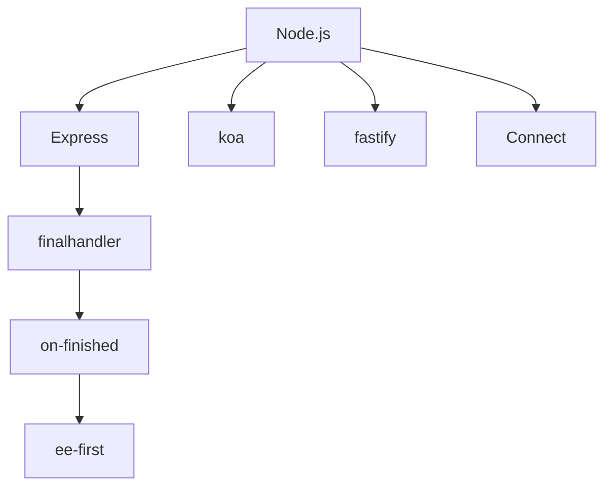

## 架構

## ee-first

### 基本資訊

- [Github Repo](https://github.com/jonathanong/ee-first)
- ee = `EventEmitter`
- 底層套件
- 核心程式碼約 100 行

### 核心概念

監聽多個 `EventEmitter` 上的多個 events，只要其中任何一個最先 fire，就觸發 callback，然後自動把所有 listener 都清掉

### 解決什麼問題？

原生 Node.js `EventEmitter` 沒有「race 多個 emitter」的機制。如果你想監聽 req 的 `end`, `error` 其中一個先發生，你得手動：

1. 在每個 emitter 上各掛 listener
2. callback 被觸發後，記得把其他所有 listener 都 `removeListener` 掉，否則 memory leak

`ee-first` 把這個 boilerplate 封裝掉了

### 基本用法
