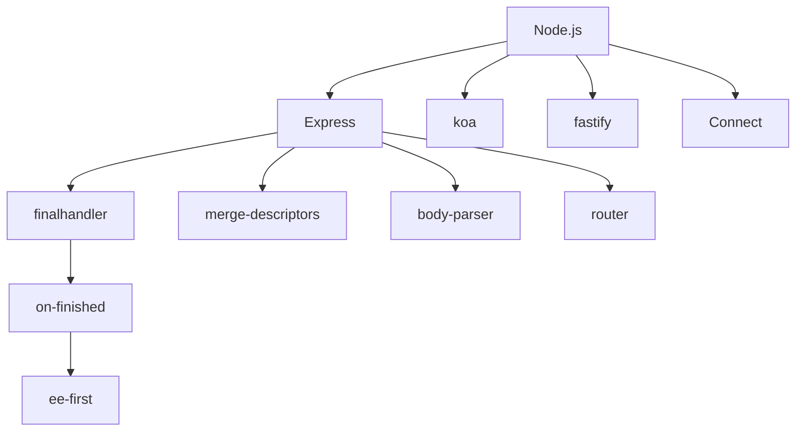
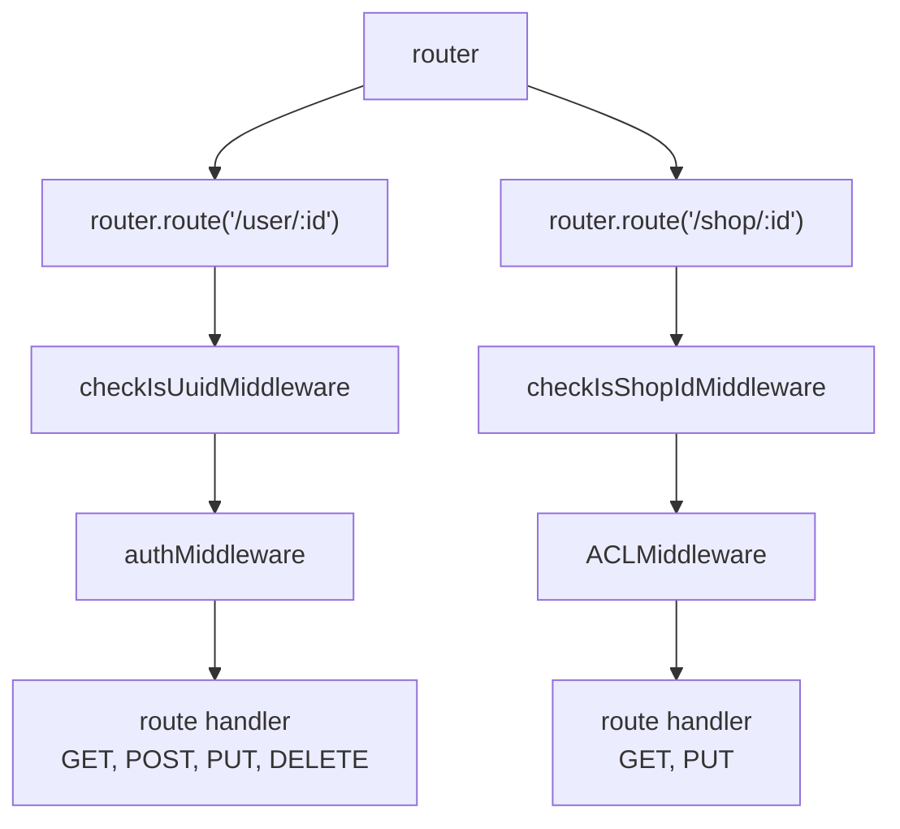

## 架構



## ee-first

### 基本資訊

- [Github Repo](https://github.com/jonathanong/ee-first)
- ee = `EventEmitter`
- 最底層套件（無任何依賴）
- 核心程式碼約 100 行

### 核心概念

監聽多個 `EventEmitter` 上的多個 events，只要其中任何一個最先 fire，就觸發 callback，然後自動把所有 listener 都清掉

### 解決什麼問題？

原生 Node.js `EventEmitter` 沒有「race 多個 emitter」的機制。如果你想監聽 req 的 `end`, `error` 其中一個先發生，你得手動：

1. 在每個 emitter 上各掛 listener
2. callback 被觸發後，記得把其他所有 listener 都 `removeListener` 掉，否則 memory leak

`ee-first` 把這個 boilerplate 封裝掉了

### 基本用法

Case 1: listener 只會觸發一次

```js
import first from "ee-first";
import EventEmitter from "events";

const e1 = new EventEmitter();
const e2 = new EventEmitter();
const thunk = first(
  [
    [e1, "end", "error"],
    [e2, "end", "error"],
  ],
  (err, ee, event, args) => {
    console.log({ err, ee, event, args }); // { err: null, ee: e1, event: 'end', args: [] }
  },
);

console.log(e1.eventNames().length, e2.eventNames().length); // 2 2
e2.emit("end");
console.log(e1.eventNames().length, e2.eventNames().length); // 0 0
e1.emit("end"); // This will not trigger
```

Case 2: 使用 `cancel()` 把所有 listener 移除

```js
import first from "ee-first";
import EventEmitter from "events";

const e1 = new EventEmitter();
const e2 = new EventEmitter();
const thunk = first(
  [
    [e1, "end", "error"],
    [e2, "end", "error"],
  ],
  (err, ee, event, args) => {
    console.log({ err, ee, event, args }); // { err: null, ee: e1, event: 'end', args: [] }
  },
);

console.log(e1.eventNames().length, e2.eventNames().length); // 2 2
thunk.cancel();
console.log(e1.eventNames().length, e2.eventNames().length); // 0 0
e1.emit("end"); // This will not trigger
```

## on-finished

### 基本資訊

- [Github Repo](https://github.com/jshttp/on-finished)

### 核心概念

當 `IncomingMessage` 或 `OutgoingMessage` 完成、關閉或發生錯誤時，觸發 callback 並自動清理所有 listener

### 背後監聽的 events

1. `socket.on('close')`
2. `socket.on('error')`
3. `message.on('end')`
4. `message.on('finish')`

### 解決什麼問題？

原生 Node.js 對於 `IncomingMessage` 或 `OutgoingMessage` 的「結束」語意很模糊，有多種情境：

1. `OutgoingMessage.end()` 或 `IncomingMessage.on('end')` 正常結束 → `finish`
2. 底層 `net.Socket` 被強制關閉 → `close`（不一定會先 `finish`）
3. 傳輸過程出錯 → `error`

你必須同時 race 這些 events，才能保證不漏接。`on-finished` 把這層判斷封裝掉，並額外處理兩個邊界情況：

1. 已經 finished：若呼叫時 message 已結束，會在下一個 event loop 觸發 callback，而非同步呼叫
2. 尚未 finished：委託給 [ee-first](#ee-first) race，第一個 event 觸發後自動清理其餘 listener

### 語法

```ts
function onFinished<T extends IncomingMessage | OutgoingMessage>(
  msg: T,
  listener: (err: Error | null, msg: T) => void,
): T;
```

### 基本用法

```ts
import onFinished from "on-finished";
import http from "http";
import assert from "assert";

const httpServer = http.createServer();
httpServer.listen(5000);
httpServer.on("request", (req, res) => {
  req.resume();
  onFinished(req, (err, msg) => {
    console.log("req finished");
    console.log({ err });
    assert(msg === req);
    res.end();
  });
});
```

用 `curl http://localhost` 測試

```js
// req finished
// { err: null }
```

### 原始碼如何搭配 ee-first 使用

```js
// finished on first message event
eeMsg = eeSocket = first([[msg, "end", "finish"]], onFinish);

// finished on first socket event
eeSocket = first([[socket, "error", "close"]], onFinish);
```

### 從原始碼挖到 undocumented property

原始碼

```js
/**
 * Determine if message is already finished.
 *
 * @param {object} msg
 * @return {boolean}
 * @public
 */
function isFinished(msg) {
  var socket = msg.socket;
  var finished = writableEnded(msg);

  if (typeof finished === "boolean") {
    // OutgoingMessage
    return Boolean(finished || (socket && !socket.writable));
  }

  if (typeof msg.complete === "boolean") {
    // IncomingMessage
    return Boolean(
      msg.upgrade ||
      !socket ||
      !socket.readable ||
      (msg.complete && !msg.readable),
    );
  }

  // don't know
  return undefined;
}

/**
 * Determines if a writable stream has finished.
 *
 * @param {Object} res
 * @returns {boolean}
 * @private
 */
function writableEnded(res) {
  return typeof res.writableEnded === "boolean"
    ? res.writableEnded
    : res.finished;
}
```

`IncomingMessage.upgrade: boolean`：是否為 "Upgrade" 請求（有監聽 "upgrade" event 才會是 `true`）

```ts
const httpServer = http.createServer();
httpServer.listen(5000);
httpServer.on("upgrade", (req, socket, head) => {
  // @ts-ignore
  assert(req.upgrade === true);
});
targetServer.on("request", function (req, res) {
  // @ts-ignore
  assert(req.upgrade === false);
});
```

## finalhandler

## router

### 基本資訊

- [Github Repo](https://github.com/pillarjs/router)

### 核心概念



### 核心概念

- router: 通常一個 `http.Server` 會搭配一個 router
- route: 一個 router 底下可定義多個 route（等同於 Restful API 的不同 Resources）
- middleware: `checkIsUuidMiddleware`, `authMiddleware`
- handler: `getUser`, `createUser`, `updateUser`, `deleteUser`

### 基本用法

```js
import { Router } from "express";
import http from "http";
import finalhandler from "finalhandler";

const router = Router();
const userRoute = router.route("/user/:id");
userRoute.all(
  function checkIsUuidMiddleware(req, res, next) {
    console.log(req.params.id);
    next();
  },
  function authMiddleware(req, res, next) {
    console.log(req.params.id);
    next();
  },
);
userRoute.get(function getUser(req, res, next) {
  res.end(req.params.id);
});
userRoute.post(function createUser(req, res, next) {
  res.end(req.params.id);
});
userRoute.put(function updateUser(req, res, next) {
  res.end(req.params.id);
});
userRoute.delete(function deleteUser(req, res, next) {
  res.end(req.params.id);
});

const httpServer = http.createServer();
httpServer.listen(5000);
// 如果 middleware + handler 都沒回應 HTTP Response
// 為了避免 HTTP Request 被掛著
// finalhandler 會幫忙回應 HTTP Response
httpServer.on("request", (req, res) =>
  router(req, res, finalhandler(req, res)),
);
```

### `router.use` 不是 excat match，且會把 `req.url` strip 掉對應的部分

`curl http://localhost:5000/api/v1`

```ts
router.use("/api", (req, res, next) => {
  console.log(req.url); // "/v1"
  next();
});
```

### router.param(name, param_middleware)

`curl http://localhost:5000/user/aaa`

```ts
router.param("id", function convertIdToUpperCase(req, res, next) {
  req.params.id = String(req.params.id).toUpperCase();
  next();
});
router.get("/user/:id", function getUser(req, res, next) {
  res.end(req.params.id); // AAA
});
```

### next

<!-- todo-yus -->

- `next()`
- `next('route')`
- `next('router')`
- `next(new Error('error message'))`

## merge-descriptors

## body-parser

## 底層 utils

- [statuses](https://www.npmjs.com/package/statuses)
- [encodeurl](https://www.npmjs.com/package/encodeurl)
- [escape-html](https://www.npmjs.com/package/escape-html)
- [ms](https://www.npmjs.com/package/ms)
- [debug](https://www.npmjs.com/package/debug)
- [parseurl](https://www.npmjs.com/package/parseurl)
- [bytes](https://www.npmjs.com/package/bytes)
- [content-type](https://www.npmjs.com/package/content-type)
- [media-typer](https://www.npmjs.com/package/media-typer)
- [mime-types](https://www.npmjs.com/package/mime-types)
- [mime-db](https://www.npmjs.com/package/mime-db)
- [path-to-regexp](https://www.npmjs.com/package/path-to-regexp)
