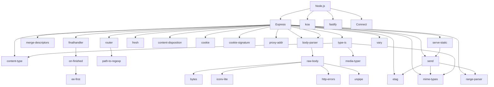
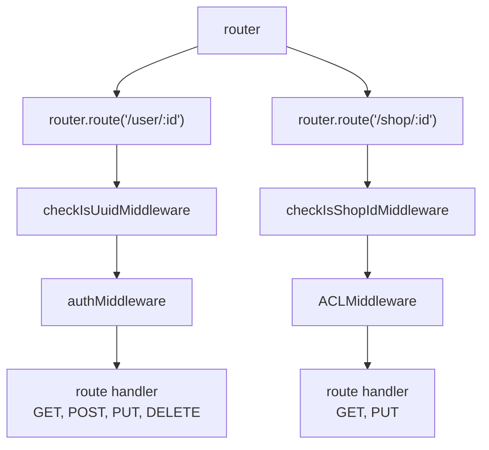
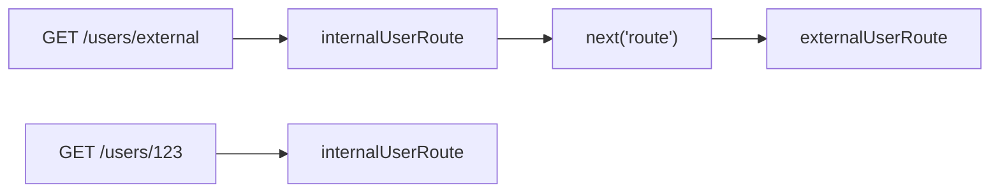

## 架構



## ee-first

### 基本資訊

- [Github Repo](https://github.com/jonathanong/ee-first)
- ee = `EventEmitter`
- 最底層套件（無任何依賴）
- 核心程式碼約 100 行

### 核心概念

監聽多個 `EventEmitter` 上的多個 events，只要其中任何一個最先 fire，就觸發 callback，然後自動把所有 listener 都清掉

### 解決什麼問題？

原生 Node.js `EventEmitter` 沒有「race 多個 emitter」的機制。如果你想監聽 req 的 `end`, `error` 其中一個先發生，你得手動：

1. 在每個 emitter 上各掛 listener
2. callback 被觸發後，記得把其他所有 listener 都 `removeListener` 掉，否則 memory leak

`ee-first` 把這個 boilerplate 封裝掉了

### 基本用法

Case 1: listener 只會觸發一次

```js
import first from "ee-first";
import EventEmitter from "events";

const e1 = new EventEmitter();
const e2 = new EventEmitter();
const thunk = first(
  [
    [e1, "end", "error"],
    [e2, "end", "error"],
  ],
  (err, ee, event, args) => {
    console.log({ err, ee, event, args }); // { err: null, ee: e1, event: 'end', args: [] }
  },
);

console.log(e1.eventNames().length, e2.eventNames().length); // 2 2
e2.emit("end");
console.log(e1.eventNames().length, e2.eventNames().length); // 0 0
e1.emit("end"); // This will not trigger
```

Case 2: 使用 `cancel()` 把所有 listener 移除

```js
import first from "ee-first";
import EventEmitter from "events";

const e1 = new EventEmitter();
const e2 = new EventEmitter();
const thunk = first(
  [
    [e1, "end", "error"],
    [e2, "end", "error"],
  ],
  (err, ee, event, args) => {
    console.log({ err, ee, event, args }); // { err: null, ee: e1, event: 'end', args: [] }
  },
);

console.log(e1.eventNames().length, e2.eventNames().length); // 2 2
thunk.cancel();
console.log(e1.eventNames().length, e2.eventNames().length); // 0 0
e1.emit("end"); // This will not trigger
```

## on-finished

### 基本資訊

- [Github Repo](https://github.com/jshttp/on-finished)

### 核心概念

當 `IncomingMessage` 或 `OutgoingMessage` 完成、關閉或發生錯誤時，觸發 callback 並自動清理所有 listener

### 背後監聽的 events

1. `socket.on('close')`
2. `socket.on('error')`
3. `message.on('end')`
4. `message.on('finish')`

### 解決什麼問題？

原生 Node.js 對於 `IncomingMessage` 或 `OutgoingMessage` 的「結束」語意很模糊，有多種情境：

1. `OutgoingMessage.end()` 或 `IncomingMessage.on('end')` 正常結束 → `finish`
2. 底層 `net.Socket` 被強制關閉 → `close`（不一定會先 `finish`）
3. 傳輸過程出錯 → `error`

你必須同時 race 這些 events，才能保證不漏接。`on-finished` 把這層判斷封裝掉，並額外處理兩個邊界情況：

1. 已經 finished：若呼叫時 message 已結束，會在下一個 event loop 觸發 callback，而非同步呼叫
2. 尚未 finished：委託給 [ee-first](#ee-first) race，第一個 event 觸發後自動清理其餘 listener

### 語法

```ts
function onFinished<T extends IncomingMessage | OutgoingMessage>(
  msg: T,
  listener: (err: Error | null, msg: T) => void,
): T;
```

### 基本用法

```ts
import onFinished from "on-finished";
import http from "http";
import assert from "assert";

const httpServer = http.createServer();
httpServer.listen(5000);
httpServer.on("request", (req, res) => {
  req.resume();
  onFinished(req, (err, msg) => {
    console.log("req finished");
    console.log({ err });
    assert(msg === req);
    res.end();
  });
});
```

用 `curl http://localhost` 測試

```js
// req finished
// { err: null }
```

### 原始碼如何搭配 ee-first 使用

```js
// finished on first message event
eeMsg = eeSocket = first([[msg, "end", "finish"]], onFinish);

// finished on first socket event
eeSocket = first([[socket, "error", "close"]], onFinish);
```

### 從原始碼挖到 undocumented property

原始碼

```js
/**
 * Determine if message is already finished.
 *
 * @param {object} msg
 * @return {boolean}
 * @public
 */
function isFinished(msg) {
  var socket = msg.socket;
  var finished = writableEnded(msg);

  if (typeof finished === "boolean") {
    // OutgoingMessage
    return Boolean(finished || (socket && !socket.writable));
  }

  if (typeof msg.complete === "boolean") {
    // IncomingMessage
    return Boolean(
      msg.upgrade ||
      !socket ||
      !socket.readable ||
      (msg.complete && !msg.readable),
    );
  }

  // don't know
  return undefined;
}

/**
 * Determines if a writable stream has finished.
 *
 * @param {Object} res
 * @returns {boolean}
 * @private
 */
function writableEnded(res) {
  return typeof res.writableEnded === "boolean"
    ? res.writableEnded
    : res.finished;
}
```

`IncomingMessage.upgrade: boolean`：是否為 "Upgrade" 請求（有監聽 "upgrade" event 才會是 `true`）

```ts
const httpServer = http.createServer();
httpServer.listen(5000);
httpServer.on("upgrade", (req, socket, head) => {
  // @ts-ignore
  assert(req.upgrade === true);
});
targetServer.on("request", function (req, res) {
  // @ts-ignore
  assert(req.upgrade === false);
});
```

## finalhandler

### 基本資訊

- [Github Repo](https://github.com/pillarjs/finalhandler)
- 通常搭配 [router](#router) 一起使用

## router

### 基本資訊

- [Github Repo](https://github.com/pillarjs/router)

### 核心概念



- router: 通常一個 `http.Server` 會搭配一個 router
- route: 一個 router 底下可定義多個 route（等同於 Restful API 的不同 Resources）
- middleware: `checkIsUuidMiddleware`, `authMiddleware`
- handler: `getUser`, `createUser`, `updateUser`, `deleteUser`

### 基本用法

```js
import { Router } from "express";
import http from "http";
import finalhandler from "finalhandler";

const router = Router();
const userRoute = router.route("/user/:id");
userRoute.all(
  function checkIsUuidMiddleware(req, res, next) {
    console.log(req.params.id);
    next();
  },
  function authMiddleware(req, res, next) {
    console.log(req.params.id);
    next();
  },
);
userRoute.get(function getUser(req, res, next) {
  res.end(req.params.id);
});
userRoute.post(function createUser(req, res, next) {
  res.end(req.params.id);
});
userRoute.put(function updateUser(req, res, next) {
  res.end(req.params.id);
});
userRoute.delete(function deleteUser(req, res, next) {
  res.end(req.params.id);
});

const httpServer = http.createServer();
httpServer.listen(5000);
// 如果 middleware + handler 都沒回應 HTTP Response
// 為了避免 HTTP Request 被掛著
// finalhandler 會幫忙回應 HTTP Response
httpServer.on("request", (req, res) =>
  router(req, res, finalhandler(req, res)),
);
```

### `router.use` 不是 exact match，且會把 `req.url` strip 掉對應的部分

`curl http://localhost:5000/api/v1`

```ts
router.use("/api", (req, res, next) => {
  console.log(req.url); // "/v1"
  next();
});
```

### router.param(name, param_middleware)

`curl http://localhost:5000/user/aaa`

```ts
router.param("id", function convertIdToUpperCase(req, res, next) {
  req.params.id = String(req.params.id).toUpperCase();
  next();
});
router.get("/user/:id", function getUser(req, res, next) {
  res.end(req.params.id); // AAA
});
```

### `next` overview

| Syntax         | Description                      |
| -------------- | -------------------------------- |
| next()         | 進到下一個 middleware 或 handler |
| next('route')  | 跳離目前的 route                 |
| next('router') | 跳離目前的 router                |
| next(err)      | 進到 error handle middleware     |

### `next('route')`

```ts
const router = Router();
const internalUserRoute = router.route("/users/:id");
internalUserRoute.get((req, res, next) => {
  if (req.params.id.startsWith("external")) return next("route");
  res.end("internalUserRoute");
});
const externalUserRoute = router.route("/users/:id");
externalUserRoute.get((req, res, next) => {
  res.end("externalUserRoute");
});
```



### `next('router')`

```ts
const router = Router();
router.use(function globalMiddleware(req, res, next) {
  next("router");
});
const httpServer = http.createServer((req, res) => {
  router(req, res, finalhandler(req, res));
});
httpServer.listen(5000);
```


### `next(err)`

```ts
const router = Router();
router.use(function globalMiddleware(req, res, next) {
  next(new Error("oops"));
});
router.use(function errorHandleMiddleware(err, req, res, next) {
  res.statusCode = 500;
  res.end("oops...");
} satisfies ErrorRequestHandler);
```


## path-to-regexp

### 基本資訊

- [Github Repo](https://github.com/pillarjs/path-to-regexp)

### 解決什麼問題？

當我們在 express 定義一個 route

```js
const app = express();
app.use("/users/:id");
```

背後就是用 `path-to-regexp` 來解析 `"/users/:id"`

### 核心概念

主要就這 5 個 method

```js
import { pathToRegexp, match, compile, parse, stringify } from "path-to-regexp";
```

加上這三個 TokenType

| TokenType  | Syntax                | Example                                  |
| ---------- | --------------------- | ---------------------------------------- |
| Parameters | `/users/:id`          | `/users/yusheng`                         |
| Wildcard   | `/*splat`             | `/hello`, `/hello/world`                 |
| Optional   | `/users{/:id}/delete` | `/users/delete`, `/users/yusheng/delete` |

### pathToRegexp 用法介紹

顧名思義，把 path 轉成 regexp

```js
const { regexp, keys } = pathToRegexp("/users/:id", {
  trailing: false,
  sensitive: true,
});
console.log({ regexp, keys });
// 1. 從字串開頭開始，match 字面上的 `/users/`
// 2. 接著捕獲一段長度 >= 1、且每個字元都不是 `/` 的字串
// 3. 然後字串立刻結尾
// {
//   regexp: /^(?:\/users\/([^\/]+))$/,
//   keys: [ { type: 'param', name: 'id' } ]
// }
```

### match 用法介紹

[router](#router) 原始碼就是用 `match` 來把開發者實際註冊的

```js
app.use("/users/:id");
```

轉換成 `matcher`，後續的 Request URL 就可以用 `matcher` 來解析

值得注意的是，預設會 `decodeURIComponent`

```js
const matcher = match("/user/:id", { decode: decodeURIComponent }); // default behavior
console.log(matcher("/user/123%2f"));
// {
//   path: '/user/123%2f',
//   params: { id: '123/' }
// }
```

傳入 `decode: false` 可以禁用此邏輯

```js
const matcher = match("/user/:id", { decode: false });
console.log(matcher("/user/123%2f"));
// {
//   path: '/user/123%2f',
//   params: { id: '123%2f' }
// }
```

### compile 用法介紹

return a function for transforming parameters into a valid path

```js
const toPath = compile("/user/:id");
console.log(toPath({})); // TypeError: Missing parameters: id
console.log(toPath({ id: "123" })); // /user/123
console.log(toPath({ id: "123", hello: "456" })); // /user/123
```

值得注意的是，預設會 `encodeURIComponent`

```js
const toPath = compile("/user/:id");
console.log(toPath({ id: "@" })); // /user/%40
console.log(toPath({ id: "\uD800" })); // URIError: URI malformed (lone surrogate => 0xD800 - 0xDFFF 單獨出現)
```

關於 "lone surrogate"，請參考我寫過的 [Unicode, UTF-8 跟 UTF-16 一篇搞懂](../web-tech/unicode-utf8-utf16.md#lone-surrogate)

傳入 `encode: false` 可以禁用此邏輯，不過套件本身就不會幫你把 `{ id: "evil/" }` 進行 `encodeURIComponent`，需自行確保傳入的參數有 encode

```js
const toPath1 = compile("/*splat");
console.log(toPath1({})); // TypeError: Missing parameters: splat
console.log(toPath1({ splat: "123" })); // TypeError: Expected "splat" to be a non-empty array
console.log(toPath1({ splat: ["/user/123"] })); // /123
console.log(toPath1({ splat: ["123", "456"] })); // /123/456

// When disabling `encode`, you need to make sure inputs are encoded correctly. No arrays are accepted.
const toPath2 = compile("/*splat", { encode: false });
console.log(toPath2({})); // TypeError: Missing parameters: splat
console.log(toPath2({ splat: "123" })); // /123
console.log(toPath2({ splat: ["/user/123"] })); // TypeError: Expected "splat" to be a string
console.log(toPath2({ splat: "123/456" })); // /123/456
```

### parse, stringify 用法介紹

```js
const tokenData3 = parse("{:user}");
console.log(tokenData3);
// TokenData {
//   tokens: [ { type: 'group', tokens: [ { type: 'text', value: 'user' } ] } ],
//   originalPath: '{user}'
// }
const toPath = compile(tokenData3);
console.log(toPath({ user: "123" })); // 123

const func = match(tokenData3);
console.log(func("123")); // { path: '123', params: { user: '123' } }

const path = stringify(tokenData3);
console.log(path); // {:user}
```

### 基本 regex 語法

| Syntax | Description |
| `^` | startsWith |
| `\s` | any whitespace |
| `\S` | any non-whitespace |
| `[^a]` | match 1 character not a |
| `$` | endsWith |
| `?` | match the previous token 0 ~ 1 time |
| `(?:...)` | non-capturing group |
| `(?=\/)` | positive lookahead<br/>previous token must continue with `/` |
| `(...)` | capturing group |
| `+` | 1 or more |
| `/your-regex-here/` | to enclose the regex pattern |
| `/your-regex-here/i` | case-insensitive |

## merge-descriptors

## body-parser

## raw-body

### 基本資訊

- [Github Repo](https://github.com/stream-utils/raw-body)

### 解決什麼問題？

在 Node.js http.Server 要自行收集 request body（包含長度驗證、encode/decode）很麻煩

```js
import http from "http";

const server = http.createServer((req, res) => {
  // 長度驗證
  req.headers["content-length"];
  // encode/decode
  req.headers["content-encoding"];
  // 自行收集 request body
  req.on("data", (chunk) => {});
  req.on("end", () => {});
});
server.listen(5000);
```

### 用法介紹

1. 支援的參數有 `length`, `encoding` 跟 `limit`

```js
import getRawBody from "raw-body";
import http from "http";

const server = http.createServer((req, res) => {
  getRawBody(
    req,
    {
      length: req.headers["content-length"],
      encoding: req.headers["content-encoding"],
      limit: 1024,
    },
    (err, body) => {},
  );
});
server.listen(5000);
```

2. 也可以不指定任何參數，這樣就不會檢查長度，且蒐集起來的 body 會是 Buffer

```js
import getRawBody from "raw-body";
import http from "http";

const server = http.createServer((req, res) => {
  getRawBody(req, (err, body) => {});
});
server.listen(5000);
```

## fresh

## cookie

## cookie-signature

## content-type

## content-disposition

## mime-types

## media-typer

## etag

## proxy-addr

## range-parser

## send

### 基本資訊

- [Github Repo](https://github.com/pillarjs/send)
- 測試版本：send@1.2.1 (range-parser@1.2.1)

### 解決什麼問題？

- Serve single file or directory
- Support Range Request and Conditional Request

### 用法介紹

1. Serve a specific file

```js
import send from "send";
import http from "http";
import { join } from "path";

const server = http.createServer((req, res) => {
  const url = new URL(req.url || "", "http://localhost:5000");
  if (req.method === "GET" && url.pathname === "/") {
    // ✅ 核心概念就這兩行，serve "index.html" for "GET / HTTP/1.1"
    const sendStream = send(req, "/index.html", { root: import.meta.dirname });
    sendStream.pipe(res);
    return;
  }
  return res.writeHead(404).end("Not Found");
});
server.listen(5000);
```

2. Serve all files from a directory

```js
const server = http.createServer((req, res) => {
  const url = new URL(req.url || "", "http://localhost:5000");
  if (req.method === "GET") {
    const sendStream = send(req, url.pathname, { root: import.meta.dirname });
    sendStream.pipe(res);
    return;
  }
  return res.writeHead(404).end("Not Found");
});
server.listen(5000);
```

### 功能測試

1. 不支援 multi-ranges，會直接 fallback 回傳 200 OK（原始碼註解也有提到）

```js
// valid (syntactically invalid/multiple ranges are treated as a regular response)
if (ranges !== -2 && ranges.length === 1) {
  debug("range %j", ranges);

  // Content-Range
  res.statusCode = 206;
  res.setHeader("Content-Range", contentRange("bytes", len, ranges[0]));

  // adjust for requested range
  offset += ranges[0].start;
  len = ranges[0].end - ranges[0].start + 1;
}
```

2. 僅支援 Weak ETag

```js
if (this._etag && !res.getHeader("ETag")) {
  // etag 套件針對 fs.Stats 預設會產 Weak ETag
  var val = etag(stat);
  debug("etag %s", val);
  res.setHeader("ETag", val);
}
```

3. 如果結尾有 trailing slash，預設會去抓該目錄的 "index.html"（`/test/` => `/test/index.html`）
4. 如果請求的是 directory，會回傳 301

Request

```
GET /test HTTP/1.1
Host: localhost:5000
```

Response

```
HTTP/1.1 301 Moved Permanently
Content-Type: text/html; charset=UTF-8
Content-Length: 154
Content-Security-Policy: default-src 'none'
X-Content-Type-Options: nosniff
Location: /test/
Date: Wed, 08 Apr 2026 08:00:33 GMT
Connection: keep-alive
Keep-Alive: timeout=5

<!DOCTYPE html>
<html lang="en">
<head>
<meta charset="utf-8">
<title>Redirecting</title>
</head>
<body>
<pre>Redirecting to /test/</pre>
</body>
</html>
```

4. dotfiles 預設會回傳 404，例如 `/.env`

```js
if (containsDotFile(parts)) {
  debug('%s dotfile "%s"', this._dotfiles, path);
  switch (this._dotfiles) {
    case "allow":
      break;
    case "deny":
      this.error(403);
      return res;
    case "ignore":
    default:
      this.error(404);
      return res;
  }
}
```

## serve-static

### 基本資訊

- [Github Repo](https://github.com/expressjs/serve-static)

### 解決什麼問題？

## vary

## bytes

## iconv-lite

## http-errors

## unpipe

## 底層 utils

- [statuses](https://www.npmjs.com/package/statuses)
- [encodeurl](https://www.npmjs.com/package/encodeurl)
- [escape-html](https://www.npmjs.com/package/escape-html)
- [ms](https://www.npmjs.com/package/ms)
- [debug](https://www.npmjs.com/package/debug)
- [parseurl](https://www.npmjs.com/package/parseurl)
- [bytes](https://www.npmjs.com/package/bytes)
  <!-- - [content-type](#content-type) -->
  <!-- - [content-disposition](#content-disposition) -->
- [media-typer](#media-typer)
<!-- - [mime-types](#mime-types) -->
- [mime-db](https://www.npmjs.com/package/mime-db)
<!-- - [path-to-regexp](#path-to-regexp) -->
