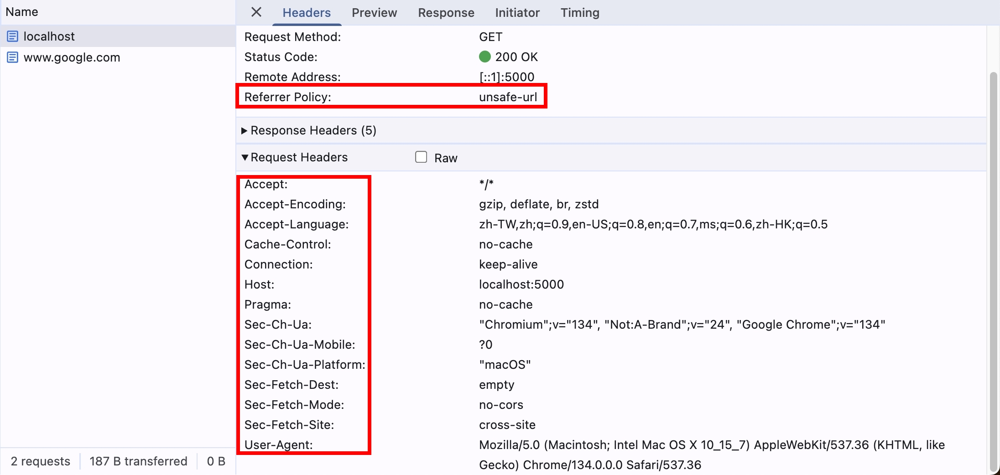

## 行前準備

為了等等方便測試，我們一樣先建立一個簡單的 NodeJS HTTP Server，所有 path 跟 method 都統一回傳 `ok` 字串就好

```js
import { createServer } from "http";
const httpServer = createServer().listen(5000);
httpServer.on("request", (req, res) => {
  res.end("ok");
});
```

## HTTP request header origin

origin 是什麼？我們打開 http://localhost:5000 > F12 > Console，輸入 location

```js
{
    "href": "http://localhost:5000/",
    "origin": "http://localhost:5000",
    "protocol": "http:",
    "host": "localhost:5000",
    "hostname": "localhost",
    "port": "5000",
    "pathname": "/",
    "search": "",
    "hash": ""
}
```

可以看到 origin 就是 `<scheme>://<hostname>:<port>` 的規則組成的

## 瀏覽器會在什麼情況加入 origin？

1. 跨域請求，例如我從 http://localhost:5000 要去請求 https://www.google.com 的頁面，我們試著在 http://localhost:5000 > F12 > Console 輸入以下程式碼

```js
fetch("https://www.google.com");
```

可以在 F12 > Network > Request Headers 確實看到 origin 了

```
origin: http://localhost:5000
```

2. 同源請求，GET 跟 HEAD 以外，例如我從 http://localhost:5000 發了一個 POST http://localhost:5000 的請求

```js
// request header 預期會有 origin: http://localhost:5000
fetch("http://localhost:5000", { method: "POST" });
```

## 瀏覽器會在什麼情況不加入 origin？

1. 跨域請求 && GET 或 HEAD 方法 && 指定 `no-cors`

我們打開 http://localhost:5000 > F12 > Console，輸入

```js
// request header 不會有 origin
fetch("https://www.google.com", { mode: "no-cors" });
// request header 不會有 origin
fetch("https://www.google.com", { mode: "no-cors", method: "HEAD" });
// request header 還是會有 origin
fetch("https://www.google.com", { mode: "no-cors", method: "POST" });
```

## 可以透過 javascript 改變 origin 嗎？

講到這邊，腦筋動很快的小夥伴可能會想到，origin request header 是可以透過 javascript 去改變的嗎？我們試試看

```js
fetch("https://www.google.com", {
  headers: { Origin: "https://www.google.com" },
});
```

可惜，最終送出去的 origin 還是沒有改變，我們看看 Fetch API 的官方文件是怎麼說的

https://fetch.spec.whatwg.org/#concept-header

```
A header (name, value) is forbidden request-header if these steps return true:
1. If name is a byte-case-insensitive match for one of:
......
`Origin`
`Referer`
......
```

當我們使用瀏覽器的 fetch 時，這些 forbidden headers 是無法透過 javascript 設定的！

## origin 竟然也有可能是 null？

根據 [MDN 文件](https://developer.mozilla.org/en-US/docs/Web/HTTP/Headers/Origin#description) 描述，以下幾種情況，origin 會是 null，我們挑一個來測試：

1. Origins whose scheme is not one of http, https, ftp, ws, wss, or gopher (including blob, file and data).

我們試著在本機創建一個 `index.html`

```html
<!DOCTYPE html>
<html>
  <head></head>
  <body></body>
</html>
```

使用瀏覽器打開，F12 > Console，輸入

```js
// request header 的 origin 會是 null
fetch("https://www.google.com");
```

小夥伴們可能會好奇，origin: null 跟 完全沒有 origin request header 差在哪裡？這邊的邏輯有點複雜，但總之來說就是，在某些特殊的跨域請求情境下，瀏覽器必須在 request header 帶上 origin，但由於安全以及隱私的情況，像剛才是本機打開的 `index.html` 檔案，如果直接把 `origin: file:///Users/xxx/path-to/index.html` 送出去，可能會導致用戶的隱私被揭露，所以這時候瀏覽器就會送出 `origin: null`，就像是在告訴 Server 端 "Hi，這是一個跨域請求，但是由於包含用戶的隱私，所以我沒辦法提供 origin 給你，請你根據這個特殊情況處理呦"

## HTTP request header Referer

referer 跟 origin 類似，都是 request header，也都是 Fetch API 官方文件有提到的 forbidden request header，但是 fetch API 其實還是有提供方法可以修改 referer，參考 MDN 文件

https://developer.mozilla.org/en-US/docs/Web/API/RequestInit#referrer

如果想要不送 referer 的話，指定空字串即可：

```js
fetch("https://www.google.com", { referrer: "" });
```

referer 根據 MDN 文件的描述，會包含 origin, path 跟 queryString，但不包含 hash，我們試著到 http://localhost:5000/test，一樣打開 F12 > Console，輸入以下程式碼

```js
fetch("https://www.google.com");
```

可以在 F12 > Network > Request Headers 確實看到 referer 了

```
referer: http://localhost:5000/
```

等等，為什麼不是 `http://localhost:5000/test`，而是 `http://localhost:5000/` 呢？難道是 MDN 文件在騙人？

## Referrer-Policy

題外話，觀察細微的小夥伴們應該有看到 `Referer` 跟 `Referrer-Policy`，為什麼後者有兩個連續的 `r`？其實後者 `Referrer` 才是正確的，至於為何會有 `Referer` 這個錯誤的拼寫，是因為 [HTTP 1.0 的規範](https://datatracker.ietf.org/doc/html/rfc1945#section-10.13) 當初在定義的時候拼錯字了，但為了向後兼容（backward compatibility），所以就只好將錯就錯QQ

回歸正題，為了解答上面的問題，我們必須提到 `referrer policy`，我們先打開 F12 > Network > General，應該會看到

```
Request URL: http://localhost:5000/test
......
Referrer Policy: strict-origin-when-cross-origin
```

`strict-origin-when-cross-origin` 是什麼意思呢？簡單來說，就是跨域請求，referer 只帶 origin 的部分，pathname 跟 querystring 就不帶了，以剛剛的情境為例，因為是從 http://localhost:5000 去請求 google.com，所以是跨域請求，只帶 origin 的部分確實是符合規範的

那我們再試試看同源請求，是否會帶上完整的 URL，我們到 http://localhost:5000/test?a=1&b=2，打開 F12 > Console，輸入以下程式碼

```js
fetch("http://localhost:5000");
```

可以看到 Request Header 確實有帶上完整的 URL

```
referer: http://localhost:5000/test?a=1&b=2
```

有小夥伴可能會問，`strict-origin-when-cross-origin` 是誰設定的呢？答案是瀏覽器預設的，詳細可以參考這篇文章

https://developer.chrome.com/blog/referrer-policy-new-chrome-default

```
strict-origin-when-cross-origin offers more privacy. With this policy, only the origin is sent in the Referer header of cross-origin requests.

This prevents leaks of private data that may be accessible from other parts of the full URL such as the path and query string.
```

講白了就是為了安全性，pathname 跟 queryString 可能會包含一些隱私的資訊，若透過 referer 揭露給跨域的主機，可能就會導致一些機密資訊洩漏

我們再來看看 referrer policy 還有哪些值，我們一樣以 http://localhost:5000/test?a=1&b=2 這個頁面發起請求

## 1. `no-referrer`

完全不送 referer

我們試試看在 http://localhost:5000/test?a=1&b=2 這個頁面的 F12 > Console 輸入

```js
// 預期不會送 referer
fetch("http://localhost:5000", {
  referrerPolicy: "no-referrer",
  mode: "no-cors",
});
// 預期不會送 referer
fetch("https://www.google.com", {
  referrerPolicy: "no-referrer",
  mode: "no-cors",
});
```

## 2. `no-referrer-when-downgrade`

downgrade（https > http 或 https > file） 情境就不送 referrer，反之就送完整 URL

我們試試看在 https://www.google.com/?a=1&b=2 這個頁面的 F12 > Console 輸入

```js
// 預期不會送 referer
fetch("http://localhost:5000", {
  referrerPolicy: "no-referrer-when-downgrade",
  mode: "no-cors",
});
// 預期會送 referer: https://www.google.com/?a=1&b=2
fetch("https://www.google.com", {
  referrerPolicy: "no-referrer-when-downgrade",
  mode: "no-cors",
});
```

## 3. `origin`

不管怎樣，我就是只送 origin 啦！

我們試試看在 http://localhost:5000/test?a=1&b=2 這個頁面的 F12 > Console 輸入

```js
// 預期會送 referer: http://localhost:5000/
fetch("http://localhost:5000", { referrerPolicy: "origin", mode: "no-cors" });
// 預期會送 referer: http://localhost:5000/
fetch("https://www.google.com", { referrerPolicy: "origin", mode: "no-cors" });
```

我們再試試看在 https://www.google.com/?a=1&b=2 這個頁面的 F12 > Console 輸入

```js
// 預期會送 referer: https://www.google.com/
fetch("http://localhost:5000", { referrerPolicy: "origin", mode: "no-cors" });
// 預期會送 referer: https://www.google.com/
fetch("https://www.google.com", { referrerPolicy: "origin", mode: "no-cors" });
```

## 4. `origin-when-cross-origin`

同源的情況就送完整的 URL，反之只送 origin

我們試試看在 http://localhost:5000/test?a=1&b=2 這個頁面的 F12 > Console 輸入

```js
// 同源 => 預期會送 referer: http://localhost:5000/test?a=1&b=2
fetch("http://localhost:5000", {
  referrerPolicy: "origin-when-cross-origin",
  mode: "no-cors",
});
// 跨域 => 預期會送 referer: http://localhost:5000/
fetch("https://www.google.com", {
  referrerPolicy: "origin-when-cross-origin",
  mode: "no-cors",
});
```

我們再試試看在 https://www.google.com/?a=1&b=2 這個頁面的 F12 > Console 輸入

```js
// 跨域 => 預期會送 referer: https://www.google.com/
fetch("http://localhost:5000", {
  referrerPolicy: "origin-when-cross-origin",
  mode: "no-cors",
});
// 同源 => 預期會送 referer: https://www.google.com/?a=1&b=2
fetch("https://www.google.com", {
  referrerPolicy: "origin-when-cross-origin",
  mode: "no-cors",
});
```

## 5. `same-origin`

同源的情況就送完整的 URL，反之就完全不送 referer

我們試試看在 localhost:5000/test?a=1&b=2 這個頁面的 F12 > Console 輸入

```js
// 同源 => 預期會送 referer: http://localhost:5000/test?a=1&b=2
fetch("http://localhost:5000", {
  referrerPolicy: "same-origin",
  mode: "no-cors",
});
// 跨域 => 預期不會送 referer
fetch("https://www.google.com", {
  referrerPolicy: "same-origin",
  mode: "no-cors",
});
```

我們再試試看在 https://www.google.com/?a=1&b=2 這個頁面的 F12 > Console 輸入

```js
// 跨域 => 預期不會送 referer
fetch("http://localhost:5000", {
  referrerPolicy: "same-origin",
  mode: "no-cors",
});
// 同源 => 預期會送 referer: https://www.google.com/?a=1&b=2
fetch("https://www.google.com", {
  referrerPolicy: "same-origin",
  mode: "no-cors",
});
```

## 6. `strict-origin`

protocol 沒有 downgrade 的時候就送 origin，反之就不送

我們試試看在 http://localhost:5000/test?a=1&b=2 這個頁面的 F12 > Console 輸入

```js
// protocol 沒有 downgrade => 預期會送 referer: http://localhost:5000/
fetch("http://localhost:5000", {
  referrerPolicy: "strict-origin",
  mode: "no-cors",
});
// protocol 沒有 downgrade => 預期會送 referer http://localhost:5000/
fetch("https://www.google.com", {
  referrerPolicy: "strict-origin",
  mode: "no-cors",
});
```

我們再試試看在 https://www.google.com/?a=1&b=2 這個頁面的 F12 > Console 輸入

```js
// protocol downgrade => 預期不會送 referer
fetch("http://localhost:5000", {
  referrerPolicy: "strict-origin",
  mode: "no-cors",
});
// protocol 沒有 downgrade => 預期會送 referer: https://www.google.com/
fetch("https://www.google.com", {
  referrerPolicy: "strict-origin",
  mode: "no-cors",
});
```

## 7. `strict-origin-when-cross-origin`

這是瀏覽器的預設值，上面有講過了～

## 8. `unsafe-url`

不管怎樣，我就是送完整的 URL 啦！但會有資安疑慮，所以不建議設定這個

我們試試看在 http://localhost:5000/test?a=1&b=2 這個頁面的 F12 > Console 輸入

```js
// 預期會送 referer: http://localhost:5000/test?a=1&b=2
fetch("http://localhost:5000", {
  referrerPolicy: "unsafe-url",
  mode: "no-cors",
});
// 預期會送 referer: http://localhost:5000/test?a=1&b=2
fetch("https://www.google.com", {
  referrerPolicy: "unsafe-url",
  mode: "no-cors",
});
```

我們再試試看在 https://www.google.com/?a=1&b=2 這個頁面的 F12 > Console 輸入

```js
// 預期會送 referer: https://www.google.com/?a=1&b=2
fetch("http://localhost:5000", {
  referrerPolicy: "unsafe-url",
  mode: "no-cors",
});
// 預期會送 referer: https://www.google.com/?a=1&b=2
fetch("https://www.google.com", {
  referrerPolicy: "unsafe-url",
  mode: "no-cors",
});
```

我們試著使用剛剛建立的 `index.html`，直接用瀏覽器打開，應該會看到網址列顯示 `file:///Users/xxx/path-to/index.html`，打開 F12 > Console 輸入

```js
// 預期會送 referer: file:///Users/xxx/path-to/index.html
fetch("http://localhost:5000", {
  referrerPolicy: "unsafe-url",
  mode: "no-cors",
});
// 預期會送 referer: file:///Users/xxx/path-to/index.html
fetch("https://www.google.com", {
  referrerPolicy: "unsafe-url",
  mode: "no-cors",
});
```

實際打開 F12 > Network，發現完全沒有送 referer，這是怎麼回事？



這其實是符合規範的行為，我們看看 W3C 的官方文件怎麼說

https://w3c.github.io/webappsec-referrer-policy/#determine-requests-referrer

```
If document’s origin is an opaque origin, return no referrer.
```

上面也有提到，當使用 file scheme 時，origin 會是 null（opaque origin），所以這時候就直接不加上 `referer` request header 了

## 小結

這個章節，我們介紹了 `Origin`, `Referer`, `Referrer-Policy`，以及在 Fetch API 的參數使用 `referrerPolicy` 來控制 request header `Referer`，但其實 `referrerPolicy` 也可以當作 HTTP response header，甚至可以在部分 HTML Element 身上使用！下個章節我們會繼續深入 `referrerPolicy`

## 參考資料

- https://developer.mozilla.org/en-US/docs/Web/HTTP/Headers/Origin
- https://developer.mozilla.org/en-US/docs/Web/HTTP/Headers/Referer
- https://developer.mozilla.org/en-US/docs/Web/HTTP/Headers/Referrer-Policy
- https://developer.mozilla.org/en-US/docs/Web/Security/Referer_header:_privacy_and_security_concerns
- https://stackoverflow.com/questions/42239643/when-do-browsers-send-the-origin-header-when-do-browsers-set-the-origin-to-null/42242802
