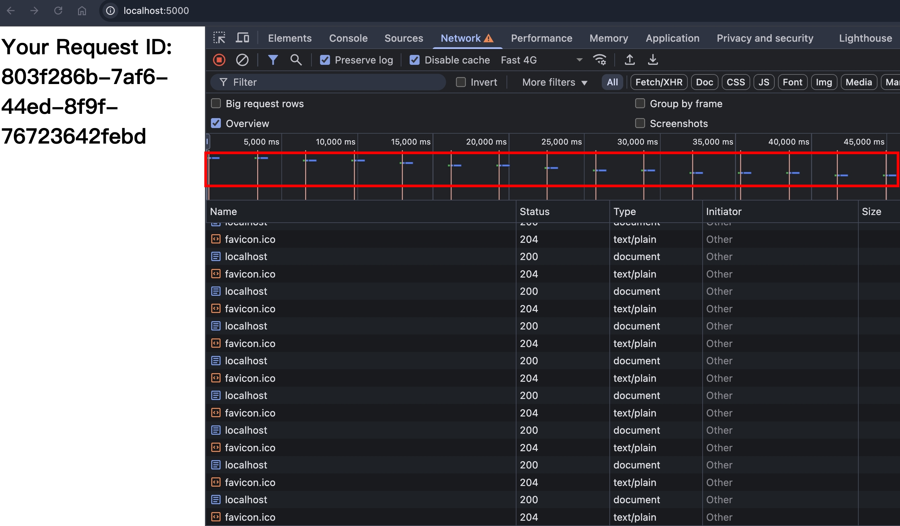
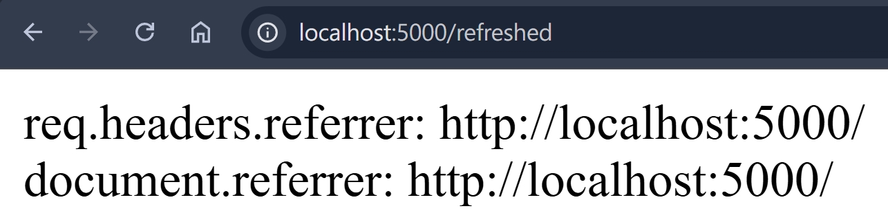
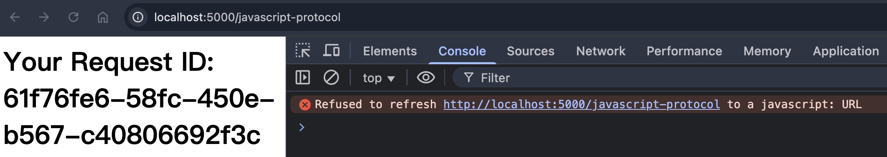
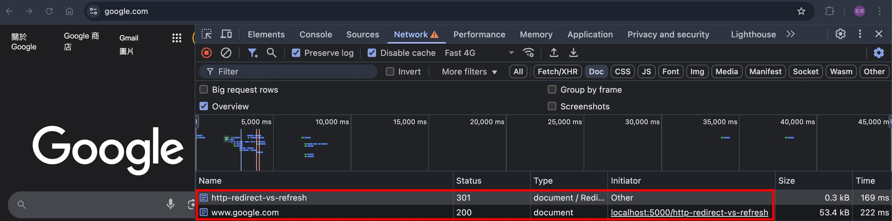
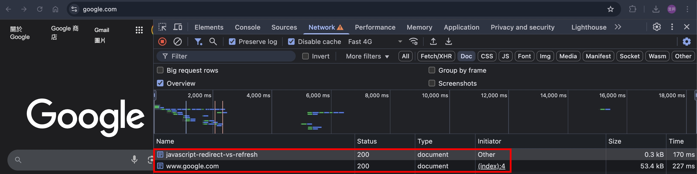
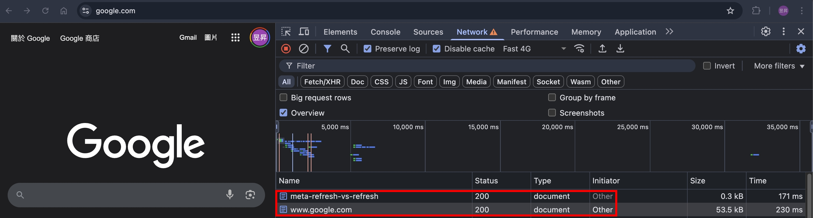
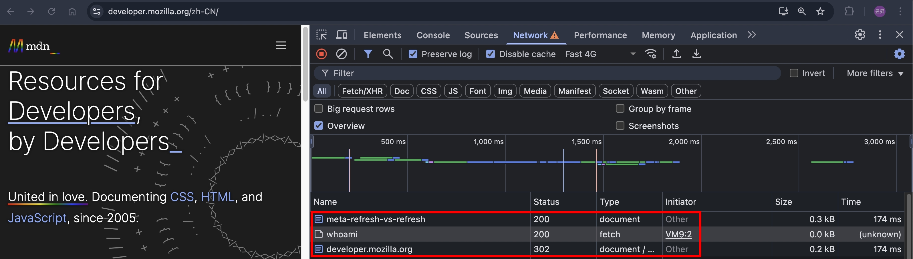
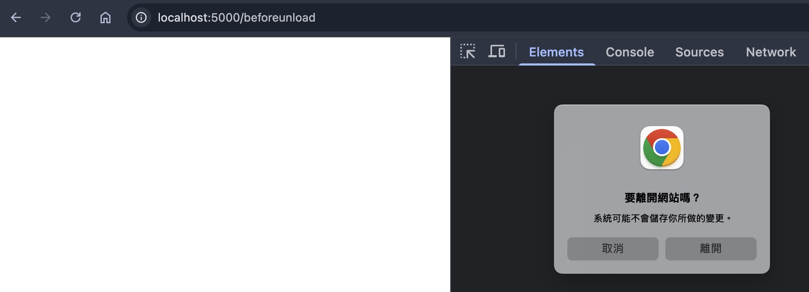

## Refresh Response Header

Refresh 是一個 Response Header，將用戶在 N 秒後導向指定頁面，語法是

```
Refresh: 0
Refresh: 1, url=https://www.google.com
Refresh: 2; url=https://developer.mozilla.org
```

若不指定 url 的話，則代表原頁重整

## Refresh without url

使用 NodeJS HTTP 模組實作

```ts
import httpServer from "../httpServer";
import { faviconListener } from "../listeners/faviconListener";
import { notFoundListener } from "../listeners/notFoundlistener";

httpServer.removeAllListeners("request");
httpServer.on("request", function requestListener(req, res) {
  if (req.url === "/favicon.ico") return faviconListener(req, res);
  if (req.url === "/") {
    res.setHeader("Refresh", "3");
    res.setHeader("Content-Type", "text/html");
    res.end(`<h1>Your Request ID: ${crypto.randomUUID()}</h1>`);
    return;
  }
  return notFoundListener(req, res);
});
```

瀏覽器打開 http://localhost:5000/ ，就可以看到每隔 3 秒刷新頁面的效果了


## referrer

根據 [MDN 文件](https://developer.mozilla.org/en-US/docs/Web/HTTP/Reference/Headers/Refresh)的描述

```
Note: When a refresh redirects to a new page, the Referer header is included in the request for the new page (if permitted by the Referrer-Policy), and document.referrer is set to the referrer URL after navigating.
```

我們來測試看看，調整 NodeJS 的程式碼

```ts
if (req.url === "/") {
  res.setHeader("Refresh", "0; url=https://localhost:5000/refreshed");
  res.setHeader("Content-Type", "text/html");
  res.end(`<h1>Your Request ID: ${crypto.randomUUID()}</h1>`);
  return;
}
if (req.url == "/refreshed") {
  res.setHeader("Content-Type", "text/html");
  res.end(`
    <html>
      <head></head>
      <body>
        <div>req.headers.referrer: ${req.headers.referer}</div>
        <div id="documentReferrer"></div>
        <script>
          document.getElementById("documentReferrer").innerText = "document.referrer: " + document.referrer
        </script>
      </body>
    </html>
  `);
  return;
}
```

瀏覽器打開 http://localhost:5000/ ，可以看到 referrer 確實有帶到


## Refresh with javascript protocol

如果 Server 端設定 `Refresh: 0; url=javascript:alert(1)`，能夠執行程式碼嗎？我們試試看：

```ts
if (req.url === "/javascript-protocol") {
  res.setHeader("Refresh", "0; url=javascript:alert(1)");
  res.setHeader("Content-Type", "text/html");
  res.end(`<h1>Your Request ID: ${crypto.randomUUID()}</h1>`);
  return;
}
```

瀏覽器打開 http://localhost:5000/javascript-protocol

結論是，不行～

## HTTP redirect vs refresh

如果 HTTP redirect 跟 refresh 同時定義，會以誰為主呢？

```ts
// HTTP redirect vs refresh
if (req.url === "/http-redirect-vs-refresh") {
  res.statusCode = 301;
  res.setHeader("Location", "https://www.google.com");
  res.setHeader(
    "Refresh",
    "0; url=https://developer.mozilla.org/zh-TW/docs/Web/HTTP/Reference/Status/301",
  );
  res.end();
  return;
}
```

瀏覽器打開 http://localhost:5000/http-redirect-vs-refresh

答案是 http 30x redirect 勝出！

## JavsScript redirect vs refresh

如果在 `<script>` 定義 redirect 跟 HTTP refresh，會以誰為主呢？

index.ts

```ts
// JavsScript redirect vs refresh
const javascriptRedirectHTML = readFileSync(
  join(__dirname, "javascriptRedirect.html"),
);
if (req.url === "/javascript-redirect-vs-refresh") {
  res.setHeader("Refresh", "0; url=https://developer.mozilla.org");
  res.end(javascriptRedirectHTML);
  return;
}
```

javascriptRedirect.html

```html
<html>
  <head></head>
  <body>
    <script>
      location.assign("https://www.google.com");
    </script>
  </body>
</html>
```

瀏覽器打開 http://localhost:5000/javascript-redirect-vs-refresh

答案是 JavaScript redirect 勝出！

## meta refresh vs refresh

如果在 HTML 定義 meta 跟 HTTP refresh，會以誰為主呢？

metaRefresh.html

```html
<html>
  <head>
    <meta http-equiv="refresh" content="0; url=https://www.google.com" />
  </head>
  <body>
    <h1>meta refresh</h1>
  </body>
</html>
```

index.ts

```ts
// meta refresh vs refresh
if (req.url === "/meta-refresh-vs-refresh") {
  res.setHeader("Refresh", "0; url=https://developer.mozilla.org");
  res.end(metaRefreshHTML);
  return;
}
```

瀏覽器打開 http://localhost:5000/meta-refresh-vs-refresh

答案是 meta refresh 勝出！

那如果 meta 秒數比較慢，會以誰為主呢？

metaRefresh.html

```html
<html>
  <head>
    <meta http-equiv="refresh" content="1; url=https://www.google.com" />
  </head>
  <body>
    <h1>meta refresh</h1>
  </body>
</html>
```

瀏覽器打開 http://localhost:5000/meta-refresh-vs-refresh

答案是 refresh 勝出！

## Redirection order of precedence

上面測試了很多情境，根據 [MDN 文件](https://developer.mozilla.org/en-US/docs/Web/HTTP/Reference/Headers/Refresh)的描述

```
Note: Even though it's present in the HTTP response, the Refresh header is still handled by the HTML loading machinery and happens after HTTP or JavaScript redirects.
```

總結一下 redirect 的優先順序：

1. HTTP Redirect（30x status code 搭配 Location）
2. JavaScript Redirect（例如：`location.assign("URL")`）
3. HTML Meta Refresh（例如：`<meta http-equiv="refresh" content="3; url=https://www.google.com">`）
4. HTTP Refresh

## beforeunload and refresh

既然 HTTP Refresh 是透過 HTML 的機制，那 beforeunload 應該也會觸發？

beforeunload.html

```html
<html>
  <head></head>
  <body>
    <script>
      addEventListener("beforeunload", (e) => {
        e.preventDefault();
        e.returnValue = "123";
      });
    </script>
  </body>
</html>
```

index.ts

```ts
// beforeunload
if (req.url === "/beforeunload") {
  res.setHeader("Refresh", "3; url=https://www.google.com");
  res.end(beforeunloadHTML);
  return;
}
```

瀏覽器打開 http://localhost:5000/beforeunload ，並且點擊螢幕製造 user interaction（原因可參考 [MDN 文件](https://developer.mozilla.org/en-US/docs/Web/API/Window/beforeunload_event)）

```
In other words, the browser will only show the dialog box if the frame or any embedded frame receives a user gesture or user interaction.
```


答案是會觸發 beforeunload！

## 小結

本篇文章，帶大家了解 HTTP Refresh 的機制，並且也跟 HTTP Redirect 還有 JavaScript Redirect 去做比較，希望大家收穫滿滿。

## 參考資料

- https://developer.mozilla.org/en-US/docs/Web/HTTP/Headers/Refresh
- https://developer.mozilla.org/en-US/docs/Web/API/Window/beforeunload_event
- https://developer.mozilla.org/en-US/docs/Web/HTTP/Guides/Redirections#order_of_precedence
