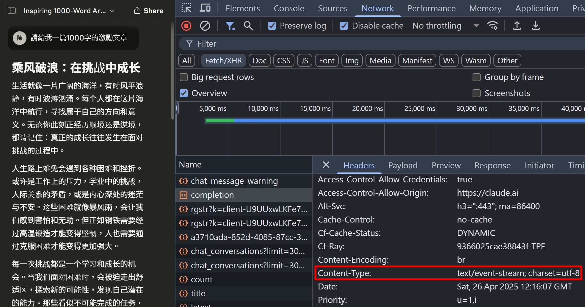
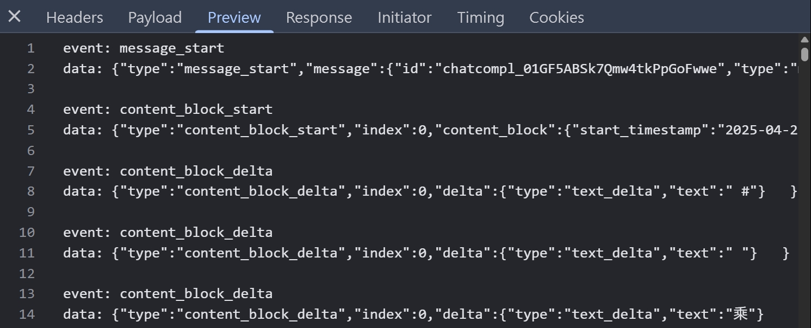
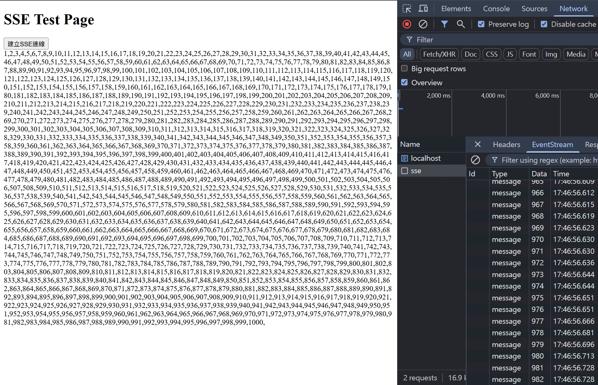
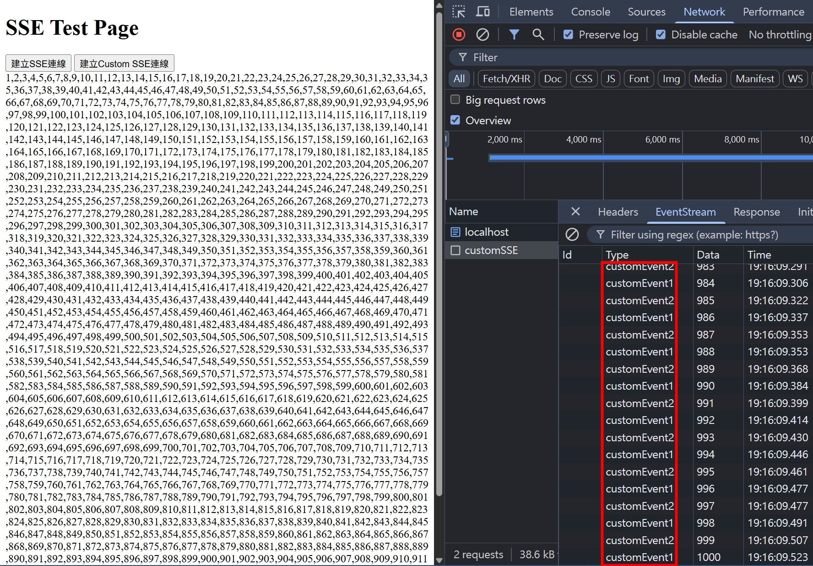
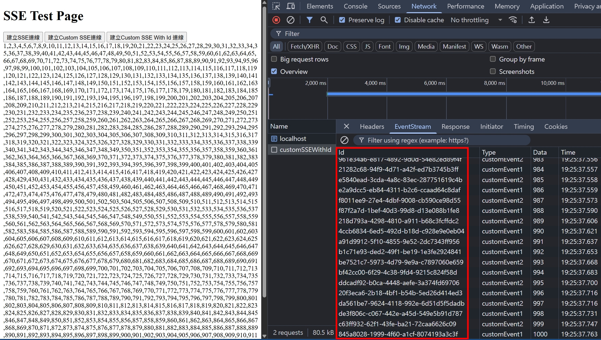
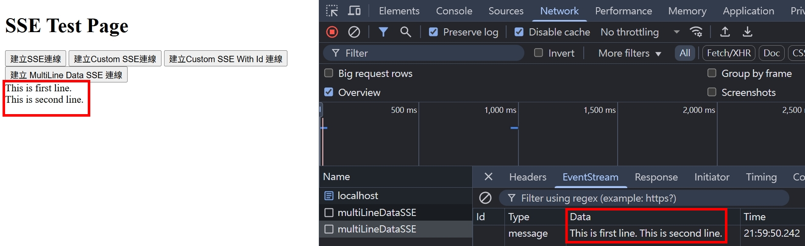
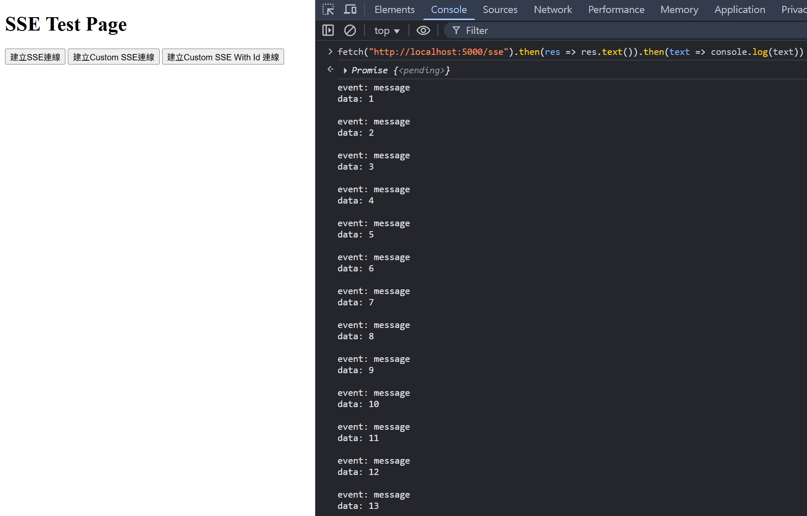

## AI 時代來臨，讓 SSE 技術再次浮上檯面

當我們使用 AI 工具如 [Claude](https://claude.ai/new) 或是 [ChatGPT](https://chatgpt.com/) 時，會發現 AI 在回答時，內容會一個一個字出現，而不是等到所有字產完才一次出現。這樣的方式，使用者可以獲得更好的體驗，可以獲得即時的回答，而不需要等待幾十秒才看到一大篇內容。這背後用到的技術，就是 Server-Sent Events。

## SSE 跟 HTTP 有什麼關聯

若仔細觀察 [Claude](https://claude.ai/new) 的 Network，會發現 SSE 其實沒有什麼神奇的魔法，就是在 Response Header 加上 `Content-Type: text/event-stream; charset=utf-8`



至於 Response Body 是怎麼傳輸的呢？



可以看到，SSE 本質上就是一個長連結的 HTTP，搭配指定的 `Content-Type` 跟 Response Payload 格式，就可以讓 Server 傳遞多次資料給 Client 端，透過一個 HTTP 請求的來回

## SSE 的 Response Payload 格式

根據 [MDN 文件](https://developer.mozilla.org/en-US/docs/Web/API/Server-sent_events/Using_server-sent_events#fields) 的描述，SSE 的 Response Payload 結構如下

```
: this is a comment
event: eventName
data: anyString
id: uniqueId
retry: 1

event: eventName
data: anyString
id: uniqueId
retry: 1
```

有幾點要注意

1. `:` 為開頭的代表是註解，通常 Server 會定期發送，確保這個連結沒有斷開

2. 只有 data 欄位是必填，其餘皆為選填，若用 TypeScript 的方式來理解

```ts
interface EventStream {
  event?: string;
  data: string;
  id?: string;
  retry?: number;
}
```

3. 這邊的換行符號是用 `\n`（畢竟如果又用 `\r\n` 的話，就會跳出 HTTP Response Body 的區塊了嘛！）

4. data 欄位也可以是 JSON 格式，例如 `data: { "age": 20, "height": 170 }`

5. data 欄位也可以是多行，瀏覽器會自動把每行 data 用 `\n` 連結起來

```
data: This is first line.
data: This is second line.
```

這樣的結果會是 `This is first line.\nThis is second line.`

## 不指定 event 的 SSE

我們創建一個 `index.html`，點擊按鈕後，會使用 SSE 傳輸資料

```html
<!DOCTYPE html>
<html>
  <head></head>
  <body>
    <header>
      <h1>SSE Test Page</h1>
    </header>
    <script>
      function handleSSE() {
        const containerDiv = document.getElementById("container");
        const eventSource = new EventSource("/sse");
        eventSource.onmessage = (event) => {
          containerDiv.innerText += `${event.data},`;
          if (event.data === "1000") eventSource.close();
        };
      }
    </script>
    <main>
      <button onclick="handleSSE()">建立SSE連線</button>
      <div id="container" style="word-wrap: break-word;"></div>
    </main>
  </body>
</html>
```

接著我們使用 NodeJS HTTP Module，處理 SSE 的邏輯，這邊很簡單，就是單純使用 `setInterval` 回傳 1 ~ 1000 的字串

```ts
import { readFileSync } from "fs";
import { join } from "path";
import httpServer from "../httpServer";
import { notFoundListener } from "../listeners/notFoundlistener";

const indexHTML = readFileSync(join(__dirname, "index.html"));
const ENDINDEX = 1000;

function generateEventStream(params: {
  eventName?: string;
  data: string;
  id?: string;
  retry?: number;
}) {
  const { eventName, data, id, retry } = params;
  let eventStream = "";
  if (eventName) eventStream += `event: ${eventName}\n`;
  eventStream += `data: ${data}\n`;
  if (id) eventStream += `id: ${id}\n`;
  if (typeof retry === "number" && Number.isInteger(retry) && retry > 0)
    eventStream += `retry: ${retry}\n`;
  eventStream += "\n";
  return eventStream;
}

httpServer.on("request", function requestListener(req, res) {
  if (req.url === "/") {
    res.setHeader("Content-Type", "text/html; charset=utf-8");
    res.end(indexHTML);
    return;
  }

  if (req.url === "/sse") {
    let index = 1;
    res.setHeader("Content-Type", "text/event-stream; charset=utf-8");
    // SSE 的目的是 Server > Client 的即時通訊，快取在此情境是多餘的，可能會造成 BUG，故關閉
    res.setHeader("Cache-Control", "no-cache");
    const timeoutId = setInterval(() => {
      if (index === ENDINDEX) {
        res.end(generateEventStream({ data: String(index) }), () =>
          clearTimeout(timeoutId),
        );
        return;
      }
      res.write(generateEventStream({ data: String(index) }));
      index += 1;
    }, 1);
    return;
  }
  return notFoundListener(req, res);
});
```

接著我們使用瀏覽器打開 http://localhost:5000/ ，並且點擊按鈕，就會看到如下的結果



當不指定 event 的情況，預設的 event 就是 `message`，所以在 client 端的 javascript 才會透過 `onmessage` 去接收 SSE。

## 指定 event 的 SSE

承上，如果我們在 server side 刻意指定 `event: message` 呢？這樣 client 端一樣是透過 `onmessage` 去接嗎？我們修改一下程式碼

```ts
if (req.url === "/sse") {
  let index = 1;
  res.setHeader("Content-Type", "text/event-stream; charset=utf-8");
  // SSE 的目的是 Server > Client 的即時通訊，快取在此情境是多餘的，可能會造成 BUG，故關閉
  res.setHeader("Cache-Control", "no-cache");
  const timeoutId = setInterval(() => {
    const eventStream = generateEventStream({
      data: String(index),
      eventName: "message",
    });
    if (index === ENDINDEX) {
      res.end(eventStream, () => clearTimeout(timeoutId));
      return;
    }
    res.write(eventStream);
    index += 1;
  }, 1);
  return;
}
```

結果跟 [不指定 event 的 SSE](#不指定-event-的-sse) 一樣。我們繼續定義不同的 event，叫做 `customEvent1` 跟 `customEvent2`，並且也同步調整前後端的程式碼。

前端的程式碼（只列出新增部分）

```js
function handleCustomSSE() {
  const containerDiv = document.getElementById("container");
  const eventSource = new EventSource("/customSSE");
  eventSource.addEventListener("customEvent1", (event) => {
    console.log("customEvent1 triggered", event.data);
    containerDiv.innerText += `${event.data},`;
    if (event.data === "1000") eventSource.close();
  });
  eventSource.addEventListener("customEvent2", (event) => {
    console.log("cutsomEvent2 triggered", event.data);
    containerDiv.innerText += `${event.data},`;
    if (event.data === "1000") eventSource.close();
  });
}
```

```html
<button onclick="handleCustomSSE()">建立Custom SSE連線</button>
```

後端的程式碼（只列出新增部分）

```ts
if (req.url === "/customSSE") {
  let index = 1;
  res.setHeader("Content-Type", "text/event-stream; charset=utf-8");
  // SSE 的目的是 Server > Client 的即時通訊，快取在此情境是多餘的，可能會造成 BUG，故關閉
  res.setHeader("Cache-Control", "no-cache");
  const timeoutId = setInterval(() => {
    const eventStream = generateEventStream({
      data: String(index),
      eventName: `customEvent${(index % 2) + 1}`,
    });
    if (index === ENDINDEX) {
      res.end(eventStream, () => clearTimeout(timeoutId));
      return;
    }
    res.write(eventStream);
    index += 1;
  }, 1);
  return;
}
```

這時候一樣打開瀏覽器 http://localhost:5000/ ，並且點擊按鈕，就會看到兩種不同的 event 囉！



## 加上 id

剛才的範例，id 欄位都是空的，我們接著嘗試給每個 eventStream 都加上 id

前端的程式碼（只列出新增部分）

```js
function handleCustomSSEWithId() {
  const containerDiv = document.getElementById("container");
  const eventSource = new EventSource("/customSSEWithId");
  eventSource.addEventListener("customEvent1", (event) => {
    console.log("customEvent1 triggered", {
      id: event.lastEventId,
      data: event.data,
    });
    containerDiv.innerText += `${event.data},`;
    if (event.data === "1000") eventSource.close();
  });
  eventSource.addEventListener("customEvent2", (event) => {
    console.log("cutsomEvent2 triggered", {
      id: event.lastEventId,
      data: event.data,
    });
    containerDiv.innerText += `${event.data},`;
    if (event.data === "1000") eventSource.close();
  });
}
```

```html
<button onclick="handleCustomSSEWithId()">建立Custom SSE With Id 連線</button>
```

後端的程式碼（只列出新增部分）

```ts
if (req.url === "/customSSEWithId") {
  let index = 1;
  res.setHeader("Content-Type", "text/event-stream; charset=utf-8");
  // SSE 的目的是 Server > Client 的即時通訊，快取在此情境是多餘的，可能會造成 BUG，故關閉
  res.setHeader("Cache-Control", "no-cache");
  const timeoutId = setInterval(() => {
    const eventStream = generateEventStream({
      data: String(index),
      eventName: `customEvent${(index % 2) + 1}`,
      id: crypto.randomUUID(), // 主要就新增這行
    });
    if (index === ENDINDEX) {
      res.end(eventStream, () => clearTimeout(timeoutId));
      return;
    }
    res.write(eventStream);
    index += 1;
  }, 1);
  return;
}
```

這時候一樣打開瀏覽器 http://localhost:5000/ ，並且點擊按鈕，就會看到 id 囉！



## 多行 data

我們接著嘗試多行 data 的情境

前端的程式碼（只列出新增部分）

```js
function handleMultiLineDataSSE() {
  const containerDiv = document.getElementById("container");
  const eventSource = new EventSource("/multiLineDataSSE");
  eventSource.onmessage = (event) => {
    console.log(event);
    containerDiv.innerText = event.data;
    eventSource.close();
  };
}
```

```html
<button onclick="handleMultiLineDataSSE()">建立 MultiLine Data SSE 連線</button>
```

後端的程式碼（只列出新增部分）

```ts
if (req.url === "/multiLineDataSSE") {
  res.setHeader("Content-Type", "text/event-stream; charset=utf-8");
  // SSE 的目的是 Server > Client 的即時通訊，快取在此情境是多餘的，可能會造成 BUG，故關閉
  res.setHeader("Cache-Control", "no-cache");
  res.end(`data: This is first line.\ndata: This is second line.\n\n`);
  return;
}
```

打開瀏覽器 http://localhost:5000/ ，並且點擊按鈕，就會看到多行 data 中間被 `\n` 連結起來了。



## 使用 fetch API 去戳 SSE Endpoint 會發生什麼事

在瀏覽器的 F12 > Console 輸入以下程式碼

```js
fetch("http://localhost:5000/sse")
  .then((res) => res.text())
  .then((text) => console.log(text));
```

因為沒有 eventListener 去監聽，所以就必須等到整包 HTTP Response Payload 都傳輸完畢，才會一次性的收到結果，如此就會造成使用者體驗不佳。



<!-- todo-yusheng -->
<!-- ## 使用 fetch API 搭配 ReadableStream 去戳 SSE Endpoint -->

<!-- todo-yusheng -->
<!-- ## 搭配 `Last-Event-ID` 實現掉包 retry 機制 -->
<!-- https://html.spec.whatwg.org/multipage/server-sent-events.html#the-last-event-id-header -->

## 結尾

本篇 SSE 帶大家實作了各種情境，並且也解析了 SSE 的實際應用（AI 問答），希望大家收穫滿滿！

## 參考資料

- https://html.spec.whatwg.org/multipage/server-sent-events.html
- https://developer.mozilla.org/en-US/docs/Web/API/EventSource
- https://developer.mozilla.org/en-US/docs/Web/API/Server-sent_events/Using_server-sent_events
- https://nodejs.org/dist/latest-v22.x/docs/api/stream.html
