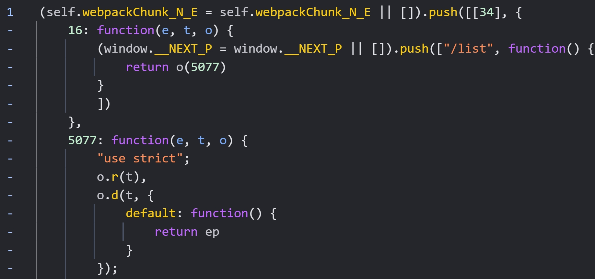
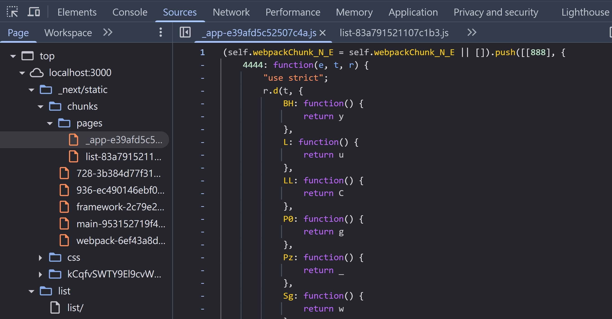
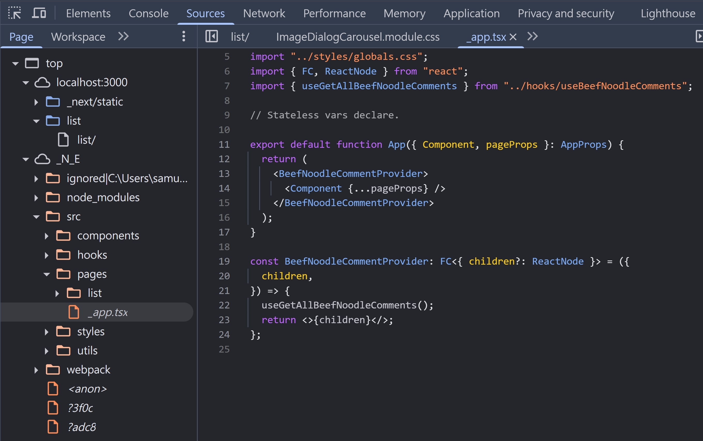
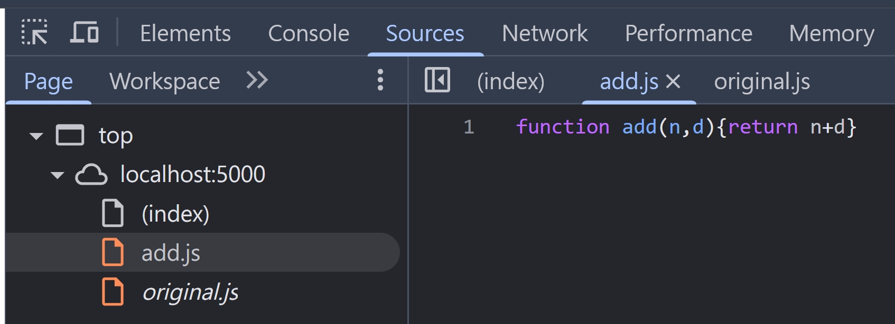
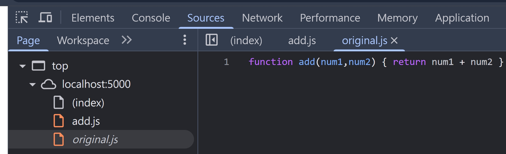

## Source Map 是什麼

現代前端開發，我們寫的 Code 通常都是打包後才會部署，而打包環節，通常都包含 minify 跟 uglify，導致我們在瀏覽器 debug 的時候，看到的都是這種很醜的程式碼



現代很多打包工具，例如 Webpack, Vite 都有支援 Source Map 的選項，讓開發者可以在 `npm run build` 階段，打包出 `file.js.map` 的檔案，這個檔案就可以讓我們在瀏覽器的 DevTools 看到原始的程式碼，方便 debug。

## NextJS Enable Source Map

來看看 NextJS 官方文件怎說的

```
Source Maps are enabled by default during development. During production builds, they are disabled to prevent you leaking your source on the client, unless you specifically opt-in with the configuration flag.
```

使用 `npm run dev` 開啟一個 NextJS 專案，確實可以看到原始的程式碼


但如果是 production 環境 `npm run build && npx serve@latest out` 就看不到原始的程式碼了



我們可以在 next.config.js 把 sourceMap 這個功能啟用

```js
/** @type {import('next').NextConfig} */
const nextConfig = {
  output: "export",
  trailingSlash: true,
  productionBrowserSourceMaps: true,
};
```

然後重新 `npm run build && npx serve@latest out`，就可以在瀏覽器的 DevTools 看到原始的程式碼



## 瀏覽器怎麼知道 .js.map 的對應

其實很簡單～在打包過後的 js，最後一行會有

```js
//# sourceMappingURL=_app-de73d6a6dba3be11.js.map
```

而 css 也是，最後一行會有

```css
/*# sourceMappingURL=5afdcedd3de5bdb2.css.map*/
```

Webpack, Vite 這些打包工具在打包時，預設都會以註解來標示對應的 .map 檔。當然，也可以透過 Response Header 來設定，就來到了我們今天的主題。

## Response Header 設定 Source Map

1. 使用 [UglifyJS-online](https://skalman.github.io/UglifyJS-online/)，貼上這段程式碼

```js
function add(num1, num2) {
  return num1 + num2;
}
```

2. 創建 `add.js`，內容為 UglifyJS 後的內容

```js
function add(n, d) {
  return n + d;
}
```

3. 創建 add.js.map，內容為

```json
{
  "version": 3,
  "sources": ["original.js"],
  "names": ["add", "num1", "num2"],
  "mappings": "AAAA,SAASA,IAAIC,EAAMC,GAAK,OAAOD,EAAOC,EAAO",
  "file": "uglified.js",
  "sourcesContent": ["function add(num1,num2) { return num1 + num2 }"]
}
```

4. 使用 NodeJS HTTP 模組創建一個簡單的應用

index.ts

```ts
import { readFileSync } from "fs";
import httpServer from "../httpServer";
import { faviconListener } from "../listeners/faviconListener";
import { join } from "path";

const js = readFileSync(join(__dirname, "add.js"));
const jsMap = readFileSync(join(__dirname, "add.js.map"));

httpServer.removeAllListeners("request");
httpServer.on("request", function requestListener(req, res) {
  if (req.url === "/favicon.ico") return faviconListener(req, res);
  if (req.url === "/add.js") {
    res.setHeader("Content-Type", "text/javascript");
    res.setHeader("SourceMap", "add.js.map");
    res.end(js);
    return;
  }
  if (req.url === "/add.js.map") {
    res.setHeader("Content-Type", "application/json");
    res.end(jsMap);
    return;
  }
  if (req.url === "/") {
    res.setHeader("Content-Type", "text/html");
    res.end('<script src="http://localhost:5000/add.js"></script>');
  }
});
```

5. 瀏覽器打開 http://localhost:5000/ ，可以看到 UglifyJS 後的程式碼，跟原始的程式碼了～
   
   

## 小結

現代前端框架，幫我們處理好太多細節了，像是開發模式的 Source Map。瀏覽器其實也會額外發起請求載入 `.map` 檔案，只是不會在 NetWork Tab 看到而已。自己動手實作一個 HTTP Server 的過程，也對整個前端開發的架構更了解～

## 參考資料

- https://developer.mozilla.org/en-US/docs/Web/HTTP/Headers/SourceMap
- https://developer.mozilla.org/en-US/docs/Glossary/Source_map
- https://www.typescriptlang.org/tsconfig/#sourceMap
- https://web.dev/articles/source-maps
- https://nextjs.org/docs/app/api-reference/config/next-config-js/productionBrowserSourceMaps
