## 語法

```
Strict-Transport-Security: max-age=<seconds>
Strict-Transport-Security: max-age=<seconds>; includeSubDomains
Strict-Transport-Security: max-age=<seconds>; includeSubDomains; preload
```

## NodeJS HTTP Server

根據 [MDN 文件](https://developer.mozilla.org/en-US/docs/Web/HTTP/Reference/Headers/Strict-Transport-Security#description) 的描述：

```
Note: The host must send the Strict-Transport-Security header over HTTPS only, not insecure HTTP. Browsers ignore the header if sent over HTTP to prevent a manipulator-in-the-middle (MITM) from altering the header to expire prematurely or adding it for a host that doesn't support HTTPS.
```

在 HTTP Protocol 的情況設定，browser 會忽略，那我們就架一個 NodeJS HTTP Server 試試看！

index.ts

```ts
import httpServer from "../httpServer";

httpServer.removeAllListeners("request");
httpServer.on("request", function requestListener(req, res) {
  res.setHeader(
    "Strict-Transport-Security",
    "max-age=31536000; includeSubDomains",
  );
  res.end();
  return;
});
```

使用瀏覽器打開 http://localhost:5000/
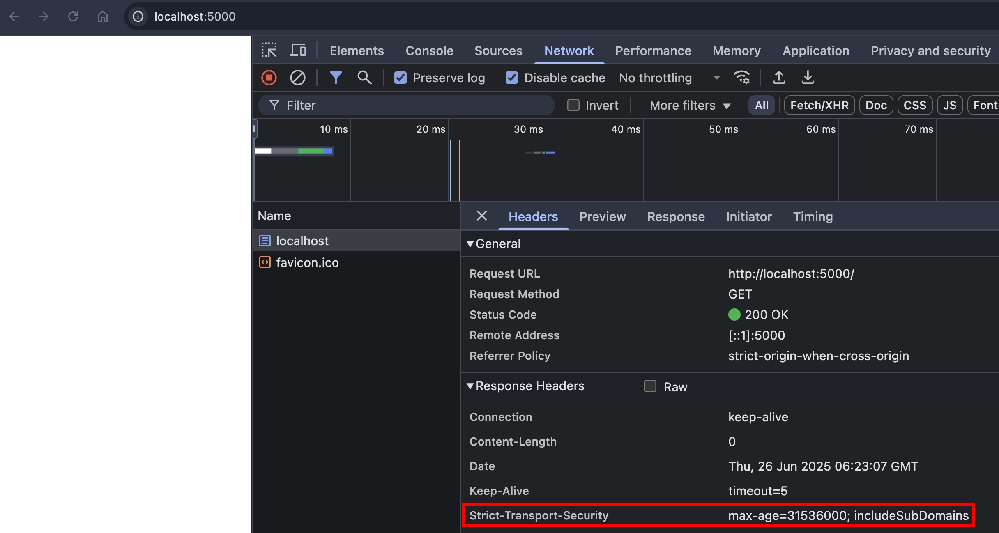
恩...沒有跳任何 warning message，那我們要怎麼驗證呢？Chrome 有提供[一個頁面](chrome://net-internals/#hsts)可以查詢 HSTS（HTTP Strict Transport Security），輸入 `localhost` 以及 `localhost:5000` 查詢看看～
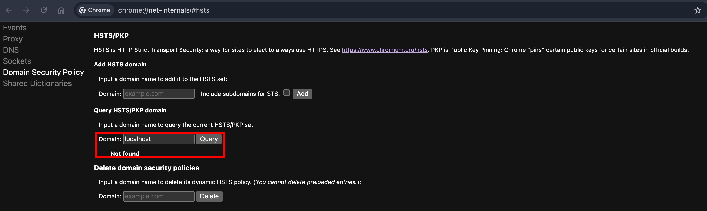

都沒查到！代表 Chrome 真的忽略了在 HTTP Protocol 設定的 HSTS（但我們還需要驗證在 HTTPS Protocol 是否就會紀錄 HSTS）

## NodeJS HTTPS Server

我們按照以下步驟，在本機啟動 NodeJS HTTPS Server

private-key.pem & cert.pem

```zsh
# 產生私鑰
openssl genrsa -out private-key.pem 2048

# 產生自簽憑證
openssl req -new -x509 -key private-key.pem -out cert.pem -days 365
```

httpsServer.ts

```ts
import { readFileSync } from "fs";
import { createServer } from "https";
import { join } from "path";

const httpsServer = createServer().listen(5001);
httpsServer.setSecureContext({
  key: readFileSync(join(__dirname, "private-key.pem")),
  cert: readFileSync(join(__dirname, "cert.pem")),
});
export default httpsServer;
```

index.ts

```ts
import httpsServer from "../https-server/httpsServer";

httpsServer.removeAllListeners("request");
httpsServer.on("request", function httpsRequestListener(req, res) {
  res.setHeader(
    "Strict-Transport-Security",
    "max-age=31536000; includeSubDomains",
  );
  res.end();
  return;
});
```

使用瀏覽器打開 https://localhost:5001/
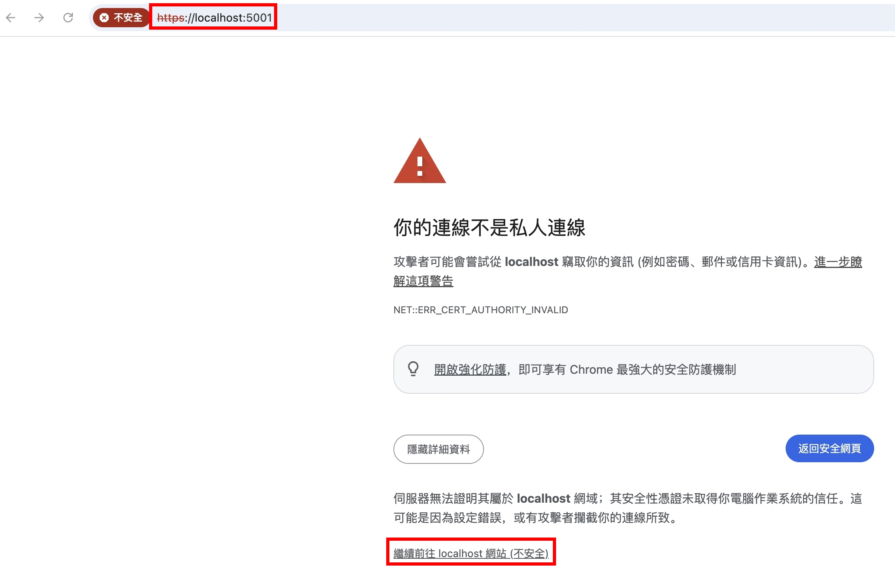
恩...看來遇到了自簽憑證不被信任的問題，此時瀏覽器也不會註冊 HSTS

## mkcert 建立本機 CA

我們把剛才生成的 `private-key.pem` 跟 `cert.pem` 砍掉，並且執行

```zsh
brew install mkcert
brew install nss # to work on firefox
mkcert -install
mkcert -key-file private-key.pem -cert-file cert.pem localhost
```

然後重啟 NodeJS HTTPS Server，關閉瀏覽器，並且重開

這次沒有跳警告了，我們用 chrome://net-internals/#hsts 查查看

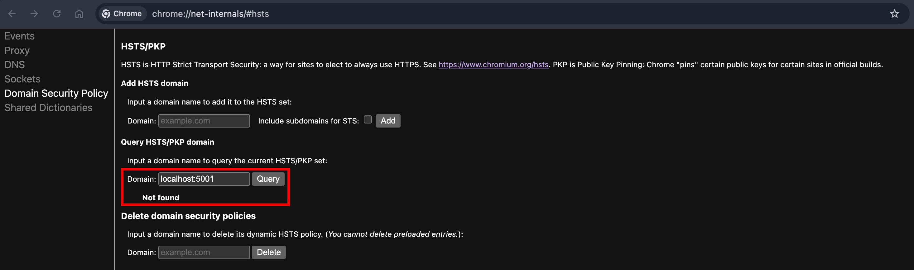
還是沒有！我推測有幾種可能性：

1. 瀏覽器不會紀錄 localhost 這個 host
2. chrome://net-internals/#hsts 不會立即查到剛設定的 Strict-Transport-Security

## 設定 hosts 檔案

為了逐步排查，我們先來設定本機的 hosts 檔案

```
127.0.0.1	hsts.test.com
127.0.0.1	nodejs.hsts.test.com
127.0.0.1	sub.nodejs.hsts.test.com
```

然後記得把剛才生成的 `private-key.pem` 跟 `cert.pem` 砍掉，然後重新簽憑證

```zsh
mkcert -key-file private-key.pem -cert-file cert.pem hsts.test.com nodejs.hsts.test.com sub.nodejs.hsts.test.com
```

把瀏覽器關掉重開，輸入 https://hsts.test.com:5001
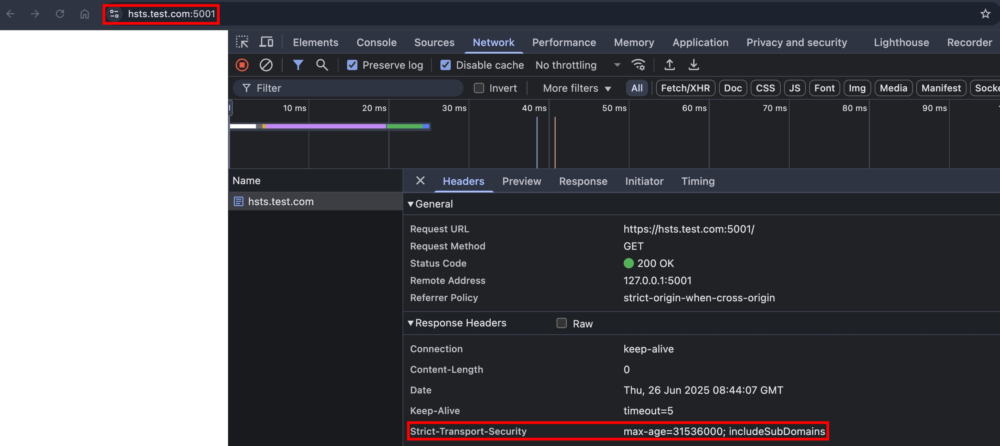
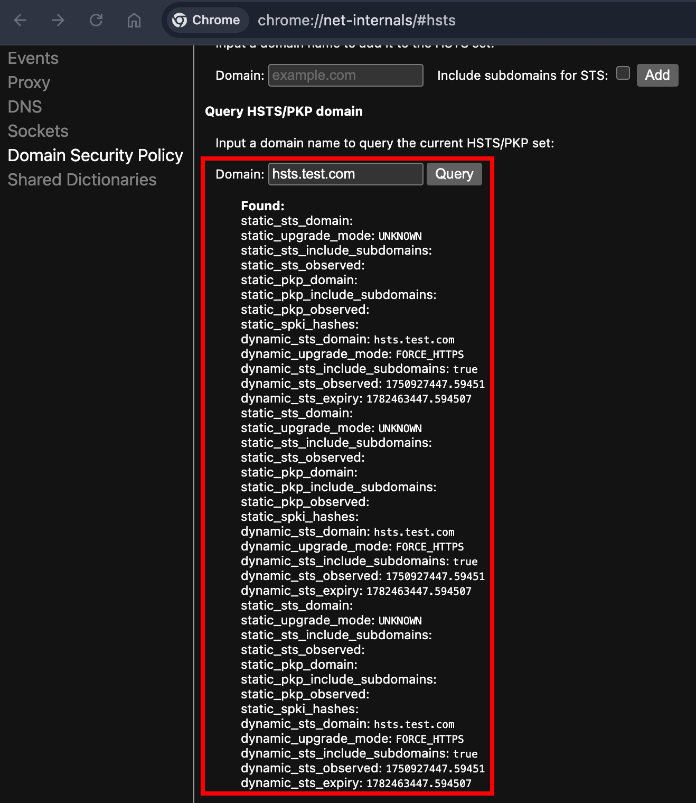
成功在 Chrome 註冊 HSTS，並且查得到了！看來我上面的猜測是正確的

## 憑證不安全的情境

根據 [MDN 文件](https://developer.mozilla.org/en-US/docs/Web/HTTP/Reference/Headers/Strict-Transport-Security#description) 的描述：

```
If a TLS warning or error, such as an invalid certificate, occurs when connecting to an HSTS host, the browser does not offer the user a way to proceed or "click through" the error message, which would compromise the intention of strict security.
```

好的，那我們現在就來把憑證變成不安全，把剛才生成的 `private-key.pem` 跟 `cert.pem` 砍掉，然後重新簽憑證

```zsh
mkcert -key-file private-key.pem -cert-file cert.pem localhost
```

由於剛剛瀏覽器已經把 `hsts.test.com` 記在 HSTS 列表了，這時候憑證變成不安全，理論上不會讓我們訪問 https://hsts.test.com:5001/
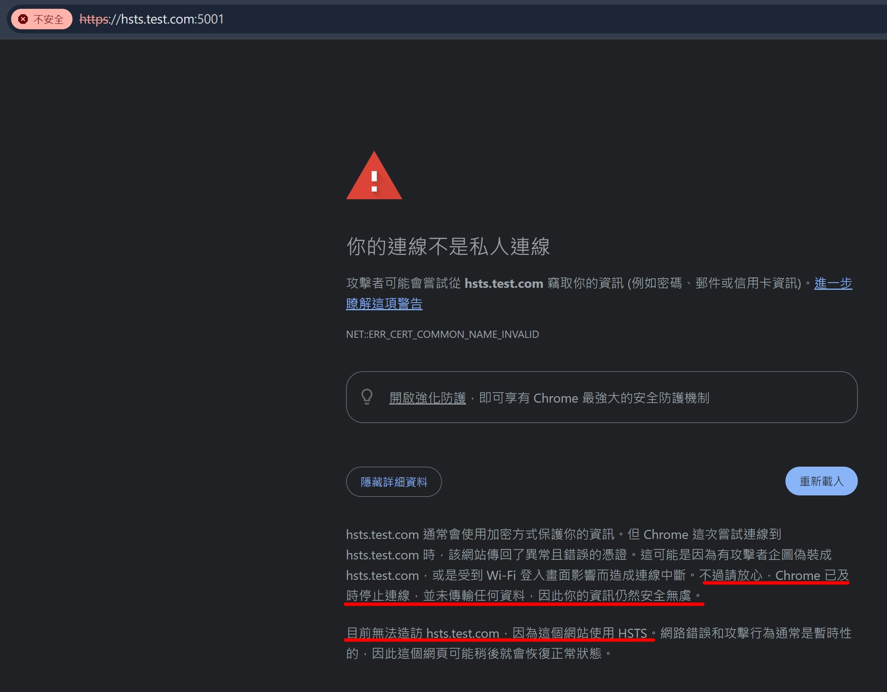
有句話很吸引我的眼球，`Chrome 已及時停止連線，並未傳輸任何資料`，意思是 request 其實根本沒有送出去嗎？我們在 NodeJS HTTPS Server 加個 log 試試看：

```ts
httpServer.on("request", function httpRequestListener(req, res) {
  console.log("receive request from https server port 5001");
  // ...other code
});
```

重整瀏覽器後，NodeJS 確實沒印出任何 log，瀏覽器在這層的防護是真的很完善！

## disable HSTS

根據 [MDN文件](https://developer.mozilla.org/en-US/docs/Web/HTTP/Reference/Headers/Strict-Transport-Security#expiration) 的描述：

```
To disable HSTS, set max-age=0. This only takes effect once the browser makes a secure request and receives the response header. By design, you cannot disable HSTS over insecure HTTP.
```

我們來實驗看看，先把剛才生成的 `private-key.pem` 跟 `cert.pem` 砍掉，然後重新簽憑證

```zsh
mkcert -key-file private-key.pem -cert-file cert.pem hsts.test.com nodejs.hsts.test.com sub.nodejs.hsts.test.com
```

調整 NodeJS 程式碼

```ts
res.setHeader("Strict-Transport-Security", "max-age=0");
```

瀏覽器關掉重開，然後 NodeJS 重啟，打開 https://hsts.test.com:5001/
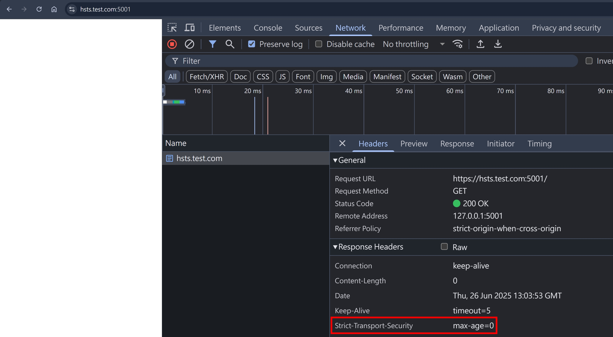
確定有看到 `max-age=0` 之後，再到 chrome://net-internals/#hsts 查詢
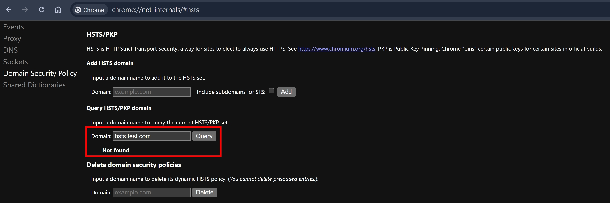
確實刪掉了～

## Best Practice

根據 [MDN 文件](https://developer.mozilla.org/en-US/docs/Web/HTTP/Reference/Headers/Strict-Transport-Security#insecure_http_requests) 的描述：

```
If the host accepts insecure HTTP requests, it should respond with a permanent redirect (such as status code 301) having an https URL in the Location header.
```

我觀察有一些網站，也確實會 follow 這個 best practice，例如 developer.mozilla.org 就是！且 developer.mozilla.org 也有設定 HSTS。

我們如果要測試上面的情境，需要到 chrome://net-internals/#hsts 先把 developer.mozilla.org 的 HSTS 紀錄刪除，這個步驟就等同於 [disable-hsts](#disable-hsts)，只是我們沒辦法碰到 developer.mozilla.org 的 Server，所以才用 chrome://net-internals/#hsts 來刪除。

刪除以後，我們再用瀏覽器輸入 http://developer.mozilla.org/zh-CN/
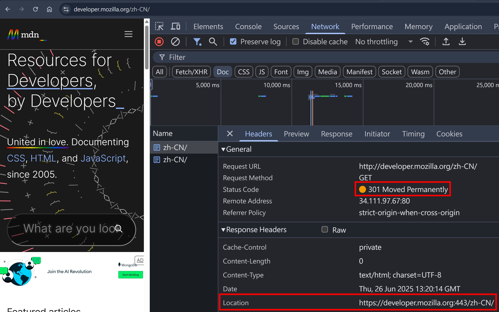
就可以看到 developer.mozilla.org 確實有 Follow Best Practice 了～

## HSTS 如何強制切到 HTTPS Protocol

我們再次用瀏覽器輸入 http://developer.mozilla.org/zh-CN/ ，由於剛才瀏覽器已經有把 developer.mozilla.org 加到 HSTS 列表，所以 `瀏覽器會攔截這個 HTTP Request，並且回傳 307 Redirect 到 HTTPS Protocol，所以對 Server 來說實際上只有收到一個 HTTPS Request，很重要！`
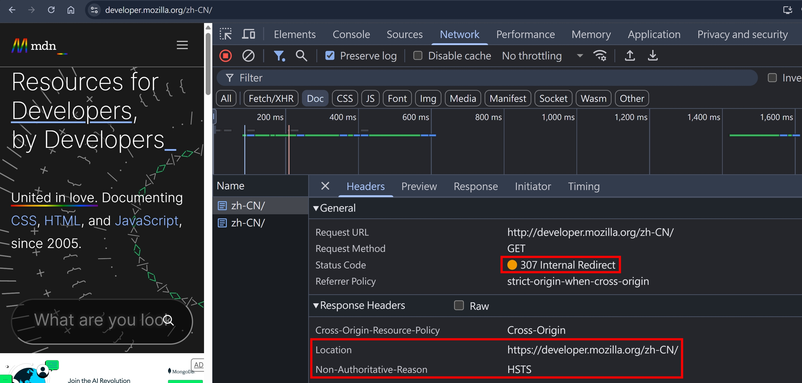
從 Response Header 也可以驗證 `Server 實際上只有收到一個 HTTPS Request`

- 因為上圖的 Response Header 連基本的 `Content-Length`, `Date` 都沒有，代表這個 HTTP Request 根本沒有到達 Server
- 且如果真的有到達 Server 的話，那就失去 HSTS 的意義了，因為 HSTS 就是要避免資料透過 Insecure HTTP 傳輸，瀏覽器的職責就是擋住 HTTP Request，並且轉成 HTTPS

## preload 機制

根據 [hstspreload.org](https://hstspreload.org/#preloading) 的描述：

```
To account for this first-load problem, Chrome maintains a list of domains that have a strong HSTS policy and are HTTPS only.
```

簡單來說，我們上面做了那麼多準備，但最終要能夠在瀏覽器註冊 HSTS 列表，還是需要透過 HTTPS 造訪該網站

為了解決這個問題，Chrome 維護了一個 preload list，採取申請制，並且對於申請的規範較為嚴格，且後續要從 preload list 移除也需要再提交申請，整套流程極為複雜，且效益不高（就是為了解決 first-load 的問題），所以申請前請三思！

## preload 申請規範

1. 合法的憑證（廢話）
2. Follow [Best Practice](#best-practice)
3. 所有 subdomain 都要 HTTPS
4. `Strict-Transport-Security: max-age=至少一年; includeSubDomains; preload`

## 小結

HSTS 已經存在 10 幾年了，但我竟然到 2025 年才知道有這個 Security Header，真的是相見恨晚～學習 HTTP 的路程，真的是一路上充滿驚喜，透過這篇文章，我自己也學到很多東西，希望各位也收穫滿滿呦～

## 參考資料

- chrome://net-internals/#hsts
- https://www.chromium.org/hsts/
- https://developer.mozilla.org/en-US/docs/Web/HTTP/Reference/Headers/Strict-Transport-Security
- https://hstspreload.org/
- https://www.rfc-editor.org/rfc/rfc6797#section-6.1
