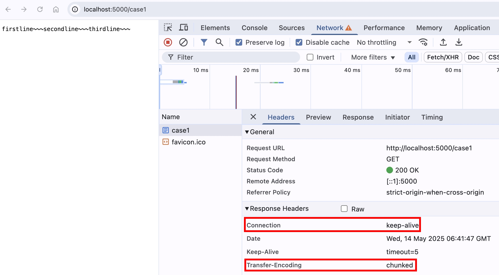
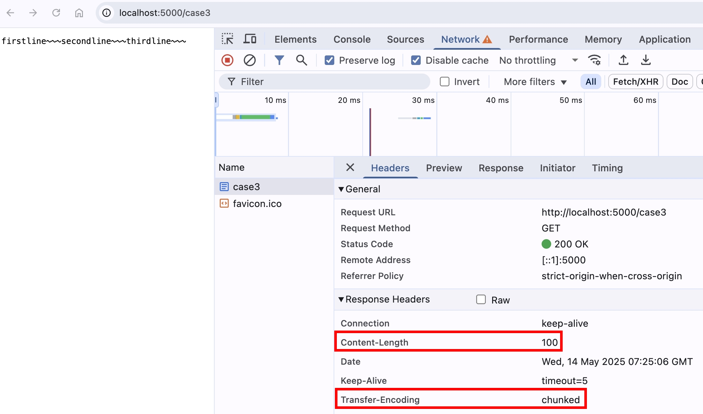
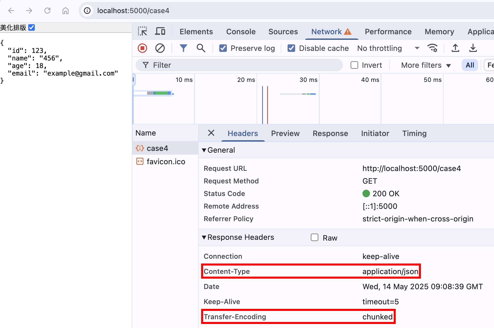
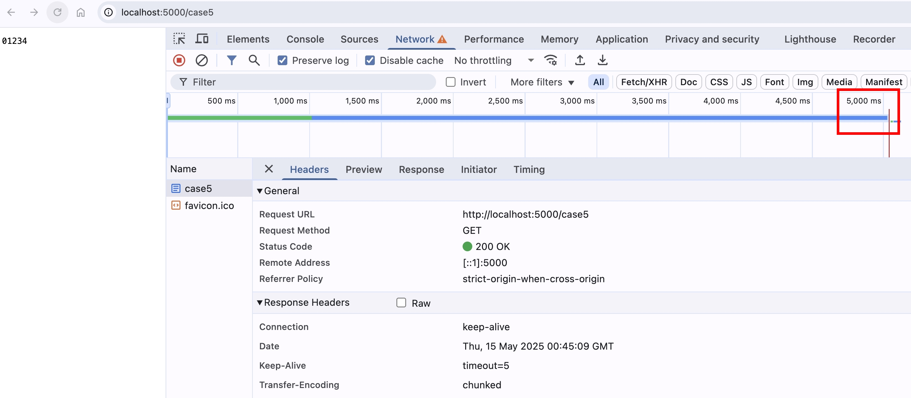
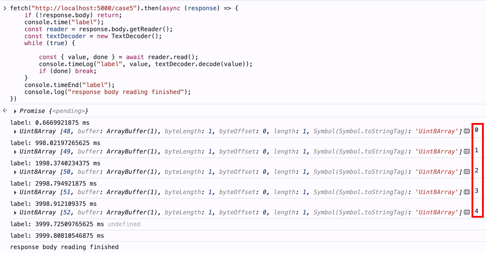
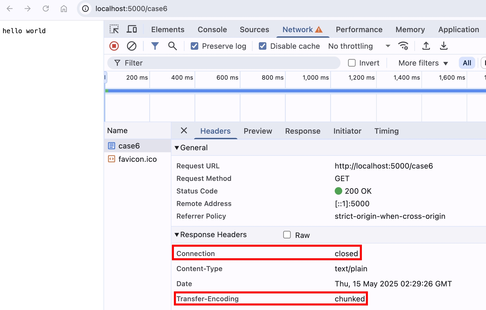

## Transfer-Encoding: chunked

HTTP/1.1 的世界，新增了 `Transfer-Encoding: chunked` 的概念，允許 request.body 或是 response.body 分塊傳輸

格式如下：

```
<byteLengthInHex>CRLF
<Data>CRLF
<byteLengthInHex>CRLF
<Data>CRLF
<byteLengthInHex>CRLF
<Data>CRLF
0CRLFCRLF
```

範例：

```
a\r\n
first line\r\n
b\r\n
second line\r\n
a\r\n
third line\r\n
0\r\n\r\n
```

## 使用 NodeJS 實作 Transfer-Encoding: chunked

我們來看看 NodeJS HTTP 模組，什麼時候會開啟 `Transfer-Encoding: chunked` 傳輸：

1. 根據 NodeJS 官方文件描述

https://nodejs.org/api/http.html#responsewritechunk-encoding-callback

```
The first time response.write() is called, it will send the buffered header information and the first chunk of the body to the client.
```

2. 根據 NodeJS 原始碼

https://github.com/nodejs/node/blob/main/lib/_http_outgoing.js#L105

```js
function OutgoingMessage(options) {
  // other code
  this.useChunkedEncodingByDefault = true;
}
```

我們使用 NodeJS HTTP 模組來實作：

```ts
import httpServer from "../httpServer";
import { faviconListener } from "../listeners/faviconListener";
import { notFoundListener } from "../listeners/notFoundlistener";

const firstline = "firstline~~~";
const secondline = "secondline~~~";
const thirdline = "thirdline~~~";

httpServer.on("request", function requestListener(req, res) {
  if (req.url === "/favicon.ico") return faviconListener(req, res);
  if (req.url === "/case1") {
    // res.write 會自動幫忙處理 transfer-encoding：chunked 的格式
    res.write(firstline);
    res.write(secondline);
    res.end(thirdline);
    return;
  }
  return notFoundListener(req, res);
});
```

然後使用瀏覽器打開 http://localhost:5000/case1



`res.write` 底層，會處理 `\r\n` 以及計算資料 byte length 的邏輯，所以只需寫入資料即可

## 使用 Socket.write 自行處理資料格式

為了讓大家對 chunked encoding 的資料格式更熟悉，我們接著使用 [Socket.write](https://nodejs.org/api/net.html#socketwritedata-encoding-callback) 來寫入 raw HTTP Response Body

```ts
if (req.url === "/case2") {
  // 先送 header 出去
  res.setHeader("transfer-encoding", "chunked");
  res.flushHeaders();

  // 使用 socket.write 自行處理 transfer-encoding: chunked 的格式
  res.socket?.write(
    `${Buffer.byteLength(firstline).toString(16)}\r\n${firstline}\r\n`,
  );
  res.socket?.write(
    `${Buffer.byteLength(secondline).toString(16)}\r\n${secondline}\r\n`,
  );
  res.socket?.write(
    `${Buffer.byteLength(thirdline).toString(16)}\r\n${thirdline}\r\n`,
  );
  res.socket?.end("0\r\n\r\n");
  return;
}
```

然後使用瀏覽器打開 http://localhost:5000/case2


可以看到結果跟上面使用 `res.write` 是一樣的

那如果格式錯誤呢？我們故意把其中一個 `\r\n` 拿掉

```ts
res.socket?.write(
  `${Buffer.byteLength(firstline).toString(16)}\r\n${firstline}`,
);
```

用瀏覽器打開 http://localhost:5000/case2


瀏覽器就會噴 `ERR_INVALID_CHUNKED_ENCODING` 的錯誤，代表瀏覽器底層會去解析這個資料，整理完才會顯示給使用者

## Transfer-Encoding: chunked + Content-Length

上面的範例，在 `Transfer-Encoding: chunked` 的情況，NodeJS HTTP 模組預設都不會傳送 `Content-Length` 的 Response Header

所以這兩個 header 是可以一起傳送的嗎？我們調整上面的程式碼

```ts
if (req.url === "/case3") {
  const contentLength =
    Buffer.byteLength(firstline) +
    Buffer.byteLength(secondline) +
    Buffer.byteLength(thirdline);
  res.setHeader("Content-Length", contentLength);
  res.setHeader("Transfer-Encoding", "chunked");
  res.write(firstline);
  res.write(secondline);
  res.end(thirdline);
  return;
}
```

用瀏覽器打開 http://localhost:5000/case3 ，一切相安無事


如果故意傳送大於資料長度的 `Content-Length` 呢？

```ts
if (req.url === "/case3") {
  res.setHeader("Content-Length", 100);
  res.setHeader("Transfer-Encoding", "chunked");
  res.write(firstline);
  res.write(secondline);
  res.end(thirdline);
  return;
}
```

可以看到瀏覽器是相安無事



為什麼會這樣呢？我們來看看 RFC 9112 的定義

https://datatracker.ietf.org/doc/html/rfc9112#section-6.1-15

```
A server MAY reject a request that contains both Content-Length and Transfer-Encoding or process such a request in accordance with the Transfer-Encoding alone.
```

https://datatracker.ietf.org/doc/html/rfc9112#section-6.2-2

```
A sender MUST NOT send a Content-Length header field in any message that contains a Transfer-Encoding header field.
```

https://datatracker.ietf.org/doc/html/rfc9112#section-6.3-2.3

```
If a message is received with both a Transfer-Encoding and a Content-Length header field, the Transfer-Encoding overrides the Content-Length.
```

簡單來說，不允許兩個 header 一起設置，但當兩個 header 同時設置時，接收方可選擇回傳錯誤訊息，或是把 `Content-Length` 捨棄，咱們的 Chrome 瀏覽器選擇了後者。

## 使用 curl 觀察 raw HTTP Response Body

由於瀏覽器已經把 Response Body 都整理好，才呈現給使用者看，但我們要怎麼確定傳輸的格式真的是

```
<byteLengthInHex>CRLF
<Data>CRLF
<byteLengthInHex>CRLF
<Data>CRLF
<byteLengthInHex>CRLF
<Data>CRLF
0CRLFCRLF
```

我們打開終端機，輸入 `curl --raw http://localhost:5000/case2`，可以看到結果如下

```
c
firstline~~~
d
secondline~~~
c
thirdline~~~
0

```

- c = 十進位的 12，等於 `firstline~~~` 的 byte length
- d = 十進位的 13，等於 `secondline~~~` 的 byte length
- c = 十進位的 12，等於 `thirdline~~~` 的 byte length
- 結尾也符合 `0\r\n\r\n`

其中 `--raw` 參數的[定義](https://everything.curl.dev/usingcurl/downloads/raw.html)如下

```
When --raw is used, it disables all internal HTTP decoding of content or transfer encodings and instead makes curl passed on unaltered, raw, data.
```

## Transfer-Encoding: chunked 搭配 Content-Type: application/json

chunked 的資料除了 `text/plain` 純文字，也可以是其他類型的，我們使用 `application/json` 來當範例

```ts
// chunked with application/json
if (req.url === "/case4") {
  const chunkSplitIndex = 20;
  const jsonString = JSON.stringify({
    id: 123,
    name: "456",
    age: 18,
    email: "example@gmail.com",
  });
  res.setHeader("Content-Type", "application/json");
  // res.write 會自動幫忙處理 transfer-encoding：chunked 的格式
  res.write(jsonString.slice(0, chunkSplitIndex));
  res.end(jsonString.slice(chunkSplitIndex));
  return;
}
```

用瀏覽器打開 http://localhost:5000/case4 ，可以看到正確解析成 json



終端機輸入 `curl --raw http://localhost:5000/case4`

```
14
{"id":123,"name":"45
28
6","age":18,"email":"example@gmail.com"}
0

```

- 14 = 十進位的 20，等於 `{"id":123,"name":"45` 的 byte length
- 28 = 十進位的 40，等於 `6","age":18,"email":"example@gmail.com"}` 的 byte length
- 結尾也符合 `0\r\n\r\n`

## ReadableStream，讓你分塊讀取 Response Body

當資料量很大時，雖然資料是分塊傳輸，但瀏覽器會等到所有資料都收到，才顯示給前端，在使用者體驗上就比較差

我們使用 `setTimeout` 來模擬 Server 處理時間

```ts
// chunked with slow data transfer
if (req.url === "/case5") {
  let index = 0;
  const maxIndex = 5;
  const interval = setInterval(() => {
    res.write(index.toString());
    index += 1;
    if (index === maxIndex) {
      clearInterval(interval);
      res.end();
    }
  }, 1000);
  return;
}
```

用瀏覽器打開 http://localhost:5000/case5 ，會發現要等 5 秒才會看到結果



使用瀏覽器原生的 `fetch` 時，大家平常都是這樣寫

```js
fetch("URL")
  .then((response) => response.json())
  .then((json) => console.log(json));
```

若仔細研究 [response](https://developer.mozilla.org/en-US/docs/Web/API/Response) 物件，會發現 [response.body](https://developer.mozilla.org/en-US/docs/Web/API/Response/body) 是 [ReadableStream](https://developer.mozilla.org/en-US/docs/Web/API/ReadableStream)

我們可以利用 `ReadableStream` 來達成分塊讀取 Response Body 的功能



## Transfer-Encoding: chunked + Connection: closed

如果設定 `Connection: closed` 的話，還可以正常接收 chunk 嗎？

```ts
// chunked with connection: close
if (req.url === "/case6") {
  // 先傳送 headers
  res.setHeaders(
    new Headers({
      Connection: "closed",
      "Content-Type": "text/plain",
      "Transfer-Encoding": "chunked",
    }),
  );
  res.flushHeaders();

  // 過 N 秒再回傳 body
  setTimeout(() => res.end("hello world"), 3000);
  return;
}
```

用瀏覽器打開 http://localhost:5000/case6 ，還是有正常收到資料



因為 `Connection: closed` 指的是在這次 HTTP 來回的傳輸完畢之後，才關閉 TCP Connection，並不是 Response Header 傳輸完畢之後就直接關閉了，這兩者之間是有差異的。

## 跟 Server Sent Events 的差別

在研究 `Transfer-Encoding: chunked` 的時候，我一直覺得這跟 [SSE](./server-sent-events.md) 的概念很像，後來才發現，其實 SSE 就是 `Transfer-Encoding: chunked` + 把 Response Body 按照指定的文本格式包裝～

兩者的應用情境略有不同，差異如下：

|                         |   Transfer-Encoding: chunked   |             Server Sent Events              |
| :---------------------: | :----------------------------: | :-----------------------------------------: |
|      Content-Type       |              任何              |              text/event-stream              |
|        主要用途         | 任意長度的資料傳輸（不限型別） | 向瀏覽器單向推播文字資料（通常是事件/訊息） |
|        使用場景         |    文件下載、API 回應分段等    | 即時通知、即時資料更新（像股價、聊天訊息）  |
| 瀏覽器 EventSource 支援 |               ❌               |                     ✅                      |
|          retry          |               ❌               |                     ✅                      |
|        eventType        |               ❌               |                     ✅                      |

## Transfer-Encoding vs Content-Encoding

實務上，瀏覽器到 Server 中間可能會經過很多節點，例如 Client `<=>` Proxy Server `<=>` CDN `<=>` Actual Server

`Transfer-Encoding` 是指相鄰兩個節點之間的傳輸方式，並不代表最終到 Client 或 Actual Server 需要用此方式傳輸

而 `Content-Encoding` 則是 [End-to-end headers](https://developer.mozilla.org/en-US/docs/Web/HTTP/Reference/Headers#end-to-end_headers)，代表這個 header 一定要傳到最後的接收者

|                            |   Transfer-Encoding   | Content-Encoding |
| :------------------------: | :-------------------: | :--------------: |
| 可否與 Content-Length 並用 | 當使用 chunked 時，❌ |        ✅        |
| 是否為 End-to-end headers  |          ❌           |        ✅        |

<!-- todo-yusheng -->
<!-- ## request smuggling -->

<!-- todo-yusheng -->
<!-- ## response splitting -->

## 參考資料

- https://developer.mozilla.org/en-US/docs/Web/HTTP/Reference/Headers/Transfer-Encoding
- https://datatracker.ietf.org/doc/html/rfc9112#name-chunked-transfer-coding
- https://httpwg.org/specs/rfc9112.html#field.transfer-encoding
- https://everything.curl.dev/usingcurl/downloads/raw.html
- https://developer.mozilla.org/en-US/docs/Web/API/Response/body
- https://developer.mozilla.org/en-US/docs/Web/API/ReadableStream
- https://developer.mozilla.org/en-US/docs/Web/API/ReadableStreamDefaultReader
- https://developer.mozilla.org/en-US/docs/Web/API/ReadableStreamDefaultReader/read
