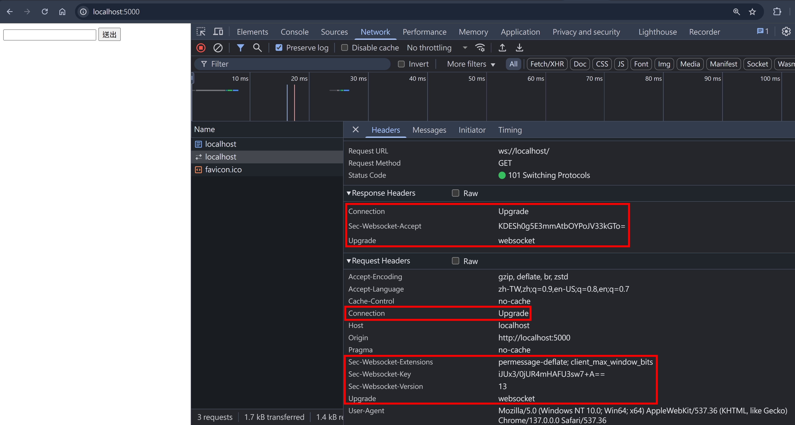
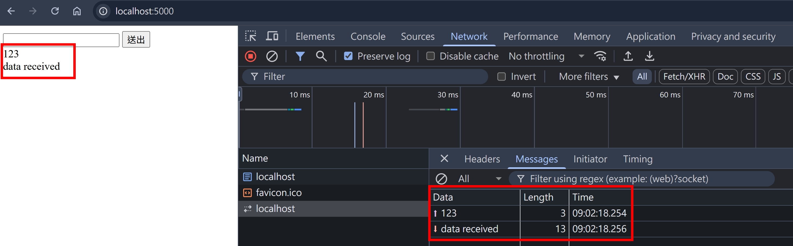
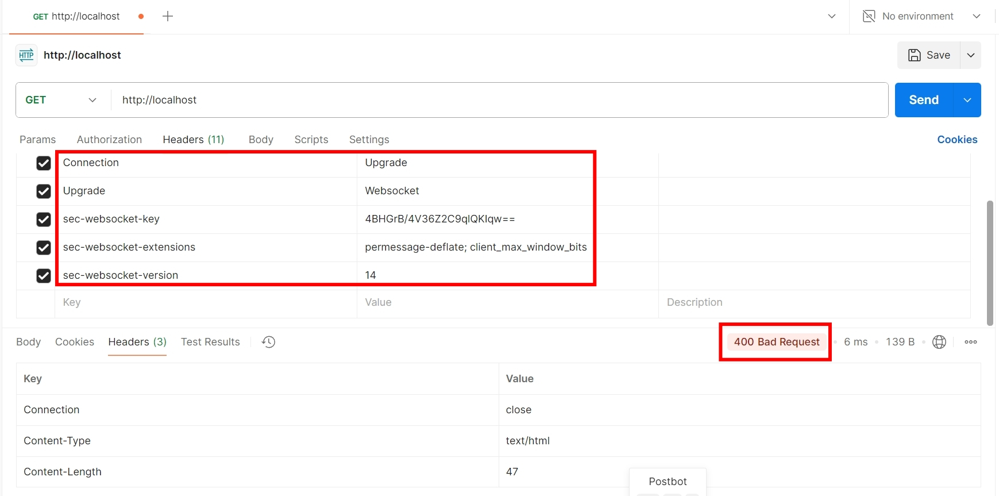

## Upgrade 使用情境

Upgrade 是 HTTP/1.1 獨有的機制，大部分的使用情境都是 WebSocket，在連線之前要先做協議溝通（其實就是一個 HTTP round trip）

Client 端會發送以下

```
GET ws://localhost/ HTTP/1.1
Connection: upgrade
Upgrade: websocket
```

Server 端收到後，若支援 WebSocket 協議，則會回傳以下

```
HTTP/1.1 101 Switching Protocols
Connection: upgrade
Upgrade: websocket
```

以上是關於 Upgrade 快速地描述，實際上在協議溝通過程，還會有很多 WebSocket 相關的 Headers，等等會講到

## WebSocket

由於這段協議溝通，在瀏覽器已經有 `WebSocket` 包裝好，NodeJS Server Side 也只需使用 [ws](https://github.com/websockets/ws) 即可達成，所以我們先用成熟的 Solution 觀察這段協議溝通

- 創建一個 `index.html`，包含 client 端的 `WebSocket`
- 創建一個 NodeJS WebSocket Server (80 port) + 一個 NodeJS HTTP Server (5000 port) 專門 Host 上面的 `index.html`

index.html

```html
<html>
  <head></head>
  <body>
    <script>
      const ws = new WebSocket("ws://localhost");
      ws.addEventListener("open", function onOpen(event) {
        console.log("open");
        console.log(event);
      });
      ws.addEventListener("close", function onClose(event) {
        console.log("close");
        console.log(event);
      });
      ws.addEventListener("error", function onError(event) {
        console.log("error");
        console.log(event);
      });
      ws.addEventListener("message", function onMessage(event) {
        console.log("message");
        console.log(event);
        appendMessageToDOM(event.data);
      });
      function handleSendMessage() {
        const messageInput = document.getElementById("messageInput");
        const chatRoomDiv = document.getElementById("chatRoom");
        if (!messageInput.value) return;
        ws.send(messageInput.value);
        appendMessageToDOM(messageInput.value);
        messageInput.value = "";
      }
      function appendMessageToDOM(message) {
        const chatRoomDiv = document.getElementById("chatRoom");
        const messageDiv = document.createElement("div");
        messageDiv.innerText = message;
        chatRoomDiv.appendChild(messageDiv);
      }
    </script>
    <input id="messageInput" />
    <button onclick="handleSendMessage()">送出</button>
    <div id="chatRoom"></div>
  </body>
</html>
```

index.ts

```ts
import httpServer from "../httpServer";
import WebSocket from "ws";
import { faviconListener } from "../listeners/faviconListener";
import { notFoundListener } from "../listeners/notFoundlistener";
import { readFileSync } from "fs";
import { join } from "path";

// 範例1: Simple server
const wss = new WebSocket.Server({ port: 80 });
const indexHTML = readFileSync(join(__dirname, "index.html"));
wss.on("connection", function onConnection(websokcet, req) {
  websokcet.on("open", function onOpen() {
    console.log("open");
  });
  websokcet.on("close", function onClose() {
    console.log("close");
  });
  websokcet.on("message", function onMessage(data, isBinary) {
    console.log({ data: data.toString(), isBinary });
    websokcet.send("data received");
  });
});
httpServer.on("request", function requestListener(req, res) {
  if (req.url === "/") {
    res.setHeader("Content-Type", "text/html; charset=utf-8");
    res.end(indexHTML);
    return;
  }
  if (req.url === "/favicon.ico") return faviconListener(req, res);
  return notFoundListener(req, res);
});
```

使用瀏覽器打開 http://localhost:5000/ ，可以看到確實是按照 upgrade-使用情境，但多了幾個 Sec-Websocket 的 Headers


隨意嘗試傳送一些資料，也確實有成功來回！


## Sec-WebSocket-Version

這是一個 Request & Response Header

As Request Header 的情境

- 格式 `Sec-WebSocket-Version: 13`
- 13 是目前 (2025.06.28) 最新的版本
- 所有 WebSocket-Version 可以在 [這裡](https://www.iana.org/assignments/websocket/websocket.xml#version-number) 查詢

As Response Header 的情境

- 如果 Server 支援 Request Header 的 `Sec-WebSocket-Version`，則不需要 include 這個 Response Header
- 反之，需要回傳 400 Bad Request，並且在 Response Header 加上 `Sec-WebSocket-Version: 12`

我們來嘗試 [ws](https://github.com/websockets/ws) 的 `WebSocket.Server` 是否有支援 400 的情境，使用 Postman 來發起協議溝通的 HTTP Request：

確實有回傳 400，不過沒有 `Sec-WebSocket-Version` 的 Header，並且 Response Body 只有說 `Missing or invalid Sec-WebSocket-Version header`，不符合規範的 Best Practice，於是我就發了一個 [PR](https://github.com/websockets/ws/pull/2291)，看作者會不會 Approve 囉！

我們再來看看 [RFC6455#section-4.4](https://datatracker.ietf.org/doc/html/rfc6455#section-4.4) 的描述

```
The following example demonstrates version negotiation described above:

  GET /chat HTTP/1.1
  Host: server.example.com
  Upgrade: websocket
  Connection: Upgrade
  ...
  Sec-WebSocket-Version: 25

The response from the server might look as follows:

  HTTP/1.1 400 Bad Request
  ...
  Sec-WebSocket-Version: 13, 8, 7
```

確實跟 [MDN文件](https://developer.mozilla.org/en-US/docs/Web/HTTP/Reference/Headers/Sec-WebSocket-Version) 的描述一樣

```
If the server doesn't support the version, or any header in the handshake is not understood or has an incorrect value, the server should send a response with status 400 Bad Request and immediately close the socket. It should also include Sec-WebSocket-Version in the 400 response, listing the versions that it does support.
```

## Sec-WebSocket-Extensions

這是一個 Request & Response Header

As Request Header 的情境

- 格式 `Sec-WebSocket-Extensions: permessage-deflate; client_max_window_bits`
- 這些 Extensions 的作用，會在未來的篇章 [protocols/websocket](../protocols/websocket.md) 討論

As Response Header 的情境

- 格式同 Request Header
- Server 需從 Client 傳來的 `Sec-WebSocket-Extensions` 挑出其支援的，並且回傳
- 承上，若沒有 Server 支援的，可以捨棄這個 Header
- 若 Server 回傳 Client 不支援的 `Sec-WebSocket-Extensions`，則 Client 必須斷開連結

## Sec-WebSocket-Key

- 這是一個 Request Header
- 用來告訴 Server "我是真的要 Upgrade 到 WebSocket 呦"
- `Sec-` 開頭的 Request Headers，無法透過 `fetch` 或是
- 格式 `Sec-WebSocket-Key: dGhlIHNhbXBsZSBub25jZQ==`
- key 的生成方式，根據 [MDN 文件](https://developer.mozilla.org/en-US/docs/Web/HTTP/Reference/Headers/Sec-WebSocket-Key#key) 的描述

```
This is a randomly selected 16-byte nonce that has been base64-encoded and isomorphic encoded.
```

我們可以使用以下 function 生成

```js
function generateWebSocketKeyModern() {
  const bytes = crypto.getRandomValues(new Uint8Array(16));
  return btoa(String.fromCharCode(...bytes));
}
```

## Sec-WebSocket-Protocol

這是一個 Request & Response Header

As Request Header 的情境

- 格式 `Sec-WebSocket-Protocol: soap, wamp`，代表 Client 支援的 sub-protocols
- 這些 sub-protocols 的作用，會在未來的篇章 [protocols/websocket](../protocols/websocket.md) 討論

As Response Header 的情境

- 格式同 `Sec-WebSocket-Protocol: soap`，代表 Server 最終決定使用的 sub-protocol
- 承上，若沒有 Server 支援的，可以捨棄這個 Header

## Sec-WebSocket-Accept

- 這是一個 Response Header
- 格式 `Sec-WebSocket-Accept: s3pPLMBiTxaQ9kYGzzhZRbK+xOo=`
- 計算方式為：

```js
createHash("sha1")
  .update(key + "258EAFA5-E914-47DA-95CA-C5AB0DC85B11")
  .digest("base64");
```

- 代表 Server 接受且支援升級到 WebSocket

## 參考資料

- https://developer.mozilla.org/en-US/docs/Web/HTTP/Reference/Headers/Upgrade
- https://developer.mozilla.org/en-US/docs/Web/HTTP/Protocol_upgrade_mechanism
- https://developer.mozilla.org/en-US/docs/Web/HTTP/Reference/Status/101
- https://developer.mozilla.org/en-US/docs/Web/HTTP/Reference/Status/426
- https://httpwg.org/specs/rfc9110.html#rfc.section.7.8
- https://datatracker.ietf.org/doc/html/rfc6455#section-4.4
- https://developer.mozilla.org/en-US/docs/Web/API/WebSocket
- https://claude.ai/chat/195b138f-4d07-4662-b287-2c2ada3b8de0
- https://github.com/websockets/ws/blob/master/doc/ws.md
- https://developer.mozilla.org/en-US/docs/Web/HTTP/Reference/Headers/Sec-WebSocket-Version
- https://developer.mozilla.org/en-US/docs/Web/HTTP/Reference/Headers/Sec-WebSocket-Extensions
- https://developer.mozilla.org/en-US/docs/Web/HTTP/Reference/Headers/Sec-WebSocket-Key
