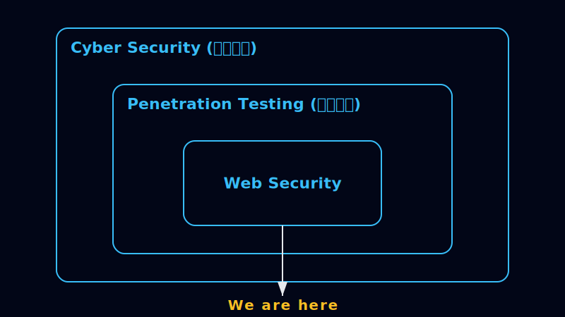

# 昱昇の技術部落格 - 專注於 Web Security 與 HTTP 協議研究

### 目前研究方向

- HTTP 協議行為與相關 library 實作（以 JavaScript, Node.js 生態系為主）
- Node.js 如何將 HTTP 協議進行多層抽象（EventEmitter, stream, Socket...）
- Web Security 攻擊面：從協議層行為到實際 exploitation

<!-- - 開始日期：2025/03/09
- 開始目標：最初是想參加 2025 iThome 鐵人賽，寫 30 篇關於 HTTP 的文章，後來變成一個全能型的技術部落格
- 開始原因：

  HTTP 從 2022 年就一直是我想要深入了解的領域。想到大三下時期的我，剛踏足全端開發，開始串接 API，遇到的第一個問題就是 CORS，在一知半解的情況下，在 python Flask 加了幾個 `Access-Control-Allow-*` 的 Header 就結束這個回合。後來陸續在工作的場景都有接觸到後端（但頭銜都是掛前端工程師QQ），更加讓我想要把 HTTP 基礎打好。

  2025 Q1，剛好遇到瓶頸期，覺得工作上能學習的部分變少，剛好想到大學同學在 2022 年就參加了 iThome 鐵人賽，於是我就利用下班時間，開啟了 30 篇 HTTP 文章的挑戰，中間並沒有持續都在寫文章，而是會有其他的研究跟學習交替進行。

- 舊的網址：https://learn-http-with-nodejs.web.app/
- 轉換原因：

  我很感謝我在 2025 的過年，看了 Huli 大大的 [Beyond XSS：探索網頁前端資安宇宙](https://aszx87410.github.io/beyond-xss/)，開啟了我對前端資安領域的高度興趣，也開啟了我的白帽駭客學習之路。

  起初都是透過企業的 Email 私下回報資安漏洞，但我發現效率不佳，跟客服來回溝通的成本，以及無法掌握企業修補資安漏洞的進度。後來我順著 [Huli 大大的文章](https://aszx87410.github.io/beyond-xss/)，得知了 [Hitcon Zeroday](https://zeroday.hitcon.org/) 這個組織，可以用來回報資安漏洞，於是我開始轉用它。看到自己累積的 [漏洞列表](https://zeroday.hitcon.org/user/cat1528985/vulnerability) 逐步成長，心中雖有喜悅，但也在挖掘漏洞的過程中，意識到自己的知識、經驗不足。

  "紅隊資安領域很廣，滲透測試是一門專精的領域，這些都是我缺乏的知識、技能"，隨著我越深入資安領域，我在 2025/05 開始意識到這些事情。從 `learn-http-with-nodejs` 轉型到 `yusheng-tech-blog`，也是因為我想要把自己的技能樹往紅隊資安領域發展，所以我要學習的內容就不只是 HTTP，這只能算是一個基礎知識而已。 -->
