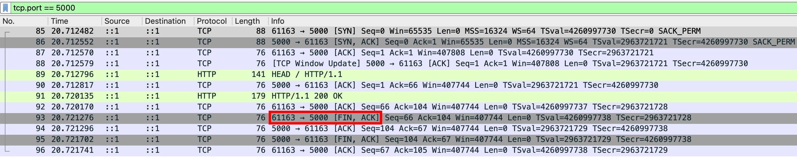
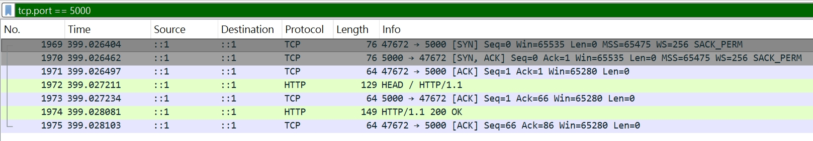

## 前言

在研究 undici 跟 node:http 的時候，我發現這兩個 http client 都選擇在 HEAD 請求之後關閉連線，背後究竟是怎樣的技術決策，讓我們來看看吧！

## `node:http` PoC

http server

```js
const server = http.createServer();
server.listen(5000);
server.on("request", (req, res) => res.end("123"));
```

http client 記得要啟用 `keepAlive: true`

```js
const agent = new http.Agent({ keepAlive: true });
// ✅ client close the TCP Connection after HEAD
const clientReqeust = http.request({
  agent,
  host: "localhost",
  port: 5000,
  method: "HEAD",
  path: "/",
});
clientReqeust.end();
```

送出的 raw HTTP Request

<div className="httpRawRequest">
  <div className="blue">HEAD / HTTP/1.1</div>
  <div className="blue">Host: localhost:5000</div>
  <div className="blue">Connection: keep-alive</div>
  <div className="blue"></div>
  <div className="blue"></div>
</div>

收到的 raw HTTP Response

<div className="httpRawRequest">
  <div className="blue">HTTP/1.1 200 OK</div>
  <div className="blue">Date: Tue, 24 Mar 2026 06:54:11 GMT</div>
  <div className="blue">Connection: keep-alive</div>
  <div className="blue">Keep-Alive: timeout=5</div>
  <div className="blue"></div>
  <div className="blue"></div>
</div>

用 [Wireshark](https://www.wireshark.org/download.html) 抓封包，發現是 client 主動關閉連線的！


## trace `node:http` 原始碼

稍微追了一下 `lib/_http_client.js` 原始碼

```js
function parserOnIncomingClient(res, shouldKeepAlive) {
  // ...省略

  if (req.shouldKeepAlive && !shouldKeepAlive && !req.upgradeOrConnect) {
    // Server MUST respond with Connection:keep-alive for us to enable it.
    // If we've been upgraded (via WebSockets) we also shouldn't try to
    // keep the connection open.
    req.shouldKeepAlive = false;
  }

  // ...省略
}
```

parser 應該是用 C 語言寫的，然後再透過以下方式 binding（這塊我沒深入研究實際是怎麼 binding 的）

```js
const { HTTPParser } = internalBinding("http_parser");
```

調整 http client 的程式碼，觀察 `shouldKeepAlive` 的變化

```js
const agent = new http.Agent({ keepAlive: true });
// ✅ client close the TCP Connection after HEAD
const clientReqeust = http.request({
  agent,
  host: "localhost",
  port: 5000,
  method: "HEAD",
  path: "/",
});
clientReqeust.end(() => console.log(clientReqeust.shouldKeepAlive)); // true
clientReqeust.on("response", () => console.log(clientReqeust.shouldKeepAlive)); // false
```

## 對照 RFC 9112 Section 6.3

我突然想到之前看過 [RFC 9112 Section 6.3. Message Body Length](https://datatracker.ietf.org/doc/html/rfc9112#section-6.3)，理論上 Node.js 的 `HTTPParser` 應該進到第一條規則：

```
Any response to a HEAD request and any response with a 1xx (Informational), 204 (No Content), or 304 (Not Modified) status code is always terminated by the first empty line after the header fields, regardless of the header fields present in the message, and thus cannot contain a message body or trailer section.
```

也就是說，這是一個 HEAD Request 的合法 HTTP Response

<div className="httpRawRequest">
  <div className="blue">HTTP/1.1 200 OK</div>
  <div className="blue">Date: Tue, 24 Mar 2026 06:54:11 GMT</div>
  <div className="blue">Connection: keep-alive</div>
  <div className="blue">Keep-Alive: timeout=5</div>
  <div className="blue"></div>
  <div className="blue"></div>
</div>

但同時第八條規則也說了

```
Otherwise, this is a response message without a declared message body length, so the message body length is determined by the number of octets received prior to the server closing the connection.
```

若 `HTTPParser` 讀出來的 raw HTTP Responses 長這樣

<div className="httpRawRequest">
  <div className="blue">HTTP/1.1 200 OK</div>
  <div className="blue">Date: Tue, 24 Mar 2026 06:54:11 GMT</div>
  <div className="blue">Connection: keep-alive</div>
  <div className="blue">Keep-Alive: timeout=5</div>
  <div className="blue"></div>
  <div className="blue">HTTP/1.1 404 Not Found</div>
  <div className="blue"></div>
  <div className="blue"></div>
</div>

1. `HTTPParser` 必須知道第一個 HTTP Response（200 OK）對應的 HTTP Request Method 是 "HEAD"
2. 並且同時嚴格遵守第一條規定
3. 否則 `HTTPParser` 就會把第二個 HTTP Response（404 Not Found）視為第一個 HTTP Response（200 OK）的 body

我推測 `HTTPParser` 可能採取比較保守的做法：

**一定要看到 `Content-Length` 或是 `Transfer-Encoding: chunked` 才會將此連線視為 `shouldKeepAlive`**

## 明確宣告 CL, TE

server 改成用 `net.createServer`，明確宣告 `Content-Length: 0`

```js
const server = net.createServer();
server.listen(5000);
server.on("connection", (socket) => {
  socket.on("data", () =>
    socket.write(
      "HTTP/1.1 200 OK\r\n" +
        "Connection: keep-alive\r\n" +
        "Keep-Alive: timeout=5\r\n" +
        "Content-Length: 0\r\n" +
        "\r\n",
    ),
  );
});
```

http client 程式碼新增 `keepAliveMsecs: Infinity`（避免 TCP KeepAlive 封包淹沒 Wireshark）

```js
const agent = new http.Agent({ keepAlive: true, keepAliveMsecs: Infinity });
const clientReqeust = http.request({
  agent,
  host: "localhost",
  port: 5000,
  method: "HEAD",
  path: "/",
});
clientReqeust.end(() => console.log(clientReqeust.shouldKeepAlive)); // true
clientReqeust.on("response", () => console.log(clientReqeust.shouldKeepAlive)); // true
```

這次連線就有 KeepAlive 了！


同理，若改成 `Transfer-Encoding: chunked`，結果也是一樣的（連線會 KeepAlive）

```js
const server = net.createServer();
server.listen(5000);
server.on("connection", (socket) => {
  socket.on("data", () =>
    socket.write(
      "HTTP/1.1 200 OK\r\n" +
        "Connection: keep-alive\r\n" +
        "Keep-Alive: timeout=5\r\n" +
        "Transfer-Encoding: chunked\r\n\r\n",
    ),
  );
});

// http client 程式碼不變...
```

## undici PoC

有了以上的經驗，這次在 http server 主要就測試三種情境

1. `Content-Length: 0`
2. `Transfer-Encoding: chunked`
3. 以上兩者都不帶

http client

```js
const client = new Client("http://localhost:5000/");
client.request({ method: "HEAD", path: "/" });
```

最終結果，三種情境下，都是 client 立即關閉連線的

## trace undici 原始碼

我在 `lib/dispatcher/client-h1.js` 翻到了實作以及原因

```js
function writeH1(client, request) {
  // ...省略

  if (method === "HEAD") {
    // https://github.com/mcollina/undici/issues/258
    // Close after a HEAD request to interop with misbehaving servers
    // that may send a body in the response.

    socket[kReset] = true;
  }

  // ...省略
}
```

原因是，某些不符合規範的 http server 會在 HEAD 請求的 HTTP Reponse 帶上 body

<div className="httpRawRequest">
  <div className="blue">HTTP/1.1 200 OK</div>
  <div className="blue">Date: Tue, 24 Mar 2026 06:54:11 GMT</div>
  <div className="blue">Connection: keep-alive</div>
  <div className="blue">Keep-Alive: timeout=5</div>
  <div className="blue">Content-Length: 5</div>
  <div className="blue"></div>
  <div className="blue">12345</div>
</div>

client 若按照 RFC 規範實作，讀到 `Content-Length: 5\r\n\r\n` 就應該視為一個完整的 HTTP Response，剩下的 12345 則留在 buffer。**而這就是有趣的地方**，若 http server 回傳：

<div className="httpRawRequest">
  <div className="blue">HTTP/1.1 200 OK</div>
  <div className="blue">Date: Tue, 24 Mar 2026 06:54:11 GMT</div>
  <div className="blue">Connection: keep-alive</div>
  <div className="blue">Keep-Alive: timeout=5</div>
  <div className="blue">Content-Length: 68</div>
  <div className="blue"></div>
  <div className="blue">HTTP/1.1 302 Found</div>
  <div className="blue">Location: //evil.com</div>
  <div className="blue">Content-Length: 0</div>
  <div className="blue"></div>
  <div className="blue"></div>
</div>

則 302 Response 就會殘留在 buffer

<div className="httpRawRequest">
  <div className="blue">HTTP/1.1 302 Found</div>
  <div className="blue">Location: //evil.com</div>
  <div className="blue">Content-Length: 0</div>
  <div className="blue"></div>
  <div className="blue"></div>
</div>

若這時候 client 沒有 "outstanding request"，則不應該把這個 302 Response 綁定到下一個 request

參考 [RFC 9112 Section 9.2. Associating a Response to a Request](https://datatracker.ietf.org/doc/html/rfc9112#section-9.2)

```
If a client receives data on a connection that doesn't have outstanding requests, the client MUST NOT consider that data to be a valid response; the client SHOULD close the connection
```

實務上，因為 client 很難判斷 "殘留的 buffer" 到底是

1. 下一個 HTTP Response
2. 其實是 response body

**所以 undici 選擇直接關閉連線，這是較為安全的做法**

## 小結

當收到 HEAD 請求的 HTTP Response 時，我把 undici 跟 node:http 根據不同情境的處理方式，整理成下表：

|                                                                                                               | undici                   | node:http                     |
| ------------------------------------------------------------------------------------------------------------- | ------------------------ | ----------------------------- |
| HTTP/1.1 200 OK<br/>Connection: keep-alive<br/>Keep-Alive: timeout=5<br/>Content-Length: 0<br/><br/>          | Close the TCP Connection | Keep the TCP Connection alive |
| HTTP/1.1 200 OK<br/>Connection: keep-alive<br/>Keep-Alive: timeout=5<br/>Transfer-Encoding: chunked<br/><br/> | Close the TCP Connection | Keep the TCP Connection alive |
| HTTP/1.1 200 OK<br/>Connection: keep-alive<br/>Keep-Alive: timeout=5<br/><br/>                                | Close the TCP Connection | Keep the TCP Connection alive |
