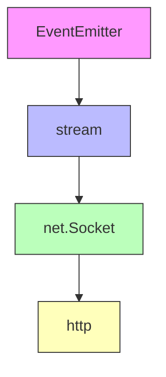
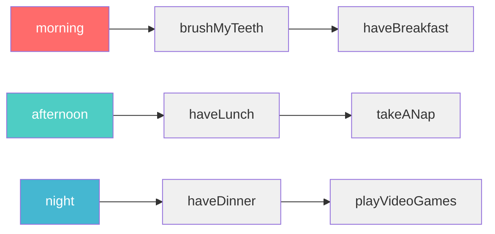

## 前言

從 [2025 iThome 鐵人賽](https://ithelp.ithome.com.tw/users/20155705/ironman/8162) 開賽前，我其實就已經規劃這篇文章了，只是一直到 2026/01 才開始寫

不管是寫前端的 JavaScript

```ts
addEventListener("click", () => {});
document.onload = () => {};
```

還是後端的 Node.js

```ts
import { createServer } from "http";
const httpServer = createServer().listen(5000);

httpServer.on("request", (req, res) => {
  req.on("data", (chunk) => {});
  req.on("end", () => {});
});
```

都離不開 Event-driven architecture (EDA) 這個概念

尤其是 "有用過 Node.js 原生 http 模組寫 client/server" 的人類們，應該都看過

- `EventEmitter`
- `stream.Readable`
- `stream.Writable`
- `net.Socket`

等等名詞，還有一堆很抽象的方法

```ts
import { createServer } from "http";
const httpServer = createServer().listen(5000);

httpServer.on("request", (req, res) => {
  res.write(); // write 跟 end 差在哪
  res.end();

  res.destroy(); // 啥時要呼叫 destroy

  res.setHeader(); // 所以到底要用哪個方法添加 header 啦
  res.appendHeader();
  res.flushHeaders();
  res.writeHead();

  res.pipe(); // pipe 又是什麼鬼

  res.cork(); // 這又是什麼妖魔鬼怪
  res.uncork();
});
```

這問題困擾了我很久，畢竟前端工程師用 JavaScript 要發起 HTTP Request 的話，都是用高階＆封裝好的 API

```ts
fetch("https://your-api-server.com", {
  method: "POST",
  headers: {
    "Content-Type": "application/json",
  },
  body: JSON.stringify({ hello: "world" }),
})
  .then((res) => res.json())
  .then((res) => console.log(res));
```

如果想搞懂 Node.js http 模組的話，你必須得知道這一整條路的關聯



所以，接下來我會規劃數篇文章，一路從 `EventEmitter` 講到 `http`

<!-- smtp-server 就是繼承 Event.Emitter -->

## EventEmitter

### 基本案例

https://nodejs.org/api/events.html#events

- 使用 `on` 註冊事件
- 使用 `emit` 觸發事件

```ts
import { EventEmitter } from "events";

class MyEmitter extends EventEmitter {}

const myEmitter = new MyEmitter();
myEmitter.on("customEvent", () => {
  console.log("customEvent occurred!");
});
myEmitter.emit("customEvent");
```

### 傳參數 & 綁定 this

https://nodejs.org/api/events.html#passing-arguments-and-this-to-listeners

- 使用 function 而不是箭頭函數，才能正確綁定 this

```ts
import { EventEmitter } from "events";

class MyEmitter extends EventEmitter {}

const myEmitter = new MyEmitter();
myEmitter.on(
  "customEvent",
  function (this: EventEmitter, a: string, b: string) {
    console.log(a, b, this === myEmitter); // a b true
  },
);
myEmitter.emit("customEvent", "a", "b");
```

### emit 會按照事件監聽的順序，同步執行

https://nodejs.org/api/events.html#asynchronous-vs-synchronous

```ts
import { EventEmitter } from "events";

class MyEmitter extends EventEmitter {}

const myEmitter = new MyEmitter();
myEmitter.on("customEvent", function () {
  console.log("first customEvent listener");
});
myEmitter.on("customEvent", function () {
  console.log("second customEvent listener");
});
myEmitter.emit("customEvent");
```

### Handling events only once

https://nodejs.org/api/events.html#handling-events-only-once

```ts
import { EventEmitter } from "events";

class MyEmitter extends EventEmitter {}

const myEmitter = new MyEmitter();
myEmitter.once("customEvent", function () {
  console.log("customEvent triggered");
});
myEmitter.emit("customEvent"); // customEvent triggered
myEmitter.emit("customEvent"); // 忽略
```

### 大魔王 1: 捕捉 error

https://nodejs.org/api/events.html#error-events

這是新手最常踩到的坑，若沒有註冊 `on('error')`，則 `emit('error')` 就會讓 Node.js process exit（常見的 Node.js DoS 原因）

❌ 錯誤作法

```ts
import { EventEmitter } from "events";

class MyEmitter extends EventEmitter {}

const myEmitter = new MyEmitter();
myEmitter.emit("error", new Error("oops...")); // ❌ 沒有註冊 on('error')
```

✅ 正確做法

```ts
import { EventEmitter } from "events";

class MyEmitter extends EventEmitter {}

const myEmitter = new MyEmitter();
myEmitter.on("error", (err) => console.log(err)); // ✅ 正確註冊 on('error')
myEmitter.emit("error", new Error("oops..."));
```

### 小插曲: errorMonitor

https://nodejs.org/api/events.html#error-events

- 會先觸發 `on(errorMonitor)`，再觸發 `on('error')`
- 好處：將 "監控" 跟 "錯誤處理" 分開，單一職責
- ⚠️注意，還是需要監聽 `on('error')`，才不會讓 Node.js process exit

```ts
import EventEmitter, { errorMonitor } from "events";

class MyEmitter extends EventEmitter {}

const myEmitter = new MyEmitter();
myEmitter.on(errorMonitor, (err) => {
  console.error("implement your custom error logger logic");
});
myEmitter.on("error", (err) => console.log(err));
myEmitter.emit("error", new Error("oops..."));
```

### 大魔王 2: 捕捉 promise rejection

https://nodejs.org/api/events.html#capture-rejections-of-promises

在 `on('event')` 使用 async function as listener 的話，需要特別注意 unhandled promise rejection

❌ 錯誤作法

```ts
import { EventEmitter } from "events";

class MyEmitter extends EventEmitter {}

const myEmitter = new MyEmitter();
myEmitter.on("hello", async () => {
  throw new Error("promise reject");
});
myEmitter.on("error", (err) => console.log("error occured")); // ❌ 無法捕捉 promise rejection
myEmitter.emit("hello");
```

✅ 正確做法

```ts
import { EventEmitter } from "events";

class MyEmitter extends EventEmitter {}

const myEmitter = new MyEmitter({ captureRejections: true }); // ✅ 加上 captureRejections
myEmitter.on("hello", async () => {
  throw new Error("promise reject");
});
myEmitter.on("error", (err) => console.log("error occured"));
myEmitter.emit("hello");
```

### 添加插隊的 event

其實 EventEmitter 的概念蠻好懂的，可以把資料結構想成

```ts
const myDailyEvents = {
  morning: [function brushMyTeeth() {}, function haveBreakfast() {}],
  afternoon: [function haveLunch() {}, function takeANap() {}],
  night: [function haveDinner() {}, function playVideoGames() {}],
};
```

執行順序就是按照陣列的順序



當你觸發 `myDailyEventsEmitter.emit('morning')`，就會先刷牙 (brushMyTeeth)，再吃早餐 (haveBreakfast)

如果想要在刷牙前摺棉被呢？只要用 `prependListener` 這個方法就好

```ts
myDailyEventsEmitter.prependListener("morning", function foldTheBlanket() {});
```

這個概念就是 array 的操作，插頭還是插尾

```ts
myDailyEventsEmitter.on("morning", function goToWork() {});
// 插尾，等同於 myDailyEvents.morning.push(function goToWork () {})

myDailyEventsEmitter.prependListener("morning", function foldTheBlanket() {});
// 插頭，等同於 myDailyEvents.morning.unshift(function foldTheBlanket () {})
```

如果希望摺棉被只要摺一次呢？只要用 `prependOnceListener` 這個方法就好

```ts
myDailyEventsEmitter.prependOnceListener(
  "morning",
  function foldTheBlanket() {},
);
```

有了這個概念，再來看 EventEmitter 的 methods，就會發現其實就是圍繞 event 跟 listener 的 CRUD

### EventEmitter prebuild events

平常應該用不到，看看就好

- [`.on('newListener')`](https://nodejs.org/api/events.html#event-newlistener)
- [`.on('removeListener')`](https://nodejs.org/api/events.html#event-removelistener)

### EventEmitter other methods

基本上就是 event 跟 listener 的 CRUD，有需要再查官方文件

- [`eventNames`](https://nodejs.org/api/events.html#emittereventnames)
- [`getMaxListeners`](https://nodejs.org/api/events.html#emittergetmaxlisteners)
- [`listenerCount`](https://nodejs.org/api/events.html#emitterlistenercounteventname-listener)
- [`listeners`](https://nodejs.org/api/events.html#emitterlistenerseventname)
- [`off`](https://nodejs.org/api/events.html#emitteroffeventname-listener)
- [`removeAllListeners`](https://nodejs.org/api/events.html#emitterremovealllistenerseventname)
- [`removeListener`](https://nodejs.org/api/events.html#emitterremovelistenereventname-listener)
- [`setMaxListeners`](https://nodejs.org/api/events.html#emittersetmaxlistenersn)
- [`rawListeners`](https://nodejs.org/api/events.html#emitterrawlistenerseventname)
- [`getEventListeners`](https://nodejs.org/api/events.html#eventsgeteventlistenersemitterortarget-eventname)

## events 模組的其他 Class

這些我覺得對於學習 http 沒有立即的幫助，且後面三者都是 Web API 移植到 NodeJS，使用情境我覺得不高～

- [EventEmitterAsyncResource](https://nodejs.org/api/events.html#class-eventseventemitterasyncresource-extends-eventemitter)
- [EventTarget](https://nodejs.org/api/events.html#class-eventtarget)
- [Event](https://nodejs.org/api/events.html#class-event)
- [CustomEvent](https://nodejs.org/api/events.html#class-customevent)

<!-- ## events

events 模組有 default export
```ts
import events from "events";
```

### methods

- [events.getEventListeners](https://nodejs.org/api/events.html#eventsgeteventlistenersemitterortarget-eventname)
- [events.getMaxListeners](https://nodejs.org/api/events.html#eventsgetmaxlistenersemitterortarget)
- [events.once](https://nodejs.org/api/events.html#eventsonceemitter-name-options)
- [events.setMaxListeners](https://nodejs.org/api/events.html#eventssetmaxlistenersn-eventtargets)
- [events.addAbortListener](https://nodejs.org/api/events.html#eventsaddabortlistenersignal-listener)
- [events.on](https://nodejs.org/api/events.html#eventsonemitter-eventname-options)

### properties

- [events.defaultMaxListeners](https://nodejs.org/api/events.html#eventsdefaultmaxlisteners)
- [events.captureRejections](https://nodejs.org/api/events.html#eventscapturerejections)
- [events.captureRejectionSymbol](https://nodejs.org/api/events.html#eventscapturerejectionsymbol) -->

## 小結

EventEmitter 是 Node.js 非同步事件處理的基礎，但它只負責「註冊事件」和「觸發事件」

當你看到 Node.js http 模組相關的程式碼：

```ts
req.on("data", (chunk) => {}); // ❓ data 事件什麼時候觸發？
req.on("end", () => {}); // ❓ end 事件什麼時候觸發？
req.pipe(res); // ❓ pipe 是什麼？
```

這些問題的答案都在 **stream** 裡

EventEmitter 只是提供了「事件機制」，而 stream 才定義了「什麼時候該觸發這些事件」

下一篇我們來看 stream 如何基於 EventEmitter 建立「資料流」的概念

## 參考資料

- https://nodejs.org/api/events.html
