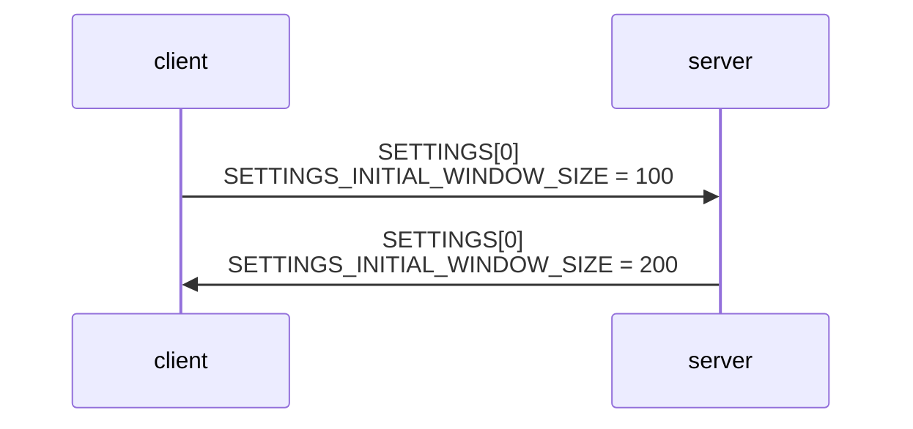
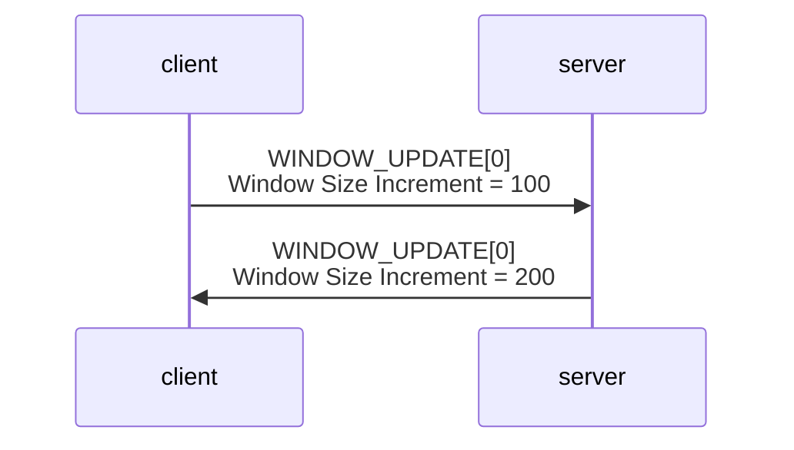
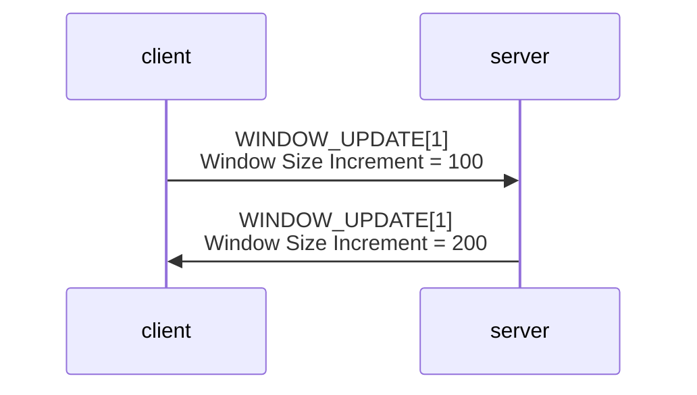
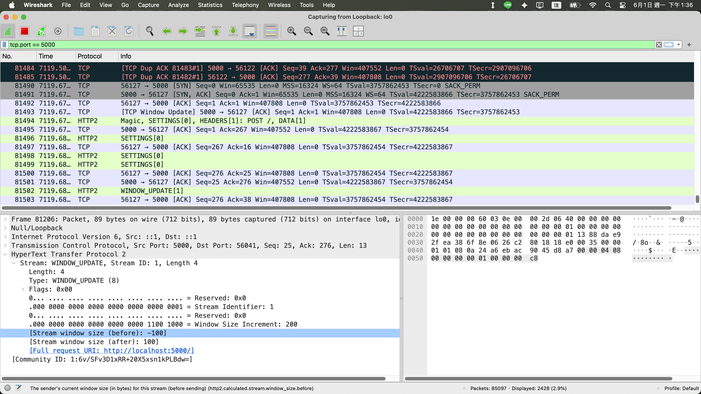
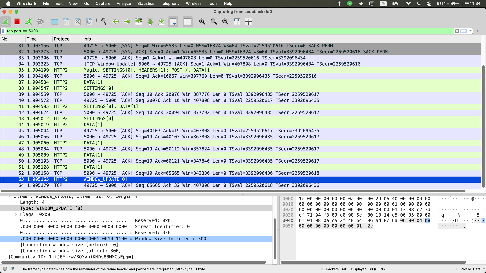
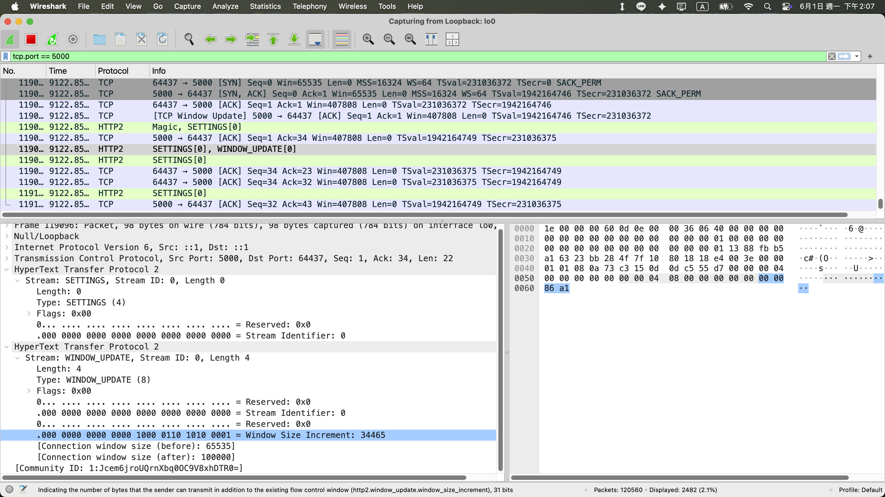
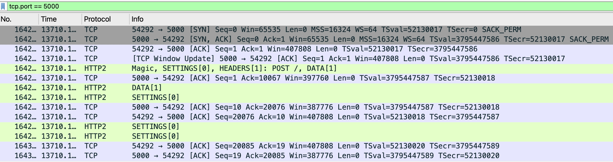

## 前言

HTTP/2 透過以下機制，來控制 [DATA frame](https://datatracker.ietf.org/doc/html/rfc9113#section-6.1) 的傳輸速度

- [SETTINGS_INITIAL_WINDOW_SIZE](https://datatracker.ietf.org/doc/html/rfc9113#SETTINGS_INITIAL_WINDOW_SIZE)
- [WINDOW_UPDATE frame](https://datatracker.ietf.org/doc/html/rfc9113#section-6.9)

|                              | stream-level flow-control window | connection flow-control window |
| ---------------------------- | -------------------------------- | ------------------------------ |
| SETTINGS_INITIAL_WINDOW_SIZE | ✅                               | ❌                             |
| WINDOW_UPDATE frame          | ✅                               | ✅                             |
| default size                 | 65535                            | 65535                          |

**基礎概念**

- client, server 各自都可以宣告自己的 window size，對方必須遵守
- window size 分為 stream-level（每個 stream 的上限值） 跟 connection（整條連線的上限值）

## 概念圖

**透過 SETTINGS frame 控制 stream-level flow-control initial window size**



**透過 WINDOW_UPDATE frame 控制 connection flow-control window size**



**透過 WINDOW_UPDATE frame 控制 stream-level flow-control window size**



## Case 1: stream-level flow-control window

**範例**

- server
  ```js
  const http2Server = http2.createServer({
    settings: { initialWindowSize: 100 },
  });
  http2Server.listen(5000);
  http2Server.on("stream", (stream) => stream.resume());
  ```
- client
  ```js
  const clientHttp2Session = http2.connect("http://localhost:5000");
  const clientHttp2Stream = clientHttp2Session.request({ ":method": "POST" });
  // 在 connection preface 之前 (stream-level flow-control window 還是 65535) 先塞 200 bytes
  clientHttp2Stream.write("1".repeat(200));
  ```
- wireshark 抓包
  

**結論**

- 根據 [RFC 9113 Section 6.9.2. Initial Flow-Control Window Size](https://datatracker.ietf.org/doc/html/rfc9113#section-6.9.2)，stream-level flow-control window 可以是負數
- 變成負數後，由於 server 有持續消化 body，server 會自動發送 [WINDOW_UPDATE frame](../http/http-2-raw-bytes.md#step-3-window_update-frame) 把它補成 `initialWindowSize`

<!-- ## 基礎概念 - 時序圖

```mermaid

``` -->

## Case 2: setLocalWindowSize(300)

**範例**

- server
  ```js
  const http2Server = http2.createServer();
  http2Server.listen(5000);
  // connection flow-control window 預設是 65535, 調整到 300
  http2Server.on("session", (session) => session.setLocalWindowSize(300));
  ```
- client utils
  ```js
  function writeAsync(writable: Writable, buffer: Parameters<Writable["write"]>[0]) {
    return new Promise((resolve) => writable.write(buffer, resolve));
  }
  ```
- client
  ```js
  const clientHttp2Session = http2.connect("http://localhost:5000");
  const clientHttp2Stream = clientHttp2Session.request({ ":method": "POST" });
  // 分批發送 65535 bytes, 把 connection flow-control window 消耗完
  await writeAsync(clientHttp2Stream, "1".repeat(10000));
  await writeAsync(clientHttp2Stream, "1".repeat(10000));
  await writeAsync(clientHttp2Stream, "1".repeat(10000));
  await writeAsync(clientHttp2Stream, "1".repeat(10000));
  await writeAsync(clientHttp2Stream, "1".repeat(10000));
  await writeAsync(clientHttp2Stream, "1".repeat(10000));
  await writeAsync(clientHttp2Stream, "1".repeat(5535));
  ```
- wireshark 抓包
  

**結論**

- 根據 [RFC 9113 Section 6.9. WINDOW_UPDATE](https://datatracker.ietf.org/doc/html/rfc9113#section-6.9)，Window Size Increment 不得小於 0
- connection flow-control window 從 65535 降到 300 是負數
- 故需要先將 connection flow-control window 消耗到 300 以下，nghttp2 才會發送 [WINDOW_UPDATE frame](../http/http-2-raw-bytes.md#step-3-window_update-frame) 把值回補到 300

## Case 3: setLocalWindowSize(100000)

- server
  ```js
  const http2Server = http2.createServer();
  http2Server.listen(5000);
  // connection flow-control window 預設是 65535, 調整到 100000
  http2Server.on("session", (session) => session.setLocalWindowSize(100000));
  ```
- client
  ```js
  const clientHttp2Session = http2.connect("http://localhost:5000");
  ```
- wireshark 抓包default window size
  

**由於 100000 > 65535，所以 server 可以直接在 connection preface 結束後，立即帶上 [WINDOW_UPDATE frame](../http/http-2-raw-bytes.md#step-3-window_update-frame)**

## http2session.state

**Node.js (底層使用 nghttp2) 提供以下跟 flow-control 相關的欄位可以觀察 http2session 的狀態**

- `effectiveLocalWindowSize`：connection flow-control window size（預設 65535, 會跟著 `setLocalWindowSize` 改變）
- `effectiveRecvDataLength`：從上一次 WINDOW_UPDATE frame 到現在，接收了多少 bytes of data
- `localWindowSize`：目前 peer 還能送多少 bytes of data 過來
- `remoteWindowSize`：目前我方 還能送多少 bytes of data 過去

**範例**

- server
  ```js
  const http2Server = http2.createServer();
  http2Server.listen(5000);
  http2Server.on("stream", (stream) => {
    stream.setEncoding("latin1");
    stream.on("data", (chunk) => {
      assert(chunk.length === 10000);
      assert(stream.session);
      const sessionState = stream.session.state;
      console.log({
        effectiveLocalWindowSize: sessionState.effectiveLocalWindowSize,
        effectiveRecvDataLength: sessionState.effectiveRecvDataLength,
        localWindowSize: sessionState.localWindowSize,
        remoteWindowSize: sessionState.remoteWindowSize,
      });
    });
  });
  ```
- client utils
  ```js
  function writeAsync(writable: Writable, buffer: Parameters<Writable["write"]>[0]) {
    return new Promise((resolve) => writable.write(buffer, resolve));
  }
  ```
- client
  ```js
  const clientHttp2Session = http2.connect("http://localhost:5000");
  const clientHttp2Stream1 = clientHttp2Session.request({ ":method": "POST" });
  // 分批發送 20000 bytes
  await writeAsync(clientHttp2Stream1, "1".repeat(10000));
  await writeAsync(clientHttp2Stream1, "1".repeat(10000));
  ```
- wireshark 抓包（server 尚未發送 [WINDOW_UPDATE frame](../http/http-2-raw-bytes.md#step-3-window_update-frame)）
  
- server output
  ```js
  {
    effectiveLocalWindowSize: 65535,
    effectiveRecvDataLength: 10000,
    localWindowSize: 55535,
    remoteWindowSize: 65535
  }
  {
    effectiveLocalWindowSize: 65535,
    effectiveRecvDataLength: 20000,
    localWindowSize: 45535,
    remoteWindowSize: 65535
  }
  ```

## 小結

HTTP/2 Flow Control 對使用者來說是無感的

- Node.js 沒有對應的 method 可以操控 WINDOW_UPDATE frame 的發送
- Node.js 沒有對應的 event 可以監聽 WINDOW_UPDATE frame 的接收
- 由 nghttp2 + Node.js 的 C, C++ 層來負責 WINDOW_UPDATE frame 的發送 / 接收 / 計算

## 參考資料

- https://datatracker.ietf.org/doc/html/rfc9113
- https://nodejs.org/docs/latest-v24.x/api/http2.html#http2sessionsetlocalwindowsizewindowsize
