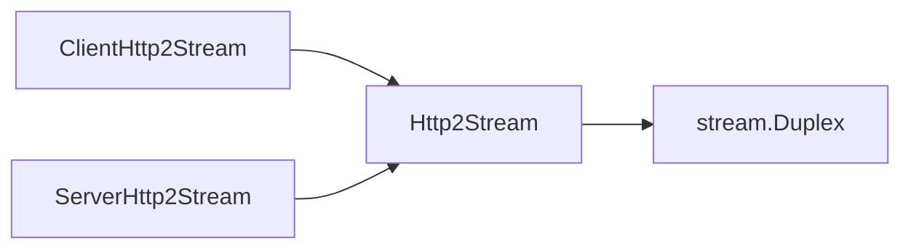
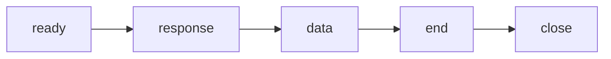
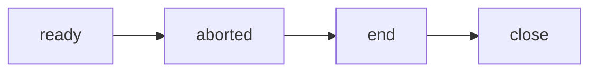

## 前言

這篇文章主要是整理 Node.js http2 模組的使用方式，建議先把 HTTP/2 的基礎讀過

- [HTTP/2 raw bytes (第一篇)](../http/http-2-raw-bytes.md)
- [HTTP/2 raw bytes (第二篇)](../http/http-2-raw-bytes-2.md)
- [HTTP/2 raw bytes (第三篇)](../http/http-2-raw-bytes-3.md)

## Node.js http2 原始碼

整體來說，架構比 Node.js http 模組乾淨，寫法也比較現代，閱讀起來比較舒適

| File path                    | Description                                                                                                  |
| ---------------------------- | ------------------------------------------------------------------------------------------------------------ |
| lib/internal/http2/compat.js | Implementation of [Compatibility API](https://nodejs.org/docs/latest-v24.x/api/http2.html#compatibility-api) |
| lib/internal/http2/core.js   | Implementation of Http2Sever, Http2Session, Http2Stream......                                                |
| lib/internal/http2/util.js   | util functions                                                                                               |

## goaway 語法

延續我在之前的文章介紹到的 [GOAWAY frame](../http/http-2-raw-bytes-2.md#goaway-frame)

- server

  ```js
  const http2Server = http2.createServer();
  http2Server.on("session", (serverHttp2Session) => {
    const code = http2.constants.NGHTTP2_NO_ERROR;
    const lastStreamID = 2 ** 31 - 1;
    const opaqueData = Buffer.from("Additional Debug Data", "utf8");
    serverHttp2Session.goaway(code, lastStreamID, opaqueData);
  });
  ```

- client

  ```js
  const clientHttp2Session = http2.connect("http://localhost:5000");
  clientHttp2Session.on("goaway", (errorCode, lastStreamID, opaqueData) => {
    console.log({
      errorCode,
      lastStreamID,
      opaqueData: opaqueData?.toString("utf8"),
    });
  });
  ```

- client output

  ```js
  {
    errorCode: 0,
    lastStreamID: 2147483647,
    opaqueData: 'Additional Debug Data'
  }
  ```

## ping 語法

延續我在之前的文章介紹到的 [PING frame](../http/http-2-raw-bytes-2.md#ping-frame)

- server

  ```js
  const http2Server = http2.createServer();
  http2Server.on("session", (serverHttp2Session) => {
    serverHttp2Session.on("ping", (payload: Buffer) => console.log(payload)); // <Buffer 31 32 33 34 35 36 37 38>
  });
  http2Server.listen(5000);
  ```

- client

  ```js
  const clientHttp2Session = http2.connect("http://localhost:5000");
  // 需等到 `on("connect")` 之後才能正確送出 PING frame
  await new Promise((resolve) => clientHttp2Session.on("connect", resolve));
  const payload = Buffer.from("12345678", "latin1");
  clientHttp2Session.ping(payload, (err, duration, payload) => {
    console.log({ err, duration, payload });
    //
  });
  ```

- client output

  ```js
  {
    err: null,
    duration: 0.838084,
    payload: <Buffer 31 32 33 34 35 36 37 38>
  }
  ```

## push 語法

延續我在之前的文章介紹到的 [PUSH_PROMISE frame](../http/http-2-raw-bytes-2.md#push_promise-frame)

- server

  ```js
  const http2Server = http2.createServer();
  http2Server.listen(5000);
  http2Server.on("stream", (serverHttp2Stream) => {
    if (!serverHttp2Stream.pushAllowed) return;
    // server 猜測 client 接下來需要 style.css
    const reqHeaders = { ":path": "/style.css" };
    serverHttp2Stream.pushStream(
      reqHeaders,
      (err, pushStream, finalReqHeaders) => {
        if (err) return console.error(err);
        // 真正在 stream id = 偶數，回傳 style.css 的內容
        pushStream.respond();
        pushStream.end("content of style.css");
      },
    );
  });
  ```

- client

  ```js
  const clientHttp2Session = http2.connect("http://localhost:5000", {
    settings: { enablePush: true },
  });
  clientHttp2Session.request({ ":path": "/index.html" });
  clientHttp2Session.on("stream", (pushedStream) => {
    pushedStream.on("push", (headers, flags) => {
      console.log({ headers, flags });
    });
    pushedStream.setEncoding("latin1");
    pushedStream.on("data", console.log);
  });
  ```

- client output

  ```js
  {
    headers: [Object: null prototype] {
      ':status': 200,
      date: 'Fri, 08 May 2026 06:39:28 GMT',
      Symbol(sensitiveHeaders): []
    },
    flags: 4 // END_HEADERS
  }
  content of style.css
  ```

## maxHeaderListPairs

- 測試目標：超出 `maxHeaderListPairs` 的 HTTP request 會如何處理
- server (Node.js http2)

  ```js
  const http2Server = http2.createServer();
  http2Server.on("request", (req, res) => {
    console.log(req.headers);
    res.end("ok");
  });
  http2Server.listen(5000);
  ```

- client (curl)

  ```
  curl --http2-prior-knowledge http://localhost:5000
  ```

- server output（得知 curl 預設會送 6 個 headers）

  ```js
  [Object: null prototype] {
    ':method': 'GET',
    ':scheme': 'http',
    ':authority': 'localhost:5000',
    ':path': '/',
    'user-agent': 'curl/8.7.1',
    accept: '*/*',
    Symbol(sensitiveHeaders): []
  }
  ```

- 調整 server 的 `maxHeaderListPairs`

  ```js
  const http2Server = http2.createServer({ maxHeaderListPairs: 5 });
  ```

- client (curl) 再次送 HTTP request

  ```
  curl --http2-prior-knowledge http://localhost:5000
  ```

- curl output

  ```
  curl: (92) HTTP/2 stream 1 was not closed cleanly: ENHANCE_YOUR_CALM (err 11)
  ```

- Wireshark 抓包

  | field                                  | hex         | description                                                         |
  | -------------------------------------- | ----------- | ------------------------------------------------------------------- |
  | Length                                 | 00 00 04    | frame payload has 4 bytes                                           |
  | Type                                   | 03          | RST_STREAM frame (type=0x03)                                        |
  | Flags                                  | 00          | unset (0x00)                                                        |
  | Reserved + Stream Identifier           | 00 00 00 01 | Reserved: 1-bit field (0)<br/>Stream Identifier: 31-bit integer (1) |
  | [Error Code](../http/http-2-errors.md) | 00 00 00 0b | ENHANCE_YOUR_CALM                                                   |

## maxOutstandingPings

**outstanding 在這邊的含義是 "sender 已經送出 (PING frame)，但尚未收到回應 (PING ACK)"**

- server

  ```js
  const http2Server = http2.createServer();
  http2Server.listen(5000);
  ```

- client

  ```js
  const clientHttp2Session = http2.connect("http://localhost:5000", {
    maxOutstandingPings: 1,
  });
  // 需等到 `on("connect")` 之後才能正確送出 PING frame
  await new Promise((resolve) => clientHttp2Session.on("connect", resolve));
  const payload = Buffer.from("12345678", "latin1");
  clientHttp2Session.ping(payload, (err, duration, payload) => {
    console.log({ err, duration, payload });
  });
  clientHttp2Session.ping(payload, (err) => console.log(err));
  ```

- client output

  ```js
  Error [ERR_HTTP2_PING_CANCEL]: HTTP2 ping cancelled
      at Http2Ping.pingCallback (node:internal/http2/core:986:10)
      at ClientHttp2Session.ping (node:internal/http2/core:1462:26)
      at process.processTicksAndRejections (node:internal/process/task_queues:104:5) {
    code: 'ERR_HTTP2_PING_CANCEL'
  }
  {
    err: null,
    duration: 1.473291,
    payload: <Buffer 31 32 33 34 35 36 37 38>
  }
  ```

## Http2session.socket

- `http2session` 是 Node.js http2 模組的抽象，代表一個 "http2 的長連線"，跟 Layer 4 的 TCP socket 是 1:1 的關聯
- 建議不要用 `http2session.socket.write()`, `http2session.socket.on("data")` 來破壞 `http2session` 的狀態機
- Node.js 會阻擋 user code 去 get/set `http2session.socket` 的部分 properties 或 methods，背後使用 JS 的 [Proxy](https://developer.mozilla.org/en-US/docs/Web/JavaScript/Reference/Global_Objects/Proxy)

  ```js
  class Http2Session extends EventEmitter {
    get socket() {
      const proxySocket = this[kProxySocket];
      if (proxySocket === null)
        return (this[kProxySocket] = new Proxy(this, proxySocketHandler));
      return proxySocket;
    }
  }

  const proxySocketHandler = {
    get(session, prop) {
      switch (prop) {
        case "setTimeout":
        case "ref":
        case "unref":
          return session[prop].bind(session);
        // ... other cases 省略
      }
    },
  };
  ```

## Http2session.close()

**概念**

- Gracefully closes the `Http2Session`
- Allowing any existing streams to complete on their own
- Preventing new Http2Stream instances from being created
- 背後會送 [GOAWAY](../http/http-2-raw-bytes-2.md#goaway-frame) frame

**範例**

- client

  ```js
  const clientHttp2Session = http2.connect("http://localhost:5000");
  clientHttp2Session.on("connect", () => {
    const clientHttp2Stream = clientHttp2Session.request();
    clientHttp2Stream.on("response", () => console.log("response"));
    setImmediate(() => clientHttp2Session.close());
  });
  clientHttp2Session.on("close", () => {
    const { closed, destroyed } = clientHttp2Session;
    console.log("close", { closed, destroyed });
  });
  ```

- server

  ```js
  const http2Server = http2.createServer();
  http2Server.listen(5000);
  http2Server.on("stream", (stream, headers, flag, rawHeaders) => {
    stream.respond();
    stream.end();
  });
  ```

- client output

  ```js
  response
  close { closed: true, destroyed: true }
  ```

## Http2session.destroy()

**概念**

- 比 [http2session.close()](#http2sessionclose) 還要激進，發送 GOAWAY 之後，直接關閉 TCP 連線

**範例**

- client

  ```js
  const clientHttp2Session = http2.connect("http://localhost:5000");
  clientHttp2Session.on("connect", () => {
    const clientHttp2Stream = clientHttp2Session.request();
    clientHttp2Stream.on("response", () => console.log("response"));
    setImmediate(() => clientHttp2Session.close());
  });
  clientHttp2Session.on("close", () => {
    const { closed, destroyed } = clientHttp2Session;
    console.log("close", { closed, destroyed });
  });
  ```

- server

  ```js
  const http2Server = http2.createServer();
  http2Server.listen(5000);
  http2Server.on("stream", (stream, headers, flag, rawHeaders) => {
    stream.respond();
    stream.end();
  });
  ```

- client output

  ```js
  close { closed: true, destroyed: true }
  ```

## Http2session.on("connect")

- client

  ```js
  const clientHttp2Session = http2.connect("http://localhost:5000");
  console.log(clientHttp2Session.connecting); // true
  clientHttp2Session.on("connect", (session, socket) =>
    console.log(clientHttp2Session.connecting),
  ); // false
  ```

- server

  ```js
  const http2Server = http2.createServer();
  http2Server.listen(5000);
  ```

## Http2session.type

- client

  ```js
  const clientHttp2Session = http2.connect("http://localhost:5000");
  console.log(
    clientHttp2Session.type === http2.constants.NGHTTP2_SESSION_CLIENT,
  ); // true
  ```

- server

  ```js
  const http2Server = http2.createServer();
  http2Server.listen(5000);
  http2Server.on("session", (serverHttp2Session) => {
    console.log(
      serverHttp2Session.type === http2.constants.NGHTTP2_SESSION_SERVER,
    ); // true
  });
  ```

## Http2Stream 繼承鍊



## ServerHttp2Stream.respond

:::info
ServerHttp2Stream 才有的 method，用來送出 [HEADERS](../http/http-2-raw-bytes.md#step-4-headers-frame) frame
:::

**simple case**

- client
  ```js
  const clientHttp2Session = http2.connect("http://localhost:5000");
  const clientHttp2Stream = clientHttp2Session.request();
  clientHttp2Stream.on("response", (headers, flags, rawHeaders) => {
    console.log("response", { headers, flags, rawHeaders });
  });
  ```
- server

  ```js
  const http2Server = http2.createServer({ maxSendHeaderBlockLength: 1 });
  http2Server.listen(5000);
  http2Server.on("stream", (stream, headers, flag, rawHeaders) => {
    console.log(stream.endAfterHeaders); // true (GET request 在 Node.js 預設是 no payload)
    console.log(stream.headersSent); // false
    stream.respond();
    console.log(stream.sentHeaders); // { ':status': 200, date: 'Wed, 13 May 2026 10:21:00 GMT' }
    console.log(stream.headersSent); // true
    stream.end();
  });
  ```

- client output

  ```js
  response {
    headers: [Object: null prototype] {
      ':status': 200,
      date: 'Mon, 11 May 2026 12:03:27 GMT',
      Symbol(sensitiveHeaders): []
    },
    flags: 4, // END_HEADERS
    rawHeaders: [ ':status', '200', 'date', 'Mon, 11 May 2026 12:03:27 GMT' ]
  }
  ```

**endStream（對應 END_STREAM flag，在這邊代表 response headers 之後不會有 response body）**

- client

  ```js
  const clientHttp2Session = http2.connect("http://localhost:5000");
  const clientHttp2Stream = clientHttp2Session.request();
  clientHttp2Stream.on("response", (headers, flags, rawHeaders) => {
    const { endAfterHeaders } = clientHttp2Stream;
    console.log("response", { headers, flags, rawHeaders, endAfterHeaders });
  });
  ```

- server

  ```js
  const http2Server = http2.createServer({ maxSendHeaderBlockLength: 1 });
  http2Server.listen(5000);
  http2Server.on("stream", (stream, headers, flag, rawHeaders) => {
    console.log(stream.endAfterHeaders); // true (GET request 在 Node.js 預設是 no payload)
    console.log(stream.headersSent); // false
    stream.respond({}, { endStream: true });
    console.log(stream.headersSent); // true
  });
  ```

- client output

  ```js
  response {
    headers: [Object: null prototype] {
      ':status': 200,
      date: 'Tue, 12 May 2026 00:23:52 GMT',
      Symbol(sensitiveHeaders): []
    },
    flags: 5, // END_STREAM + END_HEADERS
    rawHeaders: [ ':status', '200', 'date', 'Tue, 12 May 2026 00:23:52 GMT' ],
    endAfterHeaders: false // 應該要是 true，但 Node.js lib/internal/http2/core.js "onSessionHeaders" 似乎有 BUG
  }
  ```

**waitForTrailers（在這邊代表 response body 之後，是否要再送 trailers）**

- client

  ```js
  const clientHttp2Session = http2.connect("http://localhost:5000");
  const clientHttp2Stream = clientHttp2Session.request();
  clientHttp2Stream.on("response", (headers, flags, rawHeaders) => {
    console.log("response", { headers, flags, rawHeaders });
  });
  clientHttp2Stream.on("trailers", (headers, flags, rawHeaders) => {
    console.log("trailers", { headers, flags, rawHeaders });
  });
  ```

- server

  ```js
  const http2Server = http2.createServer();
  http2Server.listen(5000);
  http2Server.on("stream", (stream, headers, flag, rawHeaders) => {
    console.log(stream.endAfterHeaders); // true (GET request 在 Node.js 預設是 no payload)
    console.log(stream.headersSent); // false
    stream.respond({}, { waitForTrailers: true });
    console.log(stream.headersSent); // true
    stream.end();
    stream.on("wantTrailers", () => {
      stream.sendTrailers({ test: 123 });
      console.log(stream.sentTrailers); // { test: 123 }
    });
  });
  ```

- client output

  ```js
  response {
    headers: [Object: null prototype] {
      ':status': 200,
      date: 'Wed, 13 May 2026 05:56:05 GMT',
      Symbol(sensitiveHeaders): []
    },
    flags: 4, // END_HEADERS
    rawHeaders: [ ':status', '200', 'date', 'Wed, 13 May 2026 05:56:05 GMT' ]
  }
  trailers {
    headers: [Object: null prototype] {
      test: '123',
      Symbol(sensitiveHeaders): []
    },
    flags: 5, // END_HEADERS + END_STREAM
    rawHeaders: [ 'test', '123' ]
  }
  ```

## Http2Stream.on("frameError"), maxSendHeaderBlockLength

**送出 frame 失敗時觸發**

- server（使用 `maxSendHeaderBlockLength` 來限制 server 回傳給 client 的 headers 大小）

  ```js
  const http2Server = http2.createServer({ maxSendHeaderBlockLength: 1 });
  http2Server.listen(5000);
  http2Server.on("stream", (stream, headers, flag, rawHeaders) => {
    stream.on("frameError", (frameType, errorCode, streamID) => {
      console.log({ frameType, errorCode, streamID });
    });
    stream.on("error", console.log);
    stream.respond();
  });
  ```

- client

  ```js
  const clientHttp2Session = http2.connect("http://localhost:5000");
  const clientHttp2Stream = clientHttp2Session.request();
  clientHttp2Stream.on("error", console.log);
  ```

- output

  ```js
  { frameType: 1, errorCode: 6, streamID: 1 } // frameType = HEADERS, errorCode = FRAME_SIZE_ERROR
  Error [ERR_HTTP2_STREAM_ERROR]: Stream closed with error code NGHTTP2_FRAME_SIZE_ERROR
      at ServerHttp2Stream._destroy (node:internal/http2/core:2475:13)
      at _destroy (node:internal/streams/destroy:122:10)
      at ServerHttp2Stream.destroy (node:internal/streams/destroy:84:5)
      at Writable.destroy (node:internal/streams/writable:1120:11)
      at Http2Stream.onStreamClose (node:internal/http2/core:609:12) {
    code: 'ERR_HTTP2_STREAM_ERROR'
  }
  Error [ERR_HTTP2_STREAM_ERROR]: Stream closed with error code NGHTTP2_FRAME_SIZE_ERROR
      at ClientHttp2Stream._destroy (node:internal/http2/core:2475:13)
      at _destroy (node:internal/streams/destroy:122:10)
      at ClientHttp2Stream.destroy (node:internal/streams/destroy:84:5)
      at Writable.destroy (node:internal/streams/writable:1120:11)
      at Http2Stream.onStreamClose (node:internal/http2/core:609:12) {
    code: 'ERR_HTTP2_STREAM_ERROR'
  }
  ```

## ClientHttp2Stream

### 正常情境的生命週期

- server

  ```js
  const http2Server = http2.createServer();
  http2Server.listen(5000);
  http2Server.on("stream", (stream, headers, flag, rawHeaders) => {
    stream.respond();
    stream.end("ok");
  });
  ```

- client

  ```js
  const clientHttp2Session = http2.connect("http://localhost:5000");
  const clientHttp2Stream = clientHttp2Session.request();
  const { id, pending } = clientHttp2Stream;
  console.log({ id, pending });
  clientHttp2Stream.on("ready", () => {
    const { id, pending } = clientHttp2Stream;
    console.log("ready", { id, pending });
  });
  clientHttp2Stream.on("response", (headers, flags, rawHeaders) => {
    console.log("response", { headers, flags, rawHeaders });
  });
  clientHttp2Stream.on("data", (chunk) => console.log("data", chunk));
  clientHttp2Stream.on("end", () => {
    const { readableEnded } = clientHttp2Stream;
    console.log("end", { readableEnded });
  });
  clientHttp2Stream.on("close", () => {
    const { destroyed, closed, rstCode } = clientHttp2Stream;
    console.log("close", { destroyed, closed, rstCode });
  });
  ```

- client output

  ```js
  { id: undefined, pending: true }
  ready { id: 1, pending: false }
  response {
    headers: [Object: null prototype] {
      ':status': 200,
      date: 'Sat, 09 May 2026 08:59:36 GMT',
      Symbol(sensitiveHeaders): []
    },
    flags: 4, // END_HEADERS
    rawHeaders: [ ':status', '200', 'date', 'Sat, 09 May 2026 08:59:36 GMT' ]
  }
  data ok
  end { readableEnded: true }
  close { destroyed: true, closed: true, rstCode: 0 }
  ```

**會依序觸發**



**各個 event 代表的含意：**

| event    | description                                       |
| -------- | ------------------------------------------------- |
| ready    | TCP 連線建立，成功從 nghttp2 分配到一個 stream ID |
| response | 收到完整的 response headers 觸發（END_HEADERS）   |
| data     | 收到 chunk of response body 時觸發                |
| end      | 收到完整的 HTTP response 觸發（END_STREAM）       |
| close    | `end` 之後觸發                                    |

### request body 寫到一半就中斷

- server

  ```js
  const http2Server = http2.createServer();
  http2Server.listen(5000);
  http2Server.on("stream", (stream, headers, flag, rawHeaders) => {
    // 模擬讀取 request body 到一半就中斷
    stream.on("data", () => stream.close());
  });
  ```

- client

  ```js
  const clientHttp2Session = http2.connect("http://localhost:5000");
  const clientHttp2Stream = clientHttp2Session.request({ ":method": "POST" });
  clientHttp2Stream.write("123");
  const { id, pending } = clientHttp2Stream;
  console.log({ id, pending });
  clientHttp2Stream.on("ready", () => {
    const { id, pending } = clientHttp2Stream;
    console.log("ready", { id, pending });
  });
  clientHttp2Stream.on("aborted", () => {
    const { aborted } = clientHttp2Stream;
    console.log("aborted", { aborted });
  });
  clientHttp2Stream.on("end", () => {
    const { readableEnded } = clientHttp2Stream;
    console.log("end", { readableEnded });
  });
  clientHttp2Stream.on("close", () => {
    const { destroyed, closed, rstCode } = clientHttp2Stream;
    console.log("close", { destroyed, closed, rstCode });
  });
  ```

- client output

  ```js
  { id: undefined, pending: true }
  ready { id: 1, pending: false }
  aborted { aborted: true }
  end { readableEnded: true }
  close { destroyed: true, closed: true, rstCode: 0 }
  ```

**會依序觸發**



**各個 event 代表的含意：**

| event   | description                 |
| ------- | --------------------------- |
| aborted | request body 寫到一半就中斷 |

### close with error

**基本概念**

- [正常情境](#正常情境的生命週期)不需要自行呼叫 `stream.close()`，stream 也會走到 `closed` 狀態
- `stream.close()` 對應的 HTTP/2 frame 是 [RST_STREAM](../http/http-2-raw-bytes-2.md#rst_stream-frame)

**`stream.close()` 若搭配 [Error Code](../http/http-2-errors.md#7-error-codes) > 0，則 client 跟 server 皆需要監聽 `stream.on("error")` 來捕捉此錯誤**

- server

  ```js
  const http2Server = http2.createServer();
  http2Server.listen(5000);
  http2Server.on("stream", (stream, headers, flag, rawHeaders) => {
    stream.on("error", console.log);
  });
  ```

- client

  ```js
  const clientHttp2Session = http2.connect("http://localhost:5000");
  const clientHttp2Stream = clientHttp2Session.request();
  clientHttp2Stream.close(http2.constants.NGHTTP2_INTERNAL_ERROR);
  clientHttp2Stream.on("error", console.log);
  ```

- output

  ```js
  Error [ERR_HTTP2_STREAM_ERROR]: Stream closed with error code NGHTTP2_INTERNAL_ERROR
      at ClientHttp2Stream._destroy (node:internal/http2/core:2475:13)
      at _destroy (node:internal/streams/destroy:122:10)
      at ClientHttp2Stream.destroy (node:internal/streams/destroy:84:5)
      at Writable.destroy (node:internal/streams/writable:1120:11)
      at [kMaybeDestroy] (node:internal/http2/core:2515:14)
      at ClientHttp2Stream.<anonymous> (node:internal/http2/core:1949:28)
      at ClientHttp2Stream.emit (node:events:509:28)
      at finish (node:internal/streams/writable:953:10)
      at process.processTicksAndRejections (node:internal/process/task_queues:90:21) {
    code: 'ERR_HTTP2_STREAM_ERROR'
  }
  Error [ERR_HTTP2_STREAM_ERROR]: Stream closed with error code NGHTTP2_INTERNAL_ERROR
      at ServerHttp2Stream._destroy (node:internal/http2/core:2475:13)
      at _destroy (node:internal/streams/destroy:122:10)
      at ServerHttp2Stream.destroy (node:internal/streams/destroy:84:5)
      at Writable.destroy (node:internal/streams/writable:1120:11)
      at Http2Stream.onStreamClose (node:internal/http2/core:609:12) {
    code: 'ERR_HTTP2_STREAM_ERROR'
  }
  ```

## informational response

- server

  ```js
  const http2Server = http2.createServer();
  http2Server.listen(5000);
  http2Server.on("stream", (stream, headers, flag, rawHeaders) => {
    stream.additionalHeaders({ test: "123", ":status": 100 });
    console.log(stream.sentInfoHeaders); // { test: "123", ":status": 100 }
  });
  ```

- client

  ```js
  const clientHttp2Session = http2.connect("http://localhost:5000");
  const clientHttp2Stream = clientHttp2Session.request();
  clientHttp2Stream.on("continue", () => console.log("continue"));
  clientHttp2Stream.on("headers", (headers, flags, rawHeaders) => {
    console.log("headers", { headers, flags, rawHeaders });
  });
  ```

- client output

  ```js
  continue
  headers {
    headers: [Object: null prototype] {
      ':status': 100,
      test: '123',
      Symbol(sensitiveHeaders): []
    },
    flags: 4, // END_HEADERS
    rawHeaders: [ ':status', '100', 'test', '123' ]
  }
  ```

**各個 event 代表的含意：**

| event    | description                |
| -------- | -------------------------- |
| continue | 收到 `:status: 100` 時觸發 |
| headers  | 收到 `:status: 1xx` 時觸發 |

## Http2Server.on("connection")

**TCP 連線建立後觸發**

- client

  ```js
  const socket = net.connect({ host: "localhost", port: 5000 });
  ```

- server

  ```js
  const http2Server = http2.createServer();
  http2Server.listen(5000);
  http2Server.on("connection", (socket) =>
    console.log(socket instanceof net.Socket),
  ); // true
  ```

## Http2Server.close()

**概念**

- Stops the server from establishing new sessions and streams
- Calls [Http2Session.close()](#http2sessionclose) on all active sessions

**範例**

- server

  ```js
  const http2Server = http2.createServer();
  http2Server.listen(5000);
  http2Server.on("stream", (stream, headers, flag, rawHeaders) => {
    stream.respond();
    stream.end();
  });
  http2Server.on("close", () => console.log("http2Server close"));
  ```

- client

  ```js
  const clientHttp2Session = http2.connect("http://localhost:5000");
  const clientHttp2Stream1 = clientHttp2Session.request();
  clientHttp2Stream1.on("response", () => {
    console.log("response1");
    http2Server.close();
  });
  clientHttp2Session.on("close", () => console.log("clientHttp2Session close"));
  ```

- output

  ```js
  response1
  clientHttp2Session close
  http2Server close
  ```

## trailers

**承接 [ServerHttp2Stream.respond](#serverhttp2streamrespond)，client side 也可以送出 trailers**

- client

  ```js
  const clientHttp2Session = http2.connect("http://localhost:5000");
  const clientHttp2Stream = clientHttp2Session.request(
    { ":method": "POST" },
    { waitForTrailers: true },
  );
  clientHttp2Stream.end();
  clientHttp2Stream.on("wantTrailers", () => {
    clientHttp2Stream.sendTrailers({ test: 123 });
  });
  ```

- server（使用跟 Node.js http 模組相容的 [Compatibility API](https://nodejs.org/docs/latest-v24.x/api/http2.html#compatibility-api)）

  ```js
  const http2Server = http2.createServer();
  http2Server.listen(5000);
  http2Server.on("request", (req, res) => {
    req.on("data", console.log);
    req.on("end", () => {
      const { trailers, rawTrailers } = req;
      console.log({ trailers, rawTrailers });
    });
  });
  ```

- server output

  ```js
  {
    trailers: { test: '123', Symbol(sensitiveHeaders): [] },
    rawTrailers: [ 'test', '123' ]
  }
  ```

## Http2Session.on("error")

- client

  ```js
  const clientHttp2Session = http2.connect("http://localhost:5000");
  clientHttp2Session.on("error", console.log);
  ```

- server

  ```js
  const http2Server = http2.createServer();
  http2Server.listen(5000);
  http2Server.on("session", (serverHttp2Session) => {
    serverHttp2Session.goaway(http2.constants.NGHTTP2_INTERNAL_ERROR);
  });
  ```

- client output

  ```js
  Error [ERR_HTTP2_SESSION_ERROR]: Session closed with error code 2
      at Http2Session.onGoawayData (node:internal/http2/core:760:21) {
    code: 'ERR_HTTP2_SESSION_ERROR'
  }
  ```

## maxReservedRemoteStreams

**限制 ClientHttp2Session 同時能收到的 push stream 數量上限**

- client

  ```js
  const clientHttp2Session = http2.connect("http://localhost:5000", {
    maxReservedRemoteStreams: 1,
  });
  clientHttp2Session.on("stream", (pushedStream) => {
    // 消耗 response body，讓 pushedStream 進入 end, close 狀態
    pushedStream.resume();
    pushedStream.on("end", () =>
      console.log({
        time: performance.now(),
        streamID: pushedStream.id,
      }),
    );
  });
  clientHttp2Session.request();
  // 第 2 個 request 延遲 1 秒後再送出，此時第 1 個 pushedStream 的生命週期已結束
  setTimeout(() => clientHttp2Session.request(), 1000);
  ```

- server（同 [push 語法](#push-語法) 的範例程式碼）

  ```js
  const http2Server = http2.createServer();
  http2Server.listen(5000);
  http2Server.on("stream", (serverHttp2Stream) => {
    if (!serverHttp2Stream.pushAllowed) return;
    // server 猜測 client 接下來需要 style.css
    const reqHeaders = { ":path": "/style.css" };
    serverHttp2Stream.pushStream(
      reqHeaders,
      (err, pushStream, finalReqHeaders) => {
        if (err) return console.error(err);
        // 真正在 stream id = 偶數，回傳 style.css 的內容
        pushStream.respond();
        pushStream.end("content of style.css");
      },
    );
  });
  ```

- client output

  ```js
  { time: 123.517083, streamID: 2 }
  { time: 1121.916125, streamID: 4 }
  ```

## encrypted, alpnProtocol

參考之前寫的文章 [mkcert 建立本機 CA](../http/strict-transport-security.md#mkcert-建立本機-ca)

- client

  ```js
  const rootCA = readFileSync("/path-to-your/mkcert/rootCA.pem");
  const clientHttp2Session = http2.connect("https://localhost:5000", {
    ca: rootCA,
  });
  ```

- server

  ```js
  const https2Server = http2.createSecureServer({
    key: readFileSync(join(import.meta.dirname, "private-key.pem")),
    cert: readFileSync(join(import.meta.dirname, "cert.pem")),
  });
  https2Server.on("session", (serverHttp2Session) => {
    console.log(serverHttp2Session.encrypted); // true
    console.log(serverHttp2Session.alpnProtocol); // h2
  });
  https2Server.listen(5000);
  ```

## Http2SecureServer.on("unknownProtocol")

**client 在建立 TLS 連線時，沒帶 ALPN protocol，server 就會觸發這個事件**

- client

  ```js
  const rootCA = readFileSync("/path-to-your/mkcert/rootCA.pem");
  const tlsSocket = tls.connect({ host: "localhost", port: 5000, ca: rootCA });
  ```

- server

  ```js
  const https2Server = http2.createSecureServer({
    key: readFileSync(join(import.meta.dirname, "private-key.pem")),
    cert: readFileSync(join(import.meta.dirname, "cert.pem")),
  });
  https2Server.on("unknownProtocol", (tlsSocket) => {
    console.log(tlsSocket instanceof tls.TLSSocket); // true
    // 需自行呼叫 socket.destroy
    tlsSocket.destroy();
  });
  https2Server.listen(5000);
  ```

## strictFieldWhitespaceValidation

**是否允許 HTTP header field value 有 leading/trailing space**

- 正常我們看到的 HTTP header key value：✅ `hello: world`
- 雖 [RFC 9112](https://datatracker.ietf.org/doc/html/rfc9112.html#section-5) 可容許在 field value 前後有多個空白或是 Tab：✅ `hello: \tworld\t`
- 但 [RFC 9113](https://datatracker.ietf.org/doc/html/rfc9113#section-8.2.1) 不容許在 field value 前後有多個空白或是 Tab：❌ `hello: \tworld\t`

### 測試 false 情境

- client（參考 [Node.js + CLI 串接 `deflatehd`](../http/http-2-raw-bytes.md#nodejs--cli-串接-deflatehd)，產 HPACK raw bytes）

  ```js
  const pathToDeflatehd = "/path-to-your/nghttp2-1.69.0/src/deflatehd";
  const spawnSyncReturns = spawnSync(pathToDeflatehd, ["-t"], {
    input: [
      ":method: GET",
      ":scheme: http",
      ":path: /",
      ":authority: localhost:5000",
      "hello: world ", // field value 刻意加上 trailing whitespace
      "",
      "",
    ].join("\n"),
    encoding: "utf8",
  });
  const result = JSON.parse(spawnSyncReturns.stdout);
  const { wire } = result.cases[0];
  ```

- client（組 HTTP/2 raw bytes）

  ```js
  const payloadLength = byteLengthTo3BytesBuffer(result.cases[0].output_length);
  const headersFrame = Buffer.from([
    ...payloadLength, // Length
    0x01, // Type
    0x05, // Flags (END_STREAM + END_HEADERS)
    0x00,
    0x00,
    0x00,
    0x01, // Reserved + Stream Identifier
    ...Buffer.from(wire, "hex"), // Payload
  ]);
  const frames = Buffer.concat([magic, emptySettingsFrame, headersFrame]);
  const socket = net.connect({ host: "localhost", port: 5000 });
  socket.write(frames);
  ```

- server (Node.js http2)

  ```js
  const http2Server = http2.createServer({
    strictFieldWhitespaceValidation: false,
  });
  http2Server.listen(5000);
  http2Server.on("stream", (stream, headers) => {
    console.log("stream", headers);
    assert(Object.hasOwn(headers, "hello"));
  });
  ```

- server output

  ```js
  stream [Object: null prototype] {
    ':method': 'GET',
    ':scheme': 'http',
    ':path': '/',
    ':authority': 'localhost:5000',
    hello: 'world ', // field value 有空白
    Symbol(sensitiveHeaders): []
  }
  ```

**結論：可以容忍 field value 有 leading/trailing whitespace**

### 測試 true 情境

- client 程式碼不變
- server (Node.js http2)

  ```js
  const http2Server = http2.createServer({
    strictFieldWhitespaceValidation: true,
  });
  http2Server.listen(5000);
  http2Server.on("stream", (stream, headers) => {
    console.log("stream", headers);
    assert(Object.hasOwn(headers, "hello") === false);
  });
  ```

- server output

  ```js
  stream [Object: null prototype] {
    ':method': 'GET',
    ':scheme': 'http',
    ':path': '/',
    ':authority': 'localhost:5000',
    Symbol(sensitiveHeaders): []
  }
  ```

**結論：會把 field value 有 leading/trailing whitespace 的 header key value 移除**

## getPackedSettings, getUnpackedSettings

**util functions，用來 settings object 跟 buffer 的轉換**

```js
http2.getPackedSettings({ initialWindowSize: 100 }); // <Buffer 00 04 00 00 00 64>
http2.getUnpackedSettings(Buffer.from([0x00, 0x04, 0x00, 0x00, 0x00, 0x64])); // { initialWindowSize: 100 }
```

**參考**

- [SETTINGS frame 格式](../http/http-2-raw-bytes.md#step-2-settings-frame-connection-preface)
- [Section 6.5.2 Defined Settings](../http/http-2-raw-bytes.md#section-652-defined-settings)

## http2.getDefaultSettings()

基本上這些值都有定義在 [RFC 9113 6.5.2. Defined Settings](https://datatracker.ietf.org/doc/html/rfc9113#section-6.5.2)

```js
http2.getDefaultSettings();
// [Object: null prototype] {
//   headerTableSize: 4096,
//   enablePush: true,
//   initialWindowSize: 65535,
//   maxFrameSize: 16384,
//   maxConcurrentStreams: 4294967295,
//   maxHeaderSize: 65535,
//   maxHeaderListSize: 65535,
//   enableConnectProtocol: false
// }
```

| RFC 9113 Defined Settings       | Node.js correspond settings       |
| ------------------------------- | --------------------------------- |
| SETTINGS_HEADER_TABLE_SIZE      | headerTableSize                   |
| SETTINGS_ENABLE_PUSH            | enablePush                        |
| SETTINGS_INITIAL_WINDOW_SIZE    | initialWindowSize                 |
| SETTINGS_MAX_FRAME_SIZE         | maxFrameSize                      |
| SETTINGS_MAX_CONCURRENT_STREAMS | maxConcurrentStreams              |
| SETTINGS_MAX_HEADER_LIST_SIZE   | maxHeaderListSize (maxHeaderSize) |

:::info
enableConnectProtocol 是定義在 RFC 8441，並且會在 [這篇文章](../http/http-2-raw-bytes-3.md) 介紹到
:::

## updateSettings, remotesettings

**updateSettings 只有單純做 settings object 的更新，不會更新既有連線的 settings**

```js
// 預設 initialWindowSize: 100
const http2Server = http2.createServer({ settings: { initialWindowSize: 100 } });
http2Server.listen(5000);

// 前兩個連線都吃到 initialWindowSize: 100
const clientHttp2Session1 = http2.connect("http://localhost:5000");
clientHttp2Session1.on('remoteSettings', (settings: Settings) => {
  assert(clientHttp2Session1.remoteSettings === settings);
  assert(settings.initialWindowSize === 100);
});
const clientHttp2Session2 = http2.connect("http://localhost:5000");
clientHttp2Session2.on('remoteSettings', (settings: Settings) => {
  assert(clientHttp2Session2.remoteSettings === settings);
  assert(settings.initialWindowSize === 100);
});

// 第三個連線會吃到 initialWindowSize: 200
await sleep(1000);
http2Server.updateSettings({ initialWindowSize: 200 });
const clientHttp2Session3 = http2.connect("http://localhost:5000");
clientHttp2Session3.on('remoteSettings', (settings: Settings) => {
  assert(clientHttp2Session3.remoteSettings === settings);
  assert(settings.initialWindowSize === 200);
});
```

## settings, localsettings, pendingSettingsAck

- server
  ```js
  const http2Server = http2.createServer();
  http2Server.listen(5000);
  ```
- client
  ```js
  const clientHttp2Session = http2.connect("http://localhost:5000");
  // connection preface 階段，client, server 會先交換一次各自的 settings
  // 延遲三秒再執行 settings + 掛上 "localSettings" event listener
  // 確保 callback 只會觸發一次
  await sleep(3000);
  // 更新 clientHttp2Session 的 localSettings
  clientHttp2Session.settings({ initialWindowSize: 100 });
  assert(clientHttp2Session.pendingSettingsAck === true);
  clientHttp2Session.on("localSettings", (settings: Settings) => {
    assert(settings.initialWindowSize === 100);
    assert(settings === clientHttp2Session.localSettings);
    assert(clientHttp2Session.pendingSettingsAck === false);
  });
  ```

## remoteCustomSettings, customSettings

除了 [DefaultSetting](#http2getdefaultsettings) 定義的七個設定，[SETTINGS frame](../http/http-2-raw-bytes.md#step-2-settings-frame-connection-preface) 本身是可以擴充的，我可以自行定義：

| Setting Name                          | Setting ID | Setting Value |
| ------------------------------------- | ---------- | ------------- |
| MY_CUSTOM_SETTING_ENABLE_COOL_FEATURE | 00 0a      | 00 00 00 01   |

而擴充的 Settings 是需要 client, server 雙方協商好的：

- 任一端可以透過 `customSettings` 宣告它的 [`localsettings`](#settings-localsettings-pendingsettingsack)
- 另一端需要透過 `remoteCustomSettings` 宣告對方會傳送的 custom Setting ID

**使用方法（以 client 發送 `customSettings` 為範例）**

- server

  ```js
  const http2Server = http2.createServer({
    remoteCustomSettings: [11,12,13,14,15,16,17,18,19,20]
  });
  http2Server.listen(5000);
  http2Server.on("session", (session) => {
    session.on("remoteSettings", (settings: Settings) => {
      console.log(settings.customSettings);
    })
  })
  ```

- client

  ```js
  const clientHttp2Session = http2.connect("http://localhost:5000", {
    settings: {
      customSettings: {
        11: 11,
        12: 12,
        13: 13,
        14: 14,
        15: 15,
        16: 16,
        17: 17,
        18: 18,
        19: 19,
        20: 20
      }
    }
  });
  clientHttp2Session.on("localSettings", (settings: Settings) => {
    console.log(settings.customSettings);
  });
  ```

- client & server output

  ```js
  {
    '11': 11,
    '12': 12,
    '13': 13,
    '14': 14,
    '15': 15,
    '16': 16,
    '17': 17,
    '18': 18,
    '19': 19,
    '20': 20
  }
  ```

## maxSettings

**限制每一個收到的 SETTINGS frame 最多可以有幾組 Settings (ID + Value)**

- server（設定 `maxSettings: 1`）
  ```js
  const http2Server = http2.createServer({ maxSettings: 1 });
  http2Server.listen(5000);
  ```
- client（在一個 SETTINGS frame 發送兩組 Settings）
  ```js
  const clientHttp2Session = http2.connect("http://localhost:5000", { settings: { customSettings: { 11: 11, 12: 12 } } });
  clientHttp2Session.on("goaway", (errorCode: number, lastStreamID: number, opaqueData?: Buffer) => {
    console.log({ errorCode, lastStreamID, opaqueData: opaqueData?.toString("latin1") });
  });
  clientHttp2Session.on("error", console.log);
  clientHttp2Session.on("close", () => console.log("clientHttp2Session close"));
  ```
- client output（server 直接用 GOAWAY frame 關閉這條連線）
  ```js
  {
    errorCode: 11, // ENHANCE_YOUR_CALM
    lastStreamID: 0,
    opaqueData: 'SETTINGS: too many setting entries'
  }
  Error [ERR_HTTP2_SESSION_ERROR]: Session closed with error code 11 // ENHANCE_YOUR_CALM
      at Http2Session.onGoawayData (node:internal/http2/core:760:21) {
    code: 'ERR_HTTP2_SESSION_ERROR'
  }
  clientHttp2Session close
  ```

##

<!-- ## strictSingleValueFields -->

<!-- ## SETTINGS
maxSessionInvalidFrames
maxSessionRejectedStreams
peerMaxConcurrentStreams

- https://nodejs.org/docs/latest-v24.x/api/http2.html#http2sessionsetlocalwindowsizewindowsize
  -->

<!-- ### Compatibility API

- https://nodejs.org/docs/latest-v24.x/api/http2.html#event-request
- https://nodejs.org/docs/latest-v24.x/api/http2.html#event-request_1
- https://nodejs.org/docs/latest-v24.x/api/http2.html#class-http2http2serverrequest
- https://nodejs.org/docs/latest-v24.x/api/http2.html#class-http2http2serverresponse -->

<!-- ### state

- https://nodejs.org/docs/latest-v24.x/api/http2.html#http2sessionstate -->

<!-- ## ServerHttp2Stream.respondWithFD

- https://nodejs.org/docs/latest-v24.x/api/http2.html#http2streamrespondwithfdfd-headers-options -->

<!-- ## ServerHttp2Stream.respondWithFiles

- https://nodejs.org/docs/latest-v24.x/api/http2.html#http2streamrespondwithfilepath-headers-options -->

<!-- ## Http2Stream properties

- https://nodejs.org/docs/latest-v24.x/api/http2.html#http2streambuffersize
- https://nodejs.org/docs/latest-v24.x/api/http2.html#http2streamstate -->

<!-- todo-yus 行為怪異，不知道該怎研究 -->
<!-- ## timeout

- http2Session
  - https://nodejs.org/docs/latest-v24.x/api/http2.html#event-timeout
  - https://nodejs.org/docs/latest-v24.x/api/http2.html#http2sessionsettimeoutmsecs-callback
- http2Stream
  - https://nodejs.org/docs/latest-v24.x/api/http2.html#event-timeout_1
  - https://nodejs.org/docs/latest-v24.x/api/http2.html#http2streamsettimeoutmsecs-callback
- httpServer
  - https://nodejs.org/docs/latest-v24.x/api/http2.html#event-timeout_2
  - https://nodejs.org/docs/latest-v24.x/api/http2.html#serversettimeoutmsecs-callback
  - https://nodejs.org/docs/latest-v24.x/api/http2.html#servertimeout
- http2SecureServer
  - https://nodejs.org/docs/latest-v24.x/api/http2.html#event-timeout_3
  - https://nodejs.org/docs/latest-v24.x/api/http2.html#serversettimeoutmsecs-callback_1
  - https://nodejs.org/docs/latest-v24.x/api/http2.html#servertimeout_1 -->

<!-- todo-yus 不知道怎測 -->
<!-- ## maxSessionMemory

https://nodejs.org/docs/latest-v24.x/api/http2.html#http2createserveroptions-onrequesthandler -->
