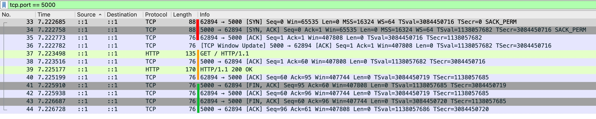
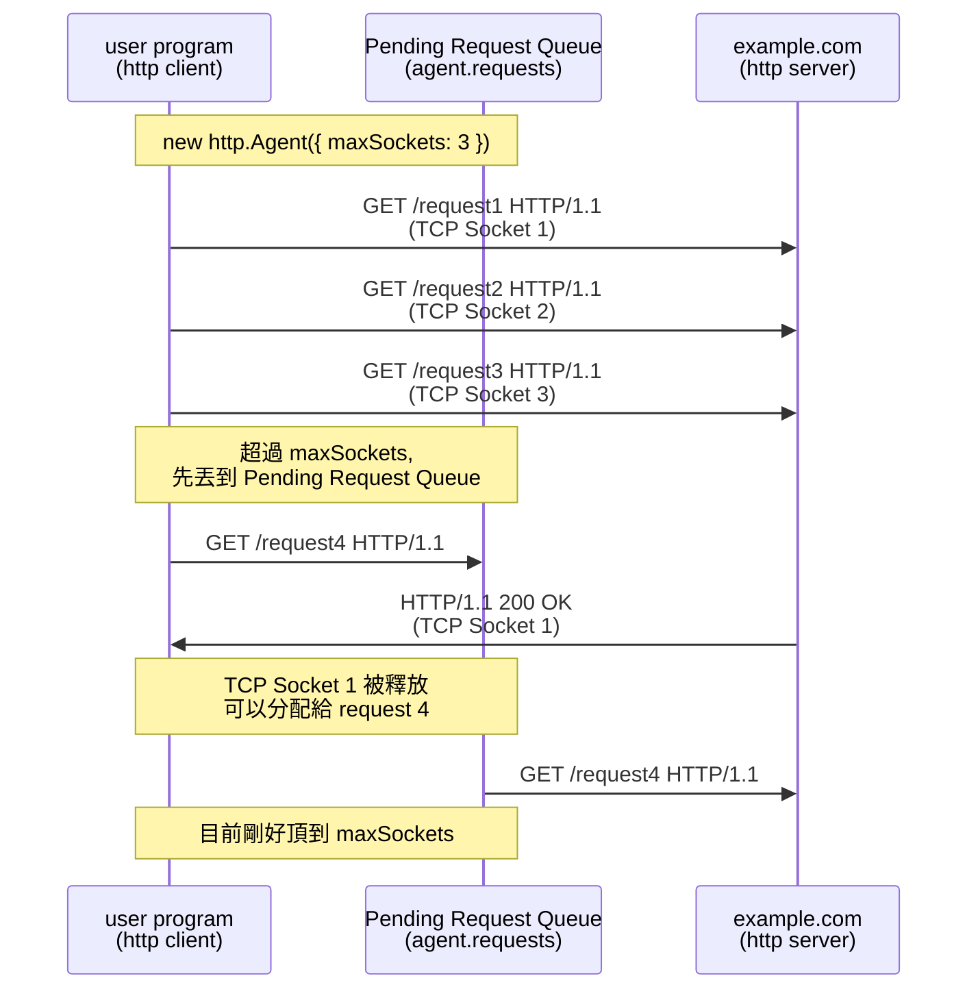

## 前言

我們有了以下知識

- [EventEmitter](./events.md)
- [stream-overview](./stream-overview.md)
- [stream.Readable](./stream-readable.md)
- [stream.Writable](./stream-writable.md)
- [socket-overview](./socket-overview.md)
- [socket-life-cycle](./socket-life-cycle.md)

終於可以進到 Node.js http 模組了！

:::info
本文測試 & 引用的 Node.js 原始碼為 v24.x latest
:::

## Why http.Agent ?

如果沒有 [http.Agent](https://nodejs.org/docs/latest-v24.x/api/http.html#class-httpagent) 的話

```ts
// Server
const server = http.createServer((req, res) => {
  console.log("req.headers", req.headers);
  res.end();
});
server.listen(5000);

// Client
const noop = () => {};
const request = http.request({
  host: "localhost",
  port: 5000,
  path: "/",
  agent: false, // ✅
});
request.end();
request.on("response", (res) => {
  console.log("res.headers", res.headers);
  res.resume();
  res.on("end", noop);
});
```

從 log 的 [Connection: close](../http/keep-alive-and-connection.md) 可以得出結論：每次 HTTP Round Trip 結束，都會關閉 TCP 連線

```ts
req.headers { host: 'localhost:5000', connection: 'close' }
res.headers {
  date: 'Fri, 06 Feb 2026 01:33:20 GMT',
  connection: 'close',
  'content-length': '0'
}
```

從 TCP (layer 4) 的角度來看，每次都需要
<span style={{ color: "red" }}>"三次交握開啟連線"</span> + <span style={{ color: "green" }}>"四次交握關閉連線"</span>，效能上會比較差


http.Agent 為此而生，它幫使用者管理

- TCP Socket 連線池
- concurrent 連線上限

<!-- Node.js 使用 [http.request](https://nodejs.org/docs/latest-v24.x/api/http.html#httprequestoptions-callback) 發起 HTTP Request 時，若沒有使用 [http.Agent](https://nodejs.org/docs/latest-v24.x/api/http.html#class-httpagent)，則每個請求都會創建一個新的 TCP 連線，並且該連線傳輸完這個 HTTP Request 就會關閉。若從 TCP (Layer 4) 的角度來看，每次都需要三次交握開啟連線 + 四次交握關閉連線，效能上會比較差。所以，管理 TCP Socket 連線池就成了一門學問，http.Agent 正是為此而生（當然 http.Agent 能做到的不止是管理 TCP Socket 連線池）。 -->

## new http.Agent(options)

https://nodejs.org/docs/latest-v24.x/api/http.html#new-agentoptions

| option                      | description -                                                                                                                                                                                                                       |
| --------------------------- | ----------------------------------------------------------------------------------------------------------------------------------------------------------------------------------------------------------------------------------- |
| keepAlive                   | Keep sockets around even when there are no outstanding requests,<br/>so they can be used for future requests without having to reestablish a TCP connection.                                                                        |
| keepAliveMsecs              | 同 [net.createServer](https://nodejs.org/api/net.html#netcreateserveroptions-connectionlistener) 的 `keepAliveInitialDelay`                                                                                                         |
| agentKeepAliveTimeoutBuffer | 假設 Server 設定 `keep-alive: timeout=3`<br/>Agent 設定 `agentKeepAliveTimeoutBuffer = 1000`<br/>那 Agent 會在 3000 - 1000 = 2 秒後，將這個連線視為過期<br/>為了避免 Client 還想傳送資料，但 Server 已經要關閉這條連線              |
| maxSockets                  | 每個 Origin 最多可以有幾個 concurrent TCP Socket<br/>參考 [options.maxSockets 圖解](#optionsmaxsockets)<br/>(Origin 是 [agent.getName([options])](https://nodejs.org/docs/latest-v24.x/api/http.html#agentgetnameoptions) 的回傳值) |
| maxTotalSockets             | 最多可以有幾個 concurrent TCP Socket                                                                                                                                                                                                |
| maxFreeSockets              | Only works when `keepAlive = true`                                                                                                                                                                                                  |
| scheduling                  | 要如何從 [freeSockets](https://nodejs.org/docs/latest-v24.x/api/http.html#agentfreesockets) 陣列中選擇<br/>- fifo (First In First Out)<br/>- lifo (Last In First Out)                                                               |
| timeout                     | 同 [socket.timeout](https://nodejs.org/api/net.html#sockettimeout)                                                                                                                                                                  |
| proxyEnv                    | v24.5.0 加入的，目前還在 Stability: 1.1 - Active development，細節在 [Built-in Proxy Support (Forward proxy)](./http_proxy.md) 介紹                                                                                                 |
| defaultPort                 | Default port to use when the port is not specified in requests.                                                                                                                                                                     |
| protocol                    | The protocol to use for the agent.                                                                                                                                                                                                  |

## methods

| method                                                                                                                            | description                                                                                                                                      |
| --------------------------------------------------------------------------------------------------------------------------------- | ------------------------------------------------------------------------------------------------------------------------------------------------ |
| [createConnection(options[, callback])](https://nodejs.org/docs/latest-v24.x/api/http.html#agentcreateconnectionoptions-callback) | 同 [net.createConnection()](https://nodejs.org/api/net.html#netcreateconnection)<br/>❌ 正常使用者不會碰到它<br/>有需要客製化行為才需要 override |
| [keepSocketAlive(socket)](https://nodejs.org/docs/latest-v24.x/api/http.html#agentkeepsocketalivesocket)                          | ❌ 正常使用者不會碰到它<br/>有需要客製化行為才需要 override                                                                                      |
| [reuseSocket(socket, request)](https://nodejs.org/docs/latest-v24.x/api/http.html#agentreusesocketsocket-request)                 | ❌ 正常使用者不會碰到它<br/>有需要客製化行為才需要 override                                                                                      |
| [destroy()](https://nodejs.org/docs/latest-v24.x/api/http.html#agentdestroy)                                                      | 銷毀整個 http.Agent                                                                                                                              |
| [getName([options])](https://nodejs.org/docs/latest-v24.x/api/http.html#agentgetnameoptions)                                      | ❌ 正常使用者不會碰到它<br/>用來當作連線池的 group key<br/>詳細請參考 [這裡](#read-only-properties)                                              |

## properties

這三個是在 [new http.Agent(options)](#new-httpagentoptions) 設定的，故不多贅述

- [maxSockets](https://nodejs.org/docs/latest-v24.x/api/http.html#agentmaxsockets)
- [maxFreeSockets](https://nodejs.org/docs/latest-v24.x/api/http.html#agentmaxfreesockets)
- [maxTotalSockets](https://nodejs.org/docs/latest-v24.x/api/http.html#agentmaxtotalsockets)

## Read-Only properties

這三個則是由 `http.Agent` 控制的

- [freeSockets](https://nodejs.org/docs/latest-v24.x/api/http.html#agentfreesockets)：連線池，可使用的 sockets

```ts
{
  'example.com:80:': [Socket, Socket],
  'www.google.com:80:': [Socket, Socket]
}
```

- [requests](https://nodejs.org/docs/latest-v24.x/api/http.html#agentrequests)：Pending Request Queue。超過 [options.maxSockets](#optionsmaxsockets) 或是 [options.maxTotalSockets](https://nodejs.org/docs/latest-v24.x/api/http.html#agentmaxtotalsockets) 的 Request 就會被丟到這裡

```ts
{
  'example.com:80:': [ClientRequest, ClientRequest],
  'www.google.com:80:': [ClientRequest, ClientRequest]
}
```

- [sockets](https://nodejs.org/docs/latest-v24.x/api/http.html#agentsockets)：`http.Agent` 使用中的 sockets

```ts
{
  'example.com:80:': [Socket, Socket],
  'www.google.com:80:': [Socket, Socket]
}
```

這邊的 `example.com:80:` 跟 `www.google.com:80:` 就是 [agent.getName([options])](https://nodejs.org/docs/latest-v24.x/api/http.html#agentgetnameoptions) 回傳的 group key

## options.maxSockets

Determines how many concurrent sockets the agent can have open per origin. Origin is the returned value of [agent.getName()](https://nodejs.org/docs/latest-v24.x/api/http.html#agentgetnameoptions).



## ClientRequest 跟 net.Socket 連結的橋樑

當你用 `http.request` 發起請求時，背後會優先從 `http.Agent` 的連線池（[freeSockets](https://nodejs.org/docs/latest-v24.x/api/http.html#agentfreesockets)）挑選一個已連線的 `net.Socket` 關聯到這個 `ClientRequest`。若 `freeSockets` 為空，就會建立一個新的 TCP 連線。詳細的實作可以看 `lib/_http_agent.js` 的 `Agent.prototype.addRequest`

我們寫個 PoC 來測試

```ts
const agent = new http.Agent({ keepAlive: true });
// ✅ 剛開始沒有建立任何 TCP 連線
assert(Object.keys(agent.freeSockets).length === 0);
const clientRequest = http.request({ host: "localhost", port: 5000, agent });
clientRequest.on("socket", (socket) => console.log(clientRequest.reusedSocket)); // ❌ false
clientRequest.end();
clientRequest.on("close", () =>
  nextTick(() => {
    // ✅ 使用 nextTick，確保 localhost:5000 的 TCP Socket 已經回收到 freeSockets
    assert(Object.keys(agent.freeSockets).length === 1);
    const clientRequest2 = http.request({
      host: "localhost",
      port: 5000,
      agent,
    });
    clientRequest2.on("socket", (socket) =>
      console.log(clientRequest2.reusedSocket),
    ); // ✅ true
    clientRequest2.end();
  }),
);
```

- [request.on('socket')](https://nodejs.org/docs/latest-v24.x/api/http.html#event-socket): `ClientRequest` 跟 `net.Socket` 關聯的瞬間觸發
- [request.reusedSocket](https://nodejs.org/docs/latest-v24.x/api/http.html#requestreusedsocket): 該 `net.Socket` 是否關聯過其他 `ClientRequest`

<!-- todo-yus 有點不確定這三個的差別 -->

<!-- ## ClientRequest events

- [request.on('close')](https://nodejs.org/docs/latest-v24.x/api/http.html#event-close)
- [message.on('close')](https://nodejs.org/docs/latest-v24.x/api/http.html#event-close_3)
- [message.complete](https://nodejs.org/docs/latest-v24.x/api/http.html#messagecomplete)

|                     | Description |
| ------------------- | ----------- |
| request.on('close') |             |
| message.on('close') |             |
| message.on('end')   |             | -->

<!-- todo-yus 有點不確定到底主題是啥 -->

<!-- ## ClientRequest info

- [request.path](https://nodejs.org/docs/latest-v24.x/api/http.html#requestpath)
- [request.method](https://nodejs.org/docs/latest-v24.x/api/http.html#requestmethod)
- [request.host](https://nodejs.org/docs/latest-v24.x/api/http.html#requesthost)
- [request.protocol](https://nodejs.org/docs/latest-v24.x/api/http.html#requestprotocol)

## 從 ClientRequest 設定 net.Socket 行為

Node.js 提供以下 methods 來設定 `ClientRequest` 關聯到的 `net.Socket` 行為

[request.setNoDelay([noDelay])](https://nodejs.org/docs/latest-v24.x/api/http.html#requestsetnodelaynodelay)：Enable/disable the use of Nagle's algorithm.

```js
ClientRequest.prototype._deferToConnect = _deferToConnect;
function _deferToConnect(method, arguments_) {
  // This function is for calls that need to happen once the socket is
  // assigned to this request and writable. It's an important promisy
  // thing for all the socket calls that happen either now
  // (when a socket is assigned) or in the future (when a socket gets
  // assigned out of the pool and is eventually writable).

  const callSocketMethod = () => {
    if (method) ReflectApply(this.socket[method], this.socket, arguments_);
  };

  const onSocket = () => {
    if (this.socket.writable) {
      callSocketMethod();
    } else {
      this.socket.once("connect", callSocketMethod);
    }
  };

  if (!this.socket) {
    this.once("socket", onSocket);
  } else {
    onSocket();
  }
}

ClientRequest.prototype.setNoDelay = function setNoDelay(noDelay) {
  this._deferToConnect("setNoDelay", [noDelay]);
};
```

[request.setSocketKeepAlive([enable][, initialDelay])](https://nodejs.org/docs/latest-v24.x/api/http.html#requestsetsocketkeepaliveenable-initialdelay)：參考 [TCP Socket 也有 keepAlive ?!](./socket-overview.md#tcp-socket-也有-keepalive-)

```js
ClientRequest.prototype.setSocketKeepAlive = function setSocketKeepAlive(
  enable,
  initialDelay,
) {
  this._deferToConnect("setKeepAlive", [enable, initialDelay]);
};
```

- [request.setTimeout(timeout[, callback])](https://nodejs.org/docs/latest-v24.x/api/http.html#requestsettimeouttimeout-callback)：Sets the socket to timeout after timeout milliseconds of inactivity on the socket.
- [request.on('timeout')](https://nodejs.org/docs/latest-v24.x/api/http.html#event-timeout)

```js
ClientRequest.prototype.setTimeout = function setTimeout(msecs, callback) {
  if (this._ended) {
    return this;
  }

  listenSocketTimeout(this);
  msecs = getTimerDuration(msecs, "msecs");
  if (callback) this.once("timeout", callback);

  if (this.socket) {
    setSocketTimeout(this.socket, msecs);
  } else {
    this.once("socket", (sock) => setSocketTimeout(sock, msecs));
  }

  return this;
};
```

為何會需要從 `ClientRequest` 設定 `net.Socket` 行為？其中一個原因是為了封裝，讓使用者不需要去理解 `net.Socket` 在 `ClientRequest` 的生命週期，也可以設定 `net.socket` 的行為 -->

<!-- todo-yus 不知道放哪 -->

<!-- ## IncomingMessage headers

Node.js 提供以下 properties 存取 `IncomingMessage` 的 headers

- [message.headers](https://nodejs.org/docs/latest-v24.x/api/http.html#messageheaders)
- [message.headersDistinct](https://nodejs.org/docs/latest-v24.x/api/http.html#messageheadersdistinct)
- [message.rawHeaders](https://nodejs.org/docs/latest-v24.x/api/http.html#messagerawheaders)

假設以下 HTTP Request

```
GET / HTTP/1.1
Host: localhost:5000
host: 123


```

會得到以下 headers

```json
{
  // ✅ `joinDuplicateHeaders` defaults to `false`, which means second `host` header will be discard.
  "headers": {
    "host": "localhost:5000"
  },
  // ✅ `headersDistinct` returns array of distinct values.
  "headersDistinct": {
    "host": ["localhost:5000", "123"]
  },
  // ✅ `rawHeaders` is exactly as they were received.
  "rawHeaders": ["Host", "localhost:5000", "host", "123"]
}
``` -->

<!-- ## IncomingMessage Start Line

Client, Server 都有的

- [message.httpVersion](https://nodejs.org/docs/latest-v24.x/api/http.html#messagehttpversion)

Server 會收到的

- [message.url](https://nodejs.org/docs/latest-v24.x/api/http.html#messageurl)
- [message.method](https://nodejs.org/docs/latest-v24.x/api/http.html#messagemethod)

Client 會收到的

- [message.statusCode](https://nodejs.org/docs/latest-v24.x/api/http.html#messagestatuscode) -->
