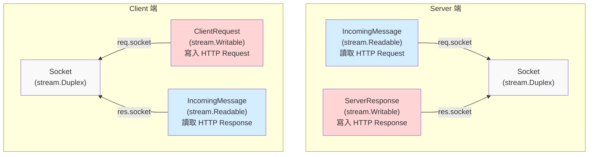
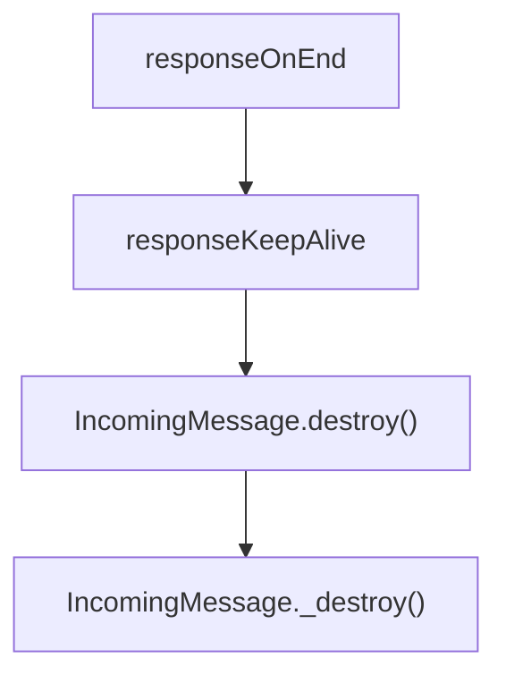

## 非對稱的設計: destroy

Node.js 官方文件在描述 `destroy([error])` 跟 `destroyed` 時，並沒有把所有情境都列出來

- destroy([error])
  - [clientRequest.destroy([error])](https://nodejs.org/docs/latest-v24.x/api/http.html#requestdestroyerror)
  - serverResponse.destroy([error]) => 官方文件沒列出，但實際上有這個 method
  - [outgoingMessage.destroy([error])](https://nodejs.org/docs/latest-v24.x/api/http.html#outgoingmessagedestroyerror)
  - [incomingMessage.destroy([error])](https://nodejs.org/docs/latest-v24.x/api/http.html#messagedestroyerror)
- destroyed
  - [clientRequest.destroyed](https://nodejs.org/docs/latest-v24.x/api/http.html#requestdestroyed)
  - serverResponse.destroyed => 官方文件沒列出，但實際上有這個 property
  - outgoingMessage.destroyed => 官方文件沒列出，但實際上有這個 property
  - incomingMessage.destroyed => 官方文件沒列出，但實際上有這個 property

我們複習一下 stream, Socket, http 的繼承關係



- Socket 是一個可讀寫的資料流，但 http 模組刻意將讀、寫分成兩個抽象 Class（[IncomingMessage](https://nodejs.org/docs/latest-v24.x/api/http.html#class-httpincomingmessage), [OutgoingMessage](https://nodejs.org/docs/latest-v24.x/api/http.html#class-httpoutgoingmessage)）
- 也因此，`request.socket` 跟 `response.socket` 必定為同一個 socket instance
- 不管是 request 還是 response 呼叫 `destroy([error])`，背後都有可能會呼叫到對應的 `socket.destroy([error])`

## IncomingMessage autoDestroy

根據 [IncomingMessage 的 History](https://nodejs.org/docs/latest-v24.x/api/http.html#class-httpincomingmessage)

| Version | Changes                                                                   |
| ------- | ------------------------------------------------------------------------- |
| v15.5.0 | The `destroyed` value returns `true` after the incoming data is consumed. |

`IncomingMessage` 繼承 `stream.Readable`，而 [new stream.Readable([options])](https://nodejs.org/api/stream.html#new-streamreadableoptions)

- `autoDestroy`: Whether this stream should automatically call `.destroy()` on itself after ending. Default: `true`.

並且我也在 Github 翻到了 v15.5.0 這個改動

- PR: [http: use `autoDestroy: true` in incoming message](https://github.com/nodejs/node/pull/33035/changes)
- Issue: [[Bug] `http.IncomingMessage.destroyed` is `true` after payload read since v15.5.0](https://github.com/nodejs/node/issues/36617)

對於 `IncomingMessage` 的生命週期，讀完 HTTP Request / Response，其任務已經達成，故標記為 `destroyed: true` 是合理的

寫個 PoC 來測試

```ts
httpServer.on("request", (req, res) => {
  req.resume();
  // ✅ Server 的 IncomingMessage 在讀完資料後，會自動把 destroyed 設為 true
  req.on("end", () => nextTick(() => assert(req.destroyed)));
  res.end("123");
});

const clientRequest = http.request({
  host: "localhost",
  port: 5000,
  method: "POST",
});
clientRequest.end("123");
clientRequest.on("response", (res) => {
  res.resume();
  // ✅ Client 的 IncomingMessage 在讀完資料後，會自動把 destroyed 設為 true
  res.on("end", () => nextTick(() => assert(res.destroyed)));
});
```

不過 HTTP/1.1 預設是 [keepAlive](../http/keep-alive-and-connection.md)，Socket 會重複使用。若 `autoDestroy` 的話，就有可能會呼叫 `socket.destroy([error])`，Node.js 是怎麼避免這件事情的呢？以 http client 為例子，我們直接看 Node.js 原始碼：

```ts
// lib/_http_client.js
function responseOnEnd() {
  // if 條件省略

  else if (req.writableFinished && !this.aborted) {
    assert(req.finished);
    responseKeepAlive(req);
  }
}

function responseKeepAlive(req) {
  // ... 前面省略

  req.destroyed = true;
  if (req.res) {
    // Detach socket from IncomingMessage to avoid destroying the freed
    // socket in IncomingMessage.destroy().
    req.res.socket = null;
  }
}
```

```ts
// lib/_http_incoming.js
IncomingMessage.prototype._destroy = function _destroy(err, cb) {
  // ... 前面省略

  if (this.socket && !this.socket.destroyed && this.aborted) {
    this.socket.destroy(err);

    // ... 以下省略
  }
```

其實連註解都有說，要在 `IncomingMessage.destroy()` 之前把 `req.res.socket` 設成 `null`，確保不會執行到 `socket.destroy()`

function 的執行順序如下：



在 http client 端，response body 完整接收後，這個 HTTP Round Trip 已結束，Socket 的 ownership 必須立刻回到 `Agent.freeSockets`，因此 Node.js 會主動執行 `req.res.socket = null`

但 http server 端，request body 完整接收後，此時 response 通常還沒完整送出，user program 可能還需要存取 `request.socket`，所以 Socket 會等到 `response.on('finish')` 之後才會被解除關聯，直接來看 Node.js 原始碼：

```ts
// lib/_http_server.js
function resOnFinish(req, res, socket, state, server) {
  // ...以上省略
  res.detachSocket(socket);
  clearIncoming(req);
  // ...以下省略
}

ServerResponse.prototype.detachSocket = function detachSocket(socket) {
  assert(socket._httpMessage === this);
  socket.removeListener("close", onServerResponseClose);
  socket._httpMessage = null;
  this.socket = null;
};
```

寫個 PoC 來測試

```ts
httpServer.on("request", (req, res) => {
  req.resume();
  // ✅ Server 的 IncomingMessage 在讀完資料後，會自動把 destroyed 設為 true
  req.on("end", () => nextTick(() => assert(req.destroyed)));
  // ✅ Server 的 Socket 在 HTTP Round Trip 結束後，會自動解除關聯
  res.on("finish", () => assert(res.socket === null));
  res.end("123");
});

const clientRequest = http.request({
  host: "localhost",
  port: 5000,
  method: "POST",
});
clientRequest.end("123");
clientRequest.on("response", (res) => {
  res.resume();
  res.on("end", () => {
    // ✅ Client 的 Socket 在 HTTP Round Trip 結束後，會自動解除關聯
    assert(res.socket === null);
    // ✅ Client 的 IncomingMessage 在讀完資料後，會自動把 destroyed 設為 true
    nextTick(() => assert(res.destroyed));
  });
});
```

## IncomingMessage.destroy([error])

我們現在知道 `IncomingMessage` 繼承了 `Readable`，且 `Readable.on("end")` 之後，預設會 `autoDestroy`，那 user program 要呼叫 `IncomingMessage.destroy([error])` 的合理時間點就是 "資料讀完之前，我不想再接著讀了"。

寫個 PoC 來實測 http server 的 `IncomingMessage`

```ts
httpServer.on("request", (req, res) => {
  req.destroy();
  assert(req.socket.destroyed);
  assert(res.socket?.destroyed);
  res.end("123"); // ❌ noop
});
```

用 `curl http://localhost:5000` 測試，結果是沒收到任何回應，因為 Socket 已經被 destroy 了

```
curl: (52) Empty reply from server
```

寫個 PoC 來實測 http client 的 `IncomingMessage`

```ts
const clientRequest = http.request({
  host: "example.com",
  port: 80,
});
clientRequest.end();
clientRequest.on("response", (res) => {
  res.destroy();
  assert(clientRequest.socket?.destroyed);
  assert(res.socket.destroyed);
});
clientRequest.on("error", (e) => {
  assert(e instanceof Error);
  assert(e.message === "socket hang up");
  assert((e as any).code === "ECONNRESET");
});
```

至於為何會需要在 `clientRequest` 捕捉錯誤，直接看 Node.js 原始碼

```ts
// lib/_http_client.js

function socketOnEnd() {
  // 以上省略
  if (!req.res && !req.socket._hadError) {
    // If we don't have a response then we know that the socket
    // ended prematurely and we need to emit an error on the request.
    req.socket._hadError = true;
    emitErrorEvent(req, new ConnResetException("socket hang up"));
  }
  // 以下省略
}
```

## 為何 http client 有 "socket hang up" 這個錯誤 ?

| 呼叫 `clientRequest.destroy()` 的時機點 | 解釋                                                                                                    |
| --------------------------------------- | ------------------------------------------------------------------------------------------------------- |
| http client 的 response 已經收到        | ✅ Node.js 已經建立 HTTP response (`IncomingMessage`)<br/>接下來是 user program 的職責                  |
| http client 的 response 尚未建立        | ❌ Node.js 尚未建立 HTTP response (`IncomingMessage`)<br/>就被切斷 Socket 連線，故拋出 "socket hang up" |

## destroy 小結

| 你想做的事                               | 正確 API           |
| ---------------------------------------- | ------------------ |
| server 不想讀 request body，但要正常回應 | `req.resume()`     |
| client 不想讀 response body，但要成功    | `res.resume()`     |
| 任一方放棄整個 HTTP 流程                 | `destroy([error])` |

<!-- | Role                                     | Meaning of `destroy()` |
| ---------------------------------------- | -------------------- |
| http client's request (ClientRequest)    | Abort the request or stop reading response |
| http client's response (IncomingMessage) | Stop reading response body |
| http server's request (IncomingMessage)  | Stop reading request |
| http server's response (ServerResponse)  | Stop sending response | -->

<!-- ## ClientRequest 在不同階段呼叫 destroy() 的語意差異
```mermaid
sequenceDiagram
  participant A as ClientRequest
  participant B as Request Sent<br/>ClientRequest.end()
  participant C as Response Receiving<br/>ClientRequest.on('response')
  participant D as Response Body Fully Sent<br/>IncomingMessage.on('end')

  Note Over A,B:  abort the request
  Note Over C,D: stop reading response body
``` -->

<!-- ## http client's IncomingMessage 在不同階段呼叫 destroy() 的語意差異
```mermaid
sequenceDiagram
  participant A as http client's IncomingMessage
  participant B as Response Receiving<br/>ClientRequest.on('response')
  participant C as Response Body Fully Sent<br/>IncomingMessage.on('end')

  Note Over B,C: stop reading response body
``` -->

<!-- ## ClientRequest.destroy([error]) -->
