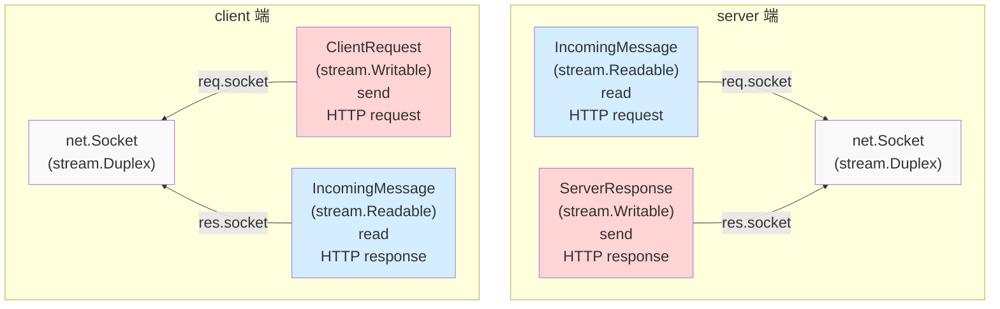

## 非對稱的官方文件

Node.js 官方文件在描述 `destroy([error])` 跟 `destroyed` 時，並沒有把所有情境都列出來

- `destroy([error])`
  - [clientRequest.destroy([error])](https://nodejs.org/docs/latest-v24.x/api/http.html#requestdestroyerror)
  - `serverResponse.destroy([error])` => 官方文件沒列出，但實際上有這個 method
  - [outgoingMessage.destroy([error])](https://nodejs.org/docs/latest-v24.x/api/http.html#outgoingmessagedestroyerror)
  - [incomingMessage.destroy([error])](https://nodejs.org/docs/latest-v24.x/api/http.html#messagedestroyerror)
- `destroyed`
  - [clientRequest.destroyed](https://nodejs.org/docs/latest-v24.x/api/http.html#requestdestroyed)
  - `serverResponse.destroyed` => 官方文件沒列出，但實際上有這個 property
  - `outgoingMessage.destroyed` => 官方文件沒列出，但實際上有這個 property
  - `incomingMessage.destroyed` => 官方文件沒列出，但實際上有這個 property

我們複習一下 `stream`、`net.Socket` 跟 `http` 的繼承關係



<!--  -->

- `net.Socket` 是一個可讀寫的資料流，但 `http` 模組刻意將讀、寫分成兩個抽象 Class（[IncomingMessage](https://nodejs.org/docs/latest-v24.x/api/http.html#class-httpincomingmessage), [OutgoingMessage](https://nodejs.org/docs/latest-v24.x/api/http.html#class-httpoutgoingmessage)）
- 也因此，`req.socket` 跟 `res.socket` 必定為同一個 socket instance
- 不管是 request 還是 response 呼叫 `destroy([error])`，背後都會呼叫到同一個 socket instance 的 `destroy([error])`

## `IncomingMessage` `autoDestroy` 歷史

根據 `IncomingMessage` 官方文件的 [History](https://nodejs.org/docs/latest-v24.x/api/http.html#class-httpincomingmessage)

| Version | Changes                                                                   |
| ------- | ------------------------------------------------------------------------- |
| v15.5.0 | The `destroyed` value returns `true` after the incoming data is consumed. |

`IncomingMessage` 繼承 `stream.Readable`，而 [new stream.Readable([options])](https://nodejs.org/api/stream.html#new-streamreadableoptions)

- `autoDestroy`: Whether this stream should automatically call `.destroy()` on itself after ending. Default: `true`.

並且我也在 Github 翻到了 v15.5.0 這個改動

- PR：[http: use `autoDestroy: true` in incoming message](https://github.com/nodejs/node/pull/33035/changes)
- issue：[[Bug] `http.IncomingMessage.destroyed` is `true` after payload read since v15.5.0](https://github.com/nodejs/node/issues/36617)

對於 `IncomingMessage` 的生命週期，讀完 HTTP request / response，其任務已經達成，故標記為 `destroyed: true` 是合理的

## `IncomingMessage` `autoDestroy` 測試

寫個 PoC 來測試

```ts
import http from "http";

const httpServer = http.createServer();
httpServer.listen(5000);
httpServer.on("request", (req, res) => {
  req.resume();
  // ✅ server 的 IncomingMessage 在讀完資料後，會自動把 destroyed 設為 true
  req.on("end", () => nextTick(() => assert(req.destroyed)));
  res.end("123");
});

const clientRequest = http.request({
  host: "localhost",
  port: 5000,
  method: "POST",
});
clientRequest.end("123");
clientRequest.on("response", (res) => {
  res.resume();
  // ✅ client 的 IncomingMessage 在讀完資料後，會自動把 destroyed 設為 true
  res.on("end", () => nextTick(() => assert(res.destroyed)));
});
```

## `IncomingMessage._destroy` 原始碼

其實就是呼叫 `IncomingMessage.socket.destroy(err)`，沒有額外實作太多東西

```ts
// lib/_http_incoming.js
IncomingMessage.prototype._destroy = function _destroy(err, cb) {
  // ... 前面省略

  if (this.socket && !this.socket.destroyed && this.aborted) {
    this.socket.destroy(err);

    // ... 以下省略
  }
};
```

## `IncomingMessage` `autoDestroy` 誤殺 socket？

HTTP/1.1 預設是 [keepAlive](../http/keep-alive-and-connection.md)，`net.Socket` 會重複在多個 HTTP request / response 使用

若 `autoDestroy = true` 的話，理論上會呼叫到 `socket.destroy([error])`

Node.js 是怎麼避免這件事情的呢？以 HTTP client 為例子，我們直接看 Node.js 原始碼：

```ts
// lib/_http_client.js
function responseOnEnd() {
  // if 條件省略

  else if (req.writableFinished && !this.aborted) {
    assert(req.finished);
    responseKeepAlive(req);
  }
}

function responseKeepAlive(req) {
  // ... 前面省略

  req.destroyed = true;
  if (req.res) {
    // ✅ 重點在 Node.js 的這段註解
    // Detach socket from IncomingMessage to avoid destroying the freed
    // socket in IncomingMessage.destroy().
    req.res.socket = null;
  }
}
```

以 HTTP server 為例子，我們直接看 Node.js 原始碼是怎麼防止 `autoDestroy` 誤殺 socket 的

```ts
// lib/_http_incoming.js
IncomingMessage.prototype._destroy = function _destroy(err, cb) {
  // ... 前面省略

  // ✅ request body 正常結束 => aborted = false => 不會進入 if 條件
  if (this.socket && !this.socket.destroyed && this.aborted) {
    this.socket.destroy(err);

    // ... 以下省略
  }
};
```

## `IncomingMessage.destroy([error])` 呼叫時機

我們現在知道

- `IncomingMessage` 繼承了 `stream.Readable`
- `readable.on("end")` 之後，預設會 `autoDestroy`
- user program 要呼叫 `IncomingMessage.destroy([error])` 的合理時間點就是 **"資料讀完之前，我不想再接著讀了"**

### server side 實測

server

```ts
import http from "http";

const httpServer = http.createServer();
httpServer.listen(5000);
httpServer.on("request", (req, res) => {
  req.destroy();
  assert(req.socket.destroyed); // ✅
  assert(res.socket.destroyed); // ✅
  res.end("123"); // ❌ noop
});
```

client 用 `curl http://localhost:5000` 測試，結果是沒收到任何回應，因為 `net.Socket` 已經被 destroy 了

```
curl: (52) Empty reply from server
```

### client side 實測

client

```ts
import http from "http";

const clientRequest = http.request({
  host: "example.com",
  port: 80,
});
clientRequest.end();
clientRequest.on("response", (res) => {
  res.destroy();
  assert(clientRequest.socket.destroyed); // ✅
  assert(res.socket.destroyed); // ✅
});
clientRequest.on("error", (e) => {
  assert(e instanceof Error); // ✅
  assert(e.message === "socket hang up"); // ✅
  assert((e as any).code === "ECONNRESET"); // ✅
});
```

至於為何會需要在 `ClientRequest` 捕捉錯誤，直接看 Node.js 原始碼

```ts
// lib/_http_client.js

function socketOnEnd() {
  // 以上省略
  if (!req.res && !req.socket._hadError) {
    // If we don't have a response then we know that the socket
    // ended prematurely and we need to emit an error on the request.
    req.socket._hadError = true;
    emitErrorEvent(req, new ConnResetException("socket hang up"));
  }
  // 以下省略
}
```

## 小結：這 API 設計真的很反直覺

我們一路從 `EventEmitter`、`stream`、`net.Socket` 讀到 `http`，我們知道

- `stream.Readable` / `stream.Writable` 各自有 `destroy([error])`，這是 `stream` 抽象層給的能力
- `ClientRequest`、`ServerResponse` 跟 `IncomingMessage` 繼承了上述兩者，所以必須實作 `destroy([error])`

  |        | request Class                             | response Class                            |
  | ------ | ----------------------------------------- | ----------------------------------------- |
  | client | `ClientRequest`<br/>(`stream.Writable`)   | `IncomingMessage`<br/>(`stream.Readable`) |
  | server | `IncomingMessage`<br/>(`stream.Readable`) | `ServerResponse`<br/>(`stream.Writable`)  |

- 但 HTTP 的 request 跟 response 並非完全獨立，而是部份耦合的
  - 以 client 的角度，若把傳輸中的 request 殺掉，那 response 還有必要留著嗎？
  - 以 server 的角度，若把傳輸中的 response 殺掉，那 request 還有必要留著嗎？
- `stream` 的抽象假設讀跟寫可以獨立生死，但 HTTP 語意上它們是綁定的一筆交易
- 結果就是「看起來每個物件都能獨立 destroy，實際上呼叫誰，都有可能造成全滅」
