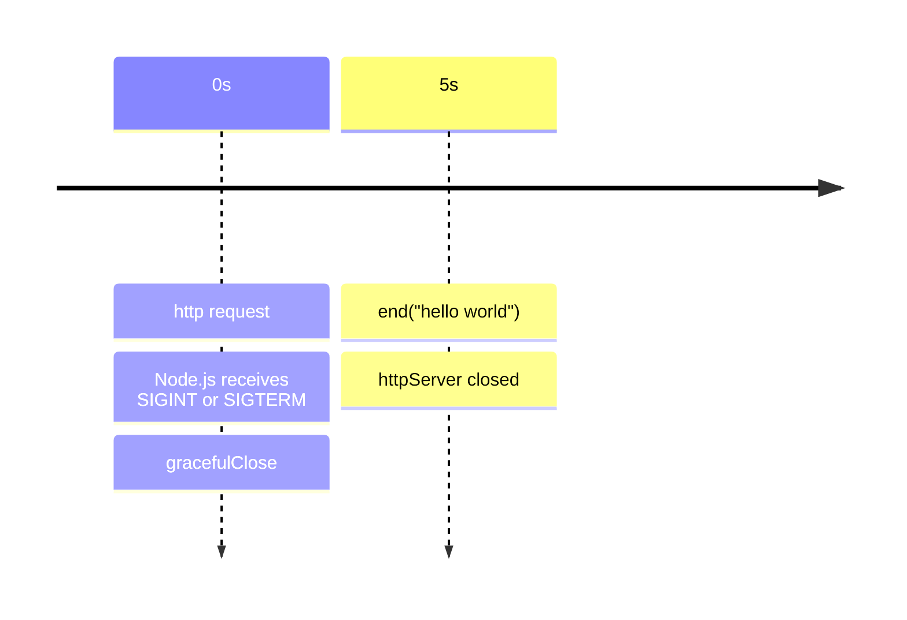
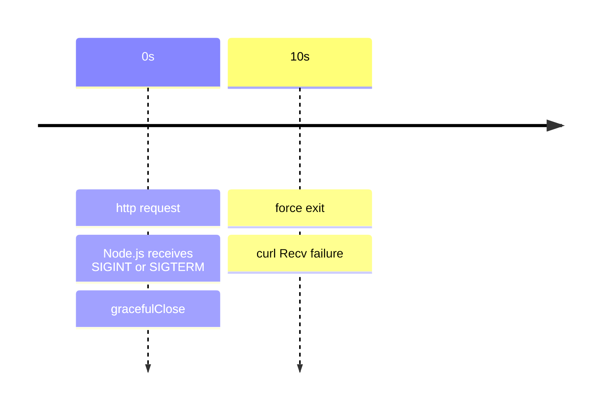

## 前言

本機開發都是直接 Ctrl + C 去砍 Node.js process，所以對於 graceful shutdown http server 無感。但如果是 production 環境的 http server，每個 http request 都代表資料庫的 CRUD，中斷就有可能造成不可預期的後果，所以如何優雅的關閉 server 也是一門學問！

## methods

Node.js 提供以下 methods 來關閉 `http.Server`

- [server.close([callback])](https://nodejs.org/docs/latest-v24.x/api/http.html#serverclosecallback)
- [server.closeAllConnections()](https://nodejs.org/docs/latest-v24.x/api/http.html#servercloseallconnections)
- [server.closeIdleConnections()](https://nodejs.org/docs/latest-v24.x/api/http.html#servercloseidleconnections)

## Cheat Sheet

| method                        | Description                                                                        |
| ----------------------------- | ---------------------------------------------------------------------------------- |
| server.close([callback])      | ✅ Graceful shutdown.                                                              |
| server.closeAllConnections()  | ❌ Destroy all sockets immediately.<br/>Use with caution.                          |
| server.closeIdleConnections() | ✅ Graceful shutdown.<br/>Call this function after<br/>`server.close([callback]) ` |

## 研究官方文件 & 原始碼

再來看看官方文件對於 `server.close([callback])` 的描述：

```
Stops the server from accepting new connections and closes all connections connected to this server which are not sending a request or waiting for a response.
```

搭配原始碼服用，直接看看背後做了哪些事情

`server.close([callback])`

```ts
Server.prototype.close = function close() {
  httpServerPreClose(this);
  ReflectApply(net.Server.prototype.close, this, arguments);
  return this;
};

function httpServerPreClose(server) {
  server.closeIdleConnections();
  clearInterval(server[kConnectionsCheckingInterval]);
}
```

`server.closeIdleConnections()`

```ts
Server.prototype.closeIdleConnections = function closeIdleConnections() {
  if (!this[kConnections]) {
    return;
  }

  const connections = this[kConnections].idle();

  for (let i = 0, l = connections.length; i < l; i++) {
    if (
      connections[i].socket._httpMessage &&
      !connections[i].socket._httpMessage.finished
    ) {
      continue;
    }

    connections[i].socket.destroy();
  }
};
```

`server.closeAllConnections()`

```ts
Server.prototype.closeAllConnections = function closeAllConnections() {
  if (!this[kConnections]) {
    return;
  }

  const connections = this[kConnections].all();

  for (let i = 0, l = connections.length; i < l; i++) {
    connections[i].socket.destroy();
  }
};
```

## 優雅的關閉 http.Server

實務上在寫 production http server 時，通常都會處理優雅關閉 server 的邏輯：

```ts
// http server
const httpServer = http.createServer();
httpServer.listen(5000);
httpServer.on("request", (req, res) => {
  // 模擬延遲
  setTimeout(() => res.end("hello world"), 5000);
});

let closed = false;
function gracefulClose() {
  // 確保 gracefulClose 只被執行一次
  if (closed) return;
  closed = true;

  // 主邏輯
  httpServer.close(() => {
    console.log("httpServer closed");
    process.exit(0);
  });
  httpServer.closeIdleConnections();

  // 避免惡意 client 掛著連線導致 process 永遠不結束，設定 10 秒的 timeout
  const timeout = setTimeout(() => {
    console.error("force exit");
    process.exit(1);
  }, 10000);
  // 若 10 秒內就 close，別讓 timeout 掛著 Node.js process event loop
  timeout.unref();
}
// 通常是 Ctrl + C
process.once("SIGINT", gracefulClose);
// Termination signal
process.once("SIGTERM", gracefulClose);
```

假設在 process `SIGINT` 或 `SIGTERM` 之前，剛好有個 http request 正在處理中，預期的時間軸如下



用 `curl http://localhost:5000` 實測

- curl 的 terminal 會收到 hello world
- Node.js 的 terminal 會收到 httpServer closed

將 http server 的 timeout 改成 20 秒

```ts
httpServer.on("request", (req, res) => {
  // 模擬延遲
  setTimeout(() => res.end("hello world"), 20000);
});
```

預期的時間軸如下



用 `curl http://localhost:5000` 實測

- curl 的 terminal 會收到 "curl: (56) Recv failure: Connection was reset"
- Node.js 的 terminal 會收到 "force exit"

<!-- todo-yus 內容太少 -->
