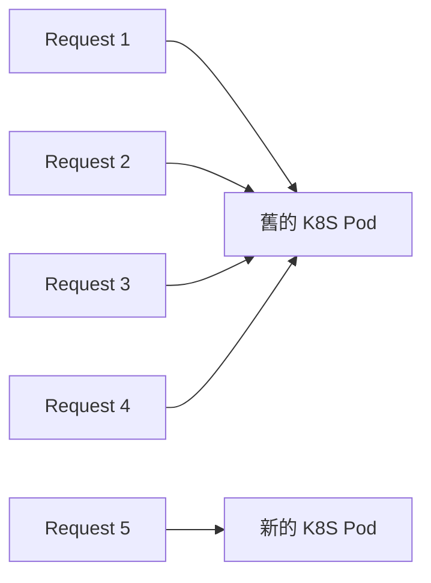
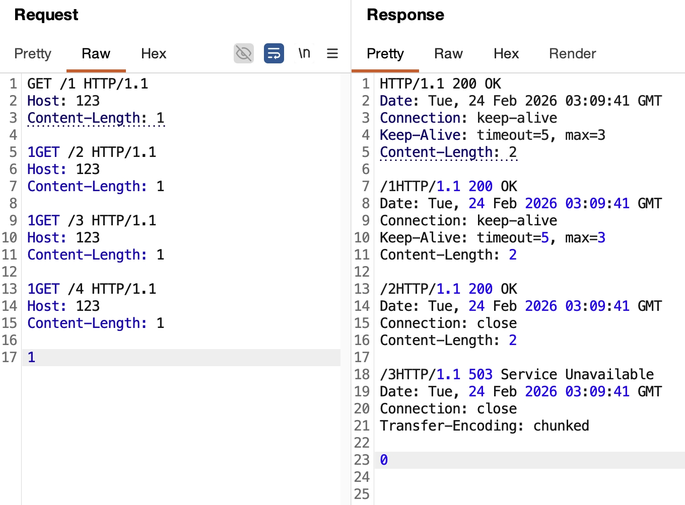

## 限制每個 TCP Socket 最多能處理的 HTTP Requests

- [server.maxRequestsPerSocket](https://nodejs.org/docs/latest-v24.x/api/http.html#servermaxrequestspersocket)
- [server.on('droprequest')](https://nodejs.org/docs/latest-v24.x/api/http.html#event-droprequest)

我看了這個 feature 的歷史原因，覺得蠻有趣的

- [Issue: Max requests per socket](https://github.com/nodejs/node/issues/40071)
- [PR: Limit requests per connection](https://github.com/nodejs/node/pull/40082)

簡單來說，由於 HTTP/1.1 KeepAlive 的特性，會盡可能的使用已經建立好的 TCP Connection，導致舊的 K8S Pod 一直處於 High CPU Usage，而新的 K8S Pod 則沒辦法分散流量。限制 `maxRequestsPerSocket` 之後，就可以讓老舊的 TCP Connection 關閉，從而達到負載均衡。



架個 http server 試試看

```ts
const httpServer = http.createServer();
httpServer.maxRequestsPerSocket = 3;
httpServer.listen(5000);
httpServer.on("request", (req, res) => {
  res.end(req.url);
});
```

用 [HTTP/1.1 pipeline](../http/http-1.1-pipelining-and-hol-blocking.md) 的概念，發送以下 raw HTTP Requests

```ts
GET /1 HTTP/1.1
Host: 123
Content-Length: 1

1GET /2 HTTP/1.1
Host: 123
Content-Length: 1

1GET /3 HTTP/1.1
Host: 123
Content-Length: 1

1GET /4 HTTP/1.1
Host: 123
Content-Length: 1

1
```

- 第 1,2 個 Response Header 有 `Keep-Alive: timeout=5, max=3`
- 第 3 個 Response Header 則會有 `Connection: close`，但此時還不會真的關閉連線
- 第 4 個 Response 開始，則一律回傳 `503 Service Unavailable`
  

:::info
`Keep-Alive: timeout=5, max=3` 屬於 "歷史遺留的非標準擴充"，詳細請參考 [RFC 2068 Section 19.7.1.1](https://datatracker.ietf.org/doc/html/rfc2068#section-19.7.1.1)
:::

若 user program 想要在 `503 Service Unavailable` 之前加上一些監控的邏輯，可以使用 `server.on('droprequest')`

```ts
httpServer.on("dropRequest", (req, socket) => {
  // 監控是否為惡意 User-Agent
  console.log(req.headers["user-agent"]);
  // ❌ 不建議使用 socket.write, socket.destroy, socket.end 等等會影響 socket 狀態機的操作
  // 因爲 Node.js 會幫忙回 `503 Service Unavailable`
});
```

<!-- todo-yus 內容太少, 分段落 -->
