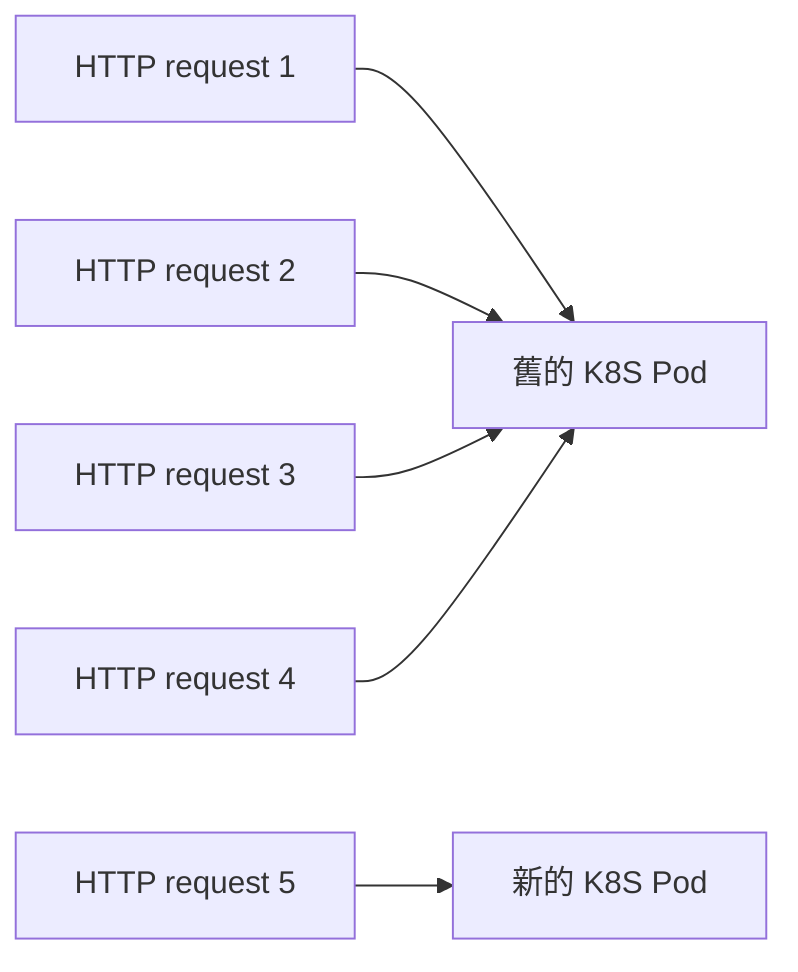

## 歷史原因

我看了這個 feature 的歷史原因，覺得蠻有趣的

- [issue: Max requests per socket](https://github.com/nodejs/node/issues/40071)
- [PR: Limit requests per connection](https://github.com/nodejs/node/pull/40082)

簡單來說，由於 [http.Agent](./http-agent.md) 跟 HTTP/1.1 KeepAlive 的特性，HTTP client **"通常"** 會盡可能的使用已經建立好的 TCP connection，導致舊的 K8S Pod 一直處於 High CPU Usage，而新的 K8S Pod 則沒辦法分散流量。設定 `maxRequestsPerSocket` 之後，就可以讓老舊的 TCP connection 關閉，從而達到負載均衡。



<!-- ## 限制每個 TCP socket 最多能處理的 HTTP request 數量

- [server.maxRequestsPerSocket](https://nodejs.org/docs/latest-v24.x/api/http.html#servermaxrequestspersocket)
- [server.on("droprequest")](https://nodejs.org/docs/latest-v24.x/api/http.html#event-droprequest) -->

## `maxRequestsPerSocket` 實測

server 設定 `maxRequestsPerSocket = 3`

```ts
const httpServer = http.createServer();
httpServer.maxRequestsPerSocket = 3;
httpServer.listen(5000);
httpServer.on("request", (req, res) => res.end(req.url));
```

client 用 [HTTP/1.1 pipeline](../http/http-1.1-pipelining-hol-blocking-vs-request-smuggling.md) 的概念，發送 4 個 raw HTTP requests

```ts
GET /1 HTTP/1.1
Host: 123
Content-Length: 1

1GET /2 HTTP/1.1
Host: 123
Content-Length: 1

1GET /3 HTTP/1.1
Host: 123
Content-Length: 1

1GET /4 HTTP/1.1
Host: 123
Content-Length: 1

1
```

- 第 1,2 個 response header 有 `Keep-Alive: timeout=5, max=3`
- 第 3 個 response header 則會有 `Connection: close`，但此時還不會真的關閉連線
- 第 4 個 response 開始，則一律回傳 `503 Service Unavailable`

```
HTTP/1.1 200 OK
Connection: keep-alive
Keep-Alive: timeout=5, max=3
Content-Length: 2

/1HTTP/1.1 200 OK
Connection: keep-alive
Keep-Alive: timeout=5, max=3
Content-Length: 2

/2HTTP/1.1 200 OK
Connection: close
Content-Length: 2

/3HTTP/1.1 503 Service Unavailable
Connection: close
Transfer-Encoding: chunked

0


```

:::info
`Keep-Alive: timeout=5, max=3` 屬於 "歷史遺留的非標準擴充"，詳細請參考 [RFC 2068 Section 19.7.1.1](https://datatracker.ietf.org/doc/html/rfc2068#section-19.7.1.1)
:::

## `on("dropRequest")`

若 user program 想要在 server 回傳 503 Service Unavailable 之前加上一些監控的邏輯，可以使用 `server.on("dropRequest")`

```ts
httpServer.on("dropRequest", (req, socket) => {
  // 監控是否為惡意 User-Agent
  console.log(req.headers["user-agent"]);
  // ❌ 不建議使用 socket.write, socket.destroy, socket.end 等等會影響 socket 狀態機的操作
  // 因爲 Node.js 會幫忙回 503 Service Unavailable
});
```

## 小結

在這篇文章，我們學到了

- KeepAlive 連線會被 client 重複使用，可能導致舊 Pod 流量過載、新 Pod 分不到流量
- 承上，`maxRequestsPerSocket` 可以強制汰換掉老舊的 TCP connection
- 當一條 socket 處理到第 `maxRequestsPerSocket` 個 request 時，response header 會先帶上 `Connection: close`，但不會馬上斷線
- 超過 `maxRequestsPerSocket` 之後的 request，一律回傳 `503 Service Unavailable`
- 可以透過 `on("dropRequest")` 在 503 回傳前加上監控邏輯，但不該在裡面手動操作 socket 的狀態機
