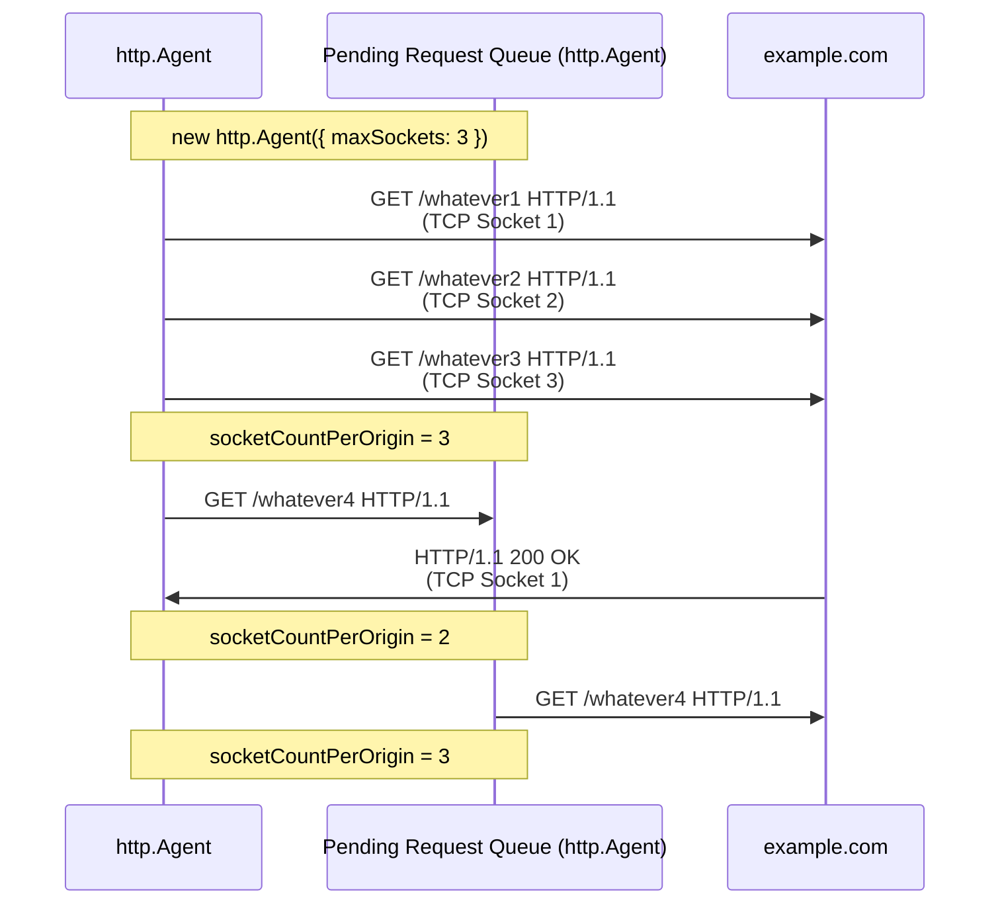
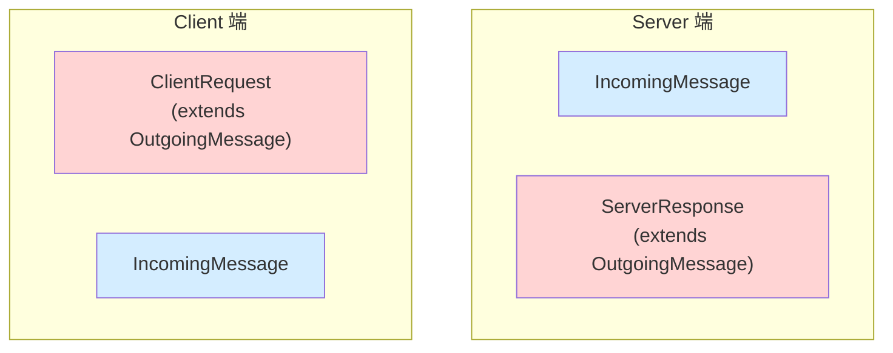
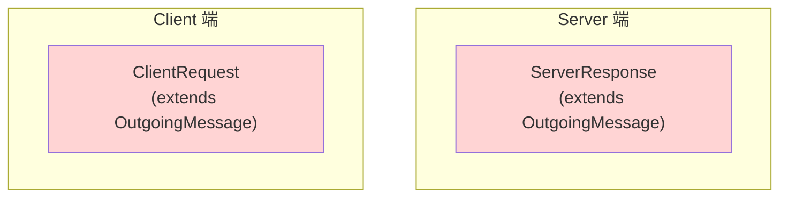
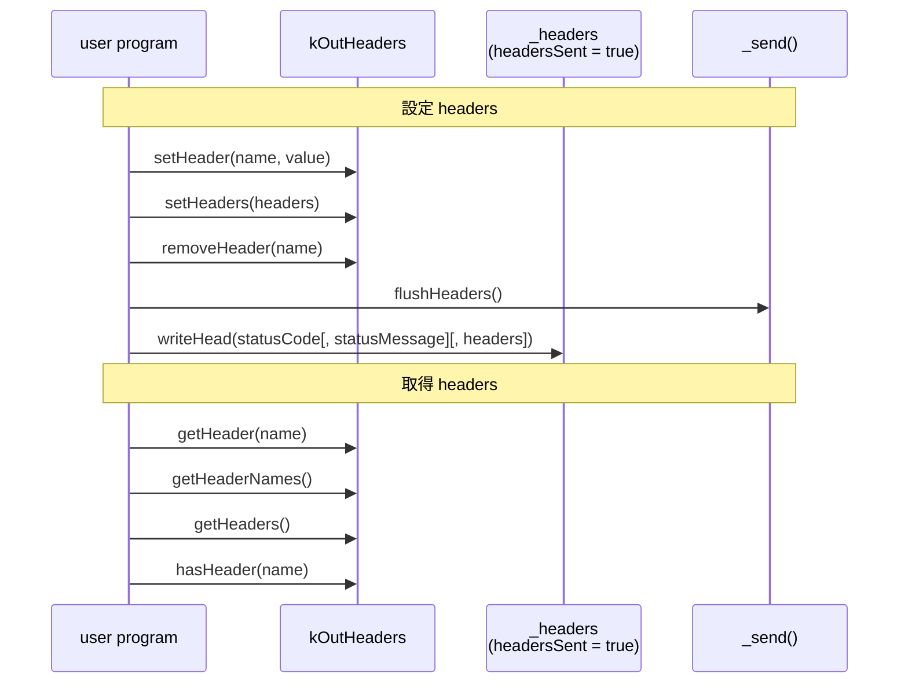
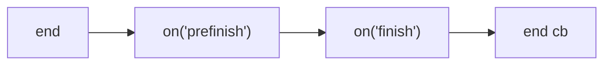

## 前言

我們有了以下知識

- [EventEmitter](./events.md)
- [stream-overview](./stream-overview.md)
- [stream.Readable](./stream-readable.md)
- [stream.Writable](./stream-writable.md)
- [socket-overview](./socket-overview.md)
- [socket-life-cycle](./socket-life-cycle.md)

終於可以進到 Node.js http 模組了！

## http.Agent

### Why http.Agent ?

如果沒有 [http.Agent](https://nodejs.org/api/http.html#class-httpagent) 的話

```ts
// Server
const server = http.createServer((req, res) => {
  console.log("req.headers", req.headers);
  res.end();
});
server.listen(5000);

// Client
const noop = () => {};
const request = http.request({
  host: "localhost",
  port: 5000,
  path: "/",
  agent: false, // ✅
});
request.end();
request.on("response", (res) => {
  console.log("res.headers", res.headers);
  res.resume();
  res.on("end", noop);
});
```

從 log 的 [Connection: close](../http/keep-alive-and-connection.md) 可以得出結論：每次 HTTP Round Trip 結束，都會關閉 TCP 連線

```ts
req.headers { host: 'localhost:5000', connection: 'close' }
res.headers {
  date: 'Fri, 06 Feb 2026 01:33:20 GMT',
  connection: 'close',
  'content-length': '0'
}
```

從 TCP (layer 4) 的角度來看，每次都需要
<span style={{ color: "red" }}>"三次交握開啟連線"</span> + <span style={{ color: "green" }}>"四次交握關閉連線"</span>，效能上會比較差


http.Agent 為此而生，它幫使用者管理

- TCP Socket 連線池
- concurrent 連線上限

<!-- Node.js 使用 [http.request](https://nodejs.org/api/http.html#httprequestoptions-callback) 發起 HTTP Request 時，若沒有使用 [http.Agent](https://nodejs.org/api/http.html#class-httpagent)，則每個請求都會創建一個新的 TCP 連線，並且該連線傳輸完這個 HTTP Request 就會關閉。若從 TCP (Layer 4) 的角度來看，每次都需要三次交握開啟連線 + 四次交握關閉連線，效能上會比較差。所以，管理 TCP Socket 連線池就成了一門學問，http.Agent 正是為此而生（當然 http.Agent 能做到的不止是管理 TCP Socket 連線池）。 -->

### new http.Agent(options)

https://nodejs.org/api/http.html#new-agentoptions

<!-- todo-yus 測試 -->

| option                      | description                                                                                                                                                                                                                 |
| --------------------------- | --------------------------------------------------------------------------------------------------------------------------------------------------------------------------------------------------------------------------- |
| keepAlive                   | Keep sockets around even when there are no outstanding requests,<br/>so they can be used for future requests without having to reestablish a TCP connection.                                                                |
| keepAliveMsecs              | 同 [net.createServer](https://nodejs.org/api/net.html#netcreateserveroptions-connectionlistener) 的 `keepAliveInitialDelay`                                                                                                 |
| agentKeepAliveTimeoutBuffer | 假設 Server 設定 `keep-alive: timeout=3`<br/>Agent 設定 `agentKeepAliveTimeoutBuffer = 1000`<br/>那 Agent 會在 3 \* 1000 - 1000 = 2 秒後，將這個連線視為過期<br/>為了避免 Client 還想傳送資料，但 Server 已經要關閉這條連線 |
| maxSockets                  | 每個 Origin 最多可以有幾個 concurrent TCP Socket<br/>參考 [options.maxSockets 圖解](#optionsmaxsockets-圖解)<br/>(Origin 是 [agent.getName([options])](https://nodejs.org/api/http.html#agentgetnameoptions) 的回傳值)      |
| maxTotalSockets             | 最多可以有幾個 concurrent TCP Socket                                                                                                                                                                                        |
| maxFreeSockets              | Only works when `keepAlive = true`                                                                                                                                                                                          |
| scheduling                  | 要如何從陣列中選擇 free Socket<br/>- fifo (First In First Out)<br/>- lifo (Last In First Out)                                                                                                                               |
| timeout                     | 同 [socket.timeout](https://nodejs.org/api/net.html#sockettimeout)                                                                                                                                                          |
| proxyEnv                    | v24.5.0 加入的，暫不討論                                                                                                                                                                                                    |
| defaultPort                 | Default port to use when the port is not specified in requests.                                                                                                                                                             |
| protocol                    | The protocol to use for the agent.                                                                                                                                                                                          |

### methods

| method                                                                                                          | description                                                                                                                                      |
| --------------------------------------------------------------------------------------------------------------- | ------------------------------------------------------------------------------------------------------------------------------------------------ |
| [createConnection(options[, callback])](https://nodejs.org/api/http.html#agentcreateconnectionoptions-callback) | 同 [net.createConnection()](https://nodejs.org/api/net.html#netcreateconnection)<br/>❌ 正常使用者不會碰到它<br/>有需要客製化行為才需要 override |
| [keepSocketAlive(socket)](https://nodejs.org/api/http.html#agentkeepsocketalivesocket)                          | ❌ 正常使用者不會碰到它<br/>有需要客製化行為才需要 override                                                                                      |
| [reuseSocket(socket, request)](https://nodejs.org/api/http.html#agentreusesocketsocket-request)                 | ❌ 正常使用者不會碰到它<br/>有需要客製化行為才需要 override                                                                                      |
| [destroy()](https://nodejs.org/api/http.html#agentdestroy)                                                      | 銷毀整個 http.Agent                                                                                                                              |
| [getName([options])](https://nodejs.org/api/http.html#agentgetnameoptions)                                      | ❌ 正常使用者不會碰到它<br/>用來當作連線池的 group key<br/>詳細請參考 [這裡](#read-only-properties)                                              |

### properties

這三個是在 [new http.Agent(options)](#new-httpagentoptions) 設定的，故不多贅述

- [maxSockets](https://nodejs.org/api/http.html#agentmaxsockets)
- [maxFreeSockets](https://nodejs.org/api/http.html#agentmaxfreesockets)
- [maxTotalSockets](https://nodejs.org/api/http.html#agentmaxtotalsockets)

### Read-Only properties

這三個則是由 http.Agent 控制的

- [freeSockets](https://nodejs.org/api/http.html#agentfreesockets): 連線池，可使用的 sockets

```ts
{
  'example.com:80:': [Socket],
  'www.google.com:80:': [Socket]
}
```

- [requests](https://nodejs.org/api/http.html#agentrequests): Pending Request Queue，參考 [options.maxSockets](#optionsmaxsockets)

```ts
{
  'example.com:80:': [ClientRequest, ClientRequest],
  'www.google.com:80:': [ClientRequest, ClientRequest]
}
```

- [sockets](https://nodejs.org/api/http.html#agentsockets): http.Agent 使用中的 sockets

```ts
{
  'example.com:80:': [Socket],
  'www.google.com:80:': [Socket]
}
```

這邊的 `example.com:80:` 跟 `www.google.com:80:` 就是 [getName([options])](https://nodejs.org/api/http.html#agentgetnameoptions) 回傳的 group key

### options.maxSockets 圖解



## Request, Response Classes 介紹

Node.js 跟 Request, Response 相關的 Class 有四個

- [http.ClientRequest](https://nodejs.org/api/http.html#class-httpclientrequest)：Client 送出的請求
- [http.ServerResponse](https://nodejs.org/api/http.html#class-httpserverresponse)：Server 送出的回應
- [http.IncomingMessage](https://nodejs.org/api/http.html#class-httpincomingmessage)：Server 讀取的請求 or Client 讀取的回應
- [http.OutgoingMessage](https://nodejs.org/api/http.html#class-httpoutgoingmessage)：抽象 Class，ClientRequest 跟 ServerResponse 都繼承它

之前在 [Node.js stream 入門](./stream-overview.md) 那篇文章有提到這些 Class 的關係，這邊再統整一次



Client Side Code

```ts
const clientRequest = http.get({
  host: "example.com",
  port: 80,
  path: "/",
});
clientRequest.on("response", (response: http.IncomingMessage) =>
  response.resume(),
);
```

Server Side Code

```ts
const server = http
  .createServer((req: http.IncomingMessage, res: http.ServerResponse) => {
    res.end();
  })
  .listen(5000);
```

## ClientRequest & ServerResponse

我們現在把視角拉入 "HTTP Request / Response 的寫入"



### 寫入流程 1：何時才會送出 header ? 了解 Node.js API 的設計

Node.js 提供了以下 methods 跟 properties 可以設定 headers

- setHeader
  - [request.setHeader(name, value)](https://nodejs.org/api/http.html#requestsetheadername-value)
  - [response.setHeader(name, value)](https://nodejs.org/api/http.html#responsesetheadername-value)
  - [outgoingMessage.setHeader(name, value)](https://nodejs.org/api/http.html#outgoingmessagesetheadername-value)
- setHeaders
  - [outgoingMessage.setHeaders(headers)](https://nodejs.org/api/http.html#outgoingmessagesetheadersheaders)
- flushHeaders
  - [request.flushHeaders()](https://nodejs.org/api/http.html#requestflushheaders)
  - [response.flushHeaders()](https://nodejs.org/api/http.html#responseflushheaders)
  - [outgoingMessage.flushHeaders()](https://nodejs.org/api/http.html#outgoingmessageflushheaders)
- removeHeader
  - [request.removeHeader(name)](https://nodejs.org/api/http.html#requestremoveheadername)
  - [response.removeHeader(name)](https://nodejs.org/api/http.html#responseremoveheadername)
  - [outgoingMessage.removeHeader(name)](https://nodejs.org/api/http.html#outgoingmessageremoveheadername)
- headersSent
  - [response.headersSent](https://nodejs.org/api/http.html#responseheaderssent)
  - [outgoingMessage.headersSent](https://nodejs.org/api/http.html#outgoingmessageheaderssent)
- writeHead
  - [response.writeHead(statusCode[, statusMessage][, headers])](https://nodejs.org/api/http.html#responsewriteheadstatuscode-statusmessage-headers)

並且以下 methods 可以取得 headers

- getHeader()
  - [request.getHeader(name)](https://nodejs.org/api/http.html#requestgetheadername)
  - [response.getHeader(name)](https://nodejs.org/api/http.html#responsegetheadername)
  - [outgoingMessage.getHeader(name)](https://nodejs.org/api/http.html#outgoingmessagegetheadername)
- getHeaderNames()
  - [request.getHeaderNames()](https://nodejs.org/api/http.html#requestgetheadernames)
  - [response.getHeaderNames()](https://nodejs.org/api/http.html#responsegetheadernames)
  - [outgoingMessage.getHeaderNames()](https://nodejs.org/api/http.html#outgoingmessagegetheadernames)
- getHeaders()
  - [request.getHeaders()](https://nodejs.org/api/http.html#requestgetheaders)
  - [response.getHeaders()](https://nodejs.org/api/http.html#responsegetheaders)
  - [outgoingMessage.getHeaders()](https://nodejs.org/api/http.html#outgoingmessagegetheaders)
- hasHeader()
  - [request.hasHeader(name)](https://nodejs.org/api/http.html#requesthasheadername)
  - [response.hasHeader(name)](https://nodejs.org/api/http.html#responsehasheadername)
  - [outgoingMessage.hasHeader(name)](https://nodejs.org/api/http.html#outgoingmessagehasheadername)

Node.js 把整個 headers 的操作分成三個階段，我們可以用 git 的概念來類比

|                 | 本地暫存             | 本地 Commit（不可再修改） | 真正送出  |
| --------------- | -------------------- | ------------------------- | --------- |
| OutgoingMessage | kOutHeaders (object) | `_headers` (string)       | `_send()` |
| git             | local changes        | local commit              | git push  |



Node.js 的設計哲學是 "盡量把 headers 延遲到跟著 body 一起發送"，從 [`flushHeaders()`](https://nodejs.org/api/http.html#outgoingmessageflushheaders) 的官方文件可以得知

```
For efficiency reason, Node.js normally buffers the message headers until outgoingMessage.end() is called or the first chunk of message data is written. It then tries to pack the headers and data into a single TCP packet.

It is usually desired (it saves a TCP round-trip), but not when the first data is not sent until possibly much later. outgoingMessage.flushHeaders() bypasses the optimization and kickstarts the message.
```

### 寫入流程 1：PoC 測試 `writeHead`

```ts
const server = http.createServer();
server.listen(5000);
server.on("request", (req, res) => {
  res.writeHead(200, { a: "1", b: "2" });

  assert(res.headersSent);

  // ✅ Can't get header after headersSent
  assert(res.getHeader("a") === undefined);
  assert(Object.keys(res.getHeaders()).length === 0);
  assert(res.getHeaderNames().length === 0);
  assert(res.hasHeader("a") === false);

  // ✅ Can't set header after headersSent
  try {
    res.setHeader("a", "1");
  } catch (e) {
    assert(e instanceof Error);
    assert((e as any).code === "ERR_HTTP_HEADERS_SENT");
  }

  // ✅ Can't set header after headersSent
  try {
    res.setHeaders(new Headers({ a: "1" }));
  } catch (e) {
    assert(e instanceof Error);
    assert((e as any).code === "ERR_HTTP_HEADERS_SENT");
  }

  // ✅ Can't remove header after headersSent
  try {
    res.removeHeader("a");
  } catch (e) {
    assert(e instanceof Error);
    assert((e as any).code === "ERR_HTTP_HEADERS_SENT");
  }

  // ✅ If all assert is truthy, print ok
  console.log("ok");
});
```

用 `curl http://localhost:5000 -v` 測試

- ✅ Node.js 會輸出 `ok`
- ✅ curl 會停在 `* Request completely sent off`，因為 Server 還沒實際回傳 headers 跟 body

用 [Wireshark](https://www.wireshark.org/download.html) 抓 Loopback: lo0，加上篩選 tcp.port == 5000，確認 Server 真的沒有提前送 Response headers

- <span style={{ color: "red" }}>TCP 三方交握</span>
- <span style={{ color: "orange" }}>Client 傳送 HTTP Request, Server 回應收到 (TCP ACK)</span>
  

### 寫入流程 1：PoC 測試 `flushHeaders`

```ts
httpServer.on("request", (req, res) => {
  // ✅ 目前都還在 kOutHeaders 這邊 get / set headers，尚未送出
  res.setHeader("a", "1");
  assert(res.getHeader("a") === "1");
  assert(res.headersSent === false);

  // ✅ 目前都還在 kOutHeaders 這邊 get / set headers，尚未送出
  res.setHeaders(new Headers({ b: "2" }));
  assert(res.hasHeader("b"));
  assert(JSON.stringify(res.getHeaderNames()) === JSON.stringify(["a", "b"]));
  assert(res.headersSent === false);

  // ✅ 實際送出
  res.flushHeaders();
  assert(res.headersSent);

  // ✅ Can't set header after headersSent
  try {
    res.setHeader("a", "1");
  } catch (e) {
    assert(e instanceof Error);
    assert((e as any).code === "ERR_HTTP_HEADERS_SENT");
  }

  // ✅ Can't set header after headersSent
  try {
    res.setHeaders(new Headers({ a: "1" }));
  } catch (e) {
    assert(e instanceof Error);
    assert((e as any).code === "ERR_HTTP_HEADERS_SENT");
  }

  // ✅ Can't remove header after headersSent
  try {
    res.removeHeader("a");
  } catch (e) {
    assert(e instanceof Error);
    assert((e as any).code === "ERR_HTTP_HEADERS_SENT");
  }
});
```

用 `curl http://localhost:5000 -v` 測試，確實有收到 response headers，但我們沒送 body，所以連線會 timeout

```
< HTTP/1.1 200 OK
< a: 1
< b: 2
< Date: Fri, 13 Feb 2026 01:50:21 GMT
< Connection: keep-alive
< Keep-Alive: timeout=5
< Transfer-Encoding: chunked
<
* transfer closed with outstanding read data remaining
* Closing connection
curl: (18) transfer closed with outstanding read data remaining
```

### 寫入流程 2：送出 body

Node.js 提供了以下 methods 可以寫入 body

- write()
  - [request.write(chunk[, encoding][, callback])](https://nodejs.org/api/http.html#requestwritechunk-encoding-callback)
  - [response.write(chunk[, encoding][, callback])](https://nodejs.org/api/http.html#responsewritechunk-encoding-callback)
  - [outgoingMessage.write(chunk[, encoding][, callback])](https://nodejs.org/api/http.html#outgoingmessagewritechunk-encoding-callback)
- end()
  - [request.end([data[, encoding]][, callback])](https://nodejs.org/api/http.html#requestenddata-encoding-callback)
  - [response.end([data[, encoding]][, callback])](https://nodejs.org/api/http.html#responseenddata-encoding-callback)
  - [outgoingMessage.end(chunk[, encoding][, callback])](https://nodejs.org/api/http.html#outgoingmessageendchunk-encoding-callback)

`Content-Length` 跟 `Transfer-Encoding` 是 HTTP/1.1 定義 body 最重要的兩個 header，參考 [RFC 9112 Section 6. Message Body](https://datatracker.ietf.org/doc/html/rfc9112#section-6)

```
The presence of a message body in a request is signaled by a Content-Length or Transfer-Encoding header field.
```

### 寫入流程 2：使用 Content-Length

假設我要 Serve 一個靜態網站，每個 HTML, CSS, JS 都是預先 build 好的檔案，這情況就屬於 "已知 body 長度"

```ts
httpServer.on("request", (req, res) => {
  // ✅ 呼叫 end 的當下，若 header 沒有明確指定 transfer-encoding: chunked
  // ✅ 則 Node.js 會自動設定 Content-Length = 寫入的 body byteLength
  res.end(readFileSync(join(__dirname, "index.html")));
});
```

用 `curl http://localhost:5000 -v` 測試

```
< HTTP/1.1 200 OK
< Date: Fri, 13 Feb 2026 03:08:34 GMT
< Connection: keep-alive
< Keep-Alive: timeout=5
< Content-Length: 20
<
* Connection #0 to host localhost left intact
<h1>hello world</h1>
```

也可以自行設定 Content-Length

```ts
httpServer.on("request", (req, res) => {
  const fileBuffer = readFileSync(join(__dirname, "index.html"));
  res.setHeader("Content-Length", fileBuffer.byteLength);

  res.write(fileBuffer);
  res.end(); // ✅ 也可以簡化成一行 res.end(fileBuffer)
});

httpServer.on("request", (req, res) => {
  const fileBuffer = readFileSync(join(__dirname, "index.html"));
  res.setHeader("Content-Length", fileBuffer.byteLength);
  res.end(fileBuffer);
});
```

用 `curl http://localhost:5000 -v` 測試

```
< HTTP/1.1 200 OK
< Content-Length: 20
< Date: Fri, 13 Feb 2026 03:23:54 GMT
< Connection: keep-alive
< Keep-Alive: timeout=5
<
* Connection #0 to host localhost left intact
<h1>hello world</h1>
```

若檔案很大，則不建議用 `readFileSync` 把整個檔案讀進記憶體

```ts
httpServer.on("request", (req, res) => {
  // ✅ 先把 file size 設定到 Content-Length
  const filestat = statSync(join(__dirname, "demo-very-large-video.mp4"));
  res.setHeader("Content-Length", filestat.size);

  // ✅ 流式傳輸，避免一次讀取大檔案，把記憶體撐爆
  const readStream = createReadStream(
    join(__dirname, "demo-very-large-video.mp4"),
  );
  readStream.pipe(res);

  // ❌ todo: res, readStream error handle
});
```

### 寫入流程 2：使用 `Transfer-Encoding: chunked`

AI 工具在回應時，不會預先知道回應長度，這時候會使用 `Transfer-Encoding: chunked`，可參考我寫過的 [SSE: Server-Sent Events](../http/server-sent-events.md)

```ts
httpServer.on("request", (req, res) => {
  // ✅ 呼叫 write 的當下，若 header 沒有明確指定 Content-Length
  // ✅ 則 Node.js 會自動設定 Transfer-Encoding: chunked
  res.write("first line");
  res.write("second line");
  res.end("third line");
});
```

用 `curl http://localhost:5000 -v` 測試

```
< HTTP/1.1 200 OK
< Date: Fri, 13 Feb 2026 03:37:50 GMT
< Connection: keep-alive
< Keep-Alive: timeout=5
< Transfer-Encoding: chunked
<
* Connection #0 to host localhost left intact
first linesecond linethird line
```

### 寫入流程 3：body 送完以後的生命週期

以下 properties 跟 events 可以得知 body 送完以後的生命週期

- writableEnded
  - [request.writableEnded](https://nodejs.org/api/http.html#requestwritableended)
  - [response.writableEnded](https://nodejs.org/api/http.html#responsewritableended)
  - [outgoingMessage.writableEnded](https://nodejs.org/api/http.html#outgoingmessagewritableended)
- on('prefinish')
  - [outgoingMessage.on('prefinish')](https://nodejs.org/api/http.html#event-prefinish)
- on('finish')
  - [request.on('finish')](https://nodejs.org/api/http.html#event-finish)
  - [response.on('finish')](https://nodejs.org/api/http.html#event-finish)
  - [outgoingMessage.on('finish')](https://nodejs.org/api/http.html#event-finish)
- writableFinished
  - [request.writableFinished](https://nodejs.org/api/http.html#requestwritablefinished)
  - [response.writableFinished](https://nodejs.org/api/http.html#responsewritablefinished)
  - [outgoingMessage.writableFinished](https://nodejs.org/api/http.html#outgoingmessagewritablefinished)

時間軸如下



其中 [outgoingMessage.on('prefinish')](https://nodejs.org/api/http.html#event-prefinish) 其實是繼承 [stream.Writable](./stream-writable.md)，不過 [Node.js stream 官方文件](https://nodejs.org/api/stream.html) 完全沒提到 prefinish

```ts
httpServer.on("request", (req, res) => {
  res.on("prefinish", () => {
    assert(res.writableEnded);
    console.log("prefinish");
  });

  res.on("finish", () => {
    assert(res.writableFinished);
    console.log("finish");
  });

  res.end("123", () => console.log("end cb"));
});
```

<!-- ### 軟木塞

- cork
  - [request.cork()](https://nodejs.org/api/http.html#requestcork)
  - [response.cork()](https://nodejs.org/api/http.html#responsecork)
  - [outgoingMessage.cork()](https://nodejs.org/api/http.html#outgoingmessagecork)
- uncork
  - [request.uncork()](https://nodejs.org/api/http.html#requestuncork)
  - [response.uncork()](https://nodejs.org/api/http.html#responseuncork)
  - [outgoingMessage.uncork()](https://nodejs.org/api/http.html#outgoingmessageuncork) -->

## 非對稱的設計: destroy

<!-- todo-yus -->

- [request.destroy([error])](https://nodejs.org/api/http.html#requestdestroyerror)
- [request.destroyed](https://nodejs.org/api/http.html#requestdestroyed)
- [outgoingMessage.destroy([error])](https://nodejs.org/api/http.html#outgoingmessagedestroyerror)
- [message.destroy([error])](https://nodejs.org/api/http.html#messagedestroyerror)

## http.ClientRequest

### events

- [request.on('close')](https://nodejs.org/api/http.html#event-close)
- [request.on('information')](https://nodejs.org/api/http.html#event-information)
- [request.on('upgrade')](https://nodejs.org/api/http.html#event-upgrade)

### request info

- [request.path](https://nodejs.org/api/http.html#requestpath)
- [request.method](https://nodejs.org/api/http.html#requestmethod)
- [request.host](https://nodejs.org/api/http.html#requesthost)
- [request.protocol](https://nodejs.org/api/http.html#requestprotocol)

<!-- ## http.ServerResponse -->

## related to socket

ClientRequest

- [request.on('socket')](https://nodejs.org/api/http.html#event-socket)
- [request.setNoDelay([noDelay])](https://nodejs.org/api/http.html#requestsetnodelaynodelay)
- [request.setSocketKeepAlive([enable][, initialDelay])](https://nodejs.org/api/http.html#requestsetsocketkeepaliveenable-initialdelay)
- [request.setTimeout(timeout[, callback])](https://nodejs.org/api/http.html#requestsettimeouttimeout-callback)
- [request.on('timeout')](https://nodejs.org/api/http.html#event-timeout)
- [request.reusedSocket](https://nodejs.org/api/http.html#requestreusedsocket)

http.Server

- [server.timeout](https://nodejs.org/api/http.html#servertimeout)
- [server.keepAliveTimeout](https://nodejs.org/api/http.html#serverkeepalivetimeout)
- [server.keepAliveTimeoutBuffer](https://nodejs.org/api/http.html#serverkeepalivetimeoutbuffer)

ServerResponse

- [response.setTimeout(msecs[, callback])]([response.setTimeout(msecs\[, callback\])](https://nodejs.org/api/http.html#responsesettimeoutmsecs-callback))

IncomingMessage

- [message.setTimeout(msecs[, callback])](https://nodejs.org/api/http.html#messagesettimeoutmsecs-callback)

## 防止 Server 亂來: response.strictContentLength

https://nodejs.org/api/http.html#responsestrictcontentlength

## maxHeadersCount

- [request.maxHeadersCount](https://nodejs.org/api/http.html#requestmaxheaderscount)
- [server.maxHeadersCount](https://nodejs.org/api/http.html#servermaxheaderscount)

## server.maxRequestsPerSocket

- [server.maxRequestsPerSocket](https://nodejs.org/api/http.html#servermaxrequestspersocket)
- [server.on('droprequest')](https://nodejs.org/api/http.html#event-droprequest)

## 一般開發者很少用到的

### 100 Continue

- [server.on('checkContinue')](https://nodejs.org/api/http.html#event-checkcontinue)
- [response.writeContinue()](https://nodejs.org/api/http.html#responsewritecontinue)

參考我寫過的 [Expect: 100-Continue](../http/expect-100-continue.md)

### server.on('checkExpectation')

https://nodejs.org/api/http.html#event-checkexpectation

### server.on('clientError')

https://nodejs.org/api/http.html#event-clienterror

### server.on('connect')

https://nodejs.org/api/http.html#event-connect_1

參考我寫過的 [HTTP CONNECT Method](../http/http-request-methods-1.md#connect)

### server.on('connection')

參考我寫過的 [HTTP/1.1 為何只能 6 個連線?](../http/browser-max-tcp-connection-6-per-host.md)

### server.on('upgrade')

https://nodejs.org/api/http.html#event-upgrade_1

Client 若送 Upgrade 請求，就會觸發這個事件

```
GET / HTTP/1.1
Host: localhost:5000
Connection: Upgrade
Upgrade: Whatever


```

99% 的使用情境是需要 Upgrade 到 WebSocket，Server 才必須監聽此事件，不過 [ws: a Node.js WebSocket library](https://github.com/websockets/ws) 已經處理好這個細節了。如果真的要學習的話，我會等到之後需要學習 WebSocket，再去翻 ws 的原始碼來讀。

### validate header

- [http.validateHeaderName(name[, label])](https://nodejs.org/api/http.html#httpvalidateheadernamename-label)
- [http.validateHeaderValue](https://nodejs.org/api/http.html#httpvalidateheadervaluename-value)

## 關閉 server

- [server.close([callback])](https://nodejs.org/api/http.html#serverclosecallback)
- [server.closeAllConnections()](https://nodejs.org/api/http.html#servercloseallconnections)
- [server.closeIdleConnections()](https://nodejs.org/api/http.html#servercloseidleconnections)

## 資安相關

- [server.headersTimeout](https://nodejs.org/api/http.html#serverheaderstimeout)
- [server.requestTimeout](https://nodejs.org/api/http.html#serverrequesttimeout)
- [http.maxHeaderSize](https://nodejs.org/api/http.html#httpmaxheadersize)

## IncomingMessage

### complete ?

- [message.on('close')](https://nodejs.org/api/http.html#event-close_3)
- [message.complete](https://nodejs.org/api/http.html#messagecomplete)

### headers

- [message.headers](https://nodejs.org/api/http.html#messageheaders)
- [message.headersDistinct](https://nodejs.org/api/http.html#messageheadersdistinct)
- [message.rawHeaders](https://nodejs.org/api/http.html#messagerawheaders)

### info

Client, Server 都有的

- [message.httpVersion](https://nodejs.org/api/http.html#messagehttpversion)

Server 會收到的

- [message.url](https://nodejs.org/api/http.html#messageurl)
- [message.method](https://nodejs.org/api/http.html#messagemethod)

Client 會收到的

- [message.statusCode](https://nodejs.org/api/http.html#messagestatuscode)

<!-- ### 100-continue

- [Event: `'continue'`](https://nodejs.org/api/http.html#event-continue) -->
