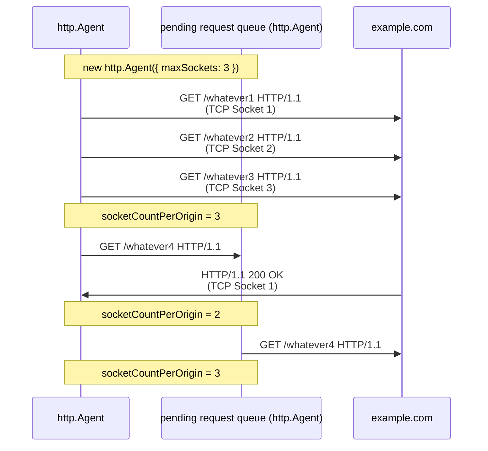

## 前言

我們有了以下知識

- [EventEmitter](./events.md)
- [stream-overview](./stream-overview.md)
- [stream.Readable](./stream-readable.md)
- [stream.Writable](./stream-writable.md)
- [socket-overview](./socket-overview.md)
- [socket-life-cycle](./socket-life-cycle.md)

終於可以進到 Node.js http 模組了！

## http.Agent

### new http.Agent(options)

https://nodejs.org/api/http.html#new-agentoptions

<!-- todo-yus 測試 -->

| option                      | description                                                                                                                                                                                                                 |
| --------------------------- | --------------------------------------------------------------------------------------------------------------------------------------------------------------------------------------------------------------------------- |
| keepAlive                   | Keep sockets around even when there are no outstanding requests, so they can be used for future requests without having to reestablish a TCP connection.                                                                |
| keepAliveMsecs              | 同 [net.createServer](https://nodejs.org/api/net.html#netcreateserveroptions-connectionlistener) 的 `keepAliveInitialDelay`                                                                                                 |
| agentKeepAliveTimeoutBuffer | 假設 Server 設定 `keep-alive: timeout=3` Agent 設定 `agentKeepAliveTimeoutBuffer = 1000` 那 Agent 會在 3 \* 1000 - 1000 = 2 秒後，將這個連線視為過期 為了避免 Client 還想傳送資料，但 Server 已經要關閉這條連線 |
| maxSockets                  | 每個 Origin 最多可以有幾個 concurrent TCP Socket 參考 [options.maxSockets](#optionsmaxsockets) 圖解 (Origin 是 [agent.getName([options])](https://nodejs.org/api/http.html#agentgetnameoptions) 的回傳值)           |
| maxTotalSockets             | 最多可以有幾個 concurrent TCP Socket                                                                                                                                                                                        |
| maxFreeSockets              | Only works when `keepAlive = true`                                                                                                                                                                                          |
| scheduling                  | 要如何從陣列中選擇 free Socket - fifo (First In First Out) - lifo (Last In First Out)                                                                                                                               |
| timeout                     | 同 [socket.timeout](https://nodejs.org/api/net.html#sockettimeout)                                                                                                                                                          |
| proxyEnv                    | v24.5.0 加入的，暫不討論                                                                                                                                                                                                    |
| defaultPort                 | Default port to use when the port is not specified in requests.                                                                                                                                                             |
| protocol                    | The protocol to use for the agent.                                                                                                                                                                                          |

### methods

<!-- todo-yus -->

- [createConnection(options[, callback])](https://nodejs.org/api/http.html#agentcreateconnectionoptions-callback)
- [keepSocketAlive(socket)](https://nodejs.org/api/http.html#agentkeepsocketalivesocket)
- [reuseSocket(socket, request)](https://nodejs.org/api/http.html#agentreusesocketsocket-request)
- [destroy()](https://nodejs.org/api/http.html#agentdestroy)
- [getName([options])](https://nodejs.org/api/http.html#agentgetnameoptions)

### properties

- [freeSockets](https://nodejs.org/api/http.html#agentfreesockets)
- [maxFreeSockets](https://nodejs.org/api/http.html#agentmaxfreesockets)
- [maxSockets](https://nodejs.org/api/http.html#agentmaxsockets)
- [maxTotalSockets](https://nodejs.org/api/http.html#agentmaxtotalsockets)
- [requests](https://nodejs.org/api/http.html#agentrequests)
- [sockets](https://nodejs.org/api/http.html#agentsockets)

### options.maxSockets

