## 前言

我們有了以下知識

- [EventEmitter](./events.md)
- [stream-overview](./stream-overview.md)
- [stream.Readable](./stream-readable.md)
- [stream.Writable](./stream-writable.md)
- [socket-overview](./socket-overview.md)
- [socket-life-cycle](./socket-life-cycle.md)

終於可以進到 Node.js http 模組了！

## http.Agent

### Why http.Agent ?

如果沒有 [http.Agent](https://nodejs.org/api/http.html#class-httpagent) 的話

```ts
// Server
const server = http.createServer((req, res) => {
  console.log("req.headers", req.headers);
  res.end();
});
server.listen(5000);

// Client
const noop = () => {};
const request = http.request({
  host: "localhost",
  port: 5000,
  path: "/",
  agent: false, // ✅
});
request.end();
request.on("response", (res) => {
  console.log("res.headers", res.headers);
  res.resume();
  res.on("end", noop);
});
```

從 log 的 [Connection: close](../http/keep-alive-and-connection.md) 可以得出結論：每次 HTTP Round Trip 結束，都會關閉 TCP 連線

```ts
req.headers { host: 'localhost:5000', connection: 'close' }
res.headers {
  date: 'Fri, 06 Feb 2026 01:33:20 GMT',
  connection: 'close',
  'content-length': '0'
}
```

從 TCP (layer 4) 的角度來看，每次都需要
<span style={{ color: "red" }}>"三次交握開啟連線"</span> + <span style={{ color: "green" }}>"四次交握關閉連線"</span>，效能上會比較差
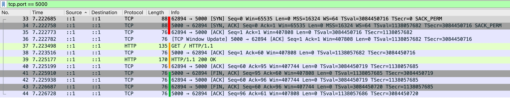

http.Agent 為此而生，它幫使用者管理

- TCP Socket 連線池
- concurrent 連線上限

<!-- Node.js 使用 [http.request](https://nodejs.org/api/http.html#httprequestoptions-callback) 發起 HTTP Request 時，若沒有使用 [http.Agent](https://nodejs.org/api/http.html#class-httpagent)，則每個請求都會創建一個新的 TCP 連線，並且該連線傳輸完這個 HTTP Request 就會關閉。若從 TCP (Layer 4) 的角度來看，每次都需要三次交握開啟連線 + 四次交握關閉連線，效能上會比較差。所以，管理 TCP Socket 連線池就成了一門學問，http.Agent 正是為此而生（當然 http.Agent 能做到的不止是管理 TCP Socket 連線池）。 -->

### new http.Agent(options)

https://nodejs.org/api/http.html#new-agentoptions

<!-- todo-yus 測試 -->

| option                      | description                                                                                                                                                                                                                 |
| --------------------------- | --------------------------------------------------------------------------------------------------------------------------------------------------------------------------------------------------------------------------- |
| keepAlive                   | Keep sockets around even when there are no outstanding requests,<br/>so they can be used for future requests without having to reestablish a TCP connection.                                                                |
| keepAliveMsecs              | 同 [net.createServer](https://nodejs.org/api/net.html#netcreateserveroptions-connectionlistener) 的 `keepAliveInitialDelay`                                                                                                 |
| agentKeepAliveTimeoutBuffer | 假設 Server 設定 `keep-alive: timeout=3`<br/>Agent 設定 `agentKeepAliveTimeoutBuffer = 1000`<br/>那 Agent 會在 3 \* 1000 - 1000 = 2 秒後，將這個連線視為過期<br/>為了避免 Client 還想傳送資料，但 Server 已經要關閉這條連線 |
| maxSockets                  | 每個 Origin 最多可以有幾個 concurrent TCP Socket<br/>參考 [options.maxSockets 圖解](#optionsmaxsockets-圖解)<br/>(Origin 是 [agent.getName([options])](https://nodejs.org/api/http.html#agentgetnameoptions) 的回傳值)      |
| maxTotalSockets             | 最多可以有幾個 concurrent TCP Socket                                                                                                                                                                                        |
| maxFreeSockets              | Only works when `keepAlive = true`                                                                                                                                                                                          |
| scheduling                  | 要如何從 [freeSockets](https://nodejs.org/api/http.html#agentfreesockets) 陣列中選擇<br/>- fifo (First In First Out)<br/>- lifo (Last In First Out)                                                                         |
| timeout                     | 同 [socket.timeout](https://nodejs.org/api/net.html#sockettimeout)                                                                                                                                                          |
| proxyEnv                    | v24.5.0 加入的，暫不討論                                                                                                                                                                                                    |
| defaultPort                 | Default port to use when the port is not specified in requests.                                                                                                                                                             |
| protocol                    | The protocol to use for the agent.                                                                                                                                                                                          |

### methods

| method                                                                                                          | description                                                                                                                                      |
| --------------------------------------------------------------------------------------------------------------- | ------------------------------------------------------------------------------------------------------------------------------------------------ |
| [createConnection(options[, callback])](https://nodejs.org/api/http.html#agentcreateconnectionoptions-callback) | 同 [net.createConnection()](https://nodejs.org/api/net.html#netcreateconnection)<br/>❌ 正常使用者不會碰到它<br/>有需要客製化行為才需要 override |
| [keepSocketAlive(socket)](https://nodejs.org/api/http.html#agentkeepsocketalivesocket)                          | ❌ 正常使用者不會碰到它<br/>有需要客製化行為才需要 override                                                                                      |
| [reuseSocket(socket, request)](https://nodejs.org/api/http.html#agentreusesocketsocket-request)                 | ❌ 正常使用者不會碰到它<br/>有需要客製化行為才需要 override                                                                                      |
| [destroy()](https://nodejs.org/api/http.html#agentdestroy)                                                      | 銷毀整個 http.Agent                                                                                                                              |
| [getName([options])](https://nodejs.org/api/http.html#agentgetnameoptions)                                      | ❌ 正常使用者不會碰到它<br/>用來當作連線池的 group key<br/>詳細請參考 [這裡](#read-only-properties)                                              |

### properties

這三個是在 [new http.Agent(options)](#new-httpagentoptions) 設定的，故不多贅述

- [maxSockets](https://nodejs.org/api/http.html#agentmaxsockets)
- [maxFreeSockets](https://nodejs.org/api/http.html#agentmaxfreesockets)
- [maxTotalSockets](https://nodejs.org/api/http.html#agentmaxtotalsockets)

### Read-Only properties

這三個則是由 `http.Agent` 控制的

- [freeSockets](https://nodejs.org/api/http.html#agentfreesockets)：連線池，可使用的 sockets

```ts
{
  'example.com:80:': [Socket],
  'www.google.com:80:': [Socket]
}
```

- [requests](https://nodejs.org/api/http.html#agentrequests)：Pending Request Queue，參考 [options.maxSockets](#optionsmaxsockets)

```ts
{
  'example.com:80:': [ClientRequest, ClientRequest],
  'www.google.com:80:': [ClientRequest, ClientRequest]
}
```

- [sockets](https://nodejs.org/api/http.html#agentsockets)：`http.Agent` 使用中的 sockets

```ts
{
  'example.com:80:': [Socket],
  'www.google.com:80:': [Socket]
}
```

這邊的 `example.com:80:` 跟 `www.google.com:80:` 就是 [getName([options])](https://nodejs.org/api/http.html#agentgetnameoptions) 回傳的 group key

### options.maxSockets 圖解


## Request, Response Classes 介紹

Node.js 跟 Request, Response 相關的 Class 有四個

- [http.ClientRequest](https://nodejs.org/api/http.html#class-httpclientrequest)：Client 送出的請求
- [http.ServerResponse](https://nodejs.org/api/http.html#class-httpserverresponse)：Server 送出的回應
- [http.IncomingMessage](https://nodejs.org/api/http.html#class-httpincomingmessage)：Server 讀取的請求 or Client 讀取的回應
- [http.OutgoingMessage](https://nodejs.org/api/http.html#class-httpoutgoingmessage)：抽象 Class，ClientRequest 跟 ServerResponse 都繼承它

之前在 [Node.js stream 入門](./stream-overview.md) 那篇文章有提到這些 Class 的關係，這邊再統整一次

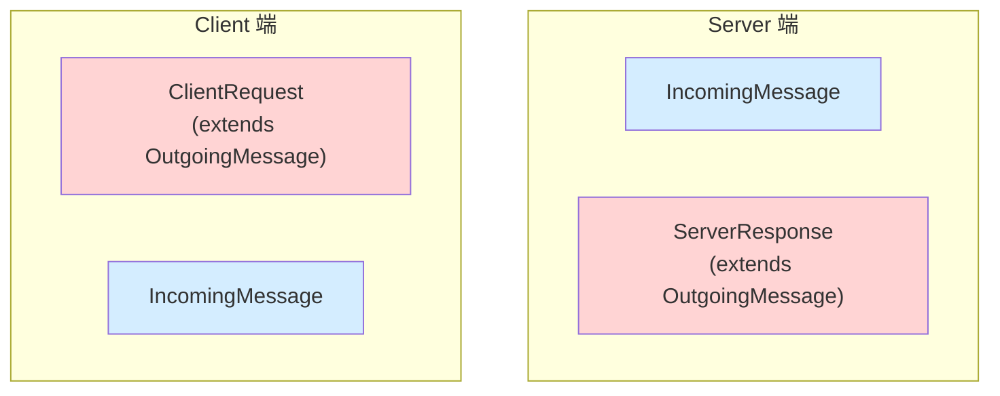

Client Side Code

```ts
const clientRequest = http.get({
  host: "example.com",
  port: 80,
  path: "/",
});
clientRequest.on("response", (response: http.IncomingMessage) =>
  response.resume(),
);
```

Server Side Code

```ts
const server = http
  .createServer((req: http.IncomingMessage, res: http.ServerResponse) => {
    res.end();
  })
  .listen(5000);
```

## ClientRequest & ServerResponse

我們現在把視角拉入 "HTTP Request / Response 的寫入"

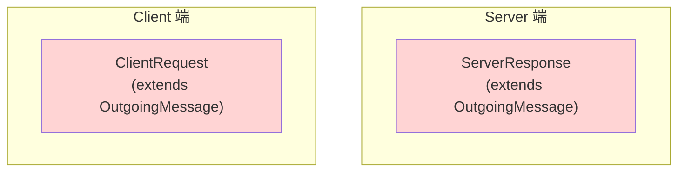

### 寫入流程 1：何時才會送出 header ? 了解 Node.js API 的設計

Node.js 提供了以下 methods 跟 properties 可以設定 headers

- setHeader
  - [request.setHeader(name, value)](https://nodejs.org/api/http.html#requestsetheadername-value)
  - [response.setHeader(name, value)](https://nodejs.org/api/http.html#responsesetheadername-value)
  - [outgoingMessage.setHeader(name, value)](https://nodejs.org/api/http.html#outgoingmessagesetheadername-value)
- setHeaders
  - [outgoingMessage.setHeaders(headers)](https://nodejs.org/api/http.html#outgoingmessagesetheadersheaders)
- appendHeader
  - [outgoingMessage.appendHeader(name, value)](https://nodejs.org/api/http.html#outgoingmessageappendheadername-value)
- flushHeaders
  - [request.flushHeaders()](https://nodejs.org/api/http.html#requestflushheaders)
  - [response.flushHeaders()](https://nodejs.org/api/http.html#responseflushheaders)
  - [outgoingMessage.flushHeaders()](https://nodejs.org/api/http.html#outgoingmessageflushheaders)
- removeHeader
  - [request.removeHeader(name)](https://nodejs.org/api/http.html#requestremoveheadername)
  - [response.removeHeader(name)](https://nodejs.org/api/http.html#responseremoveheadername)
  - [outgoingMessage.removeHeader(name)](https://nodejs.org/api/http.html#outgoingmessageremoveheadername)
- headersSent
  - [response.headersSent](https://nodejs.org/api/http.html#responseheaderssent)
  - [outgoingMessage.headersSent](https://nodejs.org/api/http.html#outgoingmessageheaderssent)
- writeHead
  - [response.writeHead(statusCode[, statusMessage][, headers])](https://nodejs.org/api/http.html#responsewriteheadstatuscode-statusmessage-headers)

並且以下 methods 可以取得 headers

- getHeader()
  - [request.getHeader(name)](https://nodejs.org/api/http.html#requestgetheadername)
  - [response.getHeader(name)](https://nodejs.org/api/http.html#responsegetheadername)
  - [outgoingMessage.getHeader(name)](https://nodejs.org/api/http.html#outgoingmessagegetheadername)
- getHeaderNames()
  - [request.getHeaderNames()](https://nodejs.org/api/http.html#requestgetheadernames)
  - [response.getHeaderNames()](https://nodejs.org/api/http.html#responsegetheadernames)
  - [outgoingMessage.getHeaderNames()](https://nodejs.org/api/http.html#outgoingmessagegetheadernames)
- getHeaders()
  - [request.getHeaders()](https://nodejs.org/api/http.html#requestgetheaders)
  - [response.getHeaders()](https://nodejs.org/api/http.html#responsegetheaders)
  - [outgoingMessage.getHeaders()](https://nodejs.org/api/http.html#outgoingmessagegetheaders)
- hasHeader()
  - [request.hasHeader(name)](https://nodejs.org/api/http.html#requesthasheadername)
  - [response.hasHeader(name)](https://nodejs.org/api/http.html#responsehasheadername)
  - [outgoingMessage.hasHeader(name)](https://nodejs.org/api/http.html#outgoingmessagehasheadername)

Node.js 把整個 headers 的操作分成三個階段，我們可以用 git 的概念來類比

|                 | 本地暫存             | 本地 Commit（不可再修改） | 真正送出  |
| --------------- | -------------------- | ------------------------- | --------- |
| OutgoingMessage | kOutHeaders (object) | `_headers` (string)       | `_send()` |
| git             | local changes        | local commit              | git push  |

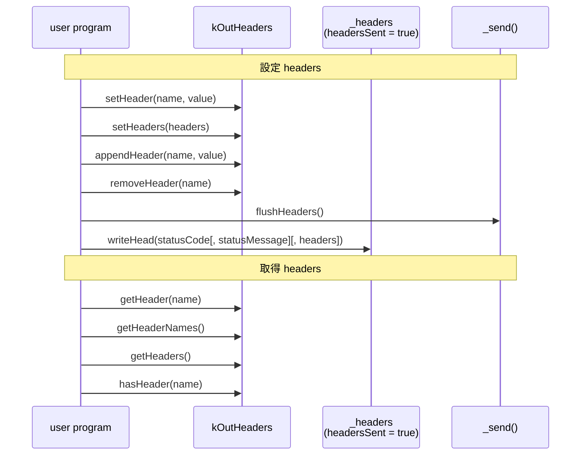

Node.js 的設計哲學是 "盡量把 headers 延遲到跟著 body 一起發送"，從 [`flushHeaders()`](https://nodejs.org/api/http.html#outgoingmessageflushheaders) 的官方文件可以得知

```
For efficiency reason, Node.js normally buffers the message headers until outgoingMessage.end() is called or the first chunk of message data is written. It then tries to pack the headers and data into a single TCP packet.

It is usually desired (it saves a TCP round-trip), but not when the first data is not sent until possibly much later. outgoingMessage.flushHeaders() bypasses the optimization and kickstarts the message.
```

### 寫入流程 1：PoC 測試 `writeHead`

```ts
const server = http.createServer();
server.listen(5000);
server.on("request", (req, res) => {
  res.writeHead(200, { a: "1", b: "2" });

  assert(res.headersSent);

  // ✅ Can't get header after headersSent
  assert(res.getHeader("a") === undefined);
  assert(Object.keys(res.getHeaders()).length === 0);
  assert(res.getHeaderNames().length === 0);
  assert(res.hasHeader("a") === false);

  // ✅ Can't set header after headersSent
  try {
    res.setHeader("a", "1");
  } catch (e) {
    assert(e instanceof Error);
    assert((e as any).code === "ERR_HTTP_HEADERS_SENT");
  }

  // ✅ Can't set header after headersSent
  try {
    res.setHeaders(new Headers({ a: "1" }));
  } catch (e) {
    assert(e instanceof Error);
    assert((e as any).code === "ERR_HTTP_HEADERS_SENT");
  }

  // ✅ Can't remove header after headersSent
  try {
    res.removeHeader("a");
  } catch (e) {
    assert(e instanceof Error);
    assert((e as any).code === "ERR_HTTP_HEADERS_SENT");
  }

  // ✅ If all assert is truthy, print ok
  console.log("ok");
});
```

用 `curl http://localhost:5000 -v` 測試

- ✅ Node.js 會輸出 `ok`
- ✅ curl 會停在 `* Request completely sent off`，因為 Server 還沒實際回傳 headers 跟 body

用 [Wireshark](https://www.wireshark.org/download.html) 抓 Loopback: lo0，加上篩選 tcp.port == 5000，確認 Server 真的沒有提前送 Response headers

- <span style={{ color: "red" }}>TCP 三方交握</span>
- <span style={{ color: "orange" }}>Client 傳送 HTTP Request, Server 回應收到 (TCP ACK)</span>
  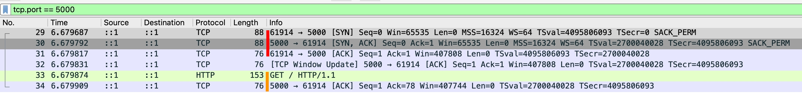

### 寫入流程 1：PoC 測試 `flushHeaders`

```ts
httpServer.on("request", (req, res) => {
  // ✅ 目前都還在 kOutHeaders 這邊 get / set headers，尚未送出
  res.setHeader("a", "1");
  assert(res.getHeader("a") === "1");
  assert(res.headersSent === false);

  // ✅ 目前都還在 kOutHeaders 這邊 get / set headers，尚未送出
  res.setHeaders(new Headers({ b: "2" }));
  assert(res.hasHeader("b"));
  assert(JSON.stringify(res.getHeaderNames()) === JSON.stringify(["a", "b"]));
  assert(res.headersSent === false);

  // ✅ 實際送出
  res.flushHeaders();
  assert(res.headersSent);

  // ✅ Can't set header after headersSent
  try {
    res.setHeader("a", "1");
  } catch (e) {
    assert(e instanceof Error);
    assert((e as any).code === "ERR_HTTP_HEADERS_SENT");
  }

  // ✅ Can't set header after headersSent
  try {
    res.setHeaders(new Headers({ a: "1" }));
  } catch (e) {
    assert(e instanceof Error);
    assert((e as any).code === "ERR_HTTP_HEADERS_SENT");
  }

  // ✅ Can't remove header after headersSent
  try {
    res.removeHeader("a");
  } catch (e) {
    assert(e instanceof Error);
    assert((e as any).code === "ERR_HTTP_HEADERS_SENT");
  }
});
```

用 `curl http://localhost:5000 -v` 測試，確實有收到 response headers，但我們沒送 body，所以連線會 timeout

```
< HTTP/1.1 200 OK
< a: 1
< b: 2
< Date: Fri, 13 Feb 2026 01:50:21 GMT
< Connection: keep-alive
< Keep-Alive: timeout=5
< Transfer-Encoding: chunked
<
* transfer closed with outstanding read data remaining
* Closing connection
curl: (18) transfer closed with outstanding read data remaining
```

### 寫入流程 2：送出 body

Node.js 提供了以下 methods 可以寫入 body

- write()
  - [request.write(chunk[, encoding][, callback])](https://nodejs.org/api/http.html#requestwritechunk-encoding-callback)
  - [response.write(chunk[, encoding][, callback])](https://nodejs.org/api/http.html#responsewritechunk-encoding-callback)
  - [outgoingMessage.write(chunk[, encoding][, callback])](https://nodejs.org/api/http.html#outgoingmessagewritechunk-encoding-callback)
- end()
  - [request.end([data[, encoding]][, callback])](https://nodejs.org/api/http.html#requestenddata-encoding-callback)
  - [response.end([data[, encoding]][, callback])](https://nodejs.org/api/http.html#responseenddata-encoding-callback)
  - [outgoingMessage.end(chunk[, encoding][, callback])](https://nodejs.org/api/http.html#outgoingmessageendchunk-encoding-callback)

`Content-Length` 跟 `Transfer-Encoding` 是 HTTP/1.1 定義 body 最重要的兩個 header，參考 [RFC 9112 Section 6. Message Body](https://datatracker.ietf.org/doc/html/rfc9112#section-6)

```
The presence of a message body in a request is signaled by a Content-Length or Transfer-Encoding header field.
```

### 寫入流程 2-1：使用 Content-Length

假設我要 Serve 一個靜態網站，每個 HTML, CSS, JS 都是預先 build 好的檔案，這情況就屬於 "已知 body 長度"

```ts
httpServer.on("request", (req, res) => {
  // ✅ 呼叫 end 的當下，若 header 沒有明確指定 transfer-encoding: chunked
  // ✅ 則 Node.js 會自動設定 Content-Length = 寫入的 body byteLength
  res.end(readFileSync(join(__dirname, "index.html")));
});
```

用 `curl http://localhost:5000 -v` 測試

```
< HTTP/1.1 200 OK
< Date: Fri, 13 Feb 2026 03:08:34 GMT
< Connection: keep-alive
< Keep-Alive: timeout=5
< Content-Length: 20
<
* Connection #0 to host localhost left intact
<h1>hello world</h1>
```

也可以自行設定 `Content-Length`

```ts
httpServer.on("request", (req, res) => {
  const fileBuffer = readFileSync(join(__dirname, "index.html"));
  res.setHeader("Content-Length", fileBuffer.byteLength);

  res.write(fileBuffer);
  res.end(); // ✅ 也可以簡化成一行 res.end(fileBuffer)
});

httpServer.on("request", (req, res) => {
  const fileBuffer = readFileSync(join(__dirname, "index.html"));
  res.setHeader("Content-Length", fileBuffer.byteLength);
  res.end(fileBuffer);
});
```

用 `curl http://localhost:5000 -v` 測試

```
< HTTP/1.1 200 OK
< Content-Length: 20
< Date: Fri, 13 Feb 2026 03:23:54 GMT
< Connection: keep-alive
< Keep-Alive: timeout=5
<
* Connection #0 to host localhost left intact
<h1>hello world</h1>
```

若檔案很大，則不建議用 `readFileSync` 把整個檔案讀進記憶體，可以使用 `pipe` 流式傳輸

```ts
httpServer.on("request", (req, res) => {
  // ✅ 先把 file size 設定到 Content-Length
  const filestat = statSync(join(__dirname, "demo-very-large-video.mp4"));
  res.setHeader("Content-Length", filestat.size);

  // ✅ 流式傳輸，避免一次讀取大檔案，把記憶體撐爆
  const readStream = createReadStream(
    join(__dirname, "demo-very-large-video.mp4"),
  );
  readStream.pipe(res);

  // ❌ todo: res, readStream error handle
});
```

### 寫入流程 2-2：使用 `Transfer-Encoding: chunked`

AI 工具在回應時，不會預先知道回應長度，這時候會使用 `Transfer-Encoding: chunked`，可參考我寫過的 [SSE: Server-Sent Events](../http/server-sent-events.md)

```ts
httpServer.on("request", (req, res) => {
  // ✅ 呼叫 write 的當下，若 header 沒有明確指定 Content-Length
  // ✅ 則 Node.js 會自動設定 Transfer-Encoding: chunked
  res.write("first line");
  res.write("second line");
  res.end("third line");
});
```

用 `curl http://localhost:5000 -v` 測試

```
< HTTP/1.1 200 OK
< Date: Fri, 13 Feb 2026 03:37:50 GMT
< Connection: keep-alive
< Keep-Alive: timeout=5
< Transfer-Encoding: chunked
<
* Connection #0 to host localhost left intact
first linesecond linethird line
```

### 寫入流程 3：body 送完以後的生命週期

以下 properties 跟 events 可以得知 body 送完以後的生命週期

- writableEnded
  - [request.writableEnded](https://nodejs.org/api/http.html#requestwritableended)
  - [response.writableEnded](https://nodejs.org/api/http.html#responsewritableended)
  - [outgoingMessage.writableEnded](https://nodejs.org/api/http.html#outgoingmessagewritableended)
- on('prefinish')
  - [outgoingMessage.on('prefinish')](https://nodejs.org/api/http.html#event-prefinish)
- on('finish')
  - [request.on('finish')](https://nodejs.org/api/http.html#event-finish)
  - [response.on('finish')](https://nodejs.org/api/http.html#event-finish)
  - [outgoingMessage.on('finish')](https://nodejs.org/api/http.html#event-finish)
- writableFinished
  - [request.writableFinished](https://nodejs.org/api/http.html#requestwritablefinished)
  - [response.writableFinished](https://nodejs.org/api/http.html#responsewritablefinished)
  - [outgoingMessage.writableFinished](https://nodejs.org/api/http.html#outgoingmessagewritablefinished)

時間軸如下


寫個 PoC 來測試

```ts
httpServer.on("request", (req, res) => {
  res.on("prefinish", () => {
    assert(res.writableEnded);
    console.log("prefinish");
  });

  res.on("finish", () => {
    assert(res.writableFinished);
    console.log("finish");
  });

  res.end("123", () => console.log("end cb"));
});

// Prints
// prefinish
// finish
// end cb
```

:::info
[outgoingMessage.on('prefinish')](https://nodejs.org/api/http.html#event-prefinish) 其實是繼承 [stream.Writable](./stream-writable.md)<br/><br/>
不過 [Node.js stream 官方文件](https://nodejs.org/api/stream.html) 完全沒提到 `prefinish`，所以就當作一個小知識先記著就好～
:::

<!-- ### 軟木塞

- cork
  - [request.cork()](https://nodejs.org/api/http.html#requestcork)
  - [response.cork()](https://nodejs.org/api/http.html#responsecork)
  - [outgoingMessage.cork()](https://nodejs.org/api/http.html#outgoingmessagecork)
- uncork
  - [request.uncork()](https://nodejs.org/api/http.html#requestuncork)
  - [response.uncork()](https://nodejs.org/api/http.html#responseuncork)
  - [outgoingMessage.uncork()](https://nodejs.org/api/http.html#outgoingmessageuncork) -->

## 非對稱的設計: destroy

Node.js 官方文件在描述 `destroy([error])` 跟 `destroyed` 時，並沒有把所有情境都列出來

- destroy([error])
  - [clientRequest.destroy([error])](https://nodejs.org/api/http.html#requestdestroyerror)
  - serverResponse.destroy([error]) => 官方文件沒列出，但實際上有這個 method
  - [outgoingMessage.destroy([error])](https://nodejs.org/api/http.html#outgoingmessagedestroyerror)
  - [incomingMessage.destroy([error])](https://nodejs.org/api/http.html#messagedestroyerror)
- destroyed
  - [clientRequest.destroyed](https://nodejs.org/api/http.html#requestdestroyed)
  - serverResponse.destroyed => 官方文件沒列出，但實際上有這個 property
  - outgoingMessage.destroyed => 官方文件沒列出，但實際上有這個 property
  - incomingMessage.destroyed => 官方文件沒列出，但實際上有這個 property

我們複習一下 stream, Socket, http 的繼承關係

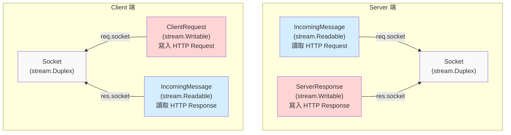

- Socket 是一個可讀寫的資料流，但 http 模組刻意將讀、寫分成兩個抽象 Class（[IncomingMessage](https://nodejs.org/api/http.html#class-httpincomingmessage), [OutgoingMessage](https://nodejs.org/api/http.html#class-httpoutgoingmessage)）
- 也因此，`request.socket` 跟 `response.socket` 必定為同一個 socket instance
- 不管是 request 還是 response 呼叫 `destroy([error])`，背後都有可能會呼叫到對應的 `socket.destroy([error])`

### IncomingMessage autoDestroy

根據 [IncomingMessage 的 History](https://nodejs.org/api/http.html#class-httpincomingmessage)

| Version | Changes                                                                   |
| ------- | ------------------------------------------------------------------------- |
| v15.5.0 | The `destroyed` value returns `true` after the incoming data is consumed. |

`IncomingMessage` 繼承 `stream.Readable`，而 [new stream.Readable([options])](https://nodejs.org/api/stream.html#new-streamreadableoptions)

- `autoDestroy`: Whether this stream should automatically call `.destroy()` on itself after ending. Default: `true`.

並且我也在 Github 翻到了 v15.5.0 這個改動

- PR: [http: use `autoDestroy: true` in incoming message](https://github.com/nodejs/node/pull/33035/changes)
- Issue: [[Bug] `http.IncomingMessage.destroyed` is `true` after payload read since v15.5.0](https://github.com/nodejs/node/issues/36617)

對於 `IncomingMessage` 的生命週期，讀完 HTTP Request / Response，其任務已經達成，故標記為 `destroyed: true` 是合理的

寫個 PoC 來測試

```ts
httpServer.on("request", (req, res) => {
  req.resume();
  // ✅ Server 的 IncomingMessage 在讀完資料後，會自動把 destroyed 設為 true
  req.on("end", () => nextTick(() => assert(req.destroyed)));
  res.end("123");
});

const clientRequest = http.request({
  host: "localhost",
  port: 5000,
  method: "POST",
});
clientRequest.end("123");
clientRequest.on("response", (res) => {
  res.resume();
  // ✅ Client 的 IncomingMessage 在讀完資料後，會自動把 destroyed 設為 true
  res.on("end", () => nextTick(() => assert(res.destroyed)));
});
```

不過 HTTP/1.1 預設是 [keepAlive](../http/keep-alive-and-connection.md)，Socket 會重複使用。若 `autoDestroy` 的話，就有可能會呼叫 `socket.destroy([error])`，Node.js 是怎麼避免這件事情的呢？以 http client 為例子，我們直接看 Node.js 原始碼：

```ts
// lib/_http_client.js
function responseOnEnd() {
  // if 條件省略

  else if (req.writableFinished && !this.aborted) {
    assert(req.finished);
    responseKeepAlive(req);
  }
}

function responseKeepAlive(req) {
  // ... 前面省略

  req.destroyed = true;
  if (req.res) {
    // Detach socket from IncomingMessage to avoid destroying the freed
    // socket in IncomingMessage.destroy().
    req.res.socket = null;
  }
}
```

```ts
// lib/_http_incoming.js
IncomingMessage.prototype._destroy = function _destroy(err, cb) {
  // ... 前面省略

  if (this.socket && !this.socket.destroyed && this.aborted) {
    this.socket.destroy(err);

    // ... 以下省略
  }
```

其實連註解都有說，要在 `IncomingMessage.destroy()` 之前把 `req.res.socket` 設成 `null`，確保不會執行到 `socket.destroy()`

function 的執行順序如下：

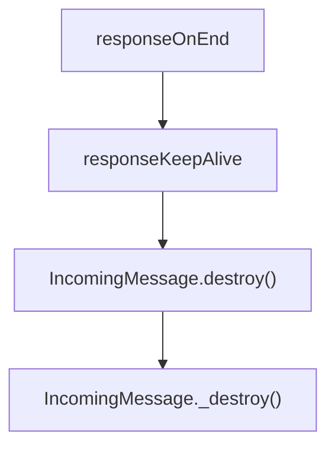

在 http client 端，response body 完整接收後，這個 HTTP Round Trip 已結束，Socket 的 ownership 必須立刻回到 `Agent.freeSockets`，因此 Node.js 會主動執行 `req.res.socket = null`

但 http server 端，request body 完整接收後，此時 response 通常還沒完整送出，user program 可能還需要存取 `request.socket`，所以 Socket 會等到 `response.on('finish')` 之後才會被解除關聯，直接來看 Node.js 原始碼：

```ts
// lib/_http_server.js
function resOnFinish(req, res, socket, state, server) {
  // ...以上省略
  res.detachSocket(socket);
  clearIncoming(req);
  // ...以下省略
}

ServerResponse.prototype.detachSocket = function detachSocket(socket) {
  assert(socket._httpMessage === this);
  socket.removeListener("close", onServerResponseClose);
  socket._httpMessage = null;
  this.socket = null;
};
```

寫個 PoC 來測試

```ts
httpServer.on("request", (req, res) => {
  req.resume();
  // ✅ Server 的 IncomingMessage 在讀完資料後，會自動把 destroyed 設為 true
  req.on("end", () => nextTick(() => assert(req.destroyed)));
  // ✅ Server 的 Socket 在 HTTP Round Trip 結束後，會自動解除關聯
  res.on("finish", () => assert(res.socket === null));
  res.end("123");
});

const clientRequest = http.request({
  host: "localhost",
  port: 5000,
  method: "POST",
});
clientRequest.end("123");
clientRequest.on("response", (res) => {
  res.resume();
  res.on("end", () => {
    // ✅ Client 的 Socket 在 HTTP Round Trip 結束後，會自動解除關聯
    assert(res.socket === null);
    // ✅ Client 的 IncomingMessage 在讀完資料後，會自動把 destroyed 設為 true
    nextTick(() => assert(res.destroyed));
  });
});
```

### IncomingMessage.destroy([error])

我們現在知道 `IncomingMessage` 繼承了 `Readable`，且 `Readable.on("end")` 之後，預設會 `autoDestroy`，那 user program 要呼叫 `IncomingMessage.destroy([error])` 的合理時間點就是 "資料讀完之前，我不想再接著讀了"。

寫個 PoC 來實測 http server 的 `IncomingMessage`

```ts
httpServer.on("request", (req, res) => {
  req.destroy();
  assert(req.socket.destroyed);
  assert(res.socket?.destroyed);
  res.end("123"); // ❌ noop
});
```

用 `curl http://localhost:5000` 測試，結果是沒收到任何回應，因為 Socket 已經被 destroy 了

```
curl: (52) Empty reply from server
```

寫個 PoC 來實測 http client 的 `IncomingMessage`

```ts
const clientRequest = http.request({
  host: "example.com",
  port: 80,
});
clientRequest.end();
clientRequest.on("response", (res) => {
  res.destroy();
  assert(clientRequest.socket?.destroyed);
  assert(res.socket.destroyed);
});
clientRequest.on("error", (e) => {
  assert(e instanceof Error);
  assert(e.message === "socket hang up");
  assert((e as any).code === "ECONNRESET");
});
```

至於為何會需要在 `clientRequest` 捕捉錯誤，直接看 Node.js 原始碼

```ts
// lib/_http_client.js

function socketOnEnd() {
  // 以上省略
  if (!req.res && !req.socket._hadError) {
    // If we don't have a response then we know that the socket
    // ended prematurely and we need to emit an error on the request.
    req.socket._hadError = true;
    emitErrorEvent(req, new ConnResetException("socket hang up"));
  }
  // 以下省略
}
```

### 為何 http client 有 "socket hang up" 這個錯誤 ?

| 呼叫 `clientRequest.destroy()` 的時機點 | 解釋                                                                                                    |
| --------------------------------------- | ------------------------------------------------------------------------------------------------------- |
| http client 的 response 已經收到        | ✅ Node.js 已經建立 HTTP response (`IncomingMessage`)<br/>接下來是 user program 的職責                  |
| http client 的 response 尚未建立        | ❌ Node.js 尚未建立 HTTP response (`IncomingMessage`)<br/>就被切斷 Socket 連線，故拋出 "socket hang up" |

### destroy 小結

| 你想做的事                               | 正確 API           |
| ---------------------------------------- | ------------------ |
| server 不想讀 request body，但要正常回應 | `req.resume()`     |
| client 不想讀 response body，但要成功    | `res.resume()`     |
| 任一方放棄整個 HTTP 流程                 | `destroy([error])` |

<!-- | Role                                     | Meaning of `destroy()` |
| ---------------------------------------- | -------------------- |
| http client's request (ClientRequest)    | Abort the request or stop reading response |
| http client's response (IncomingMessage) | Stop reading response body |
| http server's request (IncomingMessage)  | Stop reading request |
| http server's response (ServerResponse)  | Stop sending response | -->

<!-- ### ClientRequest 在不同階段呼叫 destroy() 的語意差異
```mermaid
sequenceDiagram
  participant A as ClientRequest
  participant B as Request Sent<br/>ClientRequest.end()
  participant C as Response Receiving<br/>ClientRequest.on('response')
  participant D as Response Body Fully Sent<br/>IncomingMessage.on('end')

  Note Over A,B:  abort the request
  Note Over C,D: stop reading response body
``` -->

<!-- ### http client's IncomingMessage 在不同階段呼叫 destroy() 的語意差異
```mermaid
sequenceDiagram
  participant A as http client's IncomingMessage
  participant B as Response Receiving<br/>ClientRequest.on('response')
  participant C as Response Body Fully Sent<br/>IncomingMessage.on('end')

  Note Over B,C: stop reading response body
``` -->

<!-- ### ClientRequest.destroy([error]) -->

## ClientRequest events

<!-- todo-yus 有點不確定這三個的差別 -->

- [request.on('close')](https://nodejs.org/api/http.html#event-close)
- [message.on('close')](https://nodejs.org/api/http.html#event-close_3)
- [message.complete](https://nodejs.org/api/http.html#messagecomplete)

<!-- |                     | Description |
| ------------------- | ----------- |
| request.on('close') |             |
| message.on('close') |             |
| message.on('end')   |             | -->

## ClientRequest info

- [request.path](https://nodejs.org/api/http.html#requestpath)
- [request.method](https://nodejs.org/api/http.html#requestmethod)
- [request.host](https://nodejs.org/api/http.html#requesthost)
- [request.protocol](https://nodejs.org/api/http.html#requestprotocol)

## related to socket

<!-- todo-yus -->

ClientRequest

- [request.on('socket')](https://nodejs.org/api/http.html#event-socket)
- [request.setNoDelay([noDelay])](https://nodejs.org/api/http.html#requestsetnodelaynodelay)
- [request.setSocketKeepAlive([enable][, initialDelay])](https://nodejs.org/api/http.html#requestsetsocketkeepaliveenable-initialdelay)
- [request.setTimeout(timeout[, callback])](https://nodejs.org/api/http.html#requestsettimeouttimeout-callback)
- [request.on('timeout')](https://nodejs.org/api/http.html#event-timeout)
- [request.reusedSocket](https://nodejs.org/api/http.html#requestreusedsocket)

http.Server

- [server.timeout](https://nodejs.org/api/http.html#servertimeout)

ServerResponse

- [response.setTimeout(msecs[, callback])](https://nodejs.org/api/http.html#responsesettimeoutmsecs-callback)

IncomingMessage

- [message.setTimeout(msecs[, callback])](https://nodejs.org/api/http.html#messagesettimeoutmsecs-callback)

## 防止 Server 亂來: response.strictContentLength

[response.strictContentLength](https://nodejs.org/api/http.html#responsestrictcontentlength)

Node.js http server 預設不會檢查 response header 的 `Content-Length` 跟實際送出的 body 是否 match

### `Content-Length` 大於 actual bytes

若宣告 `Content-Length: 3`，實際只送 2 bytes，就會造成 http client 的錯誤

```ts
const httpServer = http.createServer();
httpServer.listen(5000);
httpServer.on("request", (req, res) => {
  res.setHeader("Content-Length", 3);
  res.end("12");
});
```

用 `curl http://localhost:5000/ -v` 測試，發現 curl 等待幾秒左右就關閉連線了

```
< HTTP/1.1 200 OK
< Content-Length: 3
< Date: Mon, 23 Feb 2026 06:29:32 GMT
< Connection: keep-alive
< Keep-Alive: timeout=5
<
* transfer closed with 1 bytes remaining to read
* Closing connection
curl: (18) transfer closed with 1 bytes remaining to read
12
```

用 [Wireshark](https://www.wireshark.org/download.html) 抓 Loopback: lo0，加上篩選 tcp.port == 5000。發現 Server 回傳 HTTP Response 的 6 秒後，Server 主動關閉連線
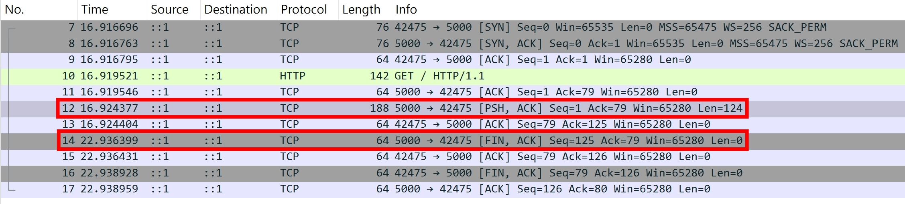

這 6 秒是以下兩個的預設值相加得來的

- [server.keepAliveTimeout](https://nodejs.org/api/http.html#serverkeepalivetimeout)
- [server.keepAliveTimeoutBuffer](https://nodejs.org/api/http.html#serverkeepalivetimeoutbuffer)

改用 Node.js `http.request` 測試

```ts
const clientRequest = http.request({ host: "localhost", port: 5000 });
clientRequest.end();
clientRequest.on("response", (res) => {
  console.log(performance.now(), res.headers);
  res.setEncoding("latin1");
  res.on("data", console.log);
  res.on("end", () => console.log("end")); // ❌ end will not trigger
  res.on("error", console.log);
  res.on("close", () => console.log(performance.now(), "close"));
});

// Prints
// 1184.9179 {
//   'content-length': '3',
//   date: 'Mon, 23 Feb 2026 11:10:16 GMT',
//   connection: 'keep-alive',
//   'keep-alive': 'timeout=5'
// }
// 12
// Error: aborted
//     at Socket.socketCloseListener (node:_http_client:535:19)
//     at Socket.emit (node:events:520:35)
//     at Socket.emit (node:domain:489:12)
//     at TCP.<anonymous> (node:net:346:12) {
//   code: 'ECONNRESET'
// }
// 7190.6428 close
```

得出的結果也是 6 秒 (7190 - 1184)

### `Content-Length` 小於 actual bytes

若宣告 `Content-Length: 3`，實際送了 4 bytes，也會造成 http client 的錯誤

```ts
const httpServer = http.createServer();
httpServer.listen(5000);
httpServer.on("request", (req, res) => {
  res.setHeader("Content-Length", 3);
  res.end("1234");
});
```

用 `curl http://localhost:5000/ -v` 測試，發現 curl 會把超過的 body 截斷，並且 curl 會立即關閉連線

```
< HTTP/1.1 200 OK
< Content-Length: 3
< Date: Mon, 23 Feb 2026 06:32:44 GMT
< Connection: keep-alive
< Keep-Alive: timeout=5
<
* Excess found writing body: excess = 1, size = 3, maxdownload = 3, bytecount = 3
* Closing connection
123
```

改用 Node.js `http.request` 測試

```ts
const clientRequest = http.request({ host: "localhost", port: 5000 });
clientRequest.end();
clientRequest.on("error", console.log); // ✅ Error: Parse Error: Expected HTTP/, RTSP/ or ICE/
clientRequest.on("response", (res) => {
  console.log(res.headers); // ✅ 會正確觸發
  res.setEncoding("latin1");
  res.on("data", console.log); // ✅ 123
  res.on("end", () => console.log("end")); // ✅ 會正確觸發
});

// Prints
// {
//   'content-length': '3',
//   date: 'Tue, 24 Feb 2026 01:04:22 GMT',
//   connection: 'keep-alive',
//   'keep-alive': 'timeout=5'
// }
// Error: Parse Error: Expected HTTP/, RTSP/ or ICE/
//     at Socket.socketOnData (node:_http_client:615:22)
//     at Socket.emit (node:events:508:28)
//     at Socket.emit (node:domain:489:12)
//     at addChunk (node:internal/streams/readable:559:12)
//     at readableAddChunkPushByteMode (node:internal/streams/readable:510:3)
//     at Socket.Readable.push (node:internal/streams/readable:390:5)
//     at TCP.onStreamRead (node:internal/stream_base_commons:189:23) {
//   bytesParsed: 125,
//   code: 'HPE_INVALID_CONSTANT',
//   reason: 'Expected HTTP/, RTSP/ or ICE/',
//   rawPacket: <Buffer 48 54 54 50 2f 31 2e 31 20 32 30 30 20 4f 4b 0d 0a 43 6f 6e 74 65 6e 74 2d 4c 65 6e 67 74 68 3a 20 33 0d 0a 44 61 74 65 3a 20 54 75 65 2c 20 32 34 20 ... 76 more bytes>
// }
// 123
// end
```

Node.js 的 `HTTPParser` 會噴 `Parse Error: Expected HTTP/, RTSP/ or ICE/`，原因是當 `HTTPParser` 讀完 3 bytes of data 之後，接下來就開始讀下一個 HTTP Request，而 HTTP Request 的 Start-Line 必須是 `HTTP/` 開頭，但我們傳送了 "4"，所以才會噴 `Parse Error`。至於 `RTSP/` 跟 `ICE/`，則是不同的協議，我目前還沒深入研究。

### 設定 response.strictContentLength

為了預防上述情境，可以設定 `response.strictContentLength`

```ts
const httpServer = http.createServer();
httpServer.listen(5000);
httpServer.on("request", (req, res) => {
  res.strictContentLength = true;
  res.setHeader("Content-Length", 3);
  res.end("123G");
});
```

用 `curl http://localhost:5000/` 測試，收到 `curl: (52) Empty reply from server`，並且 Node.js 的 log 顯示

```
Error: Response body's content-length of 4 byte(s) does not match the content-length of 3 byte(s) set in header
```

這是在 `OutgoingMessage.prototype.end` 拋出的錯誤，無法透過 `on("error")` 捕捉

```ts
function strictContentLength(msg) {
  return (
    msg.strictContentLength &&
    msg._contentLength != null &&
    msg._hasBody &&
    !msg._removedContLen &&
    !msg.chunkedEncoding &&
    !msg.hasHeader("transfer-encoding")
  );
}

OutgoingMessage.prototype.end = function end(chunk, encoding, callback) {
  // other logic...

  if (
    strictContentLength(this) &&
    this[kBytesWritten] !== this._contentLength
  ) {
    throw new ERR_HTTP_CONTENT_LENGTH_MISMATCH(
      this[kBytesWritten],
      this._contentLength,
    );
  }

  // other logic...
};
```

## 限制每個 TCP Socket 最多能處理的 HTTP Requests

- [server.maxRequestsPerSocket](https://nodejs.org/api/http.html#servermaxrequestspersocket)
- [server.on('droprequest')](https://nodejs.org/api/http.html#event-droprequest)

我看了這個 feature 的歷史原因，覺得蠻有趣的

- [Issue: Max requests per socket](https://github.com/nodejs/node/issues/40071)
- [PR: Limit requests per connection](https://github.com/nodejs/node/pull/40082)

簡單來說，由於 HTTP/1.1 KeepAlive 的特性，會盡可能的使用已經建立好的 TCP Connection，導致舊的 K8S Pod 一直處於 High CPU Usage，而新的 K8S Pod 則沒辦法分散流量。限制 `maxRequestsPerSocket` 之後，就可以讓老舊的 TCP Connection 關閉，從而達到負載均衡。

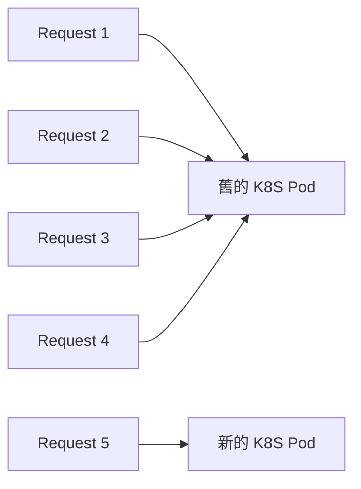

架個 http server 試試看

```ts
const httpServer = http.createServer();
httpServer.maxRequestsPerSocket = 3;
httpServer.listen(5000);
httpServer.on("request", (req, res) => {
  res.end(req.url);
});
```

用 [HTTP/1.1 pipeline](../http/http-1.1-pipelining-and-hol-blocking.md) 的概念，發送以下 raw HTTP Requests

```ts
GET /1 HTTP/1.1
Host: 123
Content-Length: 1

1GET /2 HTTP/1.1
Host: 123
Content-Length: 1

1GET /3 HTTP/1.1
Host: 123
Content-Length: 1

1GET /4 HTTP/1.1
Host: 123
Content-Length: 1

1
```

- 第 1,2 個 Response Header 有 `Keep-Alive: timeout=5, max=3`
- 第 3 個 Response Header 則會有 `Connection: close`，但此時還不會真的關閉連線
- 第 4 個 Response 開始，則一律回傳 `503 Service Unavailable`
  

:::info
`Keep-Alive: timeout=5, max=3` 屬於 "歷史遺留的非標準擴充"，詳細請參考 [RFC 2068 Section 19.7.1.1](https://datatracker.ietf.org/doc/html/rfc2068#section-19.7.1.1)
:::

若 user program 想要在 `503 Service Unavailable` 之前加上一些監控的邏輯，可以使用 `server.on('droprequest')`

```ts
httpServer.on("dropRequest", (req, socket) => {
  // 監控是否為惡意 User-Agent
  console.log(req.headers["user-agent"]);
  // ❌ 不建議使用 socket.write, socket.destroy, socket.end 等等會影響 socket 狀態機的操作
  // 因爲 Node.js 會幫忙回 `503 Service Unavailable`
});
```

## 一般開發者很少用到的

### request.on('information')

https://nodejs.org/api/http.html#event-information

會在 client 收到 1xx status code 的時候觸發（除了 101 Switching Protocols 會在 [on('upgrade')](#onupgrade) 的時候觸發 ），包含

- [100 Continue](#100-continue)
- [102 Processing (Deprecated)](https://developer.mozilla.org/en-US/docs/Web/HTTP/Reference/Status/102)
- [103 Early Hints](#103-early-hints)

### 100 Continue

- [request.on('continue')](https://nodejs.org/api/http.html#event-continue)
- [server.on('checkContinue')](https://nodejs.org/api/http.html#event-checkcontinue)
- [response.writeContinue()](https://nodejs.org/api/http.html#responsewritecontinue)

參考我寫過的 [Expect: 100-Continue](../http/expect-100-continue.md)

### 103 Early Hints

Node.js http server 提供以下 method 來寫入 Early Hints
[response.writeEarlyHints(hints[, callback])](https://nodejs.org/api/http.html#responsewriteearlyhintshints-callback)

Early Hints 是啥？最常用的情境就是告訴瀏覽器 "Response Body 還在準備中，但你可以先載入這些 Link 的資源"

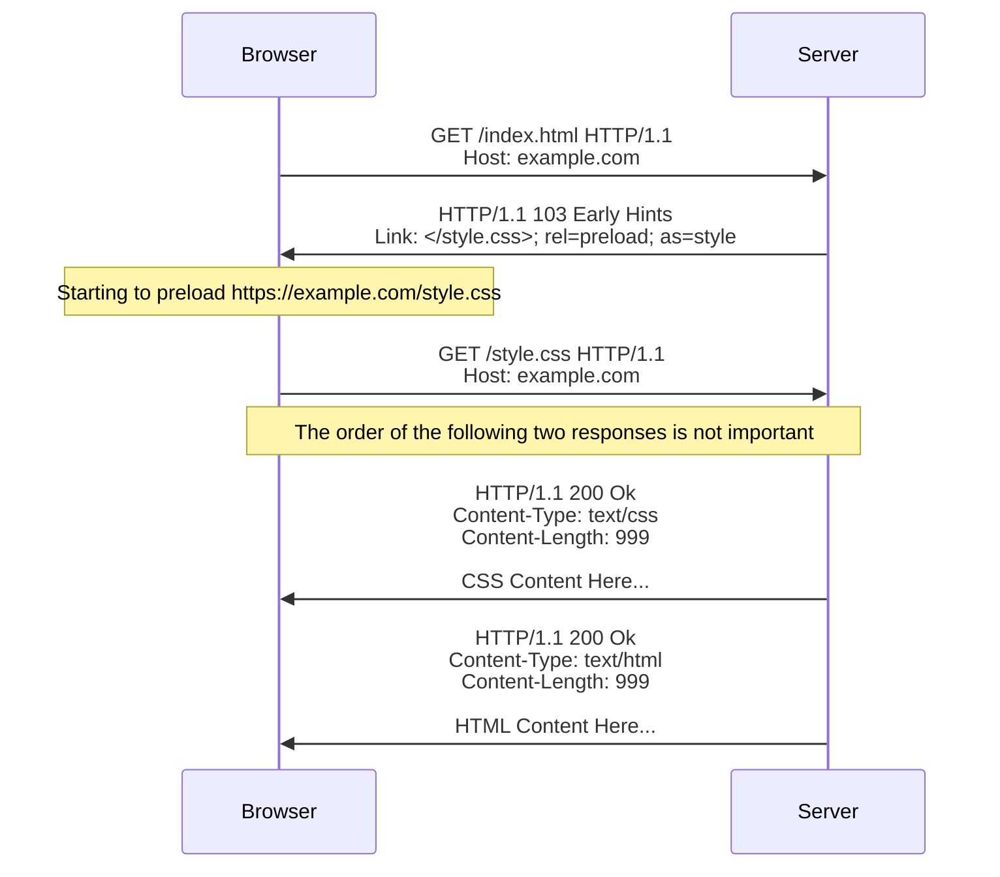

我們先來看看 [RFC 9110 Section 15.2. Informational 1xx](https://datatracker.ietf.org/doc/html/rfc9110#section-15.2) 的介紹

```
A client MUST be able to parse one or more 1xx responses received prior to a final response, even if the client does not expect one. A user agent MAY ignore unexpected 1xx responses.
```

Early Hints

<!-- todo-yus -->
<!-- https://datatracker.ietf.org/doc/html/rfc8297 -->

### server.on('checkExpectation')

https://nodejs.org/api/http.html#event-checkexpectation

<!-- todo-yus -->

### server.on('clientError')

https://nodejs.org/api/http.html#event-clienterror

通常是在 Node.js 的 HTTPParser 沒辦法正確解析出 client 送出的 http request，包含但不限於以下

| Node.js Error Code                                                                                | Description                                                                                                                                              |
| ------------------------------------------------------------------------------------------------- | -------------------------------------------------------------------------------------------------------------------------------------------------------- |
| [ERR_HTTP_REQUEST_TIMEOUT](https://nodejs.org/api/errors.html#err_http_request_timeout)           | [Incomplete request exceeded headersTimeout or requestTimeout](#prevent-incomplete-request)                                                              |
| [HPE_CHUNK_EXTENSIONS_OVERFLOW](https://nodejs.org/api/errors.html#hpe_chunk_extensions_overflow) | [Transfer-Encoding: chunked](../http/transfer-encoding.md) 的 [chunked extensions](https://datatracker.ietf.org/doc/html/rfc9112#section-7.1.1) 超過上限 |
| [HPE_HEADER_OVERFLOW](https://nodejs.org/api/errors.html#hpe_header_overflow)                     | [Exceeded maxHeaderSize](#限制-headers-大小)                                                                                                             |

這些情境，基本上都是 DoS 或是 [HTTP request smuggling](../port-swigger/http-request-smuggling.md) 的溫床，Node.js 會在 user program 沒有註冊 `'clientError'` 的情況，直接用 `socket.destroy()` 關閉連線。如果 user program 有註冊 `'clientError'` 的話，則需要自行調用 `socket.destroy()` 來關閉連線

### server.on('connect')

https://nodejs.org/api/http.html#event-connect_1

參考我寫過的 [HTTP CONNECT Method](../http/http-request-methods-1.md#connect)

### server.on('connection')

參考我寫過的 [HTTP/1.1 為何只能 6 個連線?](../http/browser-max-tcp-connection-6-per-host.md)

### on('upgrade')

Node.js 在 `ClienttRequest` 跟 `http.Server` 分別提供了 upgrade 事件

- [server.on('upgrade')](https://nodejs.org/api/http.html#event-upgrade_1)
- [request.on('upgrade')](https://nodejs.org/api/http.html#event-upgrade)

```ts
const httpServer = http.createServer();
httpServer.listen(5000);
httpServer.on("upgrade", (req, socket, head) => {
  // ✅ Server 在此回傳 `101 Switching Protocols` 的話，Client 就會觸發 `request.on('upgrade')`
  socket.write(
    "HTTP/1.1 101 Switching Protocols\r\nConnection: Upgrade\r\nUpgrade: Websocket\r\n\r\n",
  );
});

// ✅ Client 若送 Upgrade 請求，就會觸發 `server.on('upgrade')`
const clientRequest = http.request({
  host: "localhost",
  port: 5000,
  headers: {
    connection: "Upgrade",
    upgrade: "Websocket",
  },
});
clientRequest.end();
clientRequest.on("upgrade", (response, socket, head) => {
  // ✅ It's now your responsibility to handle TCP socket
});
```

99% 的使用情境是需要 Upgrade 到 WebSocket，Server 才必須監聽此事件。不過 [ws: a Node.js WebSocket library](https://github.com/websockets/ws) 已經處理好這個細節了。如果真的要學習的話，我會等到之後需要學習 WebSocket，再去翻 ws 的原始碼來讀。

### validate header

這些是 Node.js internal 在設定 header 的時候會先驗證 key value 是否合法

- [http.validateHeaderName(name[, label])](https://nodejs.org/api/http.html#httpvalidateheadernamename-label)
- [http.validateHeaderValue](https://nodejs.org/api/http.html#httpvalidateheadervaluename-value)

## 關閉 server

- [server.close([callback])](https://nodejs.org/api/http.html#serverclosecallback)
- [server.closeAllConnections()](https://nodejs.org/api/http.html#servercloseallconnections)
- [server.closeIdleConnections()](https://nodejs.org/api/http.html#servercloseidleconnections)

本機開發都是直接 Ctrl + C 去砍 Node.js process，所以對於 graceful shutdown http server 無感。但如果是 production 環境的 http server，每個 http request 都代表資料庫的 CRUD，中斷就有可能造成不可預期的後果，所以如何優雅的關閉 server 也是一門學問！

先給結論：

| method                        | Description                                                                        |
| ----------------------------- | ---------------------------------------------------------------------------------- |
| server.close([callback])      | ✅ Graceful shutdown.                                                              |
| server.closeAllConnections()  | ❌ Destroy all sockets immediately.<br/>Use with caution.                          |
| server.closeIdleConnections() | ✅ Graceful shutdown.<br/>Call this function after<br/>`server.close([callback]) ` |

再來看看官方文件對於 `server.close([callback])` 的描述：

```
Stops the server from accepting new connections and closes all connections connected to this server which are not sending a request or waiting for a response.
```

搭配原始碼服用，直接看看背後做了哪些事情

`server.close([callback])`

```ts
Server.prototype.close = function close() {
  httpServerPreClose(this);
  ReflectApply(net.Server.prototype.close, this, arguments);
  return this;
};

function httpServerPreClose(server) {
  server.closeIdleConnections();
  clearInterval(server[kConnectionsCheckingInterval]);
}
```

`server.closeIdleConnections()`

```ts
Server.prototype.closeIdleConnections = function closeIdleConnections() {
  if (!this[kConnections]) {
    return;
  }

  const connections = this[kConnections].idle();

  for (let i = 0, l = connections.length; i < l; i++) {
    if (
      connections[i].socket._httpMessage &&
      !connections[i].socket._httpMessage.finished
    ) {
      continue;
    }

    connections[i].socket.destroy();
  }
};
```

`server.closeAllConnections()`

```ts
Server.prototype.closeAllConnections = function closeAllConnections() {
  if (!this[kConnections]) {
    return;
  }

  const connections = this[kConnections].all();

  for (let i = 0, l = connections.length; i < l; i++) {
    connections[i].socket.destroy();
  }
};
```

實務上在寫 production http server 時，通常都會處理優雅關閉 server 的邏輯：

```ts
// http server
const httpServer = http.createServer();
httpServer.listen(5000);
httpServer.on("request", (req, res) => {
  // 模擬延遲
  setTimeout(() => res.end("hello world"), 5000);
});

let closed = false;
function gracefulClose() {
  // 確保 gracefulClose 只被執行一次
  if (closed) return;
  closed = true;

  // 主邏輯
  httpServer.close(() => {
    console.log("httpServer closed");
    process.exit(0);
  });
  httpServer.closeIdleConnections();

  // 避免惡意 client 掛著連線導致 process 永遠不結束，設定 10 秒的 timeout
  const timeout = setTimeout(() => {
    console.error("force exit");
    process.exit(1);
  }, 10000);
  // 若 10 秒內就 close，別讓 timeout 掛著 Node.js process event loop
  timeout.unref();
}
// 通常是 Ctrl + C
process.once("SIGINT", gracefulClose);
// Termination signal
process.once("SIGTERM", gracefulClose);
```

假設在 process `SIGINT` 或 `SIGTERM` 之前，剛好有個 http request 正在處理中，預期的時間軸如下

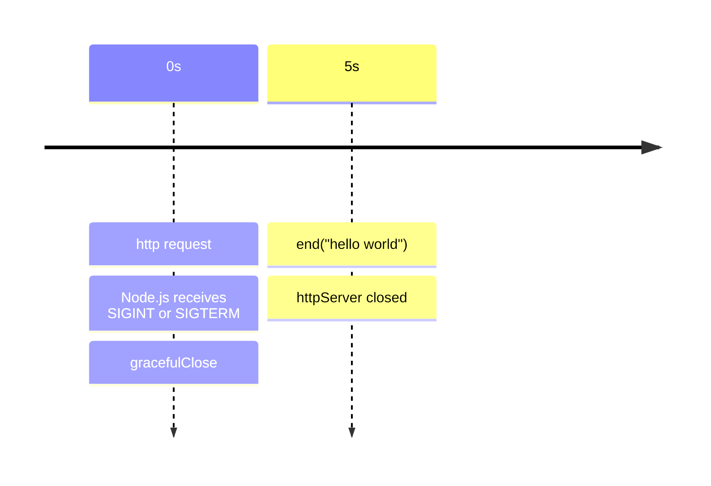

用 `curl http://localhost:5000` 實測

- curl 的 terminal 會收到 hello world
- Node.js 的 terminal 會收到 httpServer closed

將 http server 的 timeout 改成 20 秒

```ts
httpServer.on("request", (req, res) => {
  // 模擬延遲
  setTimeout(() => res.end("hello world"), 20000);
});
```

預期的時間軸如下

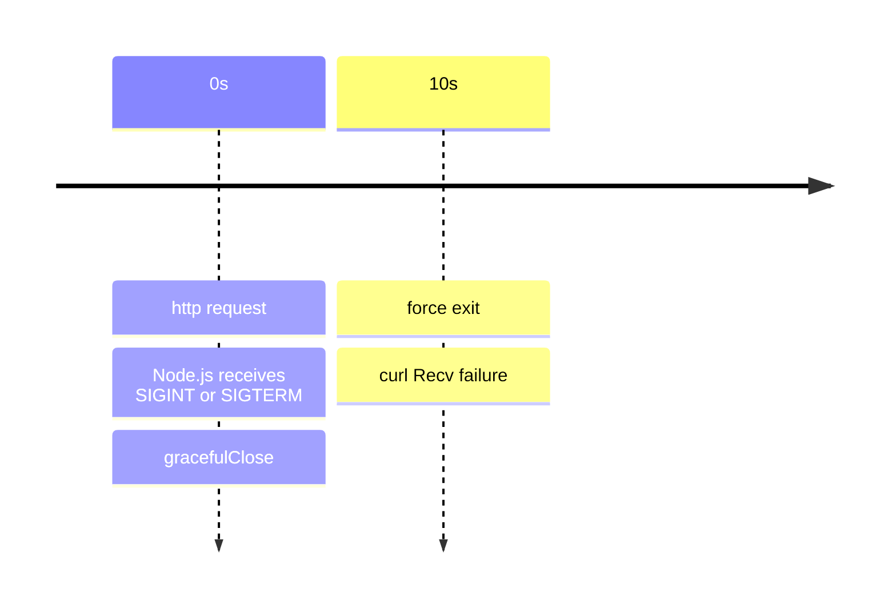

用 `curl http://localhost:5000` 實測

- curl 的 terminal 會收到 "curl: (56) Recv failure: Connection was reset"
- Node.js 的 terminal 會收到 "force exit"

## 防止 DoS, DDos 以及 Slowloris Attack

http server 承受來自四面八方的 HTTP Request，需要有一套機制防止惡意的請求，避免 server 的資源被消耗完。

### Prevent Incomplete Request

Node.js 提供以下 properties 可以設定 http server 的 timeout

- [http.createServer([options.connectionsCheckingInterval])](https://nodejs.org/api/http.html#httpcreateserveroptions-requestlistener)
- [server.headersTimeout](https://nodejs.org/api/http.html#serverheaderstimeout)
- [server.requestTimeout](https://nodejs.org/api/http.html#serverrequesttimeout)

一個正常的 HTTP Request 如下

```
POST /user HTTP/1.1
Host: example.com
Content-Length: 23
Content-Type: application/json

{ "username": "hello" }
```

Node.js http server 只要收到完整的 headers 就可以觸發 `'request'` 事件。寫個 PoC 驗證：

```ts
import http from "http";

// http server
const httpServer = http.createServer().listen(5000);
httpServer.on("request", (req, res) => {
  console.log(req.headers);
});

// http client (use net.Socket to control raw bytes)
const socket = net.createConnection({ host: "localhost", port: 5000 });
socket.write(
  "POST /user HTTP/1.1\r\nHost: example.com\r\nContent-Length: 23\r\nContent-Type: application/json\r\n\r\n",
);

// Prints
// {
//   host: 'example.com',
//   'content-length': '23',
//   'content-type': 'application/json'
// }
```

[RFC 9110#section-5.3](https://datatracker.ietf.org/doc/html/rfc9110#section-5.3) 也有提到，http server 需要收到完整的 request headers section，才可以發送回應。所以 Node.js 選擇在 request headers 完整以後，才觸發 `'reuqest'` 事件，這邊是合理的（不需要等到 body 送完才觸發）

```
A server MUST NOT apply a request to the target resource until it receives the entire request header section
```

我們現在知道 request headers 區塊的邊界了，若 Client 刻意不發送完整的 request headers

```ts
import http from "http";

// http server
// ✅ 調低 connectionsCheckingInterval，比較好觀察 headersTimeout 的秒數
const httpServer = http.createServer({ connectionsCheckingInterval: 0 });
httpServer.headersTimeout = 3000;
httpServer.listen(5000);
httpServer.on("request", (req, res) => {
  console.log(req.headers);
});

// http client (use net.Socket to control raw bytes)
const socket = net.createConnection({ host: "localhost", port: 5000 });
// ✅ 刻意不包含 headers 結尾的 `\r\n\r\n`，觸發 `headersTimeout`
const data =
  "POST /user HTTP/1.1\r\nHost: example.com\r\nContent-Length: 23\r\nContent-Type: application/json";
socket.write(data, () => console.log(performance.now())); // 884.3236
socket.on("data", (chunk) => {
  console.log(performance.now()); // 3892.4877
  console.log({ chunk }); // { chunk: 'HTTP/1.1 408 Request Timeout\r\nConnection: close\r\n\r\n' }
});
```

粗略的計算 "client 送出 data" 到 "client 收到 408 Request Timeout" 的時間差，剛好 3 秒 => 符合預期

再來測試 [server.requestTimeout](https://nodejs.org/api/http.html#serverrequesttimeout)

```ts
import http from "http";

// http server
// ✅ 調低 connectionsCheckingInterval，比較好觀察 headersTimeout 的秒數
const httpServer = http.createServer({ connectionsCheckingInterval: 0 });
// ✅ 由於 headersTimeout 的預設值是 Math.min(60000, requestTimeout)，故刻意設定一個比 requestTimeout 小的數字，方便觀察
httpServer.headersTimeout = 3000;
httpServer.requestTimeout = 4000;
httpServer.listen(5000);
httpServer.on("request", (req, res) => {
  req.resume();
  console.log(performance.now()); // 871.1117
  console.log(req.headers); // { 'content-length': '3', host: 'localhost:5000', connection: 'close' }
});

// http client
const clientRequest = http.request({
  host: "localhost",
  port: 5000,
  method: "POST",
  agent: false,
  // ✅ 宣告有 3 bytes 的 body
  headers: { "content-length": 3 },
});
// ✅ 送出完整的 headers，但不送出 body，以此觸發 requestTimeout
clientRequest.flushHeaders();
clientRequest.on("response", (res) => {
  console.log(performance.now()); // 4888.897
  console.log(res.statusCode, res.headers); // 408 { connection: 'close' }
});
```

粗略的計算 "client 送出 headers" 到 "client 收到 408 Request Timeout" 的時間差，剛好 4 秒 => 符合預期

如果想要自行處理 Request Timeout 的邏輯，可以在 http server 監聽 `'clientError'` 事件：

```ts
// 參考 lib/_http_server.js function socketOnError 的邏輯
httpServer.on("clientError", (err, socket) => {
  // ✅ 當 'clientError' 事件觸發時，Node.js 可能沒有收到完整的 HTTP Request Headers => 無法組出 `IncomingMessage`
  // ✅ 所以這個情況，user program 需要自行處理 `socket.write`, `socket.end` 以及 `socket.destroy`
  // ✅ The socket must be closed or destroyed before the listener ends.
  if (
    err instanceof Error &&
    (err as any).code === "ERR_HTTP_REQUEST_TIMEOUT" &&
    // @ts-ignore
    socket.writable &&
    (!socket._httpMessage || !socket._httpMessage._headerSent)
  ) {
    socket.write("HTTP/1.1 400 Bad Request\r\nConnection: close\r\n\r\n");
  }

  if (!socket.destroyed) socket.destroy();
});
```

### 限制 headers 大小

Node.js 提供以下 properties 可以限制 http client, server 的 headers 大小

- [http.maxHeaderSize](https://nodejs.org/api/http.html#httpmaxheadersize)
- [http.createServer([options.maxHeaderSize])](https://nodejs.org/api/http.html#httpcreateserveroptions-requestlistener)
- [http.request(url[, options.maxHeaderSize])](https://nodejs.org/api/http.html#httprequesturl-options-callback)
- [request.maxHeadersCount](https://nodejs.org/api/http.html#requestmaxheaderscount)
- [server.maxHeadersCount](https://nodejs.org/api/http.html#servermaxheaderscount)

先來測試 http server 的 `maxHeaderSize`

```ts
const httpServer = http.createServer({ maxHeaderSize: 100 });
httpServer.listen(5000);
httpServer.on("request", (req, res) => {
  res.end("hello world");
});
```

http client 使用 `net.Socket` 精準計算 100 bytes

```ts
const socket = net.createConnection({
  host: "localhost",
  port: 5000,
});
const dummy80Bytes = Array(80).fill(0).join("");
socket.write(`GET / HTTP/1.1\r\nHost: localhost:5000${dummy80Bytes}\r\n\r\n`);
socket.setEncoding("latin1");
socket.on("data", console.log);
```

正常回傳 200

```
HTTP/1.1 200 OK
Date: Thu, 19 Feb 2026 13:08:34 GMT
Connection: keep-alive
Keep-Alive: timeout=5
Content-Length: 11

hello world
```

接著增加 1 byte

```ts
const socket = net.createConnection({
  host: "localhost",
  port: 5000,
});
const dummy81Bytes = Array(81).fill(0).join("");
socket.write(`GET / HTTP/1.1\r\nHost: localhost:5000${dummy81Bytes}\r\n\r\n`);
socket.setEncoding("latin1");
socket.on("data", console.log);
```

收到 431，符合預期

```
HTTP/1.1 431 Request Header Fields Too Large
Connection: close


```

<!-- todo-yus -->不過如果處理多個 headers，計算 bytes 的邏輯就跟我預期的有點不一樣，這邊應該是要看 [llhttp](https://github.com/nodejs/llhttp) 的實作，但目前還沒讀到這裡～

再來測試 http server 的 `maxHeadersCount`

```ts
const httpServer = http.createServer();
httpServer.maxHeadersCount = 2;
httpServer.listen(5000);
httpServer.on("request", (req, res) => {
  // ✅ 將 req.headers 回寫到 response body 方便觀察
  res.end(JSON.stringify(req.headers));
});
```

送出以下 HTTP Request

```
GET / HTTP/1.1
Host: localhost:5000
Test: 67890
Foo: bar
AAA: 123


```

收到的 HTTP Response，發現 Node.js 把第三個以後的 headers 都切掉了

```
HTTP/1.1 200 OK
Date: Thu, 19 Feb 2026 15:11:38 GMT
Connection: keep-alive
Keep-Alive: timeout=5
Content-Length: 40

{"host":"localhost:5000","test":"67890"}
```

## IncomingMessage headers

Node.js 提供以下 properties 存取 `IncomingMessage` 的 headers

- [message.headers](https://nodejs.org/api/http.html#messageheaders)
- [message.headersDistinct](https://nodejs.org/api/http.html#messageheadersdistinct)
- [message.rawHeaders](https://nodejs.org/api/http.html#messagerawheaders)

假設以下 HTTP Request

```
GET / HTTP/1.1
Host: localhost:5000
host: 123


```

會得到以下 headers

```json
{
  // ✅ `joinDuplicateHeaders` defaults to `false`, which means second `host` header will be discard.
  "headers": {
    "host": "localhost:5000"
  },
  // ✅ `headersDistinct` returns array of distinct values.
  "headersDistinct": {
    "host": ["localhost:5000", "123"]
  },
  // ✅ `rawHeaders` is exactly as they were received.
  "rawHeaders": ["Host", "localhost:5000", "host", "123"]
}
```

## IncomingMessage Start Line

Client, Server 都有的

- [message.httpVersion](https://nodejs.org/api/http.html#messagehttpversion)

Server 會收到的

- [message.url](https://nodejs.org/api/http.html#messageurl)
- [message.method](https://nodejs.org/api/http.html#messagemethod)

Client 會收到的

- [message.statusCode](https://nodejs.org/api/http.html#messagestatuscode)
