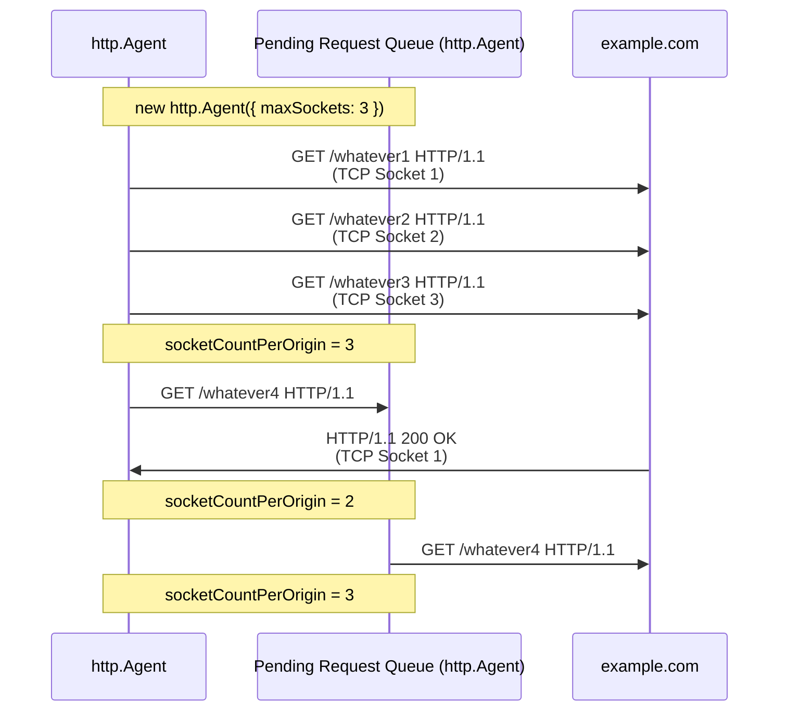
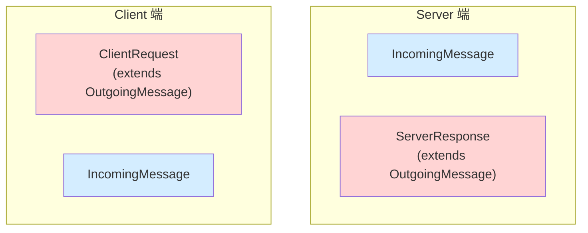

## 前言

我們有了以下知識

- [EventEmitter](./events.md)
- [stream-overview](./stream-overview.md)
- [stream.Readable](./stream-readable.md)
- [stream.Writable](./stream-writable.md)
- [socket-overview](./socket-overview.md)
- [socket-life-cycle](./socket-life-cycle.md)

終於可以進到 Node.js http 模組了！

## http.Agent

### Why http.Agent ?

如果沒有 [http.Agent](https://nodejs.org/api/http.html#class-httpagent) 的話

```ts
// Server
const server = http.createServer((req, res) => {
  console.log("req.headers", req.headers);
  res.end();
});
server.listen(5000);

// Client
const noop = () => {};
const request = http.request({
  host: "localhost",
  port: 5000,
  path: "/",
  agent: false, // ✅
});
request.end();
request.on("response", (res) => {
  console.log("res.headers", res.headers);
  res.resume();
  res.on("end", noop);
});
```

從 log 的 [Connection: close](../http/keep-alive-and-connection.md) 可以得出結論：每次 HTTP Round Trip 結束，都會關閉 TCP 連線

```ts
req.headers { host: 'localhost:5000', connection: 'close' }
res.headers {
  date: 'Fri, 06 Feb 2026 01:33:20 GMT',
  connection: 'close',
  'content-length': '0'
}
```

從 TCP (layer 4) 的角度來看，每次都需要
<span style={{ color: "red" }}>"三次交握開啟連線"</span> + <span style={{ color: "green" }}>"四次交握關閉連線"</span>，效能上會比較差


http.Agent 為此而生，它幫使用者管理

- TCP Socket 連線池
- concurrent 連線上限

<!-- Node.js 使用 [http.request](https://nodejs.org/api/http.html#httprequestoptions-callback) 發起 HTTP Request 時，若沒有使用 [http.Agent](https://nodejs.org/api/http.html#class-httpagent)，則每個請求都會創建一個新的 TCP 連線，並且該連線傳輸完這個 HTTP Request 就會關閉。若從 TCP (Layer 4) 的角度來看，每次都需要三次交握開啟連線 + 四次交握關閉連線，效能上會比較差。所以，管理 TCP Socket 連線池就成了一門學問，http.Agent 正是為此而生（當然 http.Agent 能做到的不止是管理 TCP Socket 連線池）。 -->

### new http.Agent(options)

https://nodejs.org/api/http.html#new-agentoptions

<!-- todo-yus 測試 -->

| option                      | description                                                                                                                                                                                                                 |
| --------------------------- | --------------------------------------------------------------------------------------------------------------------------------------------------------------------------------------------------------------------------- |
| keepAlive                   | Keep sockets around even when there are no outstanding requests,<br/>so they can be used for future requests without having to reestablish a TCP connection.                                                                |
| keepAliveMsecs              | 同 [net.createServer](https://nodejs.org/api/net.html#netcreateserveroptions-connectionlistener) 的 `keepAliveInitialDelay`                                                                                                 |
| agentKeepAliveTimeoutBuffer | 假設 Server 設定 `keep-alive: timeout=3`<br/>Agent 設定 `agentKeepAliveTimeoutBuffer = 1000`<br/>那 Agent 會在 3 \* 1000 - 1000 = 2 秒後，將這個連線視為過期<br/>為了避免 Client 還想傳送資料，但 Server 已經要關閉這條連線 |
| maxSockets                  | 每個 Origin 最多可以有幾個 concurrent TCP Socket<br/>參考 [options.maxSockets 圖解](#optionsmaxsockets-圖解)<br/>(Origin 是 [agent.getName([options])](https://nodejs.org/api/http.html#agentgetnameoptions) 的回傳值)      |
| maxTotalSockets             | 最多可以有幾個 concurrent TCP Socket                                                                                                                                                                                        |
| maxFreeSockets              | Only works when `keepAlive = true`                                                                                                                                                                                          |
| scheduling                  | 要如何從陣列中選擇 free Socket<br/>- fifo (First In First Out)<br/>- lifo (Last In First Out)                                                                                                                               |
| timeout                     | 同 [socket.timeout](https://nodejs.org/api/net.html#sockettimeout)                                                                                                                                                          |
| proxyEnv                    | v24.5.0 加入的，暫不討論                                                                                                                                                                                                    |
| defaultPort                 | Default port to use when the port is not specified in requests.                                                                                                                                                             |
| protocol                    | The protocol to use for the agent.                                                                                                                                                                                          |

### methods

| method                                                                                                          | description                                                                                                                                      |
| --------------------------------------------------------------------------------------------------------------- | ------------------------------------------------------------------------------------------------------------------------------------------------ |
| [createConnection(options[, callback])](https://nodejs.org/api/http.html#agentcreateconnectionoptions-callback) | 同 [net.createConnection()](https://nodejs.org/api/net.html#netcreateconnection)<br/>❌ 正常使用者不會碰到它<br/>有需要客製化行為才需要 override |
| [keepSocketAlive(socket)](https://nodejs.org/api/http.html#agentkeepsocketalivesocket)                          | ❌ 正常使用者不會碰到它<br/>有需要客製化行為才需要 override                                                                                      |
| [reuseSocket(socket, request)](https://nodejs.org/api/http.html#agentreusesocketsocket-request)                 | ❌ 正常使用者不會碰到它<br/>有需要客製化行為才需要 override                                                                                      |
| [destroy()](https://nodejs.org/api/http.html#agentdestroy)                                                      | 銷毀整個 http.Agent                                                                                                                              |
| [getName([options])](https://nodejs.org/api/http.html#agentgetnameoptions)                                      | ❌ 正常使用者不會碰到它<br/>用來當作連線池的 group key<br/>詳細請參考 [這裡](#read-only-properties)                                              |

### properties

這三個是在 [new http.Agent(options)](#new-httpagentoptions) 設定的，故不多贅述

- [maxSockets](https://nodejs.org/api/http.html#agentmaxsockets)
- [maxFreeSockets](https://nodejs.org/api/http.html#agentmaxfreesockets)
- [maxTotalSockets](https://nodejs.org/api/http.html#agentmaxtotalsockets)

### Read-Only properties

這三個則是由 http.Agent 控制的

- [freeSockets](https://nodejs.org/api/http.html#agentfreesockets): 連線池，可使用的 sockets

```ts
{
  'example.com:80:': [Socket],
  'www.google.com:80:': [Socket]
}
```

- [requests](https://nodejs.org/api/http.html#agentrequests): Pending Request Queue，參考 [options.maxSockets](#optionsmaxsockets)

```ts
{
  'example.com:80:': [ClientRequest, ClientRequest],
  'www.google.com:80:': [ClientRequest, ClientRequest]
}
```

- [sockets](https://nodejs.org/api/http.html#agentsockets): http.Agent 使用中的 sockets

```ts
{
  'example.com:80:': [Socket],
  'www.google.com:80:': [Socket]
}
```

這邊的 `example.com:80:` 跟 `www.google.com:80:` 就是 [getName([options])](https://nodejs.org/api/http.html#agentgetnameoptions) 回傳的 group key

### options.maxSockets 圖解



## Request, Response Classes 介紹

Node.js 跟 Request, Response 相關的 Class 有四個

- [http.ClientRequest](https://nodejs.org/api/http.html#class-httpclientrequest)：Client 送出的請求
- [http.ServerResponse](https://nodejs.org/api/http.html#class-httpserverresponse)：Server 送出的回應
- [http.IncomingMessage](https://nodejs.org/api/http.html#class-httpincomingmessage)：Server 讀取的請求 or Client 讀取的回應
- [http.OutgoingMessage](https://nodejs.org/api/http.html#class-httpoutgoingmessage)：抽象 Class，ClientRequest 跟 ServerResponse 都繼承它

之前在 [Node.js stream 入門](./stream-overview.md) 那篇文章有提到這些 Class 的關係，這邊再統整一次



Client Side Code

```ts
const clientRequest = http.get({
  host: "example.com",
  port: 80,
  path: "/",
});
clientRequest.on("response", (response: http.IncomingMessage) =>
  response.resume(),
);
```

Server Side Code

```ts
const server = http
  .createServer((req: http.IncomingMessage, res: http.ServerResponse) => {
    res.end();
  })
  .listen(5000);
```

## ClientRequest & ServerResponse

### 到底啥時才會送出 header: 了解其 API 的設計

setHeader

- [request.setHeader(name, value)](https://nodejs.org/api/http.html#requestsetheadername-value)
- [response.setHeader(name, value)](https://nodejs.org/api/http.html#responsesetheadername-value)
- [outgoingMessage.setHeader(name, value)](https://nodejs.org/api/http.html#outgoingmessagesetheadername-value)

setHeaders

- [outgoingMessage.setHeaders(headers)](https://nodejs.org/api/http.html#outgoingmessagesetheadersheaders)

flushHeaders

- [request.flushHeaders()](https://nodejs.org/api/http.html#requestflushheaders)
- [response.flushHeaders()](https://nodejs.org/api/http.html#responseflushheaders)
- [outgoingMessage.flushHeaders()](https://nodejs.org/api/http.html#outgoingmessageflushheaders)

removeHeader

- [request.removeHeader(name)](https://nodejs.org/api/http.html#requestremoveheadername)
- [response.removeHeader(name)](https://nodejs.org/api/http.html#responseremoveheadername)
- [outgoingMessage.removeHeader(name)](https://nodejs.org/api/http.html#outgoingmessageremoveheadername)

headersSent

- [response.headersSent](https://nodejs.org/api/http.html#responseheaderssent)
- [outgoingMessage.headersSent](https://nodejs.org/api/http.html#outgoingmessageheaderssent)

writeHead

- [response.writeHead(statusCode[, statusMessage][, headers])](https://nodejs.org/api/http.html#responsewriteheadstatuscode-statusmessage-headers)

<!-- todo-yus 介紹 -->

### 送出 body 的學問: Content-Length 跟 Transfer-Encoding

write

- [request.write](https://nodejs.org/api/http.html#requestwritechunk-encoding-callback)
- [response.write](https://nodejs.org/api/http.html#responsewritechunk-encoding-callback)

end

- [request.end([data[, encoding]][, callback])](https://nodejs.org/api/http.html#requestenddata-encoding-callback)
- [response.end([data[, encoding]][, callback])](https://nodejs.org/api/http.html#responseenddata-encoding-callback)
- [outgoingMessage.end(chunk[, encoding][, callback])](https://nodejs.org/api/http.html#outgoingmessageendchunk-encoding-callback)

### 取得 header 的相關 methods

- [getHeader(name)](https://nodejs.org/api/http.html#outgoingmessagegetheadername)
- [getHeaderNames()](https://nodejs.org/api/http.html#outgoingmessagegetheadernames)
- [getHeaders()](https://nodejs.org/api/http.html#outgoingmessagegetheaders)
- [hasHeader(name)](https://nodejs.org/api/http.html#outgoingmessagehasheadername)

## http.ClientRequest

### events

- [close](https://nodejs.org/api/http.html#event-close)
- [finish](https://nodejs.org/api/http.html#event-finish)
- [information](https://nodejs.org/api/http.html#event-information)
- [socket](https://nodejs.org/api/http.html#event-socket)
- [timeout](https://nodejs.org/api/http.html#event-timeout)
- [upgrade](https://nodejs.org/api/http.html#event-upgrade)

<!-- ### 100-continue

- [Event: `'continue'`](https://nodejs.org/api/http.html#event-continue) -->
