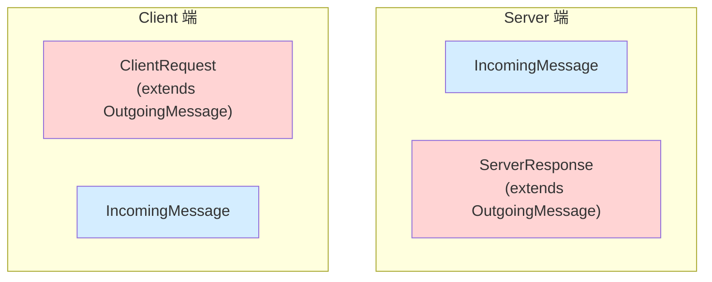
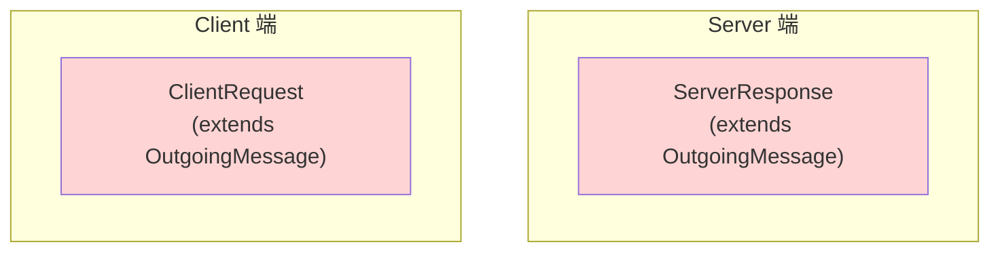
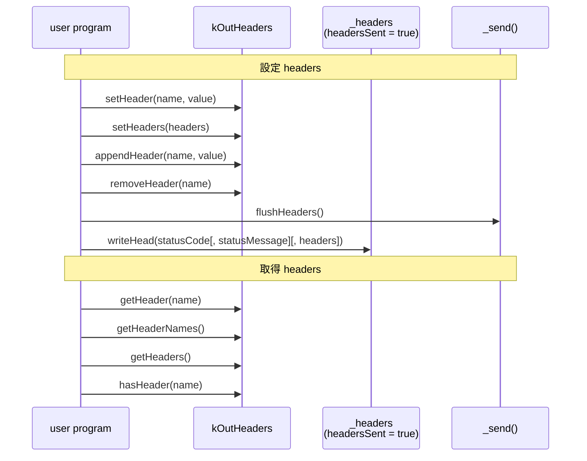
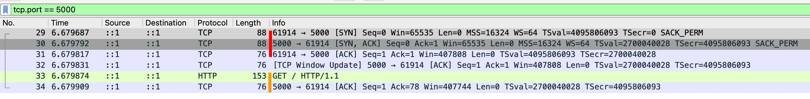

## Request, Response Classes 介紹

Node.js 跟 Request, Response 相關的 Class 有四個

- [http.ClientRequest](https://nodejs.org/docs/latest-v24.x/api/http.html#class-httpclientrequest)：Client 送出的請求
- [http.ServerResponse](https://nodejs.org/docs/latest-v24.x/api/http.html#class-httpserverresponse)：Server 送出的回應
- [http.IncomingMessage](https://nodejs.org/docs/latest-v24.x/api/http.html#class-httpincomingmessage)：Server 讀取的請求 or Client 讀取的回應
- [http.OutgoingMessage](https://nodejs.org/docs/latest-v24.x/api/http.html#class-httpoutgoingmessage)：抽象 Class，ClientRequest 跟 ServerResponse 都繼承它

之前在 [Node.js stream 入門](./stream-overview.md) 那篇文章有提到這些 Class 的關係，這邊再統整一次



Client Side Code

```ts
const clientRequest = http.get({
  host: "example.com",
  port: 80,
  path: "/",
});
clientRequest.on("response", (response: http.IncomingMessage) =>
  response.resume(),
);
```

Server Side Code

```ts
const server = http
  .createServer((req: http.IncomingMessage, res: http.ServerResponse) => {
    res.end();
  })
  .listen(5000);
```

## ClientRequest & ServerResponse

我們現在把視角拉入 "HTTP Request / Response 的寫入"



## 寫入流程 1：何時才會送出 header ? 了解 Node.js API 的設計

Node.js 提供了以下 methods 跟 properties 可以設定 headers

- setHeader
  - [request.setHeader(name, value)](https://nodejs.org/docs/latest-v24.x/api/http.html#requestsetheadername-value)
  - [response.setHeader(name, value)](https://nodejs.org/docs/latest-v24.x/api/http.html#responsesetheadername-value)
  - [outgoingMessage.setHeader(name, value)](https://nodejs.org/docs/latest-v24.x/api/http.html#outgoingmessagesetheadername-value)
- setHeaders
  - [outgoingMessage.setHeaders(headers)](https://nodejs.org/docs/latest-v24.x/api/http.html#outgoingmessagesetheadersheaders)
- appendHeader
  - [outgoingMessage.appendHeader(name, value)](https://nodejs.org/docs/latest-v24.x/api/http.html#outgoingmessageappendheadername-value)
- flushHeaders
  - [request.flushHeaders()](https://nodejs.org/docs/latest-v24.x/api/http.html#requestflushheaders)
  - [response.flushHeaders()](https://nodejs.org/docs/latest-v24.x/api/http.html#responseflushheaders)
  - [outgoingMessage.flushHeaders()](https://nodejs.org/docs/latest-v24.x/api/http.html#outgoingmessageflushheaders)
- removeHeader
  - [request.removeHeader(name)](https://nodejs.org/docs/latest-v24.x/api/http.html#requestremoveheadername)
  - [response.removeHeader(name)](https://nodejs.org/docs/latest-v24.x/api/http.html#responseremoveheadername)
  - [outgoingMessage.removeHeader(name)](https://nodejs.org/docs/latest-v24.x/api/http.html#outgoingmessageremoveheadername)
- headersSent
  - [response.headersSent](https://nodejs.org/docs/latest-v24.x/api/http.html#responseheaderssent)
  - [outgoingMessage.headersSent](https://nodejs.org/docs/latest-v24.x/api/http.html#outgoingmessageheaderssent)
- writeHead
  - [response.writeHead(statusCode[, statusMessage][, headers])](https://nodejs.org/docs/latest-v24.x/api/http.html#responsewriteheadstatuscode-statusmessage-headers)

並且以下 methods 可以取得 headers

- getHeader()
  - [request.getHeader(name)](https://nodejs.org/docs/latest-v24.x/api/http.html#requestgetheadername)
  - [response.getHeader(name)](https://nodejs.org/docs/latest-v24.x/api/http.html#responsegetheadername)
  - [outgoingMessage.getHeader(name)](https://nodejs.org/docs/latest-v24.x/api/http.html#outgoingmessagegetheadername)
- getHeaderNames()
  - [request.getHeaderNames()](https://nodejs.org/docs/latest-v24.x/api/http.html#requestgetheadernames)
  - [response.getHeaderNames()](https://nodejs.org/docs/latest-v24.x/api/http.html#responsegetheadernames)
  - [outgoingMessage.getHeaderNames()](https://nodejs.org/docs/latest-v24.x/api/http.html#outgoingmessagegetheadernames)
- getHeaders()
  - [request.getHeaders()](https://nodejs.org/docs/latest-v24.x/api/http.html#requestgetheaders)
  - [response.getHeaders()](https://nodejs.org/docs/latest-v24.x/api/http.html#responsegetheaders)
  - [outgoingMessage.getHeaders()](https://nodejs.org/docs/latest-v24.x/api/http.html#outgoingmessagegetheaders)
- hasHeader()
  - [request.hasHeader(name)](https://nodejs.org/docs/latest-v24.x/api/http.html#requesthasheadername)
  - [response.hasHeader(name)](https://nodejs.org/docs/latest-v24.x/api/http.html#responsehasheadername)
  - [outgoingMessage.hasHeader(name)](https://nodejs.org/docs/latest-v24.x/api/http.html#outgoingmessagehasheadername)

Node.js 把整個 headers 的操作分成三個階段，我們可以用 git 的概念來類比

|                 | 本地暫存             | 本地 Commit（不可再修改） | 真正送出  |
| --------------- | -------------------- | ------------------------- | --------- |
| OutgoingMessage | kOutHeaders (object) | `_headers` (string)       | `_send()` |
| git             | local changes        | local commit              | git push  |



Node.js 的設計哲學是 "盡量把 headers 延遲到跟著 body 一起發送"，從 [`flushHeaders()`](https://nodejs.org/docs/latest-v24.x/api/http.html#outgoingmessageflushheaders) 的官方文件可以得知

```
For efficiency reason, Node.js normally buffers the message headers until outgoingMessage.end() is called or the first chunk of message data is written. It then tries to pack the headers and data into a single TCP packet.

It is usually desired (it saves a TCP round-trip), but not when the first data is not sent until possibly much later. outgoingMessage.flushHeaders() bypasses the optimization and kickstarts the message.
```

## 寫入流程 1：PoC 測試 `writeHead`

```ts
const server = http.createServer();
server.listen(5000);
server.on("request", (req, res) => {
  res.writeHead(200, { a: "1", b: "2" });

  assert(res.headersSent);

  // ✅ Can't get header after headersSent
  assert(res.getHeader("a") === undefined);
  assert(Object.keys(res.getHeaders()).length === 0);
  assert(res.getHeaderNames().length === 0);
  assert(res.hasHeader("a") === false);

  // ✅ Can't set header after headersSent
  try {
    res.setHeader("a", "1");
  } catch (e) {
    assert(e instanceof Error);
    assert((e as any).code === "ERR_HTTP_HEADERS_SENT");
  }

  // ✅ Can't set header after headersSent
  try {
    res.setHeaders(new Headers({ a: "1" }));
  } catch (e) {
    assert(e instanceof Error);
    assert((e as any).code === "ERR_HTTP_HEADERS_SENT");
  }

  // ✅ Can't remove header after headersSent
  try {
    res.removeHeader("a");
  } catch (e) {
    assert(e instanceof Error);
    assert((e as any).code === "ERR_HTTP_HEADERS_SENT");
  }

  // ✅ If all assert is truthy, print ok
  console.log("ok");
});
```

用 `curl http://localhost:5000 -v` 測試

- ✅ Node.js 會輸出 `ok`
- ✅ curl 會停在 `* Request completely sent off`，因為 Server 還沒實際回傳 headers 跟 body

用 [Wireshark](https://www.wireshark.org/download.html) 抓 Loopback: lo0，加上篩選 tcp.port == 5000，確認 Server 真的沒有提前送 Response headers

- <span style={{ color: "red" }}>TCP 三方交握</span>
- <span style={{ color: "orange" }}>Client 傳送 HTTP Request, Server 回應收到 (TCP ACK)</span>
  

## 寫入流程 1：PoC 測試 `flushHeaders`

```ts
httpServer.on("request", (req, res) => {
  // ✅ 目前都還在 kOutHeaders 這邊 get / set headers，尚未送出
  res.setHeader("a", "1");
  assert(res.getHeader("a") === "1");
  assert(res.headersSent === false);

  // ✅ 目前都還在 kOutHeaders 這邊 get / set headers，尚未送出
  res.setHeaders(new Headers({ b: "2" }));
  assert(res.hasHeader("b"));
  assert(JSON.stringify(res.getHeaderNames()) === JSON.stringify(["a", "b"]));
  assert(res.headersSent === false);

  // ✅ 實際送出
  res.flushHeaders();
  assert(res.headersSent);

  // ✅ Can't set header after headersSent
  try {
    res.setHeader("a", "1");
  } catch (e) {
    assert(e instanceof Error);
    assert((e as any).code === "ERR_HTTP_HEADERS_SENT");
  }

  // ✅ Can't set header after headersSent
  try {
    res.setHeaders(new Headers({ a: "1" }));
  } catch (e) {
    assert(e instanceof Error);
    assert((e as any).code === "ERR_HTTP_HEADERS_SENT");
  }

  // ✅ Can't remove header after headersSent
  try {
    res.removeHeader("a");
  } catch (e) {
    assert(e instanceof Error);
    assert((e as any).code === "ERR_HTTP_HEADERS_SENT");
  }
});
```

用 `curl http://localhost:5000 -v` 測試，確實有收到 response headers，但我們沒送 body，所以連線會 timeout

```
< HTTP/1.1 200 OK
< a: 1
< b: 2
< Date: Fri, 13 Feb 2026 01:50:21 GMT
< Connection: keep-alive
< Keep-Alive: timeout=5
< Transfer-Encoding: chunked
<
* transfer closed with outstanding read data remaining
* Closing connection
curl: (18) transfer closed with outstanding read data remaining
```

## 寫入流程 2：送出 body

Node.js 提供了以下 methods 可以寫入 body

- write()
  - [request.write(chunk[, encoding][, callback])](https://nodejs.org/docs/latest-v24.x/api/http.html#requestwritechunk-encoding-callback)
  - [response.write(chunk[, encoding][, callback])](https://nodejs.org/docs/latest-v24.x/api/http.html#responsewritechunk-encoding-callback)
  - [outgoingMessage.write(chunk[, encoding][, callback])](https://nodejs.org/docs/latest-v24.x/api/http.html#outgoingmessagewritechunk-encoding-callback)
- end()
  - [request.end([data[, encoding]][, callback])](https://nodejs.org/docs/latest-v24.x/api/http.html#requestenddata-encoding-callback)
  - [response.end([data[, encoding]][, callback])](https://nodejs.org/docs/latest-v24.x/api/http.html#responseenddata-encoding-callback)
  - [outgoingMessage.end(chunk[, encoding][, callback])](https://nodejs.org/docs/latest-v24.x/api/http.html#outgoingmessageendchunk-encoding-callback)

`Content-Length` 跟 `Transfer-Encoding` 是 HTTP/1.1 定義 body 最重要的兩個 header，參考 [RFC 9112 Section 6. Message Body](https://datatracker.ietf.org/doc/html/rfc9112#section-6)

```
The presence of a message body in a request is signaled by a Content-Length or Transfer-Encoding header field.
```

## 寫入流程 2-1：使用 Content-Length

假設我要 Serve 一個靜態網站，每個 HTML, CSS, JS 都是預先 build 好的檔案，這情況就屬於 "已知 body 長度"

```ts
httpServer.on("request", (req, res) => {
  // ✅ 呼叫 end 的當下，若 header 沒有明確指定 transfer-encoding: chunked
  // ✅ 則 Node.js 會自動設定 Content-Length = 寫入的 body byteLength
  res.end(readFileSync(join(__dirname, "index.html")));
});
```

用 `curl http://localhost:5000 -v` 測試

```
< HTTP/1.1 200 OK
< Date: Fri, 13 Feb 2026 03:08:34 GMT
< Connection: keep-alive
< Keep-Alive: timeout=5
< Content-Length: 20
<
* Connection #0 to host localhost left intact
<h1>hello world</h1>
```

也可以自行設定 `Content-Length`

```ts
httpServer.on("request", (req, res) => {
  const fileBuffer = readFileSync(join(__dirname, "index.html"));
  res.setHeader("Content-Length", fileBuffer.byteLength);

  res.write(fileBuffer);
  res.end(); // ✅ 也可以簡化成一行 res.end(fileBuffer)
});

httpServer.on("request", (req, res) => {
  const fileBuffer = readFileSync(join(__dirname, "index.html"));
  res.setHeader("Content-Length", fileBuffer.byteLength);
  res.end(fileBuffer);
});
```

用 `curl http://localhost:5000 -v` 測試

```
< HTTP/1.1 200 OK
< Content-Length: 20
< Date: Fri, 13 Feb 2026 03:23:54 GMT
< Connection: keep-alive
< Keep-Alive: timeout=5
<
* Connection #0 to host localhost left intact
<h1>hello world</h1>
```

若檔案很大，則不建議用 `readFileSync` 把整個檔案讀進記憶體，可以使用 `pipe` 流式傳輸

```ts
httpServer.on("request", (req, res) => {
  // ✅ 先把 file size 設定到 Content-Length
  const filestat = statSync(join(__dirname, "demo-very-large-video.mp4"));
  res.setHeader("Content-Length", filestat.size);

  // ✅ 流式傳輸，避免一次讀取大檔案，把記憶體撐爆
  const readStream = createReadStream(
    join(__dirname, "demo-very-large-video.mp4"),
  );
  readStream.pipe(res);

  // ❌ todo: res, readStream error handle
});
```

## 寫入流程 2-2：使用 `Transfer-Encoding: chunked`

AI 工具在回應時，不會預先知道回應長度，這時候會使用 `Transfer-Encoding: chunked`，可參考我寫過的 [SSE: Server-Sent Events](../http/server-sent-events.md)

```ts
httpServer.on("request", (req, res) => {
  // ✅ 呼叫 write 的當下，若 header 沒有明確指定 Content-Length
  // ✅ 則 Node.js 會自動設定 Transfer-Encoding: chunked
  res.write("first line");
  res.write("second line");
  res.end("third line");
});
```

用 `curl http://localhost:5000 -v` 測試

```
< HTTP/1.1 200 OK
< Date: Fri, 13 Feb 2026 03:37:50 GMT
< Connection: keep-alive
< Keep-Alive: timeout=5
< Transfer-Encoding: chunked
<
* Connection #0 to host localhost left intact
first linesecond linethird line
```

## 寫入流程 3：body 送完以後的生命週期

以下 properties 跟 events 可以得知 body 送完以後的生命週期

- writableEnded
  - [request.writableEnded](https://nodejs.org/docs/latest-v24.x/api/http.html#requestwritableended)
  - [response.writableEnded](https://nodejs.org/docs/latest-v24.x/api/http.html#responsewritableended)
  - [outgoingMessage.writableEnded](https://nodejs.org/docs/latest-v24.x/api/http.html#outgoingmessagewritableended)
- on('prefinish')
  - [outgoingMessage.on('prefinish')](https://nodejs.org/docs/latest-v24.x/api/http.html#event-prefinish)
- on('finish')
  - [request.on('finish')](https://nodejs.org/docs/latest-v24.x/api/http.html#event-finish)
  - [response.on('finish')](https://nodejs.org/docs/latest-v24.x/api/http.html#event-finish)
  - [outgoingMessage.on('finish')](https://nodejs.org/docs/latest-v24.x/api/http.html#event-finish)
- writableFinished
  - [request.writableFinished](https://nodejs.org/docs/latest-v24.x/api/http.html#requestwritablefinished)
  - [response.writableFinished](https://nodejs.org/docs/latest-v24.x/api/http.html#responsewritablefinished)
  - [outgoingMessage.writableFinished](https://nodejs.org/docs/latest-v24.x/api/http.html#outgoingmessagewritablefinished)

時間軸如下


寫個 PoC 來測試

```ts
httpServer.on("request", (req, res) => {
  res.on("prefinish", () => {
    assert(res.writableEnded);
    console.log("prefinish");
  });

  res.on("finish", () => {
    assert(res.writableFinished);
    console.log("finish");
  });

  res.end("123", () => console.log("end cb"));
});

// Prints
// prefinish
// finish
// end cb
```

:::info
[outgoingMessage.on('prefinish')](https://nodejs.org/docs/latest-v24.x/api/http.html#event-prefinish) 其實是繼承 [stream.Writable](./stream-writable.md)<br/><br/>
不過 [Node.js stream 官方文件](https://nodejs.org/api/stream.html) 完全沒提到 `prefinish`，所以就當作一個小知識先記著就好～
:::

<!-- ## 軟木塞

- cork
  - [request.cork()](https://nodejs.org/docs/latest-v24.x/api/http.html#requestcork)
  - [response.cork()](https://nodejs.org/docs/latest-v24.x/api/http.html#responsecork)
  - [outgoingMessage.cork()](https://nodejs.org/docs/latest-v24.x/api/http.html#outgoingmessagecork)
- uncork
  - [request.uncork()](https://nodejs.org/docs/latest-v24.x/api/http.html#requestuncork)
  - [response.uncork()](https://nodejs.org/docs/latest-v24.x/api/http.html#responseuncork)
  - [outgoingMessage.uncork()](https://nodejs.org/docs/latest-v24.x/api/http.html#outgoingmessageuncork) -->
