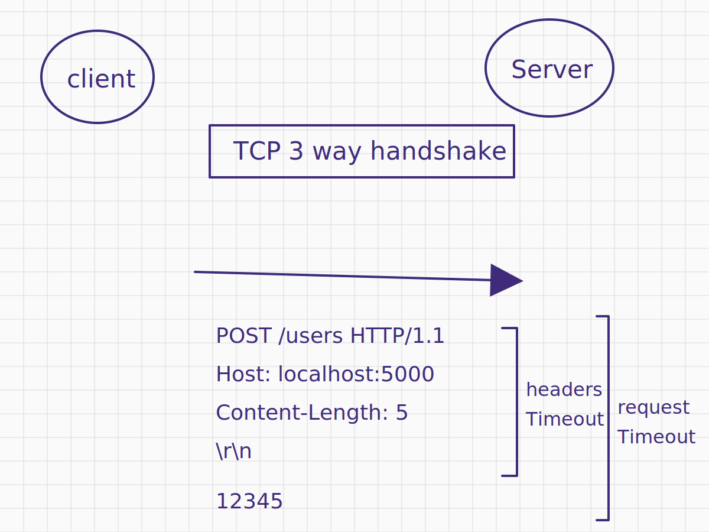

## 前言

HTTP server 每天要應付來自四面八方的 request，其中難免有惡意的 client，故意不送完整 headers、body 拖著不送、甚至塞進超大的 headers，都可能把 server 的資源耗光，也就是常聽到的 DoS、DDoS、Slowloris Attack，上線前這幾道防線最好都搞清楚！

## Prevent Incomplete Request

Node.js 提供以下 properties 可以設定 `http.Server` 的 timeout

- [http.createServer([options.connectionsCheckingInterval])](https://nodejs.org/docs/latest-v24.x/api/http.html#httpcreateserveroptions-requestlistener)
- [server.headersTimeout](https://nodejs.org/docs/latest-v24.x/api/http.html#serverheaderstimeout)
- [server.requestTimeout](https://nodejs.org/docs/latest-v24.x/api/http.html#serverrequesttimeout)

## 何時會觸發 `"request"` event

一個正常的 HTTP request 如下

```
POST /user HTTP/1.1
Host: localhost:5000
Content-Length: 5

12345
```

Node.js `http.Server` 只要收到完整的 headers 就會觸發 `"request"` 事件，寫個 PoC 驗證：

```ts
import http from "http";

// server
const httpServer = http.createServer().listen(5000);
httpServer.on("request", (req, res) => {
  console.log(req.headers);
});

// client (use net.Socket to control raw bytes)
const socket = net.createConnection({ host: "localhost", port: 5000 });
const httpMessage =
  "POST /user HTTP/1.1\r\n" +
  "Host: localhost:5000\r\n" +
  "Content-Length: 5\r\n\r\n";
socket.write(httpMessage);

// Prints
// { host: 'localhost:5000', 'content-length': '20' }
```

[RFC 9110#section-5.3](https://datatracker.ietf.org/doc/html/rfc9110#section-5.3) 也有提到，HTTP server 需要收到完整的 request headers section，才可以發送回應。所以 Node.js 選擇在 request headers 完整以後，才觸發 `'reuqest'` 事件，這邊是合理的（不需要等到 body 送完才觸發）

```
A server MUST NOT apply a request to the target resource until it receives the entire request header section
```

## `headersTimeout`

若 client 刻意不發送完整的 request headers，這時 server 就可以用 `headersTimeout` 來防止 request 永遠卡住

```ts
import http from "http";

// server
// ✅ 調低 connectionsCheckingInterval，比較好觀察 headersTimeout 的秒數
const httpServer = http.createServer({ connectionsCheckingInterval: 0 });
// ✅ 設定 headersTimeout = 3 秒
httpServer.headersTimeout = 3000;
httpServer.listen(5000);
httpServer.on("request", (req, res) => {
  console.log(req.headers);
});

// client (use net.Socket to control raw bytes)
const socket = net.createConnection({ host: "localhost", port: 5000 });
// ✅ 刻意不包含 headers 結尾的 `\r\n\r\n`，觸發 headersTimeout
const httpMessage =
  "POST /user HTTP/1.1\r\n" + "Host: localhost:5000\r\n" + "Content-Length: 5";
socket.write(httpMessage, () => console.log(performance.now())); // 884.3236
socket.setEncoding("latin1");
socket.on("data", (chunk) => {
  console.log(performance.now()); // 3892.4877
  console.log({ chunk }); // { chunk: 'HTTP/1.1 408 Request Timeout\r\nConnection: close\r\n\r\n' }
});
```

粗略的計算 **"client 送出 data"** 到 **"client 收到 408 Request Timeout"** 的時間差，剛好 3 秒 => 符合預期

並且 `headersTimeout` 是從 TCP connection 建立後就直接掛上 timer，即便 client 不送任何資料，還是會觸發

```js
// server
// ✅ 調低 connectionsCheckingInterval，比較好觀察 headersTimeout 的秒數
const httpServer = http.createServer({ connectionsCheckingInterval: 0 });
// ✅ 設定 headersTimeout = 3 秒
httpServer.headersTimeout = 3000;
httpServer.listen(5000);

// client
const socket = net.createConnection({ host: "localhost", port: 5000 });
socket.setEncoding("latin1");
socket.on("connect", () => console.log(performance.now(), "connect"));
socket.on("data", (data) => console.log(performance.now(), { data }));
socket.on("close", () => console.log(performance.now(), "close"));

// Prints
// 280.698083 connect
// 3286.0515 { data: 'HTTP/1.1 408 Request Timeout\r\nConnection: close\r\n\r\n' }
// 3288.512458 close
```

## `requestTimeout`

若 client 已發送完整的 request headers，但是 body 刻意卡著不送，server 就可以用 `requestTimeout` 來防止 request 永遠卡住

```ts
import http from "http";

// server
// ✅ 調低 connectionsCheckingInterval，比較好觀察 headersTimeout 的秒數
const httpServer = http.createServer({ connectionsCheckingInterval: 0 });
// ✅ 由於 headersTimeout 的預設值是 Math.min(60000, requestTimeout)
// ✅ 故刻意設定一個比 requestTimeout 小的數字，方便觀察 requestTimeout 的效果
httpServer.headersTimeout = 3000;
httpServer.requestTimeout = 4000;
httpServer.listen(5000);
httpServer.on("request", (req, res) => {
  req.resume();
  console.log(performance.now()); // 871.1117
  console.log(req.headers); // { 'content-length': '3', host: 'localhost:5000', connection: 'close' }
});

// client
const clientRequest = http.request({
  host: "localhost",
  port: 5000,
  method: "POST",
  agent: false,
  // ✅ 宣告有 3 bytes 的 body
  headers: { "content-length": 3 },
});
// ✅ 送出完整的 headers，但不送出 body，以此觸發 requestTimeout
clientRequest.flushHeaders();
clientRequest.on("response", (res) => {
  console.log(performance.now()); // 4888.897
  console.log(res.statusCode, res.headers); // 408 { connection: 'close' }
});
```

粗略的計算 **"client 送出 headers"** 到 **"client 收到 408 Request Timeout"** 的時間差，剛好 4 秒 => 符合預期

## `on("clientError")`

如果想要自行處理 request timeout 的邏輯，可以在 `http.Server` 監聽 `"clientError"` 事件：

```ts
import http from "http";

// server
const httpServer = http.createServer({ connectionsCheckingInterval: 0 });
httpServer.headersTimeout = 3000;
httpServer.requestTimeout = 4000;

// 參考 lib/_http_server.js
// function socketOnError 的邏輯
httpServer.on("clientError", (err, socket) => {
  // ✅ 當 "clientError" 事件觸發時，Node.js 可能沒有收到完整的 HTTP request headers => 無法組出 `IncomingMessage`
  // ✅ 所以這個情況，user program 需要自行處理 `socket.write`, `socket.end` 以及 `socket.destroy`
  // ✅ 根據官方文件 https://nodejs.org/api/http.html#event-clienterror
  // ✅ The socket must be closed or destroyed before the listener ends.
  if (
    socket.writable &&
    // @ts-ignore
    (!socket._httpMessage || !socket._httpMessage._headerSent)
  ) {
    socket.write("HTTP/1.1 400 Bad Request\r\nConnection: close\r\n\r\n");
  }

  if (!socket.destroyed) socket.destroy();
});

// client
const clientRequest = http.request({
  host: "localhost",
  port: 5000,
  method: "POST",
  agent: false,
  // ✅ 宣告有 3 bytes 的 body
  headers: { "content-length": 3 },
});
// ✅ 送出完整的 headers，但不送出 body，以此觸發 requestTimeout
clientRequest.flushHeaders();
clientRequest.on("response", (res) => {
  console.log(performance.now()); // 4888.897
  console.log(res.statusCode, res.headers); // 400 { connection: 'close' }
});
```

## `headersTimeout` 跟 `requestTimeout` 圖解



## 限制 headers 大小

Node.js 提供以下 properties 可以限制 HTTP client, server 的 headers 大小

- [http.maxHeaderSize](https://nodejs.org/docs/latest-v24.x/api/http.html#httpmaxheadersize)
- [http.createServer([options.maxHeaderSize])](https://nodejs.org/docs/latest-v24.x/api/http.html#httpcreateserveroptions-requestlistener)
- [http.request(url[, options.maxHeaderSize])](https://nodejs.org/docs/latest-v24.x/api/http.html#httprequesturl-options-callback)
- [request.maxHeadersCount](https://nodejs.org/docs/latest-v24.x/api/http.html#requestmaxheaderscount)
- [server.maxHeadersCount](https://nodejs.org/docs/latest-v24.x/api/http.html#servermaxheaderscount)

## `maxHeaderSize`

server 設定 100 bytes

```ts
const httpServer = http.createServer({ maxHeaderSize: 100 });
httpServer.listen(5000);
httpServer.on("request", (req, res) => {
  res.end("hello world");
});
```

client 使用 `net.Socket` 精準計算 100 bytes

```ts
const socket = net.createConnection({
  host: "localhost",
  port: 5000,
});
const hostHeader = "Host: localhost:5000";
const dummyBytes = Array(100 - hostHeader.length)
  .fill(0)
  .join("");
socket.write(`GET / HTTP/1.1\r\n${hostHeader}${dummyBytes}\r\n\r\n`);
socket.setEncoding("latin1");
socket.on("data", console.log);
```

正常回傳 200

```
HTTP/1.1 200 OK
Connection: keep-alive
Keep-Alive: timeout=5
Content-Length: 11

hello world
```

接著增加 1 byte

```ts
const socket = net.createConnection({
  host: "localhost",
  port: 5000,
});
const hostHeader = "Host: localhost:5000";
const dummyBytes = Array(100 - hostHeader.length + 1)
  .fill(0)
  .join("");
socket.write(`GET / HTTP/1.1\r\n${hostHeader}${dummyBytes}\r\n\r\n`);
socket.setEncoding("latin1");
socket.on("data", console.log);
```

收到 431，符合預期

```
HTTP/1.1 431 Request Header Fields Too Large
Connection: close


```

<!-- todo-yus -->
<!-- 不過如果處理多個 headers，計算 bytes 的邏輯就跟我預期的有點不一樣，這邊應該是要看 [llhttp](https://github.com/nodejs/llhttp) 的實作，但目前還沒讀到這裡～ -->

## `maxHeadersCount`

server 設定 `maxHeadersCount = 2`

```ts
const httpServer = http.createServer();
httpServer.maxHeadersCount = 2;
httpServer.listen(5000);
httpServer.on("request", (req, res) => {
  // ✅ 將 req.headers 回寫到 response body 方便觀察
  res.end(JSON.stringify(req.headers));
});
```

client 送出一個 HTTP request，包含 4 個 headers

```
GET / HTTP/1.1
Host: localhost:5000
Test: 67890
Foo: bar
AAA: 123


```

收到的 HTTP response，發現 Node.js 把第三個以後的 headers 都切掉了

```
HTTP/1.1 200 OK
Connection: keep-alive
Keep-Alive: timeout=5
Content-Length: 40

{"host":"localhost:5000","test":"67890"}
```

## 小結

在這篇文章，我們學到了

- `http.Server` 收到完整 request headers 就會觸發 `"request"` 事件，不需等 body 送完
- `headersTimeout` 防止 client 卡住不送完整 headers
- `requestTimeout` 防止 headers 送完後卡住不送 body
- 透過 `on("clientError")` 可以自行處理 timeout 或畸形 request 的回應與 socket 關閉邏輯
- `maxHeaderSize` 限制單一 request 的 headers 總 bytes 數，超過會回 431
- `maxHeadersCount` 限制 headers 的數量，超過的部分會被直接截斷
