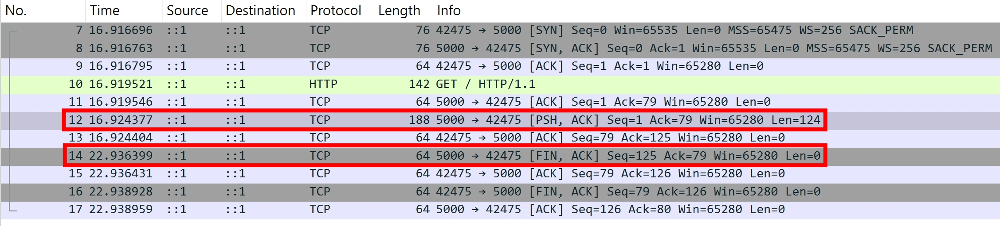

## 給 Server 加上防呆: response.strictContentLength

[response.strictContentLength](https://nodejs.org/docs/latest-v24.x/api/http.html#responsestrictcontentlength)

Node.js http server 預設 "不會" 檢查 response header 的 `Content-Length` 跟實際送出的 body 是否 match

## `Content-Length` 大於 actual bytes

若宣告 `Content-Length: 3`，實際只送 2 bytes，就會造成 http client 的錯誤

```ts
const httpServer = http.createServer();
httpServer.listen(5000);
httpServer.on("request", (req, res) => {
  res.setHeader("Content-Length", 3);
  res.end("12");
});
```

用 `curl http://localhost:5000/ -v` 測試，發現 curl 等待幾秒左右就關閉連線了

```
< HTTP/1.1 200 OK
< Content-Length: 3
< Date: Mon, 23 Feb 2026 06:29:32 GMT
< Connection: keep-alive
< Keep-Alive: timeout=5
<
* transfer closed with 1 bytes remaining to read
* Closing connection
curl: (18) transfer closed with 1 bytes remaining to read
12
```

用 [Wireshark](https://www.wireshark.org/download.html) 抓 Loopback: lo0，加上篩選 tcp.port == 5000。發現 Server 回傳 HTTP Response 的 6 秒後，Server 主動關閉連線


這 6 秒是以下兩個的預設值相加得來的

- [server.keepAliveTimeout](https://nodejs.org/docs/latest-v24.x/api/http.html#serverkeepalivetimeout)
- [server.keepAliveTimeoutBuffer](https://nodejs.org/docs/latest-v24.x/api/http.html#serverkeepalivetimeoutbuffer)

改用 Node.js `http.request` 測試

```ts
const clientRequest = http.request({ host: "localhost", port: 5000 });
clientRequest.end();
clientRequest.on("response", (res) => {
  console.log(performance.now(), res.headers);
  res.setEncoding("latin1");
  res.on("data", console.log);
  res.on("end", () => console.log("end")); // ❌ end will not trigger
  res.on("error", console.log);
  res.on("close", () => console.log(performance.now(), "close"));
});

// Prints
// 1184.9179 {
//   'content-length': '3',
//   date: 'Mon, 23 Feb 2026 11:10:16 GMT',
//   connection: 'keep-alive',
//   'keep-alive': 'timeout=5'
// }
// 12
// Error: aborted
//     at Socket.socketCloseListener (node:_http_client:535:19)
//     at Socket.emit (node:events:520:35)
//     at Socket.emit (node:domain:489:12)
//     at TCP.<anonymous> (node:net:346:12) {
//   code: 'ECONNRESET'
// }
// 7190.6428 close
```

得出的結果也是 6 秒 (7190 - 1184)

## `Content-Length` 小於 actual bytes

若宣告 `Content-Length: 3`，實際送了 4 bytes，也會造成 http client 的錯誤

```ts
const httpServer = http.createServer();
httpServer.listen(5000);
httpServer.on("request", (req, res) => {
  res.setHeader("Content-Length", 3);
  res.end("1234");
});
```

用 `curl http://localhost:5000/ -v` 測試，發現 curl 會把超過的 body 截斷，並且 curl 會立即關閉連線

```
< HTTP/1.1 200 OK
< Content-Length: 3
< Date: Mon, 23 Feb 2026 06:32:44 GMT
< Connection: keep-alive
< Keep-Alive: timeout=5
<
* Excess found writing body: excess = 1, size = 3, maxdownload = 3, bytecount = 3
* Closing connection
123
```

改用 Node.js `http.request` 測試

```ts
const clientRequest = http.request({ host: "localhost", port: 5000 });
clientRequest.end();
clientRequest.on("error", console.log); // ✅ Error: Parse Error: Expected HTTP/, RTSP/ or ICE/
clientRequest.on("response", (res) => {
  console.log(res.headers); // ✅ 會正確觸發
  res.setEncoding("latin1");
  res.on("data", console.log); // ✅ 123
  res.on("end", () => console.log("end")); // ✅ 會正確觸發
});

// Prints
// {
//   'content-length': '3',
//   date: 'Tue, 24 Feb 2026 01:04:22 GMT',
//   connection: 'keep-alive',
//   'keep-alive': 'timeout=5'
// }
// Error: Parse Error: Expected HTTP/, RTSP/ or ICE/
//     at Socket.socketOnData (node:_http_client:615:22)
//     at Socket.emit (node:events:508:28)
//     at Socket.emit (node:domain:489:12)
//     at addChunk (node:internal/streams/readable:559:12)
//     at readableAddChunkPushByteMode (node:internal/streams/readable:510:3)
//     at Socket.Readable.push (node:internal/streams/readable:390:5)
//     at TCP.onStreamRead (node:internal/stream_base_commons:189:23) {
//   bytesParsed: 125,
//   code: 'HPE_INVALID_CONSTANT',
//   reason: 'Expected HTTP/, RTSP/ or ICE/',
//   rawPacket: <Buffer 48 54 54 50 2f 31 2e 31 20 32 30 30 20 4f 4b 0d 0a 43 6f 6e 74 65 6e 74 2d 4c 65 6e 67 74 68 3a 20 33 0d 0a 44 61 74 65 3a 20 54 75 65 2c 20 32 34 20 ... 76 more bytes>
// }
// 123
// end
```

Node.js 的 `HTTPParser` 會噴 `Parse Error: Expected HTTP/, RTSP/ or ICE/`，原因是當 `HTTPParser` 讀完 3 bytes of data 之後，接下來就開始讀下一個 HTTP Request，而 HTTP Request 的 Start-Line 必須是 `HTTP/` 開頭，但我們傳送了 "4"，所以才會噴 `Parse Error`。至於 `RTSP/` 跟 `ICE/`，則是不同的協議，我目前還沒深入研究。

## 設定 response.strictContentLength

為了預防上述情境，可以設定 `response.strictContentLength`

```ts
const httpServer = http.createServer();
httpServer.listen(5000);
httpServer.on("request", (req, res) => {
  res.strictContentLength = true;
  res.setHeader("Content-Length", 3);
  res.end("123G");
});
```

用 `curl http://localhost:5000/` 測試，收到 `curl: (52) Empty reply from server`，並且 Node.js 的 log 顯示

```
Error: Response body's content-length of 4 byte(s) does not match the content-length of 3 byte(s) set in header
```

這是在 `OutgoingMessage.prototype.end` 拋出的錯誤，無法透過 `on("error")` 捕捉

```ts
function strictContentLength(msg) {
  return (
    msg.strictContentLength &&
    msg._contentLength != null &&
    msg._hasBody &&
    !msg._removedContLen &&
    !msg.chunkedEncoding &&
    !msg.hasHeader("transfer-encoding")
  );
}

OutgoingMessage.prototype.end = function end(chunk, encoding, callback) {
  // other logic...

  if (
    strictContentLength(this) &&
    this[kBytesWritten] !== this._contentLength
  ) {
    throw new ERR_HTTP_CONTENT_LENGTH_MISMATCH(
      this[kBytesWritten],
      this._contentLength,
    );
  }

  // other logic...
};
```
