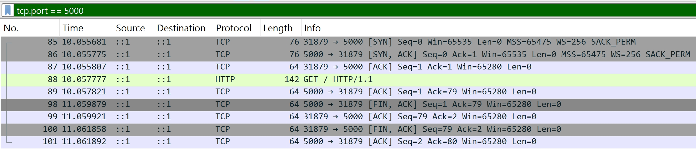
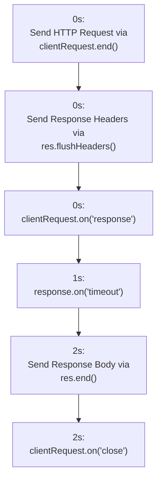
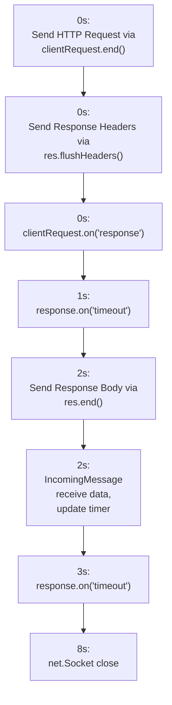
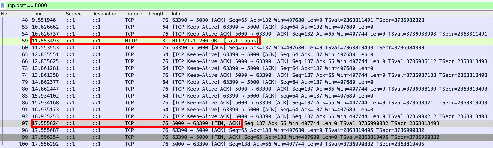

<!-- todo-yus 分段落 -->

## Client 跟 Server 的 timeout

Node.js 的 Client 跟 Server 各自都可以設定 timeout，其背後也都是 `net.Socket.setTimeout` 的呼叫

- `http.Server`
  - [server.timeout](https://nodejs.org/docs/latest-v24.x/api/http.html#servertimeout)
  - `server.on("timeout")`：沒在官方文件列出，但實際上有這個 event
- `ClientRequest`
  - [request.setTimeout(timeout[, callback])](https://nodejs.org/docs/latest-v24.x/api/http.html#requestsettimeouttimeout-callback)
  - [request.on('timeout')](https://nodejs.org/docs/latest-v24.x/api/http.html#event-timeout)
- `ServerResponse`
  - [response.setTimeout(msecs[, callback])](https://nodejs.org/docs/latest-v24.x/api/http.html#responsesettimeoutmsecs-callback)
  - `response.on("timeout")`：沒在官方文件列出，但實際上有這個 event
- `IncomingMessage`
  - [message.setTimeout(msecs[, callback])](https://nodejs.org/docs/latest-v24.x/api/http.html#messagesettimeoutmsecs-callback)
  - `message.on("timeout")`：沒在官方文件列出，但實際上有這個 event

## 以 http server 的角度來看

我們直接來看 Node.js 原始碼的實作

```ts
// IncomingMessage
IncomingMessage.prototype.setTimeout = function setTimeout(msecs, callback) {
  if (callback) this.on("timeout", callback);
  this.socket.setTimeout(msecs);
  return this;
};

// OutgoingMessage
OutgoingMessage.prototype.setTimeout = function setTimeout(msecs, callback) {
  if (callback) {
    this.on("timeout", callback);
  }

  if (!this[kSocket]) {
    this.once("socket", function socketSetTimeoutOnConnect(socket) {
      socket.setTimeout(msecs);
    });
  } else {
    this[kSocket].setTimeout(msecs);
  }
  return this;
};

// http.Server
Server.prototype.setTimeout = function setTimeout(msecs, callback) {
  this.timeout = msecs;
  if (callback) this.on("timeout", callback);
  return this;
};
```

看起來都蠻正常的

- 若 socket 已經被關聯，直接呼叫 `socket.setTimeout`
- 若 socket 尚未被關聯，則監聽 `this.once("socket")`，然後呼叫 `socket.setTimeout`
- 有 `callback` 就幫忙設定 `this.on("timeout")`，算是一個語法糖

以 `http.Server` 為例子，理論上可以在這三個地方設定 `setTimeout`

- `http.Server`
- `IncomingMessage`
- `ServerResponse`

我們先在 `IncomingMessage` 設定看看：

```ts
const httpServer = http.createServer();
httpServer.listen(5000);
httpServer.on("request", (req, res) => {
  req.setTimeout(1000, (socket) => console.log(socket instanceof net.Socket));
});
```

用 `curl http://localhost:5000/ -v` 測試，發現 1 秒後連線中斷，並且 Node.js 沒印出任何 log！

```
* Request completely sent off
* Empty reply from server
* shutting down connection #0
curl: (52) Empty reply from server
```

用 [Wireshark](https://www.wireshark.org/download.html) 抓 Loopback: lo0，加上篩選 tcp.port == 5000


發現竟然是 Server 主動關閉的！我找了一下 [response.setTimeout(msecs[, callback])](https://nodejs.org/docs/latest-v24.x/api/http.html#responsesettimeoutmsecs-callback) 的解釋

```
If no 'timeout' listener is added to the request, the response, or the server, then sockets are destroyed when they time out. If a handler is assigned to the request, the response, or the server's 'timeout' events, timed out sockets must be handled explicitly.
```

我們已有 handler，但底層的 socket 還是直接 destroy，原因藏在 Node.js `lib/_http_server.js` 原始碼裡面！

```ts
function socketOnTimeout() {
  const req = this.parser?.incoming;
  // ❌ 我們透過 curl 發的 GET 請求，幾乎是立即 complete，所以就不會 emit timeout
  const reqTimeout = req && !req.complete && req.emit("timeout", this);
  const res = this._httpMessage;
  const resTimeout = res && res.emit("timeout", this);
  const serverTimeout = this.server.emit("timeout", this);

  // ✅ 因為也沒有 resTimeout 跟 serverTimeout，所以最後就走到 destroy
  if (!reqTimeout && !resTimeout && !serverTimeout) this.destroy();
}
```

改成 POST + 發送不完整的 body，應該就能觀察到 `IncomingMessage` 的 timeout 了

```ts
const httpServer = http.createServer();
httpServer.listen(5000);
httpServer.on("request", (req, res) => {
  req.setTimeout(1000, (socket) => console.log(socket instanceof net.Socket)); // ✅ true
});

const clientRequest = http.request({
  host: "localhost",
  port: 5000,
  method: "POST",
  headers: { "content-length": 3 },
});
clientRequest.end("12");
```

嘗試在 `ServerResponse` 也加上 timeout，預期兩者都會觸發

```ts
const httpServer = http.createServer();
httpServer.listen(5000);
httpServer.on("request", (req, res) => {
  req.setTimeout(1000, (socket) =>
    console.log("req", socket instanceof net.Socket),
  );
  res.setTimeout(1000, (socket) =>
    console.log("res", socket instanceof net.Socket),
  );
});

const clientRequest = http.request({
  host: "localhost",
  port: 5000,
  method: "POST",
  headers: { "content-length": 3 },
});
clientRequest.end("12");

// Prints
// req true
// res true
```

嘗試在 `http.Server` 也加上 timeout，預期三者都會觸發

```ts
const httpServer = http.createServer();
httpServer.timeout = 1000;
httpServer.on("timeout", (socket) =>
  console.log("server", socket instanceof net.Socket),
);
httpServer.listen(5000);
httpServer.on("request", (req, res) => {
  req.setTimeout(1000, (socket) =>
    console.log("req", socket instanceof net.Socket),
  );
  res.setTimeout(1000, (socket) =>
    console.log("res", socket instanceof net.Socket),
  );
});

const clientRequest = http.request({
  host: "localhost",
  port: 5000,
  method: "POST",
  headers: { "content-length": 3 },
});
clientRequest.end("12");

// Prints
// req true
// res true
// server true
```

若三者設定不同的 timeout，則後者的設定會覆蓋前者的設定

```ts
const httpServer = http.createServer();
httpServer.timeout = 2000; // ✅ 第 1 個被設定
httpServer.on("timeout", (socket) =>
  console.log(performance.now(), "server", socket instanceof net.Socket),
);
httpServer.listen(5000);
httpServer.on("request", (req, res) => {
  console.log(performance.now());
  req.setTimeout(1000, (socket) =>
    console.log(performance.now(), "req", socket instanceof net.Socket),
  ); // ✅ 第 2 個被設定
  res.setTimeout(1500, (socket) =>
    console.log(performance.now(), "res", socket instanceof net.Socket),
  ); // ✅ 第 3 個被設定
});

const clientRequest = http.request({
  host: "localhost",
  port: 5000,
  method: "POST",
  headers: { "content-length": 3 },
});
clientRequest.end("12");

// Prints
// 1043.7383
// 2553.8869 req true
// 2554.4036 res true
// 2554.5851 server true
```

## 以 http client 的角度來看

我們直接來看 Node.js 原始碼的實作

```ts
ClientRequest.prototype.setTimeout = function setTimeout(msecs, callback) {
  if (this._ended) {
    return this;
  }

  listenSocketTimeout(this);
  msecs = getTimerDuration(msecs, "msecs");
  if (callback) this.once("timeout", callback);

  if (this.socket) {
    setSocketTimeout(this.socket, msecs);
  } else {
    this.once("socket", (sock) => setSocketTimeout(sock, msecs));
  }

  return this;
};

function listenSocketTimeout(req) {
  if (req.timeoutCb) {
    return;
  }
  // Set timeoutCb so it will get cleaned up on request end.
  req.timeoutCb = emitRequestTimeout;
  // Delegate socket timeout event.
  if (req.socket) {
    req.socket.once("timeout", emitRequestTimeout);
  } else {
    req.on("socket", (socket) => {
      socket.once("timeout", emitRequestTimeout);
    });
  }
}

function setSocketTimeout(sock, msecs) {
  if (sock.connecting) {
    sock.once("connect", function () {
      sock.setTimeout(msecs);
    });
  } else {
    sock.setTimeout(msecs);
  }
}

function emitRequestTimeout() {
  const req = this._httpMessage;
  if (req) {
    req.emit("timeout");
  }
}
```

大致上做了三件事情

- `listenSocketTimeout` => 監聽 socket 的 timeout 事件，並且透過 `ClientRequest.emit("timeout")` 傳遞到上層
- 如果 user program 有傳入 `callback`，則自動幫使用者掛上監聽 `ClientRequest.once("timeout", callback)`
- `setSocketTimeout` => 呼叫 `ClientRequest.socket.setTimeout(msecs)`

以 http client 為例子，理論上可以在這二個地方設定 timeout 跟 listener

- `ClientRequest`
- `IncomingMessage`

我們先在 `IncomingMessage` 設定看看：

```ts
const httpServer = http.createServer();
httpServer.listen(5000);
httpServer.on("request", (req, res) => {
  // ✅ 先送 headers，即可觸發 clientRequest.on('response')
  res.flushHeaders();
  // ✅ 2 秒後再送 body，理論上就會超過 client 設定的 timeout
  setTimeout(
    () => res.end(() => console.log(performance.now(), "res end")),
    2000,
  );
});

const clientRequest = http.request({
  host: "localhost",
  port: 5000,
});
clientRequest.end();
clientRequest.on("close", () =>
  console.log(performance.now(), "clientRequest close"),
);
clientRequest.on("response", (response) => {
  console.log(performance.now());
  // ✅ 加上 resume 來消耗 body
  response.resume();
  response.setTimeout(1000, () =>
    console.log(performance.now(), "response timeout"),
  );
});

// Prints
// 798.488041
// 1800.380708 response timeout
// 2799.693291 res end
// 2800.598041 clientRequest close
```

時間軸如下



如果不用 `response.resume()` 的話，則 response body 會堆積在 Internal Buffer，導致 `response.socket` 無法立即被回收

```ts
const httpServer = http.createServer();
httpServer.listen(5000);
httpServer.on("request", (req, res) => {
  // ✅ 先送 headers，即可觸發 clientRequest.on('response')
  res.flushHeaders();
  // ✅ 2 秒後再送 body，理論上就會超過 client 設定的 timeout
  setTimeout(
    () => res.end(() => console.log(performance.now(), "res end")),
    2000,
  );
});

const clientRequest = http.request({
  host: "localhost",
  port: 5000,
});
clientRequest.end();
clientRequest.on("response", (response) => {
  console.log(performance.now());
  // ✅ 刻意不加 resume
  response.setTimeout(1000, () =>
    console.log(performance.now(), "response timeout"),
  );
  // ✅ 觀察 socket close 的時間點
  response.socket.on("close", () =>
    console.log(performance.now(), "socket close"),
  );
});

// Prints
// 755.399375
// 1756.63875 response timeout
// 2757.074 res end
// 3759.140042 response timeout
// 8759.595292 socket close
```

時間軸如下



關於 update timer，實作在 `lib/internal/stream_base_commons.js`

```js
function onStreamRead(arrayBuffer) {
  // ...以上忽略
  stream[kUpdateTimer]();
  // ...以下忽略
}
```

至於 `net.Socket` 在 2s 有活躍事件，到了 8s 的時候 close，用 [Wireshark](https://www.wireshark.org/download.html) 抓 Loopback: lo0，加上篩選 tcp.port == 5000。發現 Server 回傳 HTTP Response 的 6 秒後，Server 主動關閉連線


這 6 秒是以下兩個的預設值相加得來的

- [server.keepAliveTimeout](https://nodejs.org/docs/latest-v24.x/api/http.html#serverkeepalivetimeout)
- [server.keepAliveTimeoutBuffer](https://nodejs.org/docs/latest-v24.x/api/http.html#serverkeepalivetimeoutbuffer)

嘗試在 `ClientRequest` 也加上 timeout，預期兩者都會觸發

```ts
const httpServer = http.createServer();
httpServer.listen(5000);
httpServer.on("request", (req, res) => {
  // ✅ 先送 headers，即可觸發 clientRequest.on('response')
  res.flushHeaders();
  // ✅ 2 秒後再送 body，理論上就會超過 client 設定的 timeout
  setTimeout(
    () => res.end(() => console.log(performance.now(), "res end")),
    2000,
  );
});

const clientRequest = http.request({
  host: "localhost",
  port: 5000,
});
clientRequest.end();
clientRequest.setTimeout(1000, () =>
  console.log(performance.now(), "clientRequest timeout"),
);
clientRequest.on("response", (response) => {
  console.log(performance.now());
  response.resume();
  response.setTimeout(1000, () =>
    console.log(performance.now(), "response timeout"),
  );
});

// Prints
// 905.95575
// 1908.304834 clientRequest timeout
// 1908.62 response timeout
// 2907.534584 res end
```

若設定不同的 timeout，則後者的設定 (1500ms) 會覆蓋前者的設定 (1000ms)

```ts
const httpServer = http.createServer();
httpServer.listen(5000);
httpServer.on("request", (req, res) => {
  // ✅ 先送 headers，即可觸發 clientRequest.on('response')
  res.flushHeaders();
  // ✅ 2 秒後再送 body，理論上就會超過 client 設定的 timeout
  setTimeout(
    () => res.end(() => console.log(performance.now(), "res end")),
    2000,
  );
});

const clientRequest = http.request({
  host: "localhost",
  port: 5000,
});
clientRequest.end();
clientRequest.setTimeout(1000, () =>
  console.log(performance.now(), "clientRequest timeout"),
);
clientRequest.on("response", (response) => {
  console.log(performance.now());
  response.resume();
  response.setTimeout(1500, () =>
    console.log(performance.now(), "response timeout"),
  );
});

// Prints
// 723.343375
// 2225.251875 clientRequest timeout
// 2225.709708 response timeout
// 2715.775542 res end
```

嘗試在 `http.Agent` 設定全域的 timeout，並且 `ClientRequest` 跟 `IncomingMessage` 只監聽 `on("timeout")`

```ts
const agent = new http.Agent({
  keepAlive: true,
  timeout: 1000,
});
const clientRequest = http.request({
  host: "localhost",
  port: 5000,
  agent,
});
clientRequest.end();
clientRequest.on("timeout", () =>
  console.log(performance.now(), "clientRequest timeout"),
);
clientRequest.on("response", (response) => {
  console.log(performance.now());
  response.resume();
  response.on("timeout", () =>
    console.log(performance.now(), "response timeout"),
  );
});

// Prints
// 697.856625
// 1698.323708 clientRequest timeout
// 1698.56525 response timeout
// 2699.626083 res en
```
