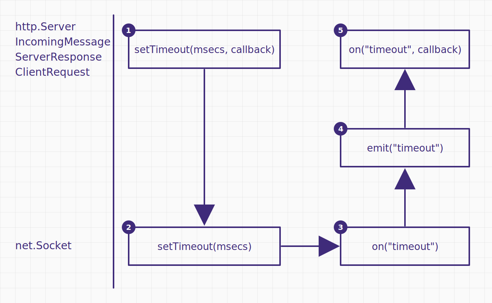

## Node.js client 跟 server 的 timeout

Node.js 的 client 跟 server 各自都可以設定 timeout，其背後也都是 `net.Socket.setTimeout` 的呼叫

- `http.Server`
  - [server.timeout](https://nodejs.org/docs/latest-v24.x/api/http.html#servertimeout)
  - [server.setTimeout([msecs][, callback])](https://nodejs.org/docs/latest-v24.x/api/http.html#serversettimeoutmsecs-callback)
  - `server.on("timeout")`：沒在官方文件列出，但實際上有這個 event
- `ClientRequest`
  - [request.setTimeout(timeout[, callback])](https://nodejs.org/docs/latest-v24.x/api/http.html#requestsettimeouttimeout-callback)
  - [request.on('timeout')](https://nodejs.org/docs/latest-v24.x/api/http.html#event-timeout)
- `ServerResponse`
  - [response.setTimeout(msecs[, callback])](https://nodejs.org/docs/latest-v24.x/api/http.html#responsesettimeoutmsecs-callback)
  - `response.on("timeout")`：沒在官方文件列出，但實際上有這個 event
- `IncomingMessage`
  - [message.setTimeout(msecs[, callback])](https://nodejs.org/docs/latest-v24.x/api/http.html#messagesettimeoutmsecs-callback)
  - `message.on("timeout")`：沒在官方文件列出，但實際上有這個 event
- `http.Agent`
  - [options.timeout](https://nodejs.org/docs/latest-v24.x/api/http.html#new-agentoptions)

## 以 HTTP server 的角度來看

以 `http.Server` 為例子，理論上可以在這三個地方設定 `setTimeout`

- `http.Server`
- `IncomingMessage`
- `ServerResponse`

### Node.js 原始碼實作

`IncomingMessage`

```ts
IncomingMessage.prototype.setTimeout = function setTimeout(msecs, callback) {
  if (callback) this.on("timeout", callback);
  this.socket.setTimeout(msecs);
  return this;
};
```

`OutgoingMessage`

```ts
OutgoingMessage.prototype.setTimeout = function setTimeout(msecs, callback) {
  if (callback) this.on("timeout", callback);

  if (!this[kSocket]) {
    this.once("socket", function socketSetTimeoutOnConnect(socket) {
      socket.setTimeout(msecs);
    });
  } else {
    this[kSocket].setTimeout(msecs);
  }
  return this;
};
```

`http.Server`

```ts
Server.prototype.setTimeout = function setTimeout(msecs, callback) {
  this.timeout = msecs;
  if (callback) this.on("timeout", callback);
  return this;
};
```

看起來都蠻正常的

- 若 `net.Socket` 已經被關聯，直接呼叫 `socket.setTimeout(msecs)`
- 若 `net.Socket` 尚未被關聯，則監聽 `this.once("socket")`，然後呼叫 `socket.setTimeout(msecs)`
- 使用者有傳入 `callback` 就幫忙設定 `this.on("timeout", callback)`，算是一個語法糖

### Case 1：`req.setTimeout` + GET 請求

server 先在 `IncomingMessage` 設定看看：

```ts
import http from "http";

const httpServer = http.createServer();
httpServer.listen(5000);
httpServer.on("request", (req, res) => {
  req.setTimeout(1000, (socket) => console.log(socket instanceof net.Socket));
});
```

client 用 `curl http://localhost:5000/ -v` 測試，發現 1 秒後連線中斷，並且 Node.js 沒印出任何 log！

```
* Request completely sent off
* Empty reply from server
* shutting down connection #0
curl: (52) Empty reply from server
```

### Case 1：排查原因

用 [Wireshark](https://www.wireshark.org/download.html) 抓 Loopback: lo0，加上篩選 tcp.port == 5000


發現竟然是 server 在 1 秒後主動關閉的！我找了一下 [response.setTimeout(msecs[, callback])](https://nodejs.org/docs/latest-v24.x/api/http.html#responsesettimeoutmsecs-callback) 的解釋

```
If no 'timeout' listener is added to the request, the response, or the server, then sockets are destroyed when they time out. If a handler is assigned to the request, the response, or the server's 'timeout' events, timed out sockets must be handled explicitly.
```

我們已有 handler，但底層的 `net.Socket` 還是直接 destroy，原因藏在 Node.js `lib/_http_server.js` 原始碼裡面！

```ts
function connectionListenerInternal(server, socket) {
  // ...

  // If the user has added a listener to the server,
  // request, or response, then it's their responsibility.
  // otherwise, destroy on timeout by default
  if (server.timeout && typeof socket.setTimeout === "function")
    socket.setTimeout(server.timeout);
  socket.on("timeout", socketOnTimeout);

  // ...
}

function socketOnTimeout() {
  const req = this.parser?.incoming;
  // ❌ 我們透過 curl 發的 GET 請求，幾乎是立即 complete，所以就不會 emit timeout
  const reqTimeout = req && !req.complete && req.emit("timeout", this);
  const res = this._httpMessage;
  const resTimeout = res && res.emit("timeout", this);
  const serverTimeout = this.server.emit("timeout", this);

  // ✅ 因為也沒有 resTimeout 跟 serverTimeout，所以最後就走到 destroy
  if (!reqTimeout && !resTimeout && !serverTimeout) this.destroy();
}
```

### Case 2：`req.setTimeout` + POST 請求

改成 POST + 發送不完整的 body，應該就能觀察到 `IncomingMessage` 的 timeout 了

```ts
import http from "http";

const httpServer = http.createServer();
httpServer.listen(5000);
httpServer.on("request", (req, res) => {
  req.setTimeout(1000, (socket) => console.log(socket instanceof net.Socket)); // ✅ true
});

const clientRequest = http.request({
  host: "localhost",
  port: 5000,
  method: "POST",
  // ✅ 宣告 3 bytes
  headers: { "content-length": 3 },
});
// ✅ 實際只送 2 bytes
clientRequest.end("12");
```

### Case 3：`res.setTimeout` + POST 請求

嘗試在 `ServerResponse` 跟 `IncomingMessage` 都設定 timeout，預期兩者都會觸發

```ts
import http from "http";

const httpServer = http.createServer();
httpServer.listen(5000);
httpServer.on("request", (req, res) => {
  req.setTimeout(1000, (socket) => {
    console.log(socket instanceof net.Socket); // ✅ true
  });
  res.setTimeout(1000, (socket) => {
    console.log(socket instanceof net.Socket); // ✅ true
  });
});

const clientRequest = http.request({
  host: "localhost",
  port: 5000,
  method: "POST",
  // ✅ 宣告 3 bytes
  headers: { "content-length": 3 },
});
// ✅ 實際只送 2 bytes
clientRequest.end("12");
```

### Case 4：`server.timeout` + POST 請求

嘗試在 `http.Server`、`ServerResponse` 跟 `IncomingMessage` 都設定 timeout，預期三者都會觸發

```ts
import http from "http";

const httpServer = http.createServer();
httpServer.timeout = 1000;
httpServer.on("timeout", (socket) => {
  console.log(socket instanceof net.Socket); // ✅ true
});
httpServer.listen(5000);
httpServer.on("request", (req, res) => {
  req.setTimeout(1000, (socket) => {
    console.log(socket instanceof net.Socket); // ✅ true
  });
  res.setTimeout(1000, (socket) => {
    console.log(socket instanceof net.Socket); // ✅ true
  });
});

const clientRequest = http.request({
  host: "localhost",
  port: 5000,
  method: "POST",
  // ✅ 宣告 3 bytes
  headers: { "content-length": 3 },
});
// ✅ 實際只送 2 bytes
clientRequest.end("12");
```

### Case 5：timeout 後者覆蓋前者

若三者設定不同的 timeout，則後者的設定會覆蓋前者的設定

```ts
const httpServer = http.createServer();
httpServer.timeout = 2000; // ✅ 第 1 個被設定
httpServer.on("timeout", (socket) => console.log(performance.now(), "server"));
httpServer.listen(5000);
httpServer.on("request", (req, res) => {
  console.log(performance.now());
  // ✅ 第 2 個被設定
  req.setTimeout(1000, (socket) => console.log(performance.now(), "req"));
  // ✅ 第 3 個被設定
  res.setTimeout(1500, (socket) => console.log(performance.now(), "res"));
});

const clientRequest = http.request({
  host: "localhost",
  port: 5000,
  method: "POST",
  // ✅ 宣告 3 bytes
  headers: { "content-length": 3 },
});
// ✅ 實際只送 2 bytes
clientRequest.end("12");

// Prints
// 1043.7383
// 2553.8869 req
// 2554.4036 res
// 2554.5851 server
```

## 以 HTTP client 的角度來看

以 `http.request` 為例子，理論上可以在這三個地方設定 timeout

- `IncomingMessage`
- `ClientRequest`
- `http.Agent`

### Node.js 原始碼實作

`ClientRequest`

```ts
ClientRequest.prototype.setTimeout = function setTimeout(msecs, callback) {
  if (this._ended) {
    return this;
  }

  listenSocketTimeout(this);
  msecs = getTimerDuration(msecs, "msecs");
  if (callback) this.once("timeout", callback);

  if (this.socket) {
    setSocketTimeout(this.socket, msecs);
  } else {
    this.once("socket", (sock) => setSocketTimeout(sock, msecs));
  }

  return this;
};

function listenSocketTimeout(req) {
  if (req.timeoutCb) {
    return;
  }
  // Set timeoutCb so it will get cleaned up on request end.
  req.timeoutCb = emitRequestTimeout;
  // Delegate socket timeout event.
  if (req.socket) {
    req.socket.once("timeout", emitRequestTimeout);
  } else {
    req.on("socket", (socket) => {
      socket.once("timeout", emitRequestTimeout);
    });
  }
}

function setSocketTimeout(sock, msecs) {
  if (sock.connecting) {
    sock.once("connect", function () {
      sock.setTimeout(msecs);
    });
  } else {
    sock.setTimeout(msecs);
  }
}

function emitRequestTimeout() {
  const req = this._httpMessage;
  if (req) {
    req.emit("timeout");
  }
}
```

跟 [server side 的 setTimeout 原始碼實作](#nodejs-原始碼實作) 差不多

- 若 `net.Socket` 已經被關聯，直接呼叫 `socket.setTimeout(msecs)`
- 若 `net.Socket` 尚未被關聯，則監聽 `this.once("socket")`，然後呼叫 `socket.setTimeout(msecs)`
- 使用者有傳入 `callback` 就幫忙設定 `this.once("timeout", callback)`，算是一個語法糖

### Case 1：`res.setTimeout`

我們先在 `IncomingMessage` 設定看看：

```ts
import http from "http";

const httpServer = http.createServer();
httpServer.listen(5000);
httpServer.on("request", (req, res) => {
  // ✅ 先送 headers，即可觸發 clientRequest.on("response")
  res.flushHeaders();
  // ✅ 2 秒後再送 body，理論上就會超過 client 設定的 timeout (1 秒)
  setTimeout(() => res.end(), 2000);
});

const clientRequest = http.request({
  host: "localhost",
  port: 5000,
});
clientRequest.end();
clientRequest.on("response", (response: http.IncomingMessage) => {
  // ✅ 加上 resume 來消耗 body
  response.resume();
  response.setTimeout(1000, () => console.log("response timeout")); // ✅ 1 秒後，成功觸發
});
```

### Case 2：`req.setTimeout`

嘗試在 `ClientRequest` 跟 `IncomingMessage` 都設定 `setTimeout`，預期兩者都會觸發

```ts
import http from "http";

const httpServer = http.createServer();
httpServer.listen(5000);
httpServer.on("request", (req, res) => {
  // ✅ 先送 headers，即可觸發 clientRequest.on("response")
  res.flushHeaders();
  // ✅ 2 秒後再送 body，理論上就會超過 client 設定的 timeout (1 秒)
  setTimeout(() => res.end(), 2000);
});

const clientRequest = http.request({
  host: "localhost",
  port: 5000,
});
clientRequest.end();
clientRequest.setTimeout(1000, () => console.log("clientRequest timeout")); // ✅ 1 秒後，成功觸發
clientRequest.on("response", (response: http.IncomingMessage) => {
  // ✅ 加上 resume 來消耗 body
  response.resume();
  response.setTimeout(1000, () => console.log("response timeout")); // ✅ 1 秒後，成功觸發
});
```

### Case 3：`http.Agent` 的 timeout

嘗試在 `http.Agent` 設定全域的 timeout，並且 `ClientRequest` 跟 `IncomingMessage` 只監聽 `on("timeout")`，預期兩者都會觸發

```ts
import http from "http";

const httpServer = http.createServer();
httpServer.listen(5000);
httpServer.on("request", (req, res) => {
  // ✅ 先送 headers，即可觸發 clientRequest.on("response")
  res.flushHeaders();
  // ✅ 2 秒後再送 body，理論上就會超過 client 設定的 timeout (1 秒)
  setTimeout(() => res.end(), 2000);
});

const agent = new http.Agent({
  keepAlive: true,
  timeout: 1000,
});
const clientRequest = http.request({
  host: "localhost",
  port: 5000,
  agent,
});
clientRequest.end();
clientRequest.on("timeout", () => console.log("clientRequest timeout")); // ✅ 1 秒後，成功觸發
clientRequest.on("response", (response) => {
  // ✅ 加上 resume 來消耗 body
  response.resume();
  response.on("timeout", () => console.log("response timeout")); // ✅ 1 秒後，成功觸發
});
```

### Case 4：timeout 後者覆蓋前者

若設定不同的 timeout，則後者的設定會覆蓋前者的設定

```ts
const httpServer = http.createServer();
httpServer.listen(5000);
httpServer.on("request", (req, res) => {
  // ✅ 先送 headers，即可觸發 clientRequest.on("response")
  res.flushHeaders();
  // ✅ 2 秒後再送 body，理論上就會超過 client 設定的 timeout (1 秒)
  setTimeout(() => res.end(), 2000);
});

// ✅ 第 1 個被設定
const agent = new http.Agent({
  keepAlive: true,
  timeout: 500,
});
const clientRequest = http.request({
  host: "localhost",
  port: 5000,
  agent,
});
clientRequest.end();
// ✅ 第 2 個被設定
clientRequest.setTimeout(1000, () => console.log("clientRequest timeout")); // ✅ 1.5 秒後，成功觸發
clientRequest.on("response", (response: http.IncomingMessage) => {
  // ✅ 加上 resume 來消耗 body
  response.resume();
  // ✅ 第 3 個被設定
  response.setTimeout(1500, () => console.log("response timeout")); // ✅ 1.5 秒後，成功觸發
});
```

## 小結

Node.js http 模組層的各種 `setTimeout` 或是 `timeout`，底層都是綁定到 `net.Socket.setTimeout`



也因此會有 [後者覆蓋前者](#case-4timeout-後者覆蓋前者) 的狀況，因為

- 從 server 的角度來看：`IncomingMessage.socket` 跟 `ServerResponse.socket` 是同一個 socket instance
- 從 client 的角度來看：`ClientRequest.socket` 跟 `IncomingMessage.socket` 是同一個 socket instance

最後，統整 client 跟 server 的設定方式：

|                   | `setTimeout(msecs, callback)` | `timeout` option | `on("timeout", callback)` |
| ----------------- | ----------------------------- | ---------------- | ------------------------- |
| `http.Server`     | ✅                            | ✅               | ✅                        |
| `http.Agent`      | ❌                            | ✅               | ❌                        |
| `ClientRequest`   | ✅                            | ❌               | ✅                        |
| `ServerResponse`  | ✅                            | ❌               | ✅                        |
| `IncomingMessage` | ✅                            | ❌               | ✅                        |
