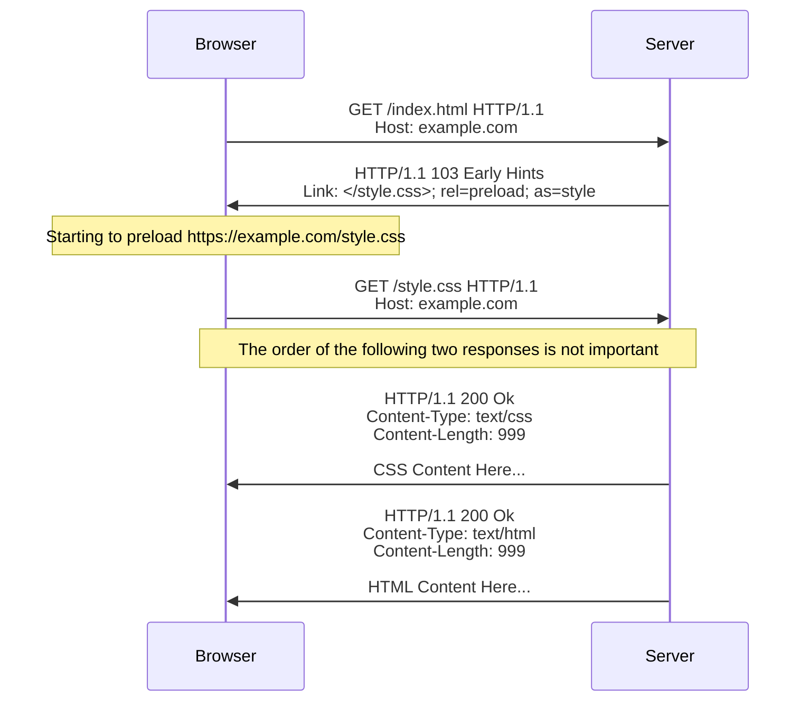
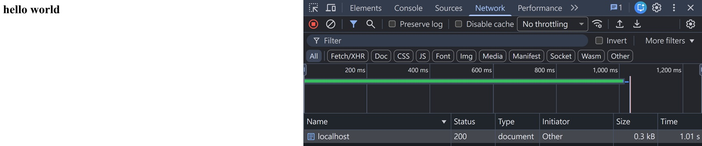

## request.on('information')

https://nodejs.org/docs/latest-v24.x/api/http.html#event-information

會在 client 收到 1xx status code 的時候觸發（除了 101 Switching Protocols 會在 [on('upgrade')](#onupgrade) 的時候觸發 ），包含

- [100 Continue](#100-continue)
- [102 Processing (Deprecated)](https://developer.mozilla.org/en-US/docs/Web/HTTP/Reference/Status/102)
- [103 Early Hints](#103-early-hints)

## 100 Continue

- [request.on('continue')](https://nodejs.org/docs/latest-v24.x/api/http.html#event-continue)
- [server.on('checkContinue')](https://nodejs.org/docs/latest-v24.x/api/http.html#event-checkcontinue)
- [response.writeContinue()](https://nodejs.org/docs/latest-v24.x/api/http.html#responsewritecontinue)

參考我寫過的 [Expect: 100-Continue](../http/expect-100-continue.md)

## 103 Early Hints

Node.js http server 提供以下 method 來寫入 Early Hints
[response.writeEarlyHints(hints[, callback])](https://nodejs.org/docs/latest-v24.x/api/http.html#responsewriteearlyhintshints-callback)

Early Hints 是啥？最常用的情境就是告訴瀏覽器 "Response Body 還在準備中，但你可以先載入這些 Link 的資源"



用 Node.js 寫個 PoC

```ts
const httpServer = http.createServer();
httpServer.listen(5000);
httpServer.on("request", (req, res) => {
  if (req.url === "/") {
    res.writeEarlyHints({ link: "</style.css>; rel=preload; as=style" });
    setTimeout(
      () => res.end(readFileSync(join(__dirname, "index.html"))),
      1000,
    );
    return;
  }
  if (req.url === "/style.css") {
    res.end("body { color: red; }");
    return;
  }
  res.writeHead(404).end();
});
```

index.html

```html
<html>
  <head>
    <link rel="stylesheet" href="/style.css" />
  </head>
  <body>
    <h1>hello world</h1>
  </body>
</html>
```

瀏覽器打開 http://localhost:5000/ ，發現 103 Early Hints 沒正確被載入


看了一下 MDN 文件關於 103 Early Hints 的 [browser_compatibility](https://developer.mozilla.org/en-US/docs/Web/HTTP/Reference/Status/103#browser_compatibility)，發現主流瀏覽器都是在 HTTP/2 才有支援～

但還是可以用 `curl -v http://localhost:5000/` 戳看看

```
< HTTP/1.1 103 Early Hints
< Link: </style.css>; rel=preload; as=style
<
< HTTP/1.1 200 OK
< Date: Fri, 27 Feb 2026 11:24:27 GMT
< Connection: keep-alive
< Keep-Alive: timeout=5
< Content-Length: 134
<
<html>
  <head>
    <link rel="stylesheet" href="/style.css" />
  </head>
  <body>
    <h1>hello world</h1>
  </body>
</html>
```

至於為何 HTTP/1.1 不建議使用呢？原因是ㄧ些老舊的 proxy 不支援 1xx Informational Response，如果把 103 Early Hints 當成正常 HTTP Response 的話

```
HTTP/1.1 103 Early Hints
Link: </style.css>; rel=preload; as=style


```

就有可能把 Final Response 留在 TCP Socket，成 [Response Queue Poisoning](https://portswigger.net/web-security/request-smuggling/advanced/response-queue-poisoning)

```
HTTP/1.1 200 OK
Date: Fri, 27 Feb 2026 11:24:27 GMT
Connection: keep-alive
Keep-Alive: timeout=5
Content-Length: 134

<html>
  <head>
    <link rel="stylesheet" href="/style.css" />
  </head>
  <body>
    <h1>hello world</h1>
  </body>
</html>
```

通常 MDN 這種面對大眾的文件都會寫的比較隱晦

```
For compatibility and security reasons, it is recommended to only send HTTP 103 Early Hints responses over HTTP/2 or later unless the client is known to handle informational responses correctly.
```

我們接著看看 [RFC 9110 Section 15.2. Informational 1xx](https://datatracker.ietf.org/doc/html/rfc9110#section-15.2) 的介紹

```
A client MUST be able to parse one or more 1xx responses received prior to a final response, even if the client does not expect one. A user agent MAY ignore unexpected 1xx responses.
```

調整 Node.js 程式碼，回傳兩個 Early Hints

```ts
const httpServer = http.createServer();
httpServer.listen(5000);
httpServer.on("request", (req, res) => {
  if (req.url === "/") {
    res.writeEarlyHints({ link: "</style.css>; rel=preload; as=style" });
    res.writeEarlyHints({ link: "</script.js>; rel=preload; as=script" });
    res.end("hello world");
    return;
  }
  res.writeHead(404).end();
});
```

用 `curl -v http://localhost:5000/` 戳看看

```
< HTTP/1.1 103 Early Hints
< Link: </style.css>; rel=preload; as=style
<
< HTTP/1.1 103 Early Hints
< Link: </script.js>; rel=preload; as=script
<
< HTTP/1.1 200 OK
< Date: Sat, 28 Feb 2026 03:17:31 GMT
< Connection: keep-alive
< Keep-Alive: timeout=5
< Content-Length: 11
<
hello world
```

改用 Node.js 寫個 http client 戳看看

```ts
const clientRequest = http.request({ host: "localhost", port: 5000 });
clientRequest.on("information", console.log);
clientRequest.end();
```

印出以下資訊，Node.js 有正確處理多個 1xx Informational Responses

```ts
{
  statusCode: 103,
  statusMessage: 'Early Hints',
  httpVersion: '1.1',
  httpVersionMajor: 1,
  httpVersionMinor: 1,
  headers: { link: '</style.css>; rel=preload; as=style' },
  rawHeaders: [ 'Link', '</style.css>; rel=preload; as=style' ]
}
{
  statusCode: 103,
  statusMessage: 'Early Hints',
  httpVersion: '1.1',
  httpVersionMajor: 1,
  httpVersionMinor: 1,
  headers: { link: '</script.js>; rel=preload; as=script' },
  rawHeaders: [ 'Link', '</script.js>; rel=preload; as=script' ]
}
```

不過很有趣的是，雖然 103 Early Hints 並不在 [RFC 9110: HTTP Semantics](https://datatracker.ietf.org/doc/html/rfc9110#section-15.2) 的規範內，而是定義在 [RFC8297: An HTTP Status Code for Indicating Hints](https://datatracker.ietf.org/doc/html/rfc8297)，雖然只是 "Proposed Standard"，但主流瀏覽器在 HTTP/2 以後都有實作

## server.on('checkExpectation')

Node.js http server 提供以下 event 來監聽 `Expect: 100-continue` 以外的 Expectation
[server.on('checkExpectation')](https://nodejs.org/docs/latest-v24.x/api/http.html#event-checkexpectation)

[RFC 9110 Section 10.1.1. Expect](https://datatracker.ietf.org/doc/html/rfc9110#section-10.1.1) 有提到

```
The only expectation defined by this specification is "100-continue" (with no defined parameters).
```

不過 `Expect` 在語意上是可以支援其他 "Expectation" 的，所以 Node.js 預留了一個空間

```ts
const httpServer = http.createServer();
httpServer.listen(5000);
httpServer.on("checkExpectation", (req, res) => {
  res.writeHead(417);
  res.end(`Sorry, ${req.headers.expect} is not supported`);
});
```

用 `curl -H "Expect: 104-helloworld" -v http://localhost:5000/` 戳看看

```
< HTTP/1.1 417 Expectation Failed
< Date: Sat, 28 Feb 2026 08:30:30 GMT
< Connection: keep-alive
< Keep-Alive: timeout=5
< Transfer-Encoding: chunked
<
Sorry, 104-helloworld is not supported
```

若 user program 沒有監聽 `server.on('checkExpectation')`，則 Node.js 預設也會回 417 Expectation Failed

```
< HTTP/1.1 417 Expectation Failed
< Date: Sat, 28 Feb 2026 08:32:16 GMT
< Connection: keep-alive
< Keep-Alive: timeout=5
< Transfer-Encoding: chunked
<

```

## server.on('clientError')

https://nodejs.org/docs/latest-v24.x/api/http.html#event-clienterror

通常是在 Node.js 的 HTTPParser 沒辦法正確解析出 client 送出的 http request，包含但不限於以下

| Node.js Error Code                                                                                | Description                                                                                                                                              |
| ------------------------------------------------------------------------------------------------- | -------------------------------------------------------------------------------------------------------------------------------------------------------- |
| [ERR_HTTP_REQUEST_TIMEOUT](https://nodejs.org/api/errors.html#err_http_request_timeout)           | [Incomplete request exceeded headersTimeout or requestTimeout](#prevent-incomplete-request)                                                              |
| [HPE_CHUNK_EXTENSIONS_OVERFLOW](https://nodejs.org/api/errors.html#hpe_chunk_extensions_overflow) | [Transfer-Encoding: chunked](../http/transfer-encoding.md) 的 [chunked extensions](https://datatracker.ietf.org/doc/html/rfc9112#section-7.1.1) 超過上限 |
| [HPE_HEADER_OVERFLOW](https://nodejs.org/api/errors.html#hpe_header_overflow)                     | [Exceeded maxHeaderSize](#限制-headers-大小)                                                                                                             |

這些情境，基本上都是 DoS 或是 [HTTP request smuggling](../port-swigger/http-request-smuggling.md) 的溫床，Node.js 會在 user program 沒有註冊 `'clientError'` 的情況，直接用 `socket.destroy()` 關閉連線。如果 user program 有註冊 `'clientError'` 的話，則需要自行調用 `socket.destroy()` 來關閉連線

## server.on('connect')

https://nodejs.org/docs/latest-v24.x/api/http.html#event-connect_1

參考我寫過的 [HTTP CONNECT Method](../http/http-request-methods-1.md#connect)

## server.on('connection')

參考我寫過的 [HTTP/1.1 為何只能 6 個連線?](../http/browser-max-tcp-connection-6-per-host.md)

## on('upgrade')

Node.js 在 `ClientRequest` 跟 `http.Server` 分別提供了 upgrade 事件

- [server.on('upgrade')](https://nodejs.org/docs/latest-v24.x/api/http.html#event-upgrade_1)
- [request.on('upgrade')](https://nodejs.org/docs/latest-v24.x/api/http.html#event-upgrade)

```ts
const httpServer = http.createServer();
httpServer.listen(5000);
httpServer.on("upgrade", (req, socket, head) => {
  // ✅ Server 在此回傳 `101 Switching Protocols` 的話，Client 就會觸發 `request.on('upgrade')`
  socket.write(
    "HTTP/1.1 101 Switching Protocols\r\nConnection: Upgrade\r\nUpgrade: Websocket\r\n\r\n",
  );
});

// ✅ Client 若送 Upgrade 請求，就會觸發 `server.on('upgrade')`
const clientRequest = http.request({
  host: "localhost",
  port: 5000,
  headers: {
    connection: "Upgrade",
    upgrade: "Websocket",
  },
});
clientRequest.end();
clientRequest.on("upgrade", (response, socket, head) => {
  // ✅ It's now your responsibility to handle TCP socket
});
```

99% 的使用情境是需要 Upgrade 到 WebSocket，Server 才必須監聽此事件。不過 [ws: a Node.js WebSocket library](https://github.com/websockets/ws) 已經處理好這個細節了。如果真的要學習的話，我會等到之後需要學習 WebSocket，再去翻 ws 的原始碼來讀。

## validate header

這些是 Node.js 原始碼在 [設定 header](./http-request-response-classes.md#寫入流程-1何時才會送出-header--了解-nodejs-api-的設計) 的時候會先驗證 key value 是否合法，user program 通常不會需要用到以下 methods

- [http.validateHeaderName(name[, label])](https://nodejs.org/docs/latest-v24.x/api/http.html#httpvalidateheadernamename-label)
- [http.validateHeaderValue(name, value)](https://nodejs.org/docs/latest-v24.x/api/http.html#httpvalidateheadervaluename-value)
