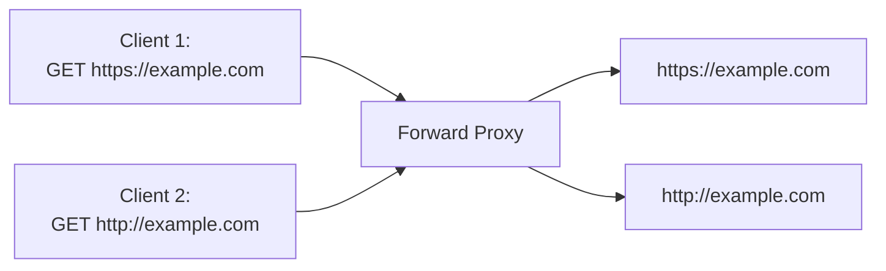
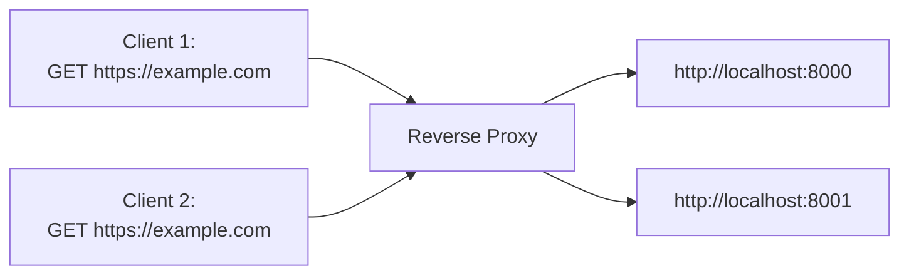
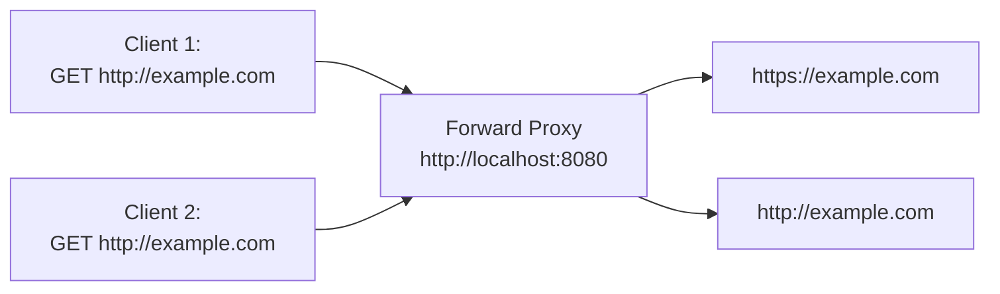
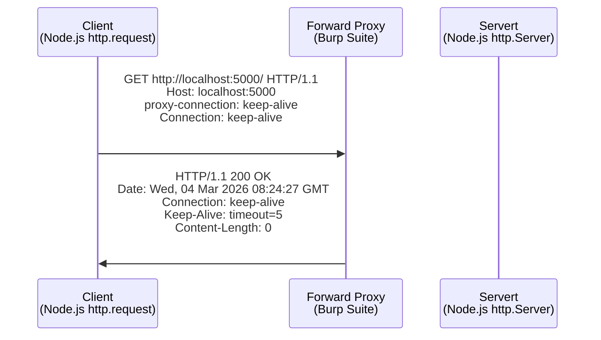

## 前言

在開始介紹之前，先來比較一下 "Forward Proxy" 跟 "Reverse Proxy" 的差異

## Forward Proxy vs Reverse Proxy

Forward Proxy



Reverse Proxy



|          | Forward Proxy                            | Reverse Proxy                           |
| -------- | ---------------------------------------- | --------------------------------------- |
| 隱私     | 保護 Client 的真實 IP                    | 保護 Server 的真實 IP                   |
| 部署位置 | 靠近 Client 端（通常在內網出口）         | 靠近 Server 端（通常在 CDN 邊緣）       |
| 代理對象 | 代理 Client，替 Client 發出請求          | 代理 Server，替 Server 接收請求         |
| 常見用途 | 翻牆、企業內網監控、匿名瀏覽             | Load Balancing、SSL Termination、WAF    |
| 快取方向 | 快取對外請求的 Response（減少出口流量）  | 快取 Origin 的 Response（減少後端壓力） |
| 設定方   | Client 需主動設定（或透過透明代理）      | Client 無感，由基礎設施決定             |
| 安全應用 | 內容過濾、存取控制（防員工訪問惡意網站） | WAF、DDoS 防護、隱藏後端架構            |
| 典型產品 | Burp Suite                               | Nginx、HAProxy、Cloudflare              |

## Node.js Built-in Proxy Support 的角色定位

簡單來說，如果你有先設定

```js
http.setGlobalProxyFromEnv({ http_proxy: "http://localhost:8080" });
```

當你想要在 Node.js 發起 HTTP Request

```js
http.get("http://example.com");
fetch("http://example.com");
```

這些 HTTP Request 就會

1. 先被 Node.js 導到 `http://localhost:8080`
2. 再從 `http://localhost:8080` 轉發到 `http://example.com`



Node.js Built-in Proxy Support 的角色定位是：

1. 幫 Client 重新構造 HTTP Request，詳細解說在 [HTTP_PROXY](#http_proxy)
2. 幫 Client 重新構造 HTTPS Request，詳細解說在 [HTTPS_PROXY](#https_proxy)
3. 根據 Client 設定的 [NO_PROXY](#no_proxy) 來決定要不要把請求發給 Forward Proxy，還是直接發到 Target Server

## HTTP_PROXY

由於我在 Node.js 生態系找不到一個適合的 "Forward Proxy"，所以我這邊用 [Burp Suite](https://portswigger.net/burp/communitydownload) 內建的 "Forward Proxy"

1. 首先，自己架一個 "Target Server" 來觀察 "Forward Proxy" 到 "Target Server" 的 HTTP Request

```ts
import http from "http";

const targetServer = http.createServer();
targetServer.listen(5000);
targetServer.on("request", function (req, res) {
  res.end();
});
```

2. 設定一個有 `proxyEnv` 的 `http.Agent`，並且用這個 `http.Agent` 發起 HTTP Request 到 "Target Server"

```ts
const agent = new http.Agent({
  proxyEnv: { http_proxy: "http://localhost:8080" },
  keepAlive: true,
});

const clientRequest = http.request({ host: "localhost", port: 5000, agent });
clientRequest.end();
```

3. [Wireshark](https://www.wireshark.org/download.html) 抓 Loopback: lo0，查看 Raw HTTP Request / Response



<!-- todo-yus -->

## HTTPS_PROXY

## NO_PROXY
