## 前言

在開始介紹之前，先來比較一下 **Forward Proxy** 跟 **Reverse Proxy** 的差異

## Forward Proxy vs Reverse Proxy

**Forward Proxy**

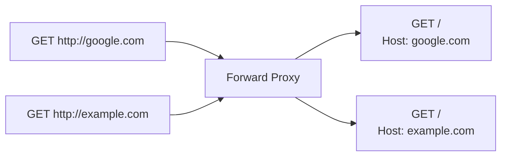

<!--  -->

**Reverse Proxy**

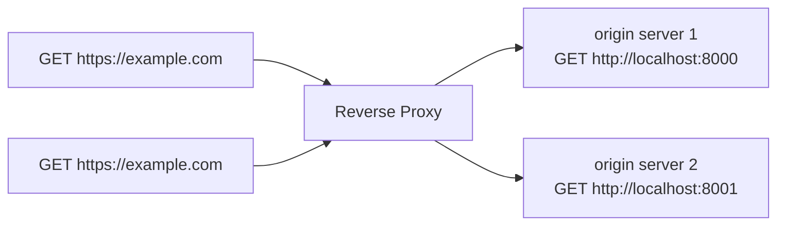

<!--  -->

|          | Forward Proxy                            | Reverse Proxy                           |
| -------- | ---------------------------------------- | --------------------------------------- |
| 隱私     | 保護 client 的真實 IP                    | 保護 server 的真實 IP                   |
| 部署位置 | 靠近 client 端（通常在內網出口）         | 靠近 server 端（通常在 CDN 邊緣）       |
| 代理對象 | 代理 client，替 client 發出請求          | 代理 server，替 server 接收請求         |
| 常見用途 | 翻牆、企業內網監控、匿名瀏覽             | Load Balancing、SSL Termination、WAF    |
| 快取方向 | 快取對外請求的 response（減少出口流量）  | 快取 origin 的 response（減少後端壓力） |
| 設定方   | client 需主動設定（或透過透明代理）      | client 無感，由基礎設施決定             |
| 安全應用 | 內容過濾、存取控制（防員工訪問惡意網站） | WAF、DDoS 防護、隱藏後端架構            |
| 典型產品 | Burp Suite                               | Nginx、HAProxy、Cloudflare              |

## Node.js Built-in Proxy Support 的角色定位

Node.js Built-in Proxy Support 的角色定位是：

1. 幫 client 轉發 HTTP request，詳細解說在 [HTTP_PROXY](#http_proxy)
2. 幫 client 轉發 HTTPS request，詳細解說在 [HTTPS_PROXY](./https_proxy.md)
3. 根據 client 設定的 [NO_PROXY](#no_proxy) 來決定要不要把請求發給 Forward Proxy，還是直接發到 target server

簡單來說，如果你有先設定

```js
import http from "http";

http.setGlobalProxyFromEnv({ http_proxy: "http://localhost:8080" });
```

當你想要在 Node.js 發起 HTTP request

```js
import http from "http";

http.get("http://example.com");
fetch("http://example.com");
```

這些 HTTP request 就會

1. 先被 Node.js 轉發到 Forward Proxy http://localhost:8080
2. Forward Proxy 再從 http://localhost:8080 轉發到 target server http://example.com

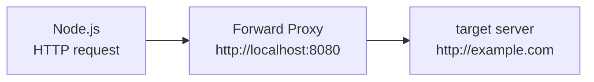

<!--  -->

## HTTP_PROXY

由於我在 Node.js 生態系找不到一個適合的 Forward Proxy，所以我這邊用 [Burp Suite](https://portswigger.net/burp/communitydownload) 內建的 http://localhost:8080

1. 首先，自己架一個 target server
<!-- 來觀察 **Forward Proxy** 到 **target server** 的 HTTP request -->

```ts
import http from "http";

const targetServer = http.createServer();
targetServer.listen(5000);
targetServer.on("request", function (req, res) {
  res.end();
});
```

2. 設定一個有 `proxyEnv` 的 `http.Agent`，並且發起 HTTP request 到 target server

```ts
import http from "http";

const agent = new http.Agent({
  proxyEnv: { http_proxy: "http://localhost:8080" },
  keepAlive: true,
});

const clientRequest = http.request({ host: "localhost", port: 5000, agent });
clientRequest.end();
```

3. 用 [Wireshark](https://www.wireshark.org/download.html) 抓 Loopback: lo0，查看 raw HTTP request / response

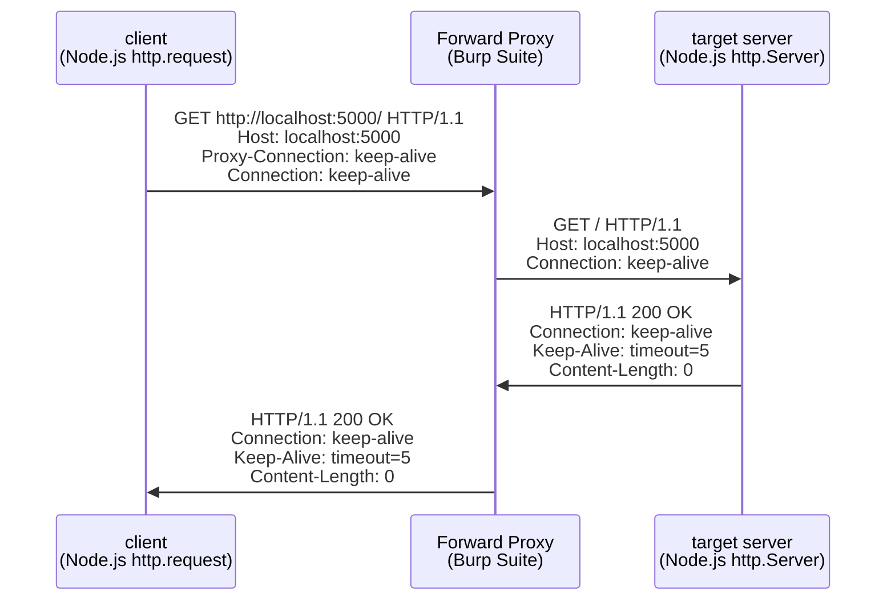

<!-- 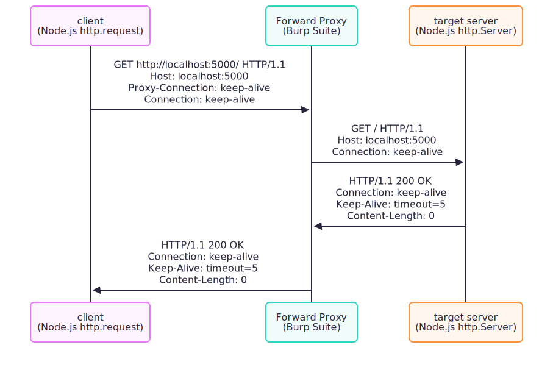 -->

觀察到幾個重點

- client => Forward Proxy 的 request target 是 [absolute-form](#absolute-form)
- Forward Proxy => target server 的 request target 卻轉成了 [origin-form](#origin-form)
- client => Forward Proxy 加了 `Proxy-Connection: keep-alive`
- Forward Proxy => target server 把 `Proxy-Connection: keep-alive` 移除

## origin-form

根據 [RFC 9112 Section 3.2.2. origin-form](https://datatracker.ietf.org/doc/html/rfc9112#name-origin-form) 的描述

```
When making a request directly to an origin server, other than a CONNECT or server-wide OPTIONS request (as detailed below), a client MUST send only the absolute path and query components of the target URI as the request-target.
```

:::info
我們平常看到的 request-target，大部分都是落在這個格式
:::

## absolute-form

根據 [RFC 9112 Section 3.2.2. absolute-form](https://datatracker.ietf.org/doc/html/rfc9112#name-absolute-form) 的描述

```
When making a request to a proxy, other than a CONNECT or server-wide OPTIONS request (as detailed below), a client MUST send the target URI in "absolute-form" as the request-target.
```

至於為何要在 request-target 跟 `Host` header 重複宣告同樣的資訊呢？

```
GET http://localhost:5000/ HTTP/1.1
Host: localhost:5000
```

這部分我覺得 [RFC 9112 Section 3.2.2. absolute-form](https://datatracker.ietf.org/doc/html/rfc9112#name-absolute-form) 講得不夠明確

```
A client MUST send a Host header field in an HTTP/1.1 request even if the request-target is in the absolute-form, since this allows the Host information to be forwarded through ancient HTTP/1.0 proxies that might not have implemented Host.
```

不過 [RFC 9112 Section 3.2.2. absolute-form](https://datatracker.ietf.org/doc/html/rfc9112#name-absolute-form) 同時也有提到

```
A proxy that forwards such a request MUST generate a new Host field value based on the received request-target rather than forward the received Host field value.
```

再加上 [RFC 9112 Section 3.2. Request Target](https://datatracker.ietf.org/doc/html/rfc9112#name-request-target) 有說明

```
A server MUST respond with a 400 (Bad Request) status code to any HTTP/1.1 request message that lacks a Host header field
```

結合以上資訊，我 **"推論"** 出以下結論：

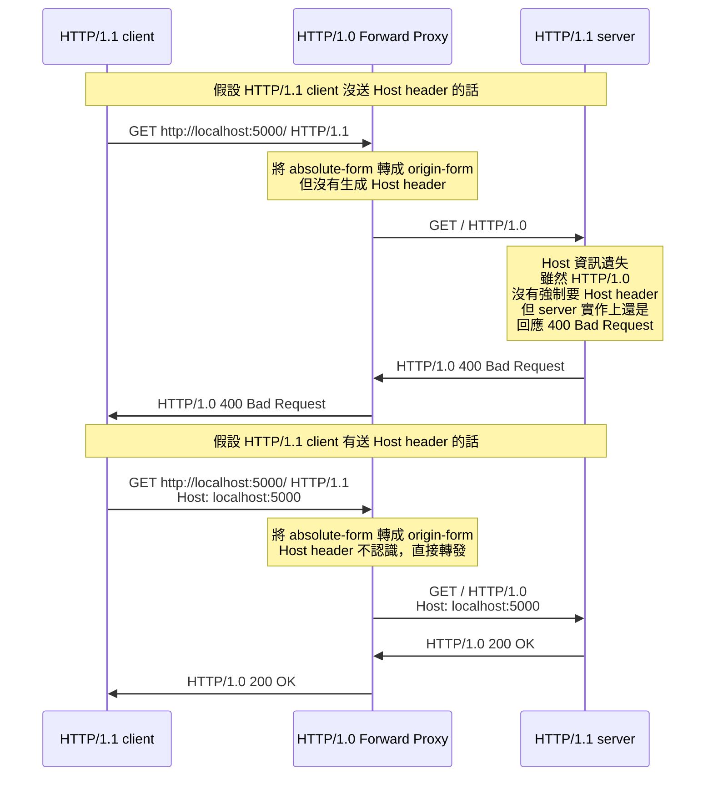

<!-- 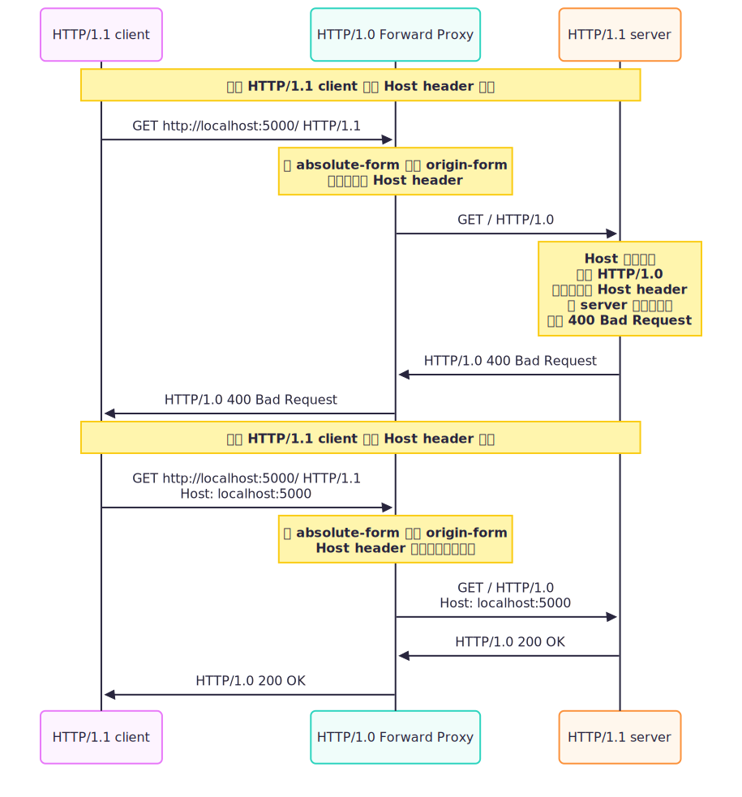 -->

## authority-form

用在 [CONNECT](../http/http-request-methods-1.md#connect) 請求

## asterisk-form

實務上我沒看過這用法，格式如下

```
OPTIONS * HTTP/1.1
Host: example.com
```

但正常的 Cors preflight request 都是針對特定的 resource

```
OPTIONS /users HTTP/1.1
Host: example.com
```

## Proxy-Connection

這是一個非標準的 HTTP header，主要是為了解決 ancient HTTP/1.0 proxies 不支援 `Connection: keep-alive` 並且無腦轉發，造成 proxy 到 server 中間維持了閒置的 TCP 連線

:::info
以下為時序圖為考古推論，我沒有實際用 ancient HTTP/1.0 proxy 測試過（我也找不到這種古老架構測試了）
:::

如果 client 沒有送 `Proxy-Connection: keep-alive`，而是送 `Connection: keep-alive` 的話

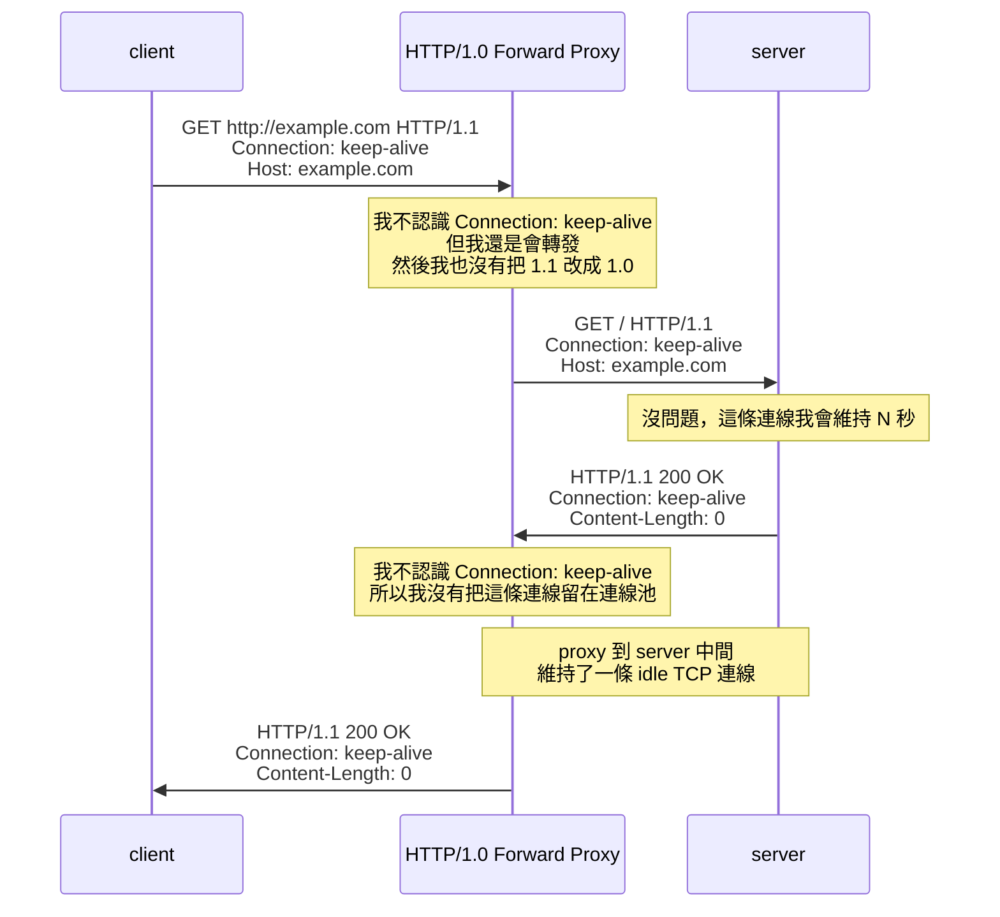

<!-- 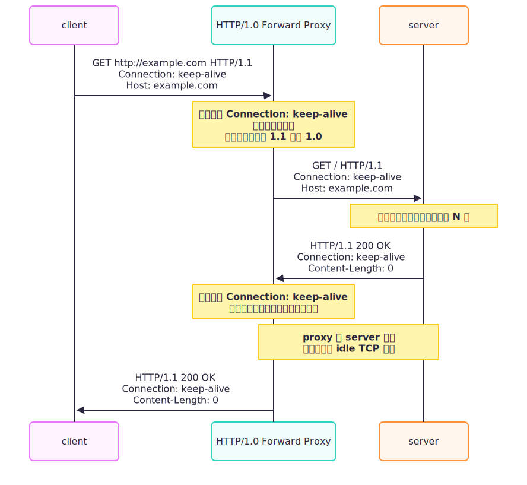 -->

如果 client 改送 `Proxy-Connection: keep-alive`，即便 proxy 無腦轉發，也可以避免 proxy 到 server 中間維持了閒置的 TCP 連線

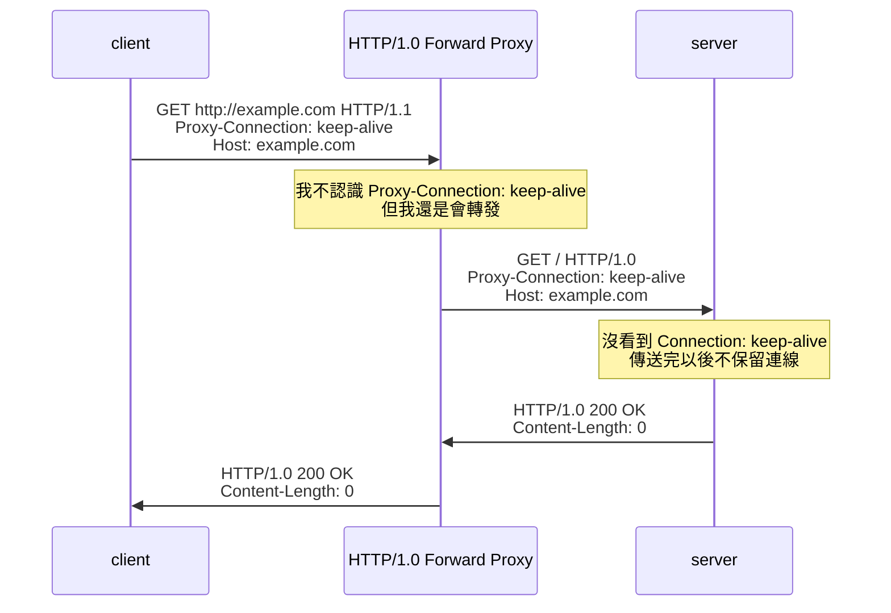

<!-- 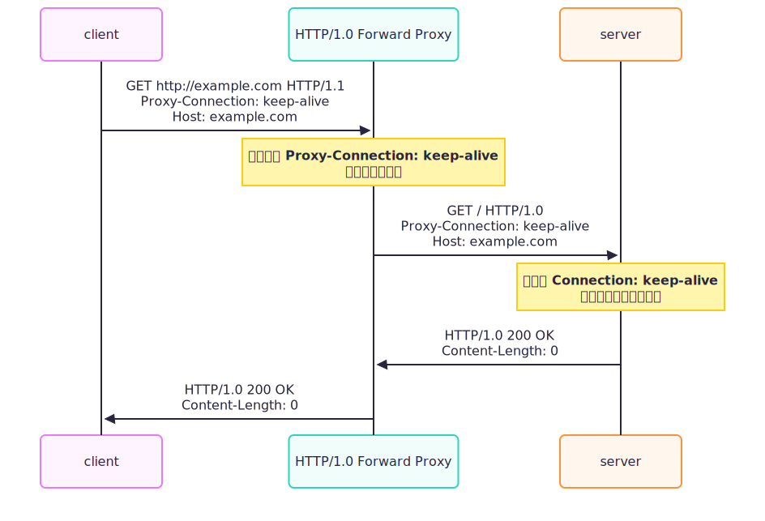 -->

如果 client 改送 `Proxy-Connection: keep-alive`，支援 `Proxy-Connection` 的 proxy 就會轉成 `Connection: keep-alive`

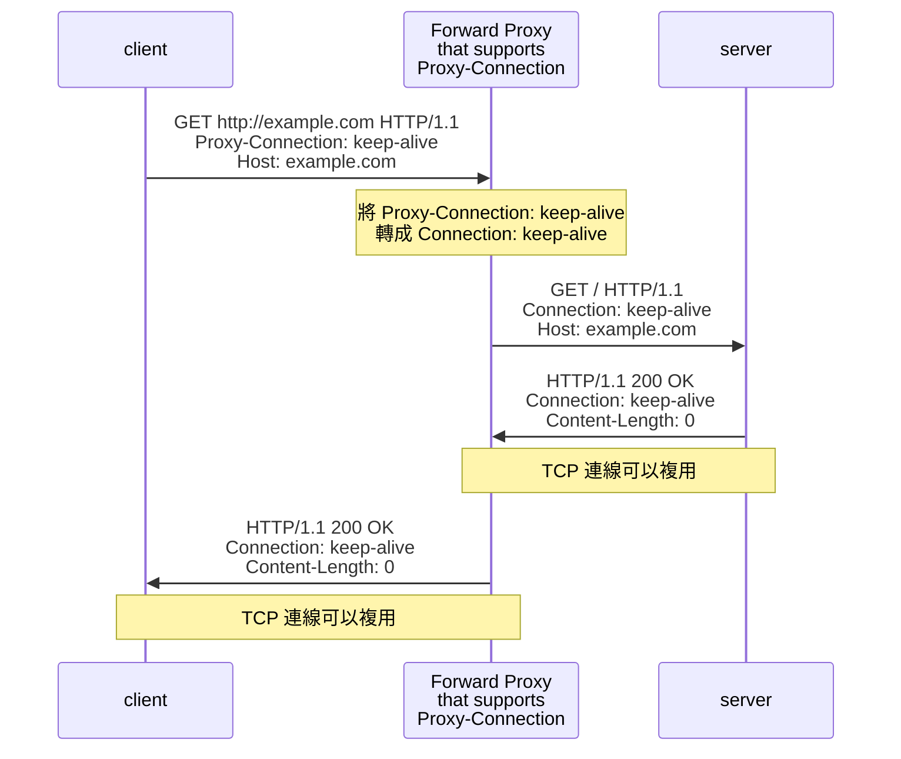

<!-- 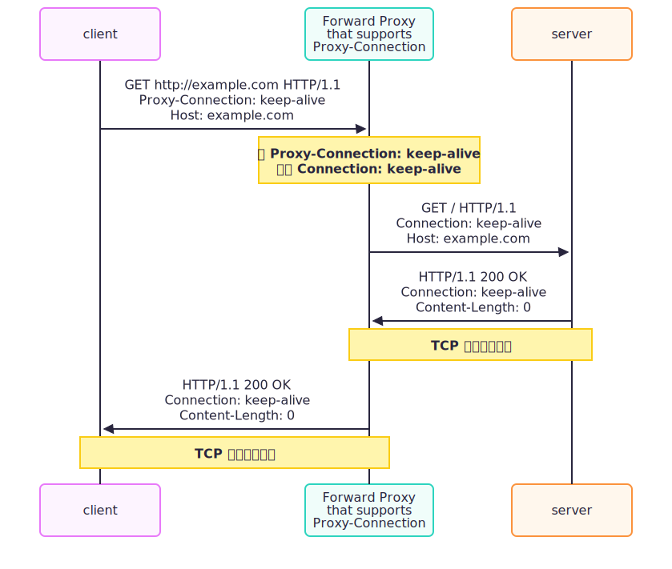 -->

## NO_PROXY

如果某些 domain, IP 不想經過 Forward Proxy，可以在 `NO_PROXY` 指定

```ts
import http from "http";

const fakeProxy = http.createServer();
fakeProxy.listen(5000);
fakeProxy.on("request", function (req, res) {
  console.log("fakeProxy receive request");
  res.end();
});

const agent = new http.Agent({
  proxyEnv: { http_proxy: "http://localhost:5000", no_proxy: "example.com" },
  keepAlive: true,
});
const clientRequest = http.request({ host: "example.com", agent });
clientRequest.end();
```

上述的範例，HTTP request 就不會經過 `fakeProxy`，而是直接打到 `example.com`

詳細的語法，可以參考 [NO_PROXY Format](https://nodejs.org/docs/latest-v24.x/api/http.html#no_proxy-format)

## 小結

在這篇文章，我們學到了

- Node.js Built-in Proxy Support 的角色定位
- Forward Proxy 跟 Reverse Proxy 的差異、比較
- origin-form 跟 absolute-form
- `Proxy-Connection: keep-alive` 的歷史
