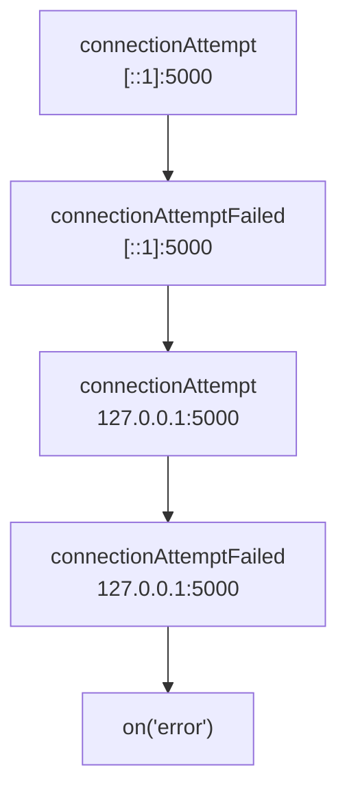
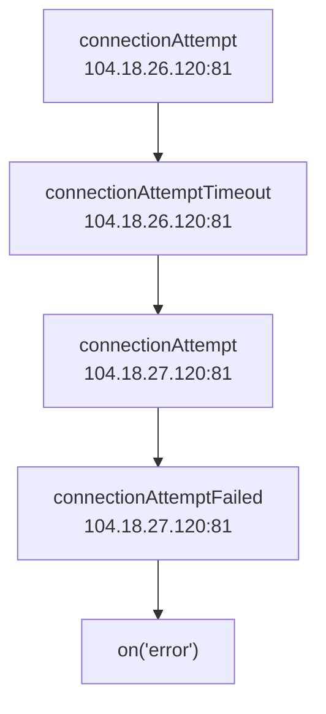
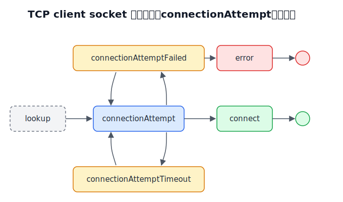

## TCP client socket 生命週期 1：lookup

✅ 正確觸發（lookup event 會在 DNS lookup 之後觸發）

```ts
// ✅ host 為 domain name，會觸發 DNS lookup
const socket = net.connect({ host: "example.com", port: 80 });
socket.on("lookup", (err, address, family, host) =>
  console.log(performance.now(), { err, address, family, host }),
);

// Prints
// 635.062125 { err: null, address: '104.18.26.120', family: 4, host: 'example.com' }
// 635.566666 { err: null, address: '104.18.27.120', family: 4, host: 'example.com' }
```

❌ 不會觸發（指定 IP 的情況就不會觸發）

```ts
// ❌ host 為 IP，不會觸發 DNS lookup
const socket = net.connect({ host: "104.18.26.120", port: 80 });
socket.on("lookup", (err, address, family, host) =>
  console.log(performance.now(), { err, address, family, host }),
);
```

❌ 不會觸發（TCP server socket 是被動等待連線）

```ts
// TCP server
const server = net.createServer();
server.listen(5000, "localhost");
server.on("connection", (serverSocket) => {
  // ❌ serverSocket 是被動等待連線，不會觸發 DNS lookup
  serverSocket.on("lookup", console.log);
});

// TCP client
const clientSocket = net.connect({
  host: "localhost",
  port: 5000,
});
```

## TCP client socket 生命週期 2：connect

成功把 domain name 解成 IP 之後，接下來就可以開始連線

**"connect"** 開頭的 events 有這四個：

- [connect](https://nodejs.org/api/net.html#event-connect)
- [connectionAttempt](https://nodejs.org/api/net.html#event-connectionattempt)
- [connectionAttemptFailed](https://nodejs.org/api/net.html#event-connectionattemptfailed)
- [connectionAttemptTimeout](https://nodejs.org/api/net.html#event-connectionattempttimeout)

針對 localhost 解出來的 addresses 為

```ts
import dns from "dns";
dns.lookup("localhost", { all: true }, (err, addresses) =>
  console.log(addresses),
);

// Prints
// [({ address: "::1", family: 6 }, { address: "127.0.0.1", family: 4 })]
```

每一個 address 的連線，都會觸發一個 `connectionAttempt`，並且可能會觸發以下三個其中一個

- `connect`：連線成功
- `connectionAttemptFailed`：連線失敗
- `connectionAttemptTimeout`：連線超時

另外，[autoSelectFamilyAttemptedAddresses](https://nodejs.org/api/net.html#socketautoselectfamilyattemptedaddresses) 會記錄所有嘗試過的 address，其格式為

```ts
["::1:5000", "127.0.0.1:5000"];
```

### 正常情境

啟一個 TCP server 監聽 localhost:5000，並且開一個 TCP client 連過去

```ts
const server = net.createServer();
server.listen(5000, "localhost");

const socket = net.connect({
  host: "localhost",
  port: 5000,
});
socket.on("connectionAttempt", (ip, port, family) => {
  console.log("connectionAttempt", { ip, port, family });
});
socket.on("connect", () => console.log("connect"));
socket.on("connectionAttemptFailed", (ip, port, family, error) => {
  console.log("connectionAttemptFailed", { ip, port, family, error });
});
socket.on("connectionAttemptTimeout", (ip, port, family) => {
  console.log("connectionAttemptTimeout", { ip, port, family });
});

// Prints
// connectionAttempt { ip: '::1', port: 5000, family: 6 }
// connect
```

最終觸發一次 **"connectionAttempt"** 跟 **"connect"** event

### 異常情境：server 沒開對應 port

將 TCP server 的 port 改成 5001

```ts
const server = net.createServer();
server.listen(5001, "localhost");

const socket = net.connect({
  host: "localhost",
  port: 5000,
});
socket.on("connectionAttempt", (ip, port, family) => {
  console.log("connectionAttempt", { ip, port, family });
});
socket.on("connect", () => console.log("connect"));
socket.on("connectionAttemptFailed", (ip, port, family, error) => {
  console.log("connectionAttemptFailed", { ip, port, family, error });
});
socket.on("connectionAttemptTimeout", (ip, port, family) => {
  console.log("connectionAttemptTimeout", { ip, port, family });
});
// ✅ 記得監聽 on("error") 才不會讓 process exit
socket.on("error", (err) => console.log(err));
```

print 出來的結果是

```ts
// `net.connect` 會根據 "localhost" 解出來的 addresses 依序嘗試連線
// 觸發 `connectionAttempt` 跟 `connectionAttemptFailed`
connectionAttempt { ip: '::1', port: 5000, family: 6 }
connectionAttemptFailed {
  ip: '::1',
  port: 5000,
  family: 6,
  error: Error: connect ECONNREFUSED ::1:5000
      at createConnectionError (node:net:1678:14)
      at afterConnectMultiple (node:net:1708:16) {
    errno: -4078,
    code: 'ECONNREFUSED',
    syscall: 'connect',
    address: '::1',
    port: 5000
  }
}
connectionAttempt { ip: '127.0.0.1', port: 5000, family: 4 }
connectionAttemptFailed {
  ip: '127.0.0.1',
  port: 5000,
  family: 4,
  error: Error: connect ECONNREFUSED 127.0.0.1:5000
      at createConnectionError (node:net:1678:14)
      at afterConnectMultiple (node:net:1708:16) {
    errno: -4078,
    code: 'ECONNREFUSED',
    syscall: 'connect',
    address: '127.0.0.1',
    port: 5000
  }
}
// https://developer.mozilla.org/en-US/docs/Web/JavaScript/Reference/Global_Objects/AggregateError
// 代表的是 多個 error "聚合" 成的一個 error
// 當所有 IPv6 跟 IPv4 的連線嘗試都失敗，就會拋出
AggregateError
    at internalConnectMultiple (node:net:1134:18)
    at afterConnectMultiple (node:net:1715:7) {
  code: 'ECONNREFUSED',
  [errors]: [
    Error: connect ECONNREFUSED ::1:5000
        at createConnectionError (node:net:1678:14)
        at afterConnectMultiple (node:net:1708:16) {
      errno: -4078,
      code: 'ECONNREFUSED',
      syscall: 'connect',
      address: '::1',
      port: 5000
    },
    Error: connect ECONNREFUSED 127.0.0.1:5000
        at createConnectionError (node:net:1678:14)
        at afterConnectMultiple (node:net:1708:16) {
      errno: -4078,
      code: 'ECONNREFUSED',
      syscall: 'connect',
      address: '127.0.0.1',
      port: 5000
    }
  ]
}
```

執行順序如下



<!--  -->

至於為何 Node.js 會把所有 addresses 都嘗試連線一次呢？根據 [socket.connect](https://nodejs.org/api/net.html#socketconnectoptions-connectlistener) 的官方文件，重點的預設值為：

- `family: 0`：IPv6 跟 IPv4 都允許
- `autoSelectFamily: true`：會嘗試連線所有的 IPv6 跟 IPv4，直到其中一個成功

### 異常情境：連線 timeout

由於 [autoSelectFamilyAttemptTimeout](https://nodejs.org/api/net.html#socketconnectoptions-connectlistener) 的最小值是 10ms，本機互連很難超過，所以我們使用 example.com:81 來當範例

先測試 example.com 解出來的 addresses

```ts
dns.lookup("example.com", { all: true }, (err, addresses) =>
  console.log(addresses),
);
// Prints
// [{ address: '104.18.26.120', family: 4 }, { address: '104.18.27.120', family: 4 }]
```

再來連到 example.com:81 試試看

```ts
const socket = net.connect({
  host: "example.com",
  port: 81,
  autoSelectFamilyAttemptTimeout: 10,
});
socket.on("connectionAttempt", (ip, port, family) => {
  console.log(performance.now(), "connectionAttempt", { ip, port, family });
});
socket.on("connect", () => console.log(performance.now(), "connect"));
socket.on("connectionAttemptFailed", (ip, port, family, error) => {
  console.log(performance.now(), "connectionAttemptFailed", {
    ip,
    port,
    family,
    error,
  });
});
socket.on("connectionAttemptTimeout", (ip, port, family) => {
  console.log(performance.now(), "connectionAttemptTimeout", {
    ip,
    port,
    family,
  });
});
```

print 出來的結果是

```ts
765.0478 connectionAttempt { ip: '104.18.26.120', port: 81, family: 4 }
776.1741 connectionAttemptTimeout { ip: '104.18.26.120', port: 81, family: 4 }
776.762 connectionAttempt { ip: '104.18.27.120', port: 81, family: 4 }
21811.692 connectionAttemptFailed {
  ip: '104.18.27.120',
  port: 81,
  family: 4,
  error: Error: connect ETIMEDOUT 104.18.27.120:81
      at createConnectionError (node:net:1678:14)
      at afterConnectMultiple (node:net:1708:16) {
    errno: -4039,
    code: 'ETIMEDOUT',
    syscall: 'connect',
    address: '104.18.27.120',
    port: 81
  }
}
AggregateError
    at internalConnectMultiple (node:net:1134:18)
    at afterConnectMultiple (node:net:1715:7) {
  code: 'ETIMEDOUT',
  [errors]: [
    Error: connect ETIMEDOUT 104.18.26.120:81
        at createConnectionError (node:net:1678:14)
        at Timeout.internalConnectMultipleTimeout (node:net:1737:38)
        at listOnTimeout (node:internal/timers:610:11)
        at processTimers (node:internal/timers:543:7) {
      errno: -4039,
      code: 'ETIMEDOUT',
      syscall: 'connect',
      address: '104.18.26.120',
      port: 81
    },
    Error: connect ETIMEDOUT 104.18.27.120:81
        at createConnectionError (node:net:1678:14)
        at afterConnectMultiple (node:net:1708:16) {
      errno: -4039,
      code: 'ETIMEDOUT',
      syscall: 'connect',
      address: '104.18.27.120',
      port: 81
    }
  ]
}
```

執行順序如下



<!--  -->

- 第一組 IP 104.18.26.120 經過 10ms 就 timeout
- 第二組 IP 104.18.27.120 由於是最後一組，所以不受 10ms 的 timeout 限制（畢竟要以連線成功為優先）

我們可以從 [Node.js 原始碼](https://github.com/nodejs/node/blob/main/lib/net.js) 看到最後一組 address 確實不受 timeout 限制

```ts
function internalConnectMultiple(context, canceled) {
  // ... other code

  if (current < context.addresses.length - 1) {
    debug(
      "connect/multiple: setting the attempt timeout to %d ms",
      context.timeout,
    );

    // If the attempt has not returned an error, start the connection timer
    context[kTimeout] = setTimeout(
      internalConnectMultipleTimeout,
      context.timeout,
      context,
      req,
      self._handle,
    );
  }
}
```

### TCP server socket 不會觸發 connect events

```ts
// TCP server
const server = net.createServer();
server.listen(5000, "localhost");
server.on("connection", (serverSocket) => {
  // ❌ serverSocket 是被動等待連線，不會觸發 connect events
  serverSocket.on("connectionAttempt", console.log);
  serverSocket.on("connect", console.log);
  serverSocket.on("connectionAttemptTimeout", console.log);
  serverSocket.on("connectionAttemptFailed", console.log);
});

// TCP client
const clientSocket = net.connect({
  host: "localhost",
  port: 5000,
});
```

## 小結

| event                    | emitted on client socket | emitted on server socket |
| ------------------------ | ------------------------ | ------------------------ |
| lookup                   | ✅                       | ❌                       |
| connectionAttempt        | ✅                       | ❌                       |
| connect                  | ✅                       | ❌                       |
| connectionAttemptTimeout | ✅                       | ❌                       |
| connectionAttemptFailed  | ✅                       | ❌                       |


