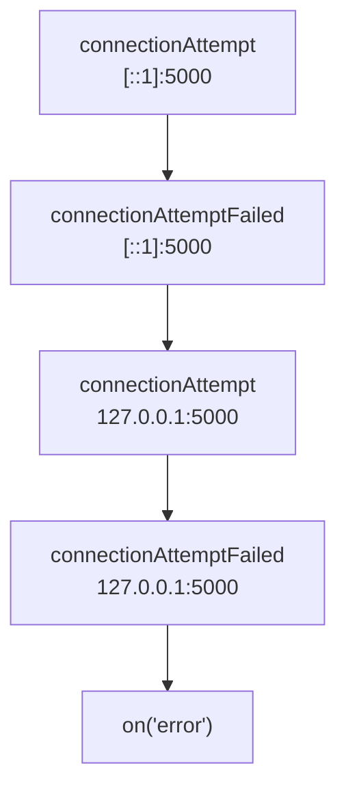
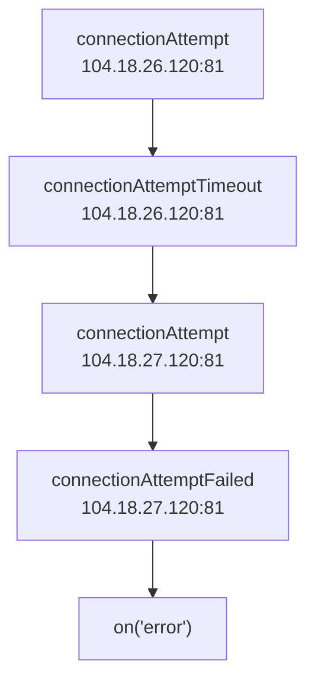
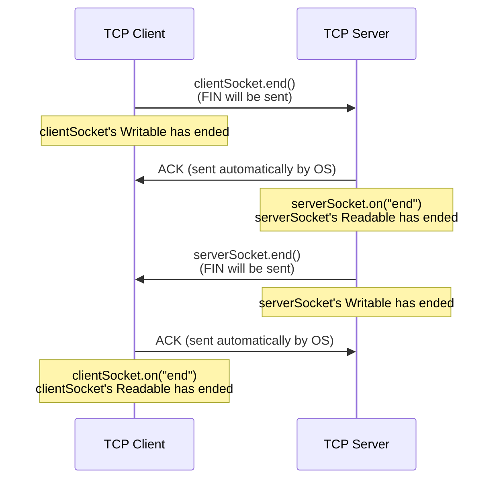
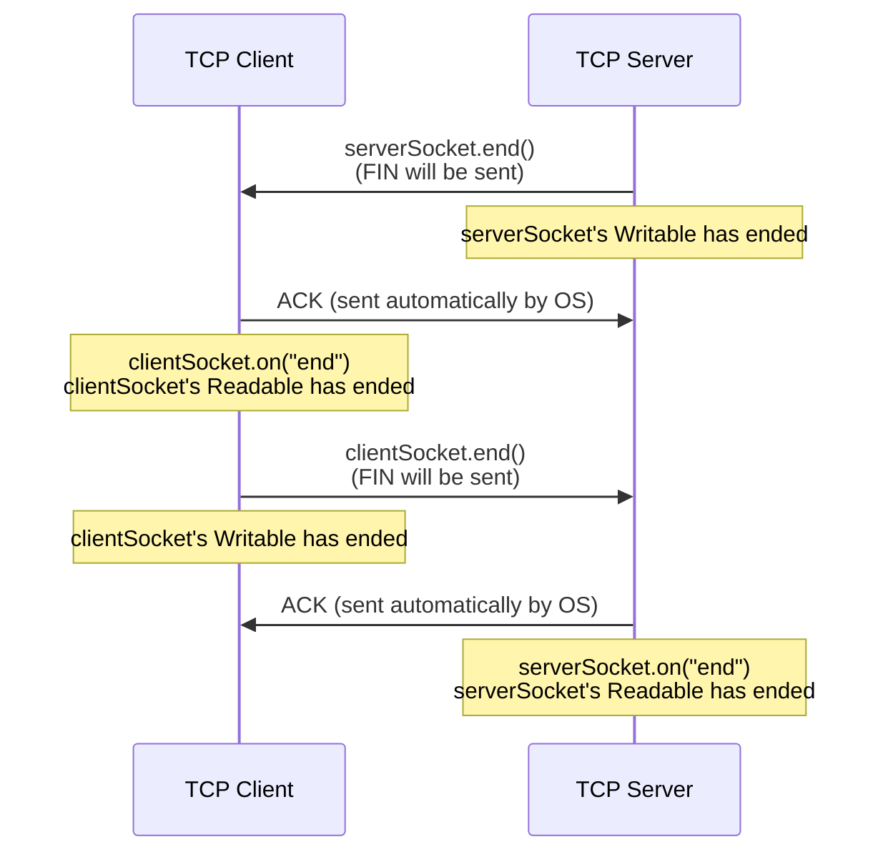
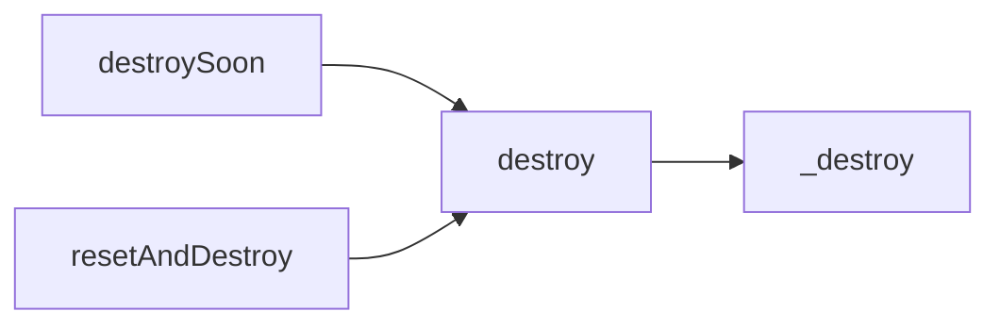

## TCP "Client" Socket 生命週期 1: lookup

lookup event 會在 dns lookup 之後觸發，但如果指定 IP 的情況就不會觸發。

✅ 正確觸發

```ts
//
const socket = net.createConnection({ host: "example.com", port: 80 });
socket.on("lookup", (err, address, family, host) =>
  console.log(performance.now(), { err, address, family, host }),
);

// Prints
// 635.062125 { err: null, address: '104.18.26.120', family: 4, host: 'example.com' }
// 635.566666 { err: null, address: '104.18.27.120', family: 4, host: 'example.com' }
```

❌ 不會觸發

```ts
// ❌ host 為 IP，不會觸發 dns lookup
const socket = net.createConnection({ host: "104.18.26.120", port: 80 });
socket.on("lookup", (err, address, family, host) =>
  console.log(performance.now(), { err, address, family, host }),
);
```

❌ 不會觸發

```ts
// TCP Server
const server = net.createServer();
server.listen(5000, "localhost");
server.on("connection", (serverSocket) => {
  // ❌ serverSocket 是被動等待連線，不會觸發 dns lookup
  serverSocket.on("lookup", console.log);
});

// TCP Client
const clientSocket = net.createConnection({
  host: "localhost",
  port: 5000,
});
```

## TCP "Client" Socket 生命週期 2: connect

成功把 domain 解成 IP 之後，接下來就可以開始連線。connect 開頭的 events 有這四個：

- [connect](https://nodejs.org/api/net.html#event-connect)
- [connectionAttempt](https://nodejs.org/api/net.html#event-connectionattempt)
- [connectionAttemptFailed](https://nodejs.org/api/net.html#event-connectionattemptfailed)
- [connectionAttemptTimeout](https://nodejs.org/api/net.html#event-connectionattempttimeout)

針對 "localhost" 解出來的 addresses 為

```ts
import dns from "dns";
dns.lookup("localhost", { all: true }, (err, addresses) =>
  console.log(addresses),
);

// Prints
// [({ address: "::1", family: 6 }, { address: "127.0.0.1", family: 4 })]
```

每一個 address 的連線，都會觸發一個 `connectionAttempt`，並且可能會觸發

- `connect`：連線成功
- `connectionAttemptFailed`：連線失敗
- `connectionAttemptTimeout`：連線超時

### 正常情境

啟一個 TCP Server 監聽 localhost:5000，並且開一個 TCP Client 連過去

```ts
const server = net.createServer();
server.listen(5000, "localhost");

const socket = net.createConnection({
  host: "localhost",
  port: 5000,
});
socket.on("connectionAttempt", (ip, port, family) => {
  console.log("connectionAttempt", { ip, port, family });
});
socket.on("connect", () => console.log("connect"));
socket.on("connectionAttemptFailed", (ip, port, family, error) => {
  console.log("connectionAttemptFailed", { ip, port, family, error });
});
socket.on("connectionAttemptTimeout", (ip, port, family) => {
  console.log("connectionAttemptTimeout", { ip, port, family });
});

// Prints
// connectionAttempt { ip: '::1', port: 5000, family: 6 }
// connect
```

### Server 沒開對應 port

將 TCP Server 的 port 改成 5001

```ts
const server = net.createServer();
server.listen(5001, "localhost");

const socket = net.createConnection({
  host: "localhost",
  port: 5000,
});
socket.on("connectionAttempt", (ip, port, family) => {
  console.log("connectionAttempt", { ip, port, family });
});
socket.on("connect", () => console.log("connect"));
socket.on("connectionAttemptFailed", (ip, port, family, error) => {
  console.log("connectionAttemptFailed", { ip, port, family, error });
});
socket.on("connectionAttemptTimeout", (ip, port, family) => {
  console.log("connectionAttemptTimeout", { ip, port, family });
});
// ✅ 記得監聽 on("error") 才不會讓 process exit
socket.on("error", (err) => console.log(err));
```

print 出來的結果是

```ts
// `net.createConnection` 會根據 "localhost" 解出來的 addresses 依序嘗試連線
// 觸發 `connectionAttempt` 跟 `connectionAttemptFailed`
connectionAttempt { ip: '::1', port: 5000, family: 6 }
connectionAttemptFailed {
  ip: '::1',
  port: 5000,
  family: 6,
  error: Error: connect ECONNREFUSED ::1:5000
      at createConnectionError (node:net:1678:14)
      at afterConnectMultiple (node:net:1708:16) {
    errno: -4078,
    code: 'ECONNREFUSED',
    syscall: 'connect',
    address: '::1',
    port: 5000
  }
}
connectionAttempt { ip: '127.0.0.1', port: 5000, family: 4 }
connectionAttemptFailed {
  ip: '127.0.0.1',
  port: 5000,
  family: 4,
  error: Error: connect ECONNREFUSED 127.0.0.1:5000
      at createConnectionError (node:net:1678:14)
      at afterConnectMultiple (node:net:1708:16) {
    errno: -4078,
    code: 'ECONNREFUSED',
    syscall: 'connect',
    address: '127.0.0.1',
    port: 5000
  }
}
// https://developer.mozilla.org/en-US/docs/Web/JavaScript/Reference/Global_Objects/AggregateError
// 代表的是 多個 error "聚合" 成的一個 error
// 當所有 IPv6 跟 IPv4 的連線嘗試都失敗，就會拋出
AggregateError
    at internalConnectMultiple (node:net:1134:18)
    at afterConnectMultiple (node:net:1715:7) {
  code: 'ECONNREFUSED',
  [errors]: [
    Error: connect ECONNREFUSED ::1:5000
        at createConnectionError (node:net:1678:14)
        at afterConnectMultiple (node:net:1708:16) {
      errno: -4078,
      code: 'ECONNREFUSED',
      syscall: 'connect',
      address: '::1',
      port: 5000
    },
    Error: connect ECONNREFUSED 127.0.0.1:5000
        at createConnectionError (node:net:1678:14)
        at afterConnectMultiple (node:net:1708:16) {
      errno: -4078,
      code: 'ECONNREFUSED',
      syscall: 'connect',
      address: '127.0.0.1',
      port: 5000
    }
  ]
}
```

執行順序如下



至於為何 Node.js 會把所有 addresses 都嘗試連線一次呢？根據 [socket.connect](https://nodejs.org/api/net.html#socketconnectoptions-connectlistener) 的官方文件，重點的預設值為：

- `family: 0`：IPv6 跟 IPv4 都允許
- `autoSelectFamily: true`：會嘗試連線所有的 IPv6 跟 IPv4，直到其中一個成功

### 連線 timeout

由於 [autoSelectFamilyAttemptTimeout](https://nodejs.org/api/net.html#socketconnectoptions-connectlistener) 的最小值是 10ms，本機互連很難超過，所以我們使用 example.com:81 來當範例

先測試 example.com 解出來的 addresses

```ts
dns.lookup("example.com", { all: true }, (err, addresses) =>
  console.log(addresses),
);
// Prints
// [{ address: '104.18.26.120', family: 4 }, { address: '104.18.27.120', family: 4 }]
```

再來連到 example.com:81 試試看

```ts
const socket = net.createConnection({
  host: "example.com",
  port: 81,
  autoSelectFamilyAttemptTimeout: 10,
});
socket.on("connectionAttempt", (ip, port, family) => {
  console.log(performance.now(), "connectionAttempt", { ip, port, family });
});
socket.on("connect", () => console.log(performance.now(), "connect"));
socket.on("connectionAttemptFailed", (ip, port, family, error) => {
  console.log(performance.now(), "connectionAttemptFailed", {
    ip,
    port,
    family,
    error,
  });
});
socket.on("connectionAttemptTimeout", (ip, port, family) => {
  console.log(performance.now(), "connectionAttemptTimeout", {
    ip,
    port,
    family,
  });
});
```

print 出來的結果是

```ts
765.0478 connectionAttempt { ip: '104.18.26.120', port: 81, family: 4 }
776.1741 connectionAttemptTimeout { ip: '104.18.26.120', port: 81, family: 4 }
776.762 connectionAttempt { ip: '104.18.27.120', port: 81, family: 4 }
21811.692 connectionAttemptFailed {
  ip: '104.18.27.120',
  port: 81,
  family: 4,
  error: Error: connect ETIMEDOUT 104.18.27.120:81
      at createConnectionError (node:net:1678:14)
      at afterConnectMultiple (node:net:1708:16) {
    errno: -4039,
    code: 'ETIMEDOUT',
    syscall: 'connect',
    address: '104.18.27.120',
    port: 81
  }
}
AggregateError
    at internalConnectMultiple (node:net:1134:18)
    at afterConnectMultiple (node:net:1715:7) {
  code: 'ETIMEDOUT',
  [errors]: [
    Error: connect ETIMEDOUT 104.18.26.120:81
        at createConnectionError (node:net:1678:14)
        at Timeout.internalConnectMultipleTimeout (node:net:1737:38)
        at listOnTimeout (node:internal/timers:610:11)
        at processTimers (node:internal/timers:543:7) {
      errno: -4039,
      code: 'ETIMEDOUT',
      syscall: 'connect',
      address: '104.18.26.120',
      port: 81
    },
    Error: connect ETIMEDOUT 104.18.27.120:81
        at createConnectionError (node:net:1678:14)
        at afterConnectMultiple (node:net:1708:16) {
      errno: -4039,
      code: 'ETIMEDOUT',
      syscall: 'connect',
      address: '104.18.27.120',
      port: 81
    }
  ]
}
```

執行順序如下



- 第一組 IP 104.18.26.120 經過 10ms 就 timeout
- 第二組 IP 104.18.27.120 由於是最後一組，所以不受 10ms 的 timeout 限制（畢竟要以連線成功為優先）

我們可以從 [Node.js 原始碼](https://github.com/nodejs/node/blob/main/lib/net.js) 看到最後一組 address 確實不受 timeout 限制

```ts
function internalConnectMultiple(context, canceled) {
  // ... other code

  if (current < context.addresses.length - 1) {
    debug(
      "connect/multiple: setting the attempt timeout to %d ms",
      context.timeout,
    );

    // If the attempt has not returned an error, start the connection timer
    context[kTimeout] = setTimeout(
      internalConnectMultipleTimeout,
      context.timeout,
      context,
      req,
      self._handle,
    );
  }
}
```

### Server Socket 不會觸發 connect events

```ts
// TCP Server
const server = net.createServer();
server.listen(5000, "localhost");
server.on("connection", (serverSocket) => {
  // ❌ serverSocket 是被動等待連線，不會觸發 connect events
  serverSocket.on("connectionAttempt", console.log);
  serverSocket.on("connect", console.log);
  serverSocket.on("connectionAttemptTimeout", console.log);
  serverSocket.on("connectionAttemptFailed", console.log);
});

// TCP Client
const clientSocket = net.createConnection({
  host: "localhost",
  port: 5000,
});
```

## TCP Socket 生命週期 3: 讀寫資料

雖說在先前 [stream.Readable](./stream-readable.md) 那篇文章有提到，讀取資料有兩種模式

- [自動讀取: `on('data')`](./stream-readable.md#自動讀取-ondata)
- [手動讀取: `on('readable')` 搭配 `read`](./stream-readable.md#手動讀取-onreadable-搭配-read)

但 `net.Socket` 僅支援第一種**自動讀取**

並且讀取資料的方法都是繼承 stream.Readable，故這邊就不再贅述～

- [socket.on('data')](https://nodejs.org/api/net.html#event-data)
- [socket.setEncoding([encoding])](https://nodejs.org/api/net.html#socketsetencodingencoding)
- [socket.pause()](https://nodejs.org/api/net.html#socketpause)
- [socket.resume()](https://nodejs.org/api/net.html#socketresume)

主要多了

- [socket.bytesRead](https://nodejs.org/api/net.html#socketbytesread)，用來得知總讀取的資料量
- [socket.bytesWritten](https://nodejs.org/api/net.html#socketbyteswritten)，用來得知總寫入的資料量

```ts
// localhost:5000 架一個簡易的 TCP Server
const server = net.createServer();
server.listen(5000, "localhost");
server.on("connection", (socket) => {
  const cb = () => console.log({ bytesWritten: socket.bytesWritten });
  // server 依序寫入 123, 456 給 client
  socket.write("123", cb);
  setTimeout(() => socket.write("456", cb));
});

// 連線到 TCP Server，讀取資料
const socket = net.createConnection({ host: "localhost", port: 5000 });
socket.setEncoding("utf8");
socket.on("data", (data) => console.log(data, socket.bytesRead));

// Prints
// { bytesWritten: 3 }
// { data: '123', bytesRead: 3 }
// { bytesWritten: 6 }
// { data: '456', bytesRead: 6 }
```

## TCP Socket 生命週期 4: 關閉連線

TCP 的 4-way-Handshake 用來關閉連線，Client 跟 Server 皆可以主動發起這個流程

| TCP 封包 | FIN                                                   | ACK                                        |
| -------- | ----------------------------------------------------- | ------------------------------------------ |
| 全名     | Finish                                                | Acknowledgement                            |
| 語意     | 結束，我不會再寫入資料了<br/>half-close writable side | 確認收到 TCP 封包（含 FIN）                |
| 觸發     | 透過 socket.end()                                     | Node.js 沒有提供 API 控制 ACK 封包的發送   |
| 接收     | 透過 socket.on("end")                                 | Node.js 沒有提供 Event 監控 ACK 封包的抵達 |

### Client 透過 socket.end() 發起關閉連線

<!-- prettier-ignore -->
```ts
// TCP Server
const server = net.createServer({ allowHalfOpen: true });
server.listen(5000, "localhost");
server.on("connection", (serverSocket) => {
  serverSocket.on("end", () => {
    assert(serverSocket.readableEnded === true); 
    console.log(`Step 2: TCP Server received Client's FIN via socket.on("end")`);
    console.log("Step 3: TCP Server initiates FIN via socket.end()");
    serverSocket.end();
    assert(serverSocket.writableEnded === true);
  });
});

// TCP Client
const clientSocket = net.createConnection({ host: "localhost", port: 5000, allowHalfOpen: true });
clientSocket.on("connect", () => {
  console.log("Step 1: TCP Client initiates FIN via socket.end()");
  clientSocket.end();
  assert(clientSocket.writableEnded === true);
});
clientSocket.on("end", () => {
  assert(clientSocket.readableEnded === true);
  console.log(`Step 4: TCP Client received Server's FIN via socket.on("end")`);
});

// Prints
// Step 1: TCP Client initiates FIN via socket.end()
// Step 2: TCP Server received Client's FIN via socket.on("end")
// Step 3: TCP Server initiates FIN via socket.end()
// Step 4: TCP Client received Server's FIN via socket.on("end")
```

用 [Wireshark](https://www.wireshark.org/download.html) 抓 Loopback: lo0，加上篩選 tcp.port == 5000，觀察由 TCP Client 主動發起的關閉連線


流程如下：



### Server 透過 socket.end() 發起關閉連線

<!-- prettier-ignore -->
```ts
// TCP Server
const server = net.createServer();
server.listen(5000, "localhost");
server.on("connection", (serverSocket) => {
  console.log("Step 1: TCP Server initiates FIN via socket.end()");
  serverSocket.end();
  assert(serverSocket.writableEnded === true);
  serverSocket.on("end", () => {
    assert(serverSocket.readableEnded === true);
    console.log(`Step 4: TCP Server received Client's FIN via socket.on("end")`);
  });
});

// TCP Client
const clientSocket = net.createConnection({ host: "localhost", port: 5000, allowHalfOpen: true });
clientSocket.on("end", () => {
  assert(clientSocket.readableEnded === true);
  console.log(`Step 2: TCP Client received Server's FIN via socket.on("end")`,);
  console.log("Step 3: TCP Client initiates FIN via socket.end()");
  clientSocket.end();
  assert(clientSocket.writableEnded === true);
});

// Prints
// Step 1: TCP Server initiates FIN via socket.end()
// Step 2: TCP Client received Server's FIN via socket.on("end")
// Step 3: TCP Client initiates FIN via socket.end()
// Step 4: TCP Server received Client's FIN via socket.on("end")
```

用 [Wireshark](https://www.wireshark.org/download.html) 抓 Loopback: lo0，加上篩選 tcp.port == 5000，觀察由 TCP Server 主動發起的關閉連線


流程如下：



## TCP Socket 生命週期 4-1: 強制關閉連線

正常情況走的是 TCP 4-way-Handshake 優雅的關閉連線，但也有情況必須強制關閉連線，這時候就需要用到 destroy 開頭的 methods

- [socket.destroy([error])](https://nodejs.org/api/net.html#socketdestroyerror)
  - Ensures that no more I/O activity happens on this socket.
  - Destroys the stream and closes the connection.
- [socket.destroySoon()](https://nodejs.org/api/net.html#socketdestroysoon)
  - Destroys the socket after all data is written.
- [socket.resetAndDestroy()](https://nodejs.org/api/net.html#socketresetanddestroy)
  - Close the TCP connection by sending an RST packet and destroy the stream.

以上是 Node.js 官方文件的描述，我翻了 Node.js 原始碼，發現這三個 method，最後都會走到 `destroy` 跟 `_destroy`



具體差異是，`destroySoon` 會等 writable 結束再呼叫 `destroy`

```ts
// https://github.com/nodejs/node/blob/main/lib/net.js

Socket.prototype.destroySoon = function () {
  if (this.writable) this.end();

  if (this.writableFinished) this.destroy();
  else this.once("finish", this.destroy);
};
```

而 `resetAndDestroy` 則是會把 `resetAndClosing` 設為 `true` 再呼叫 `destroy`，TCP 層級會發送 RST (Reset) 封包

```ts
// https://github.com/nodejs/node/blob/main/lib/net.js

Socket.prototype.resetAndDestroy = function () {
  if (this._handle) {
    if (!(this._handle instanceof TCP)) throw new ERR_INVALID_HANDLE_TYPE();
    if (this.connecting) {
      debug("reset wait for connection");
      this.once("connect", () => this._reset());
    } else {
      this._reset();
    }
  } else {
    this.destroy(new ERR_SOCKET_CLOSED());
  }
  return this;
};

Socket.prototype._reset = function () {
  debug("reset connection");
  this.resetAndClosing = true;
  return this.destroy();
};
```

## end vs destroy

兩者都是關閉連線，但行為上卻不一樣

| method     | socket.end()     | socket.destroy() |
| ---------- | ---------------- | ---------------- |
| TCP Packet | FIN              | FIN or RST       |
| Writable   | writable = false | writable = false |
| Readable   | readable = true  | readable = false |

<!-- todo-yus -->

<!-- ## noDelay -->

<!-- ## file descriptor -->

<!-- ## onread, single buffer -->

<!-- ## ref, unref (阻止 process.exit) -->

<!-- ## getTypeOfService, setTypeOfService -->

## 小結

以上是我覺得學習 Node.js http 模組之前，必學的 net 模組部分

net.Socket 跟 net.Server 還有很多可以介紹的，但我覺得需要更多底層的理解（作業系統、TCP...），包含

- TCP noDelay, Nagle's algorithm
- file descriptor
- onread, single buffer
- ref, unref (阻止 process.exit)
- getTypeOfService, setTypeOfService

等未來若有機會研究到更底層，再來把這塊補齊～

## 參考資料

- https://nodejs.org/api/net.html
