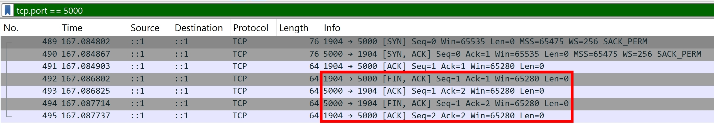
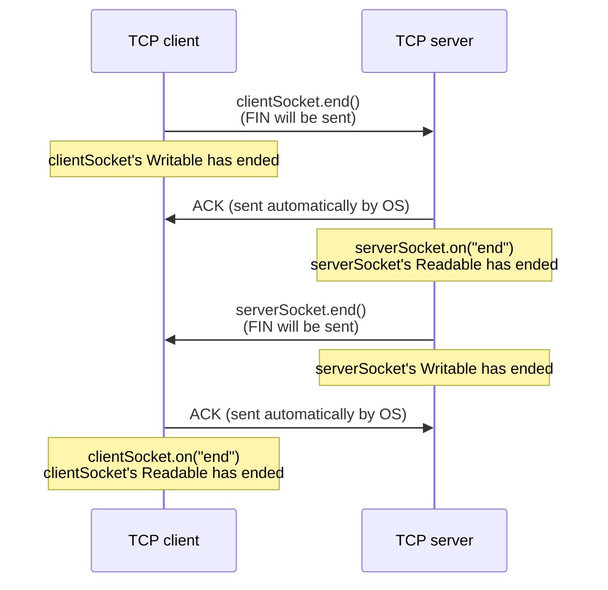
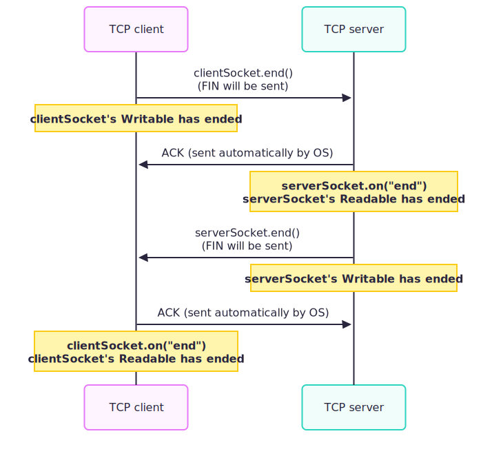
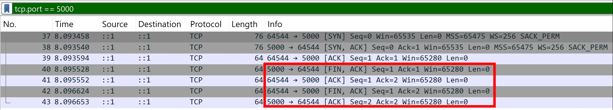
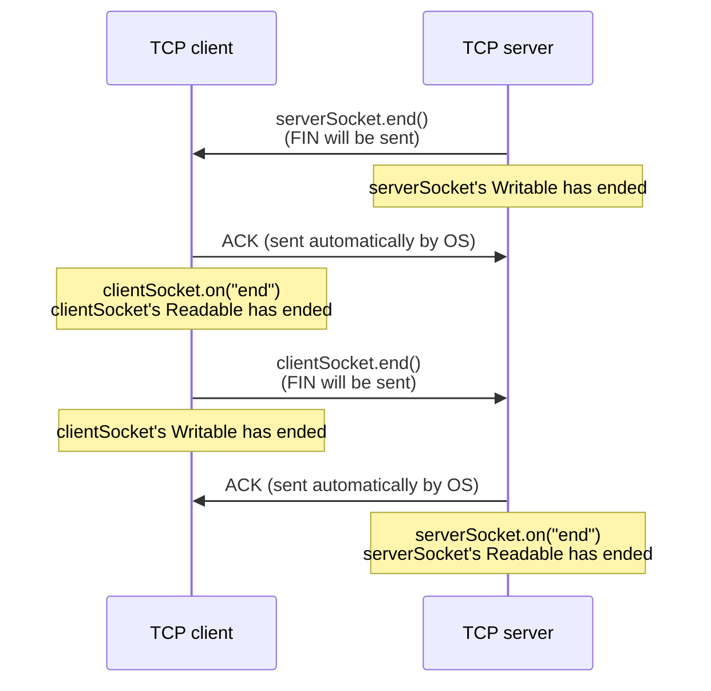
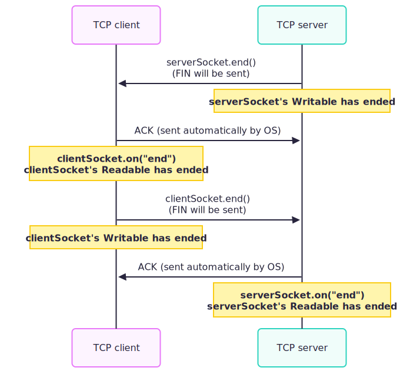
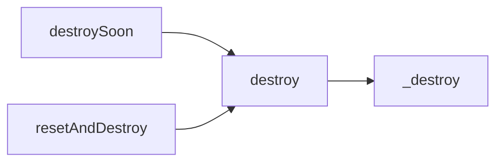
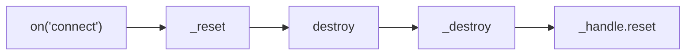

## 前言

承接 [Node.js TCP Client Socket 生命週期](./socket-client-life-cycle.md)，接下來要介紹的是 TCP client socket 跟 server socket 共同的生命週期

## TCP socket 生命週期 3：讀寫資料

`net.Socket` 是繼承 `stream.Duplex`，這是一個可讀可寫的資料流

```js
// https://github.com/nodejs/node/blob/main/lib/net.js

function Socket(options) {
  // ...
  stream.Duplex.call(this, options);
  // ...
}
```

- 讀資料，基本上就是繼承 `stream.Readable` 的 methods 跟 events
- 寫資料，基本上就是繼承 `stream.Writable` 的 methods 跟 events

主要多了

- [socket.bytesRead](https://nodejs.org/api/net.html#socketbytesread)，用來得知總讀取的資料量
- [socket.bytesWritten](https://nodejs.org/api/net.html#socketbyteswritten)，用來得知總寫入的資料量

```ts
import net from "net";

// localhost:5000 架一個簡易的 TCP server
const server = net.createServer();
server.listen(5000, "localhost");
server.on("connection", (socket) => {
  const cb = () => console.log({ bytesWritten: socket.bytesWritten });
  // server 依序寫入 123, 456 給 client
  socket.write("123", cb);
  setTimeout(() => socket.write("456", cb));
});

// 連線到 TCP server，讀取資料
const socket = net.connect({ host: "localhost", port: 5000 });
socket.setEncoding("utf8");
socket.on("data", (data) => console.log(data, socket.bytesRead));

// Prints
// { bytesWritten: 3 }
// { data: '123', bytesRead: 3 }
// { bytesWritten: 6 }
// { data: '456', bytesRead: 6 }
```

## TCP socket 生命週期 4：關閉連線

TCP 的 4-way-Handshake 用來關閉連線，client 跟 server 皆可以主動發起這個流程

|           | FIN                                              | ACK                                                             |
| --------- | ------------------------------------------------ | --------------------------------------------------------------- |
| Full name | Finish                                           | Acknowledgement                                                 |
| Semantics | I'm done writing data — half-close writable side | Confirms receipt of a TCP packet (including FIN)                |
| Trigger   | Via `socket.end()`                               | Node.js provides no API to control sending of ACK packets       |
| Receipt   | Via `socket.on("end")`                           | Node.js provides no event to monitor the arrival of ACK packets |

### client 透過 `socket.end()` 發起關閉連線

<!-- prettier-ignore -->
```ts
import net from "net";
import assert from "assert";

// TCP server
const server = net.createServer({ allowHalfOpen: true });
server.listen(5000, "localhost");
server.on("connection", (serverSocket) => {
  serverSocket.on("end", () => {
    assert(serverSocket.readableEnded === true); 
    console.log(`Step 2: TCP server received client's FIN via socket.on("end")`);
    console.log("Step 3: TCP server initiates FIN via socket.end()");
    serverSocket.end();
    assert(serverSocket.writableEnded === true);
  });
});

// TCP client
const clientSocket = net.connect({ host: "localhost", port: 5000, allowHalfOpen: true });
clientSocket.on("connect", () => {
  console.log("Step 1: TCP client initiates FIN via socket.end()");
  clientSocket.end();
  assert(clientSocket.writableEnded === true);
});
clientSocket.on("end", () => {
  assert(clientSocket.readableEnded === true);
  console.log(`Step 4: TCP client received server's FIN via socket.on("end")`);
});

// Prints
// Step 1: TCP client initiates FIN via socket.end()
// Step 2: TCP server received client's FIN via socket.on("end")
// Step 3: TCP server initiates FIN via socket.end()
// Step 4: TCP client received server's FIN via socket.on("end")
```

用 [Wireshark](https://www.wireshark.org/download.html) 抓 Loopback: lo0，加上篩選 tcp.port == 5000，觀察由 TCP client 主動發起的關閉連線



流程如下：


```mermaid
sequenceDiagram
  participant c as TCP client
  participant s as TCP server

  c ->> s: clientSocket.end()<br/>(FIN will be sent)
  Note over c: clientSocket's Writable has ended
  s ->> c: ACK (sent automatically by OS)
  Note over s: serverSocket.on("end")<br/>serverSocket's Readable has ended

  s ->> c: serverSocket.end()<br/>(FIN will be sent)
  Note over s: serverSocket's Writable has ended
  c ->> s: ACK (sent automatically by OS)
  Note over c: clientSocket.on("end")<br/>clientSocket's Readable has ended
```

<!--  -->

### server 透過 `socket.end()` 發起關閉連線

<!-- prettier-ignore -->
```ts
import net from "net";
import assert from "assert";

// TCP server
const server = net.createServer();
server.listen(5000, "localhost");
server.on("connection", (serverSocket) => {
  console.log("Step 1: TCP server initiates FIN via socket.end()");
  serverSocket.end();
  assert(serverSocket.writableEnded === true);
  serverSocket.on("end", () => {
    assert(serverSocket.readableEnded === true);
    console.log(`Step 4: TCP server received client's FIN via socket.on("end")`);
  });
});

// TCP client
const clientSocket = net.connect({ host: "localhost", port: 5000, allowHalfOpen: true });
clientSocket.on("end", () => {
  assert(clientSocket.readableEnded === true);
  console.log(`Step 2: TCP client received server's FIN via socket.on("end")`,);
  console.log("Step 3: TCP client initiates FIN via socket.end()");
  clientSocket.end();
  assert(clientSocket.writableEnded === true);
});

// Prints
// Step 1: TCP server initiates FIN via socket.end()
// Step 2: TCP client received server's FIN via socket.on("end")
// Step 3: TCP client initiates FIN via socket.end()
// Step 4: TCP server received client's FIN via socket.on("end")
```

用 [Wireshark](https://www.wireshark.org/download.html) 抓 Loopback: lo0，加上篩選 tcp.port == 5000，觀察由 TCP server 主動發起的關閉連線



流程如下：


```mermaid
sequenceDiagram
  participant c as TCP client
  participant s as TCP server

  s ->> c: serverSocket.end()<br/>(FIN will be sent)
  Note over s: serverSocket's Writable has ended
  c ->> s: ACK (sent automatically by OS)
  Note over c: clientSocket.on("end")<br/>clientSocket's Readable has ended

  c ->> s: clientSocket.end()<br/>(FIN will be sent)
  Note over c: clientSocket's Writable has ended
  s ->> c: ACK (sent automatically by OS)
  Note over s: serverSocket.on("end")<br/>serverSocket's Readable has ended
```

<!--  -->

## TCP socket 生命週期 4-1：強制關閉連線

正常情況走的是 TCP 4-way-Handshake 優雅的關閉連線，但也有情況必須強制關閉連線，這時候就需要用到 destroy 開頭的 methods

- [socket.destroy([error])](https://nodejs.org/api/net.html#socketdestroyerror)
  - Ensures that no more I/O activity happens on this socket.
  - Destroys the stream and closes the connection.
- [socket.destroySoon()](https://nodejs.org/api/net.html#socketdestroysoon)
  - Destroys the socket after all data is written.
- [socket.resetAndDestroy()](https://nodejs.org/api/net.html#socketresetanddestroy)
  - Close the TCP connection by sending an RST packet and destroy the stream.

以上是 Node.js 官方文件的描述，我翻了 Node.js 原始碼，發現這三個 method，最後都會走到 `destroy` 跟 `_destroy`


```mermaid
flowchart LR
  A["destroy"] --> B["_destroy"]
  C["destroySoon"] --> A
  D["resetAndDestroy"] --> A
```

<!--  -->

具體差異是，`destroySoon` 會等 `writableFinished` 再呼叫 `destroy`

```ts
// https://github.com/nodejs/node/blob/main/lib/net.js

Socket.prototype.destroySoon = function () {
  if (this.writable) this.end();

  if (this.writableFinished) this.destroy();
  else this.once("finish", this.destroy);
};
```

而 `resetAndDestroy` 則是會設定 `resetAndClosing` 為 `true` 再呼叫 `destroy`，TCP 層級會發送 RST (Reset) 封包

```ts
// https://github.com/nodejs/node/blob/main/lib/net.js

Socket.prototype.resetAndDestroy = function () {
  if (this._handle) {
    if (!(this._handle instanceof TCP)) throw new ERR_INVALID_HANDLE_TYPE();
    if (this.connecting) {
      debug("reset wait for connection");
      this.once("connect", () => this._reset());
    } else {
      this._reset();
    }
  } else {
    this.destroy(new ERR_SOCKET_CLOSED());
  }
  return this;
};

Socket.prototype._reset = function () {
  debug("reset connection");
  this.resetAndClosing = true;
  return this.destroy();
};

Socket.prototype._destroy = function (exception, cb) {
  // ...
  if (this.resetAndClosing) {
    this.resetAndClosing = false;
    const err = this._handle.reset(() => {
      debug("emit close");
      this.emit("close", isException);
    });
    if (err) this.emit("error", new ErrnoException(err, "reset"));
  }
  // ...
};
```

`resetAndDestroy` 的簡化流程：


```mermaid
flowchart LR
  A["on('connect')"] --> B["_reset"]
  B --> C["destroy"]
  C --> D["_destroy"]
  D --> E["_handle.reset"]
```

<!--  -->

:::info
這裡的 `_handle` 是 JavaScript 跟底層 C/C++ 介接的橋樑
:::

## `socket.end()` vs `socket.destroy()`

兩者都是關閉連線，但行為上卻不一樣

|                   | `socket.end()` | `socket.destroy()` |
| ----------------- | -------------- | ------------------ |
| TCP Flag          | FIN            | FIN or RST         |
| `socket.writable` | false          | false              |
| `socket.readable` | true           | false              |

<!-- todo-yus -->

<!-- ## noDelay -->

<!-- ## file descriptor -->

<!-- ## onread, single buffer -->

<!-- ## ref, unref (阻止 process.exit) -->

<!-- ## getTypeOfService, setTypeOfService -->

## 小結

`net.Socket` 說穿了，就是把 `stream.Duplex` 這個抽象的讀寫流，加上 TCP 的功能具象化

|              | `stream.Duplex`                           | `net.Socket` (TCP)                                                               |
| ------------ | ----------------------------------------- | -------------------------------------------------------------------------------- |
| `on("data")` | emits a chunk                             | emits a chunk received over TCP                                                  |
| `on("end")`  | `readable = false`                        | `readable = false`, received TCP `FIN`                                           |
| `write`      | buffers a chunk                           | sends a chunk over TCP                                                           |
| `end`        | `writable = false`                        | `writable = false`, sends TCP `FIN`                                              |
| `destroy`    | `writable = false`<br/>`readable = false` | `writable = false`<br/>`readable = false`<br/>closes TCP handle (`FIN` or `RST`) |

<!-- 以上是我覺得學習 Node.js http 模組之前，必學的 `net` 模組部分

`net.Socket` 跟 `net.Server` 還有很多可以介紹的，但我覺得需要更多底層的理解（作業系統、TCP...），包含

- TCP noDelay, Nagle's algorithm
- file descriptor
- onread, single buffer
- ref, unref (阻止 process.exit)
- getTypeOfService, setTypeOfService

等未來若有機會研究到更底層，再來把這塊補齊～ -->

## 參考資料

- https://nodejs.org/api/net.html
