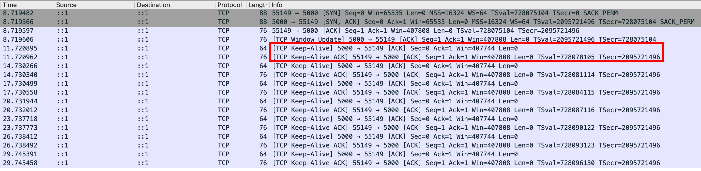
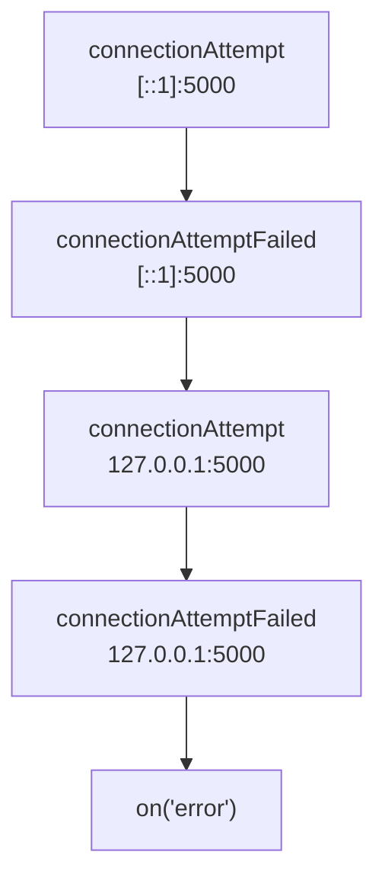
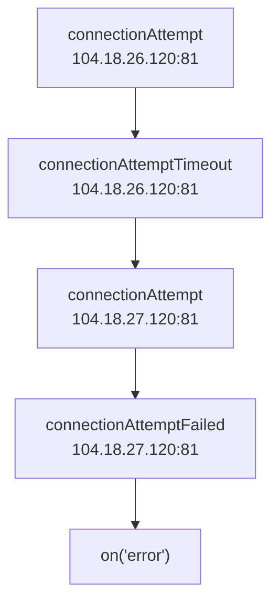
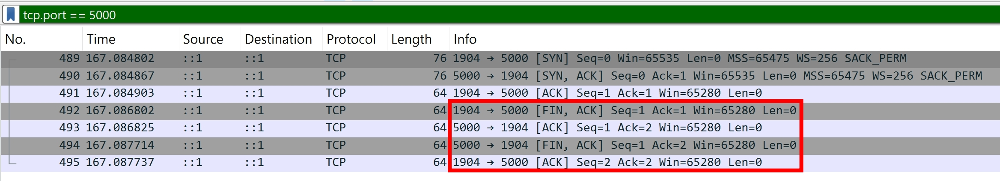
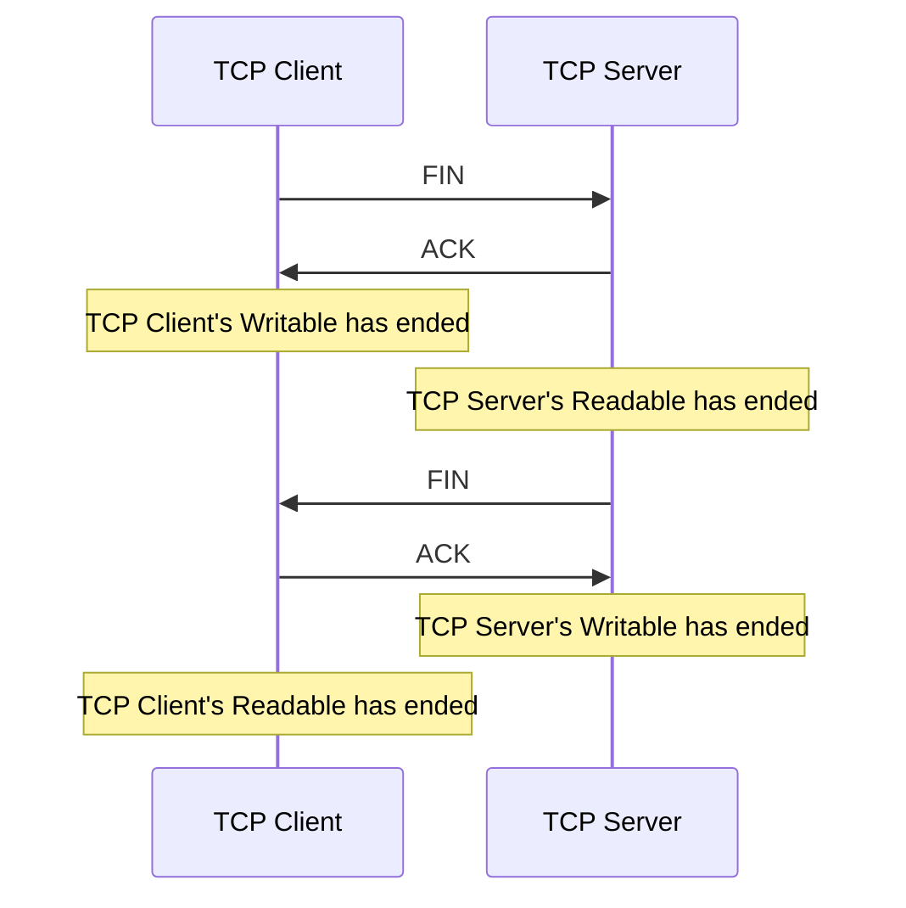
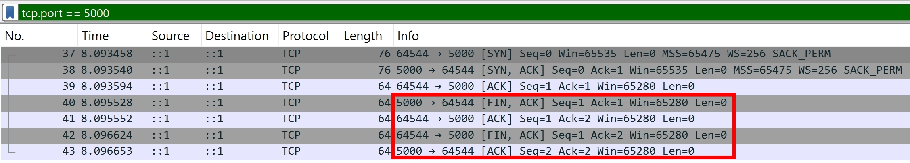
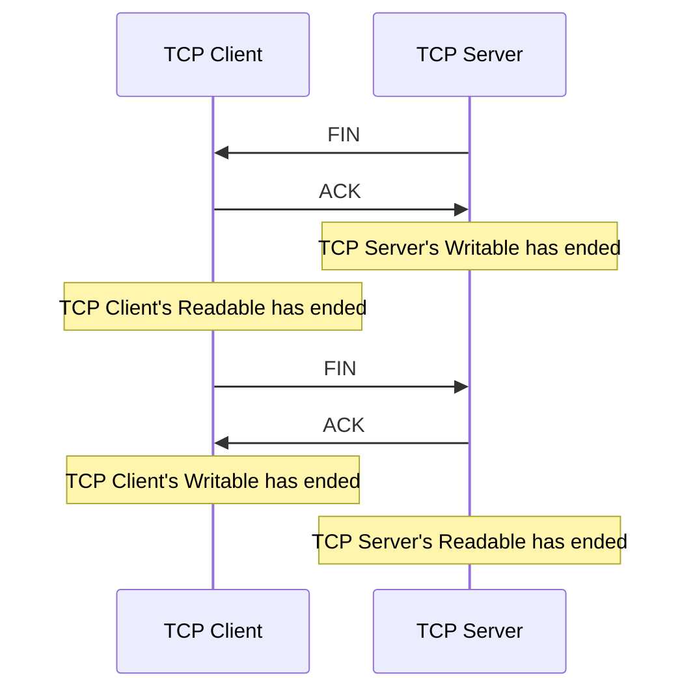

## 前言

Node.js 的 net.Socket 是一個 TCP (Layer 4) 的抽象 & 封裝，讓開發者不必理解 TCP 的架構，直接使用封裝好的 API 就可以建立 TCP 連線、傳輸資料

所謂的 TCP 架構，包含但不限於以下：

1. TCP Finite State Machine
2. TCP Header
3. TCP Flags
4. TCP HandShake
5. TCP Checksum

透過封裝好的 API，就可以不必關注以上細節

:::info
TCP Socket 這個抽象 & 封裝並非 Node.js 獨有的概念，許多程式語言都有實作 Socket 模組
:::

## From HTTP Point of View

✅ 為了簡化邏輯，我們先以 HTTP/1.1 Plain Text 當作舉例

### As a HTTP Client

身為前端工程師，正常要發起 HTTP Request

```ts
fetch("http://example.com")
  .then((res) => res.text())
  .then(console.log);

// <!doctype html><html lang="en"><head><title>Example Domain</title><meta name="viewport" content="width=device-width, initial-scale=1"><style>body{background:#eee;width:60vw;margin:15vh auto;font-family:system-ui,sans-serif}h1{font-size:1.5em}div{opacity:0.8}a:link,a:visited{color:#348}</style><body><div><h1>Example Domain</h1><p>This domain is for use in documentation examples without needing permission. Avoid use in operations.<p><a href="https://iana.org/domains/example">Learn more</a></div></body></html>
```

若以 net 模組來達成這件事情

```ts
const socket = net.connect({
  host: "example.com",
  port: 80,
});
socket.setEncoding("utf8"); // ✅ setEncoding 是 stream.Readable 的 method
socket.write("GET / HTTP/1.1\r\nHost: example.com\r\n\r\n"); // ✅ write 是 stream.Writable 的 method
socket.on("data", console.log); // ✅ on('data') 是 stream.Readable 的 event

// HTTP/1.1 200 OK
// Date: Thu, 29 Jan 2026 06:50:35 GMT
// Content-Type: text/html
// Transfer-Encoding: chunked
// Connection: keep-alive
// CF-RAY: 9c56cbd4d8fe8a97-TPE
// Last-Modified: Tue, 27 Jan 2026 13:22:54 GMT
// Allow: GET, HEAD
// Accept-Ranges: bytes
// Age: 8132
// cf-cache-status: HIT
// Server: cloudflare

// 201
// <!doctype html><html lang="en"><head><title>Example Domain</title><meta name="viewport" content="width=device-width, initial-scale=1"><style>body{background:#eee;width:60vw;margin:15vh auto;font-family:system-ui,sans-serif}h1{font-size:1.5em}div{opacity:0.8}a:link,a:visited{color:#348}</style><body><div><h1>Example Domain</h1><p>This domain is for use in documentation examples without needing permission. Avoid use in operations.<p><a href="https://iana.org/domains/example">Learn more</a></div></body></html>

// 0
//
//
```

- 我們平常用的 HTTP Client (curl, fetch, Postman...) 底層也是透過 TCP Client Socket 來傳輸 raw bytes
- 在 net 模組的範例，可以看到 16 進位的 201 跟 0，這是 [Transfer-Encoding](../http/transfer-encoding.md) 用來宣告下一行的資料有多少 bytes
- HTTP Client 幫開發者處理好了 HTTP Parsing, Connection Reuse 等等底層細節
- 在 [stream-overview](stream-overview.md#streamduplex) 有提到 Socket 繼承 stream.Duplex，故包含 Readable 跟 Writable 的所有 methods

### As a HTTP Server

正常要用 Node.js 創建一個 HTTP Server

```ts
const httpServer = http.createServer();
httpServer.on("request", (req, res) => {
  res.end("ok");
});
httpServer.listen(5000);
```

用 curl 戳看看，確認真的有收到 HTTP Response

```ts
// curl http://localhost:5000 -v
// * Host localhost:5000 was resolved.
// * IPv6: ::1
// * IPv4: 127.0.0.1
// *   Trying [::1]:5000...
// * Connected to localhost (::1) port 5000
// > GET / HTTP/1.1
// > Host: localhost:5000
// > User-Agent: curl/8.7.1
// > Accept: */*
// >
// * Request completely sent off
// < HTTP/1.1 200 OK
// < Date: Thu, 29 Jan 2026 08:27:19 GMT
// < Connection: keep-alive
// < Keep-Alive: timeout=5
// < Content-Length: 2
// <
// * Connection #0 to host localhost left intact
// ok%
```

若以 net 模組來達成這件事情

```ts
const server = net.createServer({ allowHalfOpen: true });
server.on("connection", (socket) => {
  socket.on("data", (chunk) => {
    // todo: implement HTTP Parser to parse chunk...
    socket.write("HTTP/1.1 200 OK\r\nContent-Length: 2\r\n\r\nok");
  });
});
server.listen(5000);
```

用 curl 戳看看，確認真的有收到 HTTP Response

```ts
// curl http://localhost:5000 -v
// * Host localhost:5000 was resolved.
// * IPv6: ::1
// * IPv4: 127.0.0.1
// *   Trying [::1]:5000...
// * Connected to localhost (::1) port 5000
// > GET / HTTP/1.1
// > Host: localhost:5000
// > User-Agent: curl/8.7.1
// > Accept: */*
// >
// * Request completely sent off
// < HTTP/1.1 200 OK
// < Content-Length: 2
// <
// * Connection #0 to host localhost left intact
// ok%
```

## net.Server (net.createServer)

要創建一個 TCP Server 的話，可以使用

```ts
const server5000 = new net.Server();
server5000.listen(5000);

const server5001 = net.createServer();
server5001.listen(5001);
```

這兩者是等效的，其中 `createServer` 是一個 wrapper function，單純是語意上比較好理解，這也是 Node.js 的一貫風格

https://github.com/nodejs/node/blob/main/lib/net.js

```ts
function createServer(options, connectionListener) {
  return new Server(options, connectionListener);
}
```

## net.connect (net.createConnection)

要創建一個 TCP Client 連線到 localhost:5000 的話，可以使用

```ts
const socket = net.connect({
  host: "localhost",
  port: 5000,
});

const socket = net.createConnection({
  host: "localhost",
  port: 5000,
});
```

這兩者是完全一樣的 function，只是名稱不一樣

https://github.com/nodejs/node/blob/main/lib/net.js

```ts
module.exports = {
  connect,
  createConnection: connect,
};
```

並且從 [Node.js 官方文件](https://nodejs.org/api/net.html#netcreateconnection) 可以得知這是一個用來創建 [net.Socket](https://nodejs.org/api/net.html#class-netsocket) 的 factory function

```
A factory function, which creates a new net.Socket, immediately initiates connection with socket.connect(), then returns the net.Socket that starts the connection.
```

直接看 [Node.js 原始碼](https://github.com/nodejs/node/blob/main/lib/net.js) 的話

```ts
function connect(...args) {
  const normalized = normalizeArgs(args);
  const options = normalized[0];
  debug("createConnection", normalized);
  const socket = new Socket(options);

  if (options.timeout) {
    socket.setTimeout(options.timeout);
  }

  return socket.connect(normalized);
}
```

其實就是幫忙設定 `socket.setTimeout` 跟 `socket.connect` 而已XD

## Client / Server 小結

我們現在學會了創建 TCP Client / Server 的語法，並且也成功傳輸 HTTP/1.1 Plain Text。接下來要針對 `net.Socket` 深入講解

:::info
`net.Socket` 跟 TCP Socket 在本篇文章會大量提到，並且代表的是同樣的概念
:::

## TCP Socket 也有 keepAlive ?!

我在去年寫的 HTTP 文章 [Keep-Alive 和 Connection](../http/keep-alive-and-connection.md) 有提到 keepAlive，但 HTTP 層級跟 TCP Socket 層級的 keepAlive 是不同的概念

HTTP 層級的 `keepAlive: timeout=5, max=200` 代表的是

- 這條 TCP Connection 若 5 秒沒有傳輸資料則關閉
- 這條 TCP Connection 最多只能傳送 200 個 HTTP Round Trip 就要關閉

而 TCP 層級的 `keepAlive` 則是一個 "heartbeat" 機制，可由 Client 或 Server 發出，確認對方是否還活著

以 Server 發出 "keepAlive heartbeat" 為例

```ts
const server = net.createServer({
  keepAlive: true,
  keepAliveInitialDelay: 3000,
});
server.listen(5000);
server.on("listening", () => {
  const socket = net.connect({
    host: "localhost",
    port: 5000,
    keepAlive: false,
  });
});
```

用 [Wireshark](https://www.wireshark.org/download.html) 抓 Loopback: lo0，加上篩選 tcp.port == 5000


- 可以看到每 3 秒，由 TCP Server 發出 TCP Keep-Alive 封包，Client 回應 TCP Keep-Alive ACK 封包
- 雖說 `keepAliveInitialDelay: 3000` 的語意是指 TCP 三方交握，過了 3 秒都沒傳輸資料的話，Server 就會發出 "heartbeat"
- 但實際上我用 Node.js v24.13.0 (LTS) + macOS 15.6.1 測試的結果，每 3 秒就會傳送一次 TCP Keep-Alive，這邊我沒深入研究原因

## TCP Client Socket 生命週期 1: lookup

lookup event 會在 `dns.lookup` 之後觸發，但如果指定 IP 的情況就不會觸發。

✅ 正確觸發

```ts
const socket = net.createConnection({ host: "example.com", port: 80 });
socket.on("lookup", (err, address, family, host) =>
  console.log(performance.now(), { err, address, family, host }),
);

// Prints
// 635.062125 { err: null, address: '104.18.26.120', family: 4, host: 'example.com' }
// 635.566666 { err: null, address: '104.18.27.120', family: 4, host: 'example.com' }
```

❌ 不會觸發

```ts
const socket = net.createConnection({ host: "104.18.26.120", port: 80 });
socket.on("lookup", (err, address, family, host) =>
  console.log(performance.now(), { err, address, family, host }),
);
```

## TCP Client Socket 生命週期 2: connection

成功把 domain 解成 IP 之後，接下來就可以開始連線。connect 開頭的 events 有這四個：

- [connect](https://nodejs.org/api/net.html#event-connect)
- [connectionAttempt](https://nodejs.org/api/net.html#event-connectionattempt)
- [connectionAttemptFailed](https://nodejs.org/api/net.html#event-connectionattemptfailed)
- [connectionAttemptTimeout](https://nodejs.org/api/net.html#event-connectionattempttimeout)

針對 "localhost" 解出來的 addresses 為

```ts
import dns from "dns";
dns.lookup("localhost", { all: true }, (err, addresses) =>
  console.log(addresses),
);

// Prints
// [({ address: "::1", family: 6 }, { address: "127.0.0.1", family: 4 })]
```

每一個 address 的連線，都會觸發一個 `connectionAttempt`，並且可能會觸發

- `connect`：連線成功
- `connectionAttemptFailed`：連線失敗
- `connectionAttemptTimeout`：連線超時

### 正常情境

啟一個 TCP Server 監聽 localhost:5000，並且開一個 TCP Client 連過去

```ts
const server = net.createServer();
server.listen(5000, "localhost");

const socket = net.createConnection({
  host: "localhost",
  port: 5000,
});
socket.on("connectionAttempt", (ip, port, family) => {
  console.log("connectionAttempt", { ip, port, family });
});
socket.on("connect", () => console.log("connect"));
socket.on("connectionAttemptFailed", (ip, port, family, error) => {
  console.log("connectionAttemptFailed", { ip, port, family, error });
});
socket.on("connectionAttemptTimeout", (ip, port, family) => {
  console.log("connectionAttemptTimeout", { ip, port, family });
});

// Prints
// connectionAttempt { ip: '::1', port: 5000, family: 6 }
// connect
```

### Server 沒開對應 port

將 TCP Server 的 port 改成 5001

```ts
const server = net.createServer();
server.listen(5001, "localhost");

const socket = net.createConnection({
  host: "localhost",
  port: 5000,
});
socket.on("connectionAttempt", (ip, port, family) => {
  console.log("connectionAttempt", { ip, port, family });
});
socket.on("connect", () => console.log("connect"));
socket.on("connectionAttemptFailed", (ip, port, family, error) => {
  console.log("connectionAttemptFailed", { ip, port, family, error });
});
socket.on("connectionAttemptTimeout", (ip, port, family) => {
  console.log("connectionAttemptTimeout", { ip, port, family });
});
// ✅ 記得監聽 on("error") 才不會讓 process exit
socket.on("error", (err) => console.log(err));
```

print 出來的結果是

```ts
// `net.createConnection` 會根據 "localhost" 解出來的 addresses 依序嘗試連線
// 觸發 `connectionAttempt` 跟 `connectionAttemptFailed`
connectionAttempt { ip: '::1', port: 5000, family: 6 }
connectionAttemptFailed {
  ip: '::1',
  port: 5000,
  family: 6,
  error: Error: connect ECONNREFUSED ::1:5000
      at createConnectionError (node:net:1678:14)
      at afterConnectMultiple (node:net:1708:16) {
    errno: -4078,
    code: 'ECONNREFUSED',
    syscall: 'connect',
    address: '::1',
    port: 5000
  }
}
connectionAttempt { ip: '127.0.0.1', port: 5000, family: 4 }
connectionAttemptFailed {
  ip: '127.0.0.1',
  port: 5000,
  family: 4,
  error: Error: connect ECONNREFUSED 127.0.0.1:5000
      at createConnectionError (node:net:1678:14)
      at afterConnectMultiple (node:net:1708:16) {
    errno: -4078,
    code: 'ECONNREFUSED',
    syscall: 'connect',
    address: '127.0.0.1',
    port: 5000
  }
}
// https://developer.mozilla.org/en-US/docs/Web/JavaScript/Reference/Global_Objects/AggregateError
// 代表的是 多個 error "聚合" 成的一個 error
// 當所有 IPv6 跟 IPv4 的連線嘗試都失敗，就會拋出
AggregateError
    at internalConnectMultiple (node:net:1134:18)
    at afterConnectMultiple (node:net:1715:7) {
  code: 'ECONNREFUSED',
  [errors]: [
    Error: connect ECONNREFUSED ::1:5000
        at createConnectionError (node:net:1678:14)
        at afterConnectMultiple (node:net:1708:16) {
      errno: -4078,
      code: 'ECONNREFUSED',
      syscall: 'connect',
      address: '::1',
      port: 5000
    },
    Error: connect ECONNREFUSED 127.0.0.1:5000
        at createConnectionError (node:net:1678:14)
        at afterConnectMultiple (node:net:1708:16) {
      errno: -4078,
      code: 'ECONNREFUSED',
      syscall: 'connect',
      address: '127.0.0.1',
      port: 5000
    }
  ]
}
```

執行順序如下



至於為何 Node.js 會把所有 addresses 都嘗試連線一次呢？根據 [socket.connect](https://nodejs.org/api/net.html#socketconnectoptions-connectlistener) 的官方文件，重點的預設值為：

- `family: 0`：IPv6 跟 IPv4 都允許
- `autoSelectFamily: true`：會嘗試連線所有的 IPv6 跟 IPv4，直到其中一個成功

### 連線 timeout

由於 [autoSelectFamilyAttemptTimeout](https://nodejs.org/api/net.html#socketconnectoptions-connectlistener) 的最小值是 10ms，本機互連很難超過，所以我們使用 example.com:81 來當範例

先測試 example.com 解出來的 addresses

```ts
dns.lookup("example.com", { all: true }, (err, addresses) =>
  console.log(addresses),
);
// Prints
// [{ address: '104.18.26.120', family: 4 }, { address: '104.18.27.120', family: 4 }]
```

再來連到 example.com:81 試試看

```ts
const socket = net.createConnection({
  host: "example.com",
  port: 81,
  autoSelectFamilyAttemptTimeout: 10,
});
socket.on("connectionAttempt", (ip, port, family) => {
  console.log(performance.now(), "connectionAttempt", { ip, port, family });
});
socket.on("connect", () => console.log(performance.now(), "connect"));
socket.on("connectionAttemptFailed", (ip, port, family, error) => {
  console.log(performance.now(), "connectionAttemptFailed", {
    ip,
    port,
    family,
    error,
  });
});
socket.on("connectionAttemptTimeout", (ip, port, family) => {
  console.log(performance.now(), "connectionAttemptTimeout", {
    ip,
    port,
    family,
  });
});
```

print 出來的結果是

```ts
765.0478 connectionAttempt { ip: '104.18.26.120', port: 81, family: 4 }
776.1741 connectionAttemptTimeout { ip: '104.18.26.120', port: 81, family: 4 }
776.762 connectionAttempt { ip: '104.18.27.120', port: 81, family: 4 }
21811.692 connectionAttemptFailed {
  ip: '104.18.27.120',
  port: 81,
  family: 4,
  error: Error: connect ETIMEDOUT 104.18.27.120:81
      at createConnectionError (node:net:1678:14)
      at afterConnectMultiple (node:net:1708:16) {
    errno: -4039,
    code: 'ETIMEDOUT',
    syscall: 'connect',
    address: '104.18.27.120',
    port: 81
  }
}
AggregateError
    at internalConnectMultiple (node:net:1134:18)
    at afterConnectMultiple (node:net:1715:7) {
  code: 'ETIMEDOUT',
  [errors]: [
    Error: connect ETIMEDOUT 104.18.26.120:81
        at createConnectionError (node:net:1678:14)
        at Timeout.internalConnectMultipleTimeout (node:net:1737:38)
        at listOnTimeout (node:internal/timers:610:11)
        at processTimers (node:internal/timers:543:7) {
      errno: -4039,
      code: 'ETIMEDOUT',
      syscall: 'connect',
      address: '104.18.26.120',
      port: 81
    },
    Error: connect ETIMEDOUT 104.18.27.120:81
        at createConnectionError (node:net:1678:14)
        at afterConnectMultiple (node:net:1708:16) {
      errno: -4039,
      code: 'ETIMEDOUT',
      syscall: 'connect',
      address: '104.18.27.120',
      port: 81
    }
  ]
}
```

執行順序如下



- 第一組 IP 104.18.26.120 經過 10ms 就 timeout
- 第二組 IP 104.18.27.120 由於是最後一組，所以不受 10ms 的 timeout 限制（畢竟要以連線成功為優先）

我們可以從 [Node.js 原始碼](https://github.com/nodejs/node/blob/main/lib/net.js) 看到最後一組 address 確實不受 timeout 限制

```ts
function internalConnectMultiple(context, canceled) {
  // ... other code

  if (current < context.addresses.length - 1) {
    debug(
      "connect/multiple: setting the attempt timeout to %d ms",
      context.timeout,
    );

    // If the attempt has not returned an error, start the connection timer
    context[kTimeout] = setTimeout(
      internalConnectMultipleTimeout,
      context.timeout,
      context,
      req,
      self._handle,
    );
  }
}
```

## TCP Client Socket 生命週期 3: 讀寫資料

雖說在先前 [stream.Readable](./stream-readable.md) 那篇文章有提到，讀取資料有兩種模式

- [自動讀取: `on('data')`](./stream-readable.md#自動讀取-ondata)
- [手動讀取: `on('readable')` 搭配 `read`](./stream-readable.md#手動讀取-onreadable-搭配-read)

但 `net.Socket` 僅支援第一種**自動讀取**

並且讀取資料的方法都是繼承 stream.Readable，故這邊就不再贅述～

- [socket.on('data')](https://nodejs.org/api/net.html#event-data)
- [socket.setEncoding([encoding])](https://nodejs.org/api/net.html#socketsetencodingencoding)
- [socket.pause()](https://nodejs.org/api/net.html#socketpause)
- [socket.resume()](https://nodejs.org/api/net.html#socketresume)

主要多了

- [socket.bytesRead](https://nodejs.org/api/net.html#socketbytesread)，用來得知總讀取的資料量
- [socket.bytesWritten](https://nodejs.org/api/net.html#socketbyteswritten)，用來得知總寫入的資料量

```ts
// localhost:5000 架一個簡易的 TCP Server
const server = net.createServer();
server.listen(5000, "localhost");
server.on("connection", (socket) => {
  const cb = () => console.log({ bytesWritten: socket.bytesWritten });
  // server 依序寫入 123, 456 給 client
  socket.write("123", cb);
  setTimeout(() => socket.write("456", cb));
});

// 連線到 TCP Server，讀取資料
const socket = net.createConnection({ host: "localhost", port: 5000 });
socket.setEncoding("utf8");
socket.on("data", (data) => console.log(data, socket.bytesRead));

// Prints
// { bytesWritten: 3 }
// { data: '123', bytesRead: 3 }
// { bytesWritten: 6 }
// { data: '456', bytesRead: 6 }
```

## TCP Client Socket 生命週期 4: 關閉連線

TCP 的 4-way-Handshake 用來關閉連線，Client 跟 Server 皆可以主動發起關閉連線 (FIN) 的封包

- FIN：Finish (結束，我不會再寫入資料了)
- ACK：Acknowledgement (確認)

以 Client 主動發起關閉連線 (FIN) 的封包為例，範例如下：

```ts
// TCP Server
const server = net.createServer();
server.listen(5000, "localhost");
server.on("connection", (socket) => {
  socket.on("end", () => {
    // Note: 我們無法透過 Node.js 觀察到 ACK 封包何時會發送
    console.log(
      `Step 2: TCP Server received TCP Client's FIN via socket.on("end")`,
    );
    console.log("Step 3: TCP Server initiates FIN via socket.end()");
    socket.end();
  });
});

// TCP Client
const socket = net.createConnection({ host: "localhost", port: 5000 });
socket.on("connect", () => {
  console.log("Step 1: TCP Client initiates FIN via socket.end()");
  socket.end();
});
socket.on("end", () => {
  // Note: 我們無法透過 Node.js 觀察到 ACK 封包何時會發送
  console.log(
    `Step 4: TCP Client received TCP Server's FIN via socket.on("end")`,
  );
});

// Prints
// Step 1: TCP Client initiates FIN via socket.end()
// Step 2: TCP Server received TCP Client's FIN via socket.on("end")
// Step 3: TCP Server initiates FIN via socket.end()
// Step 4: TCP Client received TCP Server's FIN via socket.on("end")
```

用 [Wireshark](https://www.wireshark.org/download.html) 抓 Loopback: lo0，加上篩選 tcp.port == 5000，觀察由 TCP Client 主動發起的關閉連線


<!-- todo-yus 調整 -->

流程如下：



以 Server 主動發起關閉連線 (FIN) 的封包為例，範例如下：

```ts
// TCP Server
const server = net.createServer();
server.listen(5000, "localhost");
server.on("connection", (socket) => {
  console.log("Step 1: TCP Server initiates FIN via socket.end()");
  socket.end();
  socket.on("end", () => {
    // Note: 我們無法透過 Node.js 觀察到 ACK 封包何時會發送
    console.log(
      `Step 4: TCP Server received TCP Client's FIN via socket.on("end")`,
    );
  });
});

// TCP Client
const socket = net.createConnection({ host: "localhost", port: 5000 });
socket.on("end", () => {
  // Note: 我們無法透過 Node.js 觀察到 ACK 封包何時會發送
  console.log(
    `Step 2: TCP Client received TCP Server's FIN via socket.on("end")`,
  );
  console.log("Step 3: TCP Client initiates FIN via socket.end()");
  socket.end();
});

// Prints
// Step 1: TCP Server initiates FIN via socket.end()
// Step 2: TCP Client received TCP Server's FIN via socket.on("end")
// Step 3: TCP Client initiates FIN via socket.end()
// Step 4: TCP Server received TCP Client's FIN via socket.on("end")
```

用 [Wireshark](https://www.wireshark.org/download.html) 抓 Loopback: lo0，加上篩選 tcp.port == 5000，觀察由 TCP Server 主動發起的關閉連線


<!-- todo-yus 調整 -->

流程如下：



<!-- ## noDelay -->

<!-- ## file descriptor -->

<!-- ## onread, single buffer -->

## 參考資料

- https://nodejs.org/api/net.html
