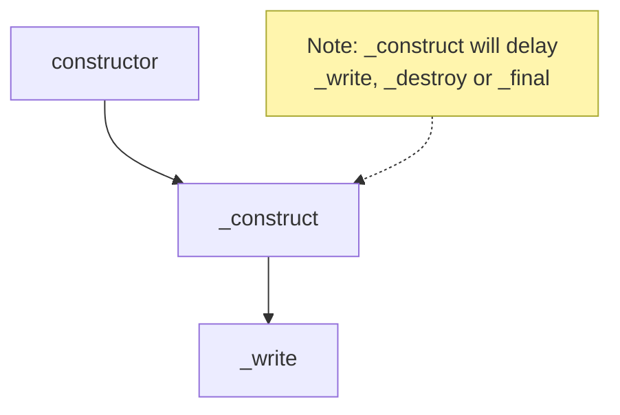

## Writable 生命週期 1：誕生 - constructor 與初始化

先來個範例，包含 `constructor`, `_construct` 跟 `_write`，各位覺得執行順序是什麼呢？

```ts
import { Writable, WritableOptions } from "stream";

class MyWritable extends Writable {
  constructor(opts?: WritableOptions) {
    super(opts);
    console.log(performance.now(), "constructor");
  }
  _construct(callback: (error?: Error | null) => void): void {
    console.log(performance.now(), "_construct");
    // 模擬 async 操作，例如：建立 TCP 連線
    setTimeout(() => callback(), 1000);
  }
  _write(
    chunk: any,
    encoding: BufferEncoding,
    callback: (error?: Error | null) => void,
  ): void {
    // 模擬寫入延遲
    setTimeout(() => {
      console.log(performance.now(), chunk);
      callback();
    }, 100);
  }
}

const myWritable = new MyWritable();
myWritable.write("123");

// Prints
// 650.24275 constructor
// 650.622958 _construct
// 1754.264416 <Buffer 31 32 33>
```

執行順序如下：



## Writable 生命週期 2：寫入資料 / backpressure / highWaterMark

我曾經以為寫入資料就是一直 `write` 下去

```ts
const myWritable = getWritableStreamSomehow();
myWritable.write("");
```

## handle errors

https://nodejs.org/api/stream.html#errors-while-writing

<!-- todo-yus -->

## Readable 生命週期 1：誕生 - constructor 與初始化

- constructor
- \_construct

## Readable 生命週期 2: 運作 - 兩種讀取模式的切換

- readableFlowing = null
- on('readable'), read, \_read, push
- on('data')
- pause, on('pause'), isPaused
- resume, on('resume')
- highWaterMark, backpressure

## Readable 生命週期 3: 終結 - 結束、銷毀與錯誤處理

- on('end'), readableEnded
- autoDestroy, destroy, on('destory'), destroyed
- on('close'), closed
- on('error'), errored
