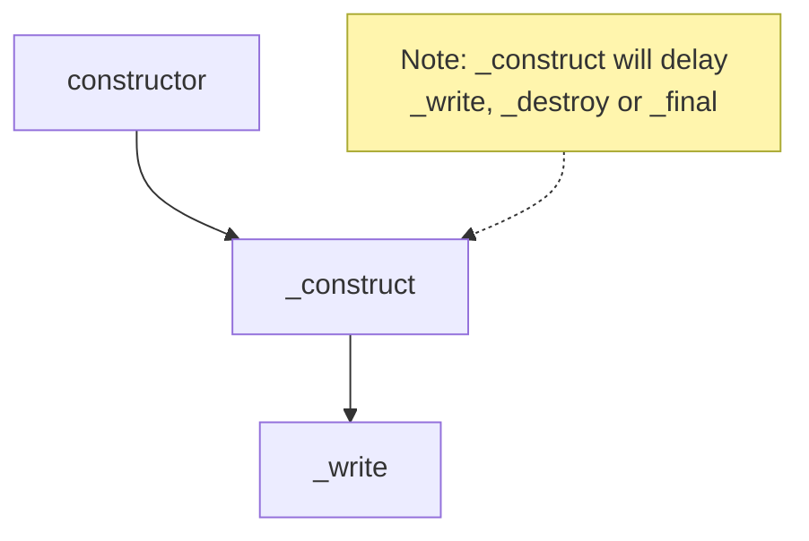
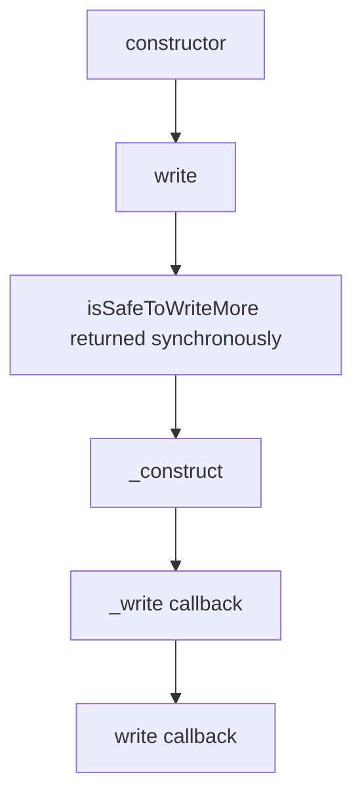

## Writable

### 生命週期 1：constructor 與初始化

先來個範例，包含 `constructor`, `_construct` 跟 `_write`，各位覺得執行順序是什麼呢？

```ts
import { Writable, WritableOptions } from "stream";

class MyWritable extends Writable {
  constructor(opts?: WritableOptions) {
    super(opts);
    console.log(performance.now(), "constructor");
  }
  _construct(callback: (error?: Error | null) => void): void {
    console.log(performance.now(), "_construct");
    // 模擬 async 操作，例如：建立 TCP 連線
    setTimeout(() => {
      console.log(performance.now(), "_construct complete");
      callback();
    }, 1000);
  }
  _write(
    chunk: any,
    encoding: BufferEncoding,
    callback: (error?: Error | null) => void,
  ): void {
    // 模擬寫入延遲
    setTimeout(() => {
      console.log(performance.now(), chunk);
      callback();
    }, 100);
  }
}

const myWritable = new MyWritable();
myWritable.write("123");

// Prints
// 650.24275 constructor
// 650.622958 _construct
// 1754.264416 <Buffer 31 32 33>
```

執行順序如下：



### 生命週期 2：寫入資料 / backpressure / highWaterMark

我曾經以為寫入資料就是一直 `write` 下去就好

```ts
const myWritable = getWritableStreamSomehow();
myWritable.write("123");
myWritable.write("456");
```

但如果仔細查看 [writable.write](https://nodejs.org/api/stream.html#writablewritechunk-encoding-callback) 跟 [writable.\_write](https://nodejs.org/api/stream.html#writable_writechunk-encoding-callback) 的描述的話，會發現 backpressure 跟 highWaterMark 這兩個名詞一直被提到

我們先來看看 write 的 callback 何時會被觸發

```ts
// class MyWritable 實作不變...

const myWritable = new MyWritable();
const isSafeToWriteMore = myWritable.write("123", () =>
  console.log(performance.now(), "data is flushed"),
);
console.log(performance.now(), { isSafeToWriteMore });

// Prints
// 750.2246 constructor
// 750.8683 { isSafeToWriteMore: true }
// 751.1718 _construct
// 1875.7623 <Buffer 31 32 33>
// 1876.2586 data is flushed
```

時間軸如下



我們可以得知，`_write` 的 callback 被觸發後，接著馬上就觸發 `write` 的 callback。

這個設計其實很精妙，但 Node.js 是怎麼判斷 isSafeToWriteMore 呢？這邊就會帶到　backpressure 跟 highWaterMark 這兩個名詞了

<!-- todo-yus -->

## handle errors

https://nodejs.org/api/stream.html#errors-while-writing

<!-- todo-yus -->

## Readable 生命週期 1：誕生 - constructor 與初始化

- constructor
- \_construct

## Readable 生命週期 2: 運作 - 兩種讀取模式的切換

- readableFlowing = null
- on('readable'), read, \_read, push
- on('data')
- pause, on('pause'), isPaused
- resume, on('resume')
- highWaterMark, backpressure

## Readable 生命週期 3: 終結 - 結束、銷毀與錯誤處理

- on('end'), readableEnded
- autoDestroy, destroy, on('destory'), destroyed
- on('close'), closed
- on('error'), errored
