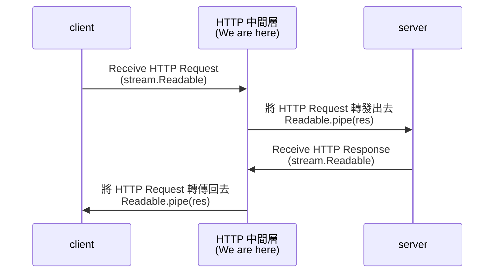

## encode & decode

我們之前的範例都是寫 string 進 internal buffer，並且沒有指定任何 `encoding` 或是 `decodeStrings`，從 internal buffer 取出來的資料都是 `Buffer`

```ts
readable.push("123");
const chunk = readable.read(); // chunk: <Buffer 31 32 33>

writable.write("123");
writable._write(chunk); // chunk: <Buffer 31 32 33>
```

若希望 `writable._write(chunk)` 可以保留原始編碼，可以在 create instance 的傳入 `decodeStrings: false`

```ts
class MyWritable extends Writable {
  _write(
    chunk: any,
    encoding: BufferEncoding,
    callback: (error?: Error | null) => void,
  ): void {
    console.log(chunk); // 123
    callback();
  }
}

const myWritable = new MyWritable({ decodeStrings: false });
myWritable.write("123");
```

若希望 `readable.read()` 讀出來的 chunk 可以轉換成 utf8，可以在 create instance 的傳入 `encoding: "utf8"`

```ts
class MyReadable extends Readable {
  _read(size: number): void {
    this.push("123");
    this.push(null);
  }
}

const myReadable = new MyReadable({ encoding: "utf8" });
myReadable.on("readable", () => {
  const chunk = myReadable.read();
  console.log(chunk); // 123
});
```

## objectMode

若想要針對 string, Buffer, TypedArray, DataView 以外的資料讀寫，則需要用到 objectMode

假設我有一個 10GB 的 json 檔，存了 Array of Objects

```json
[
  { "name": "kelly", "age": 24 },
  { "name": "alex", "age": 30 }
]
```

若希望 `writable._write(chunk)` 的 chunk 都是一個完整的 Object，這個情況就很適合用 objectMode

```ts
class MyWritable extends Writable {
  _write(
    chunk: any,
    encoding: BufferEncoding,
    callback: (error?: Error | null) => void,
  ): void {
    console.log(chunk);
    callback();
  }
}

const myWritable = new MyWritable({ objectMode: true });
myWritable.writableObjectMode; // true
myWritable.write({ name: "kelly", age: 24 });
myWritable.write({ name: "alex", age: 30 });

// Prints
// { name: 'kelly', age: 24 }
// { name: 'alex', age: 30 }
```

若希望 `readable.read()` 讀出來的 chunk 都是一個完整的 Object，這個情況就很適合用 objectMode

```ts
class MyReadable extends Readable {
  _read(size: number): void {
    this.push({ name: "kelly", age: 24 });
    this.push({ name: "alex", age: 30 });
    this.push(null);
  }
}

const myReadable = new MyReadable({ objectMode: true });
myReadable.readableObjectMode; // true
myReadable.on("readable", () => {
  const kelly = myReadable.read();
  const alex = myReadable.read();
});
```

在 objectMode 的情況，highWaterMark 的單位就會從 bytes 變成 Object 的數量

Writable

```ts
class MyWritable extends Writable {
  _write(
    chunk: any,
    encoding: BufferEncoding,
    callback: (error?: Error | null) => void,
  ): void {
    setTimeout(callback, 100);
  }
}

const myWritable = new MyWritable({ objectMode: true, highWaterMark: 2 });
const canContinue1 = myWritable.write({ name: "kelly", age: 24 });
const canContinue2 = myWritable.write({ name: "alex", age: 30 });
console.log({ canContinue1 }); // true
console.log({ canContinue2 }); // false
```

Readable

```ts
class MyReadable extends Readable {
  _read(size: number): void {
    const canContinue1 = this.push({ name: "kelly", age: 24 });
    const canContinue2 = this.push({ name: "alex", age: 30 });
    this.push(null);
    console.log({ canContinue1 }); // true
    console.log({ canContinue2 }); // false
  }
}

const myReadable = new MyReadable({ objectMode: true, highWaterMark: 2 });
myReadable.on("readable", () => {
  const kelly = myReadable.read();
  const alex = myReadable.read();
});
```

另外，objectMode 跟上面介紹的 [encode / decode](#encode--decode) 是互斥的參數，基本上只能擇一使用

Writable 若在 `objectMode: true` 的情境，則 decodeStrings, defaultEncoding 基本上就無效

```ts
class MyWritable extends Writable {
  _write(
    chunk: any,
    encoding: BufferEncoding,
    callback: (error?: Error | null) => void,
  ): void {
    console.log(chunk); // { "name": "kelly", "age": 24 }
    callback();
  }
}

const myWritable = new MyWritable({
  objectMode: true,
  decodeStrings: true,
  defaultEncoding: "utf8",
});
myWritable.write({ name: "kelly", age: 24 });
```

Readable 若在 `objectMode: true` 的情境，同時設定 encoding 會導致 `read()` 噴錯

```ts
class MyReadable extends Readable {
  _read(size: number): void {
    this.push({ name: "kelly", age: 24 });
    this.push(null);
  }
}

const myReadable = new MyReadable({ objectMode: true, encoding: "utf8" });
myReadable.readableObjectMode;
myReadable.on("readable", () => {
  myReadable.read(); // TypeError: The "buf" argument must be an instance of Buffer, TypedArray, or DataView. Received an instance of Object
});
```

## readable.pipe

pipe 的中文是管子，在這邊的意思是把 readable 資料源 (source) "透過水管接到" writable 目的地 (destination)

聽起來很抽象，但實際上各種 HTTP 中間層（Web Server, CDN, Proxy）就是用這個概念在轉發 HTTP Request / Response

### HTTP Proxy as Example

若以 "HTTP 中間層" 當作第一人稱的話



我們用 Node.js 實作一個簡單的 HTTP 中間層 + server 架構

```ts
const httpProxyServer = createServer().listen(5000);
const httpServer = createServer().listen(5001);

httpProxyServer.on("request", (req, res) => {
  const proxyToSeverRequest = request({
    hostname: "localhost",
    port: 5001,
    path: req.url,
    method: req.method,
    headers: req.headers,
  });
  proxyToSeverRequest.on("response", (serverToProxyResponse) => {
    const { statusCode, headers } = serverToProxyResponse;
    res.writeHead(statusCode as number, headers);
    // server ->> proxy 的 response body (Readable) 透過 pipe 水管接到 proxy ->> client 的 response body (Writable)
    serverToProxyResponse.pipe(res);
  });
  // client ->> proxy 的 request body (Readable) 透過 pipe 水管接到 proxy ->> server 的 request body (Writable)
  req.pipe(proxyToSeverRequest);
});

httpServer.on("request", (req, res) => {
  let body = "";
  req.setEncoding("utf8");
  req.on("data", (chunk) => {
    body += chunk;
  });
  req.on("end", () => {
    // 把 request url, headers, body 包成 json 原封不動吐回去
    res.setHeader("content-type", "application/json");
    res.end(
      JSON.stringify({
        url: req.url,
        headers: req.headers,
        body,
      }),
    );
  });
});
```

用 Postman 發個 POST 請求到 http://localhost:5000/ ，就可以成功收到 http://localhost:5001/ 回傳的 HTTP Response 了


不過以上只是簡單的 PoC，實際上 HTTP 中間層需要處理很多細節，包含且不限於以下：

1. keep-alive
2. change origin header
3. keep or omit cookie
4. HTTPS ->> HTTP
5. HTTP/2 ->> HTTP
6. error handle

所以通常不會自己手刻 http-proxy，而是會用現成的套件，例如 [http-proxy-3](https://www.npmjs.com/package/http-proxy-3)，處理了大部分 HTTP 的 edge case

<!-- todo-yus -->
<!-- ### 為何要用 readalble.pipe

承上面的範例，如果不用 readable.pipe 的話，就要自己處理很多細節、錯誤處理，包含且不限於以下：
1. 若 Readable Side 發生錯誤， -->

## unshift

## 參考資料

- https://nodejs.org/api/stream.html
- https://nodejs.org/api/stream.html#new-streamreadableoptions
- https://nodejs.org/api/stream.html#new-streamwritableoptions
