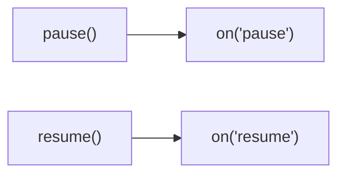
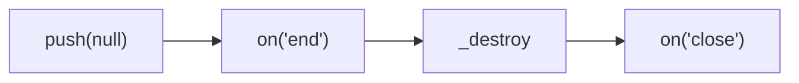
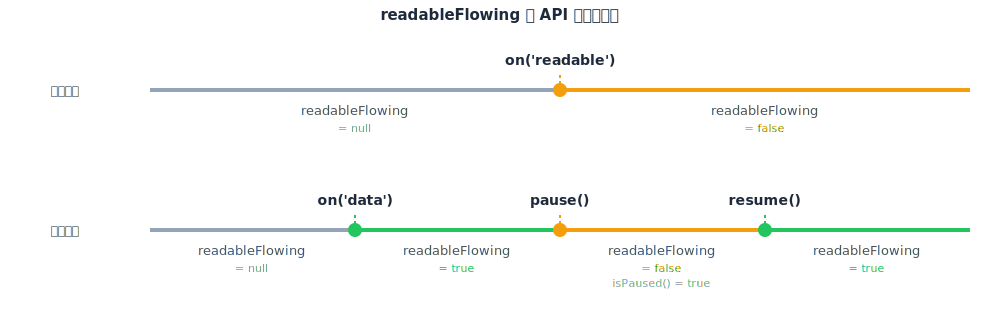
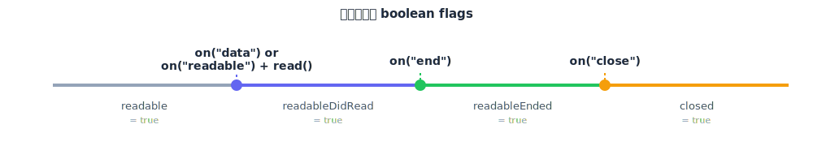

## 生命週期 1：constructor 與初始化

先來個範例，包含 `constructor`、`_construct` 跟 `_read`，各位覺得執行順序是什麼呢？

```ts
import { Readable, ReadableOptions } from "stream";

class MyReadable extends Readable {
  constructor(opts?: ReadableOptions) {
    console.log(performance.now(), "constructor");
    super(opts);
  }
  _construct(callback: (error?: Error | null) => void): void {
    console.log(performance.now(), "_construct");
    // 模擬 async 操作，例如：建立 TCP 連線
    setTimeout(callback, 1000);
  }
  _read(size: number): void {
    console.log(performance.now(), "_read");
  }
}

const myReadable = new MyReadable();
myReadable.read();

// Prints
// 642.80225 constructor
// 643.349708 _construct
// 1645.209708 _read
```

執行順序如下：


<!--  -->

## 生命週期 2：運作 - 兩種讀取模式的切換

### 自動讀取：`on('data')`

```ts
import { Readable } from "stream";

class MyReadable extends Readable {
  private maxCount = 5;
  private curCount = 0;
  _read(size: number): void {
    console.log(performance.now(), "_read");
    // 模擬讀取資料的延遲
    setTimeout(() => {
      if (this.curCount < this.maxCount) {
        this.push(this.curCount.toString().repeat(size));
        this.curCount++;
        return;
      }
      // https://nodejs.org/api/stream.html#readablepushchunk-encoding
      // Passing chunk as null signals the end of the stream (EOF), after which no more data can be written.
      this.push(null);
    }, 100);
  }
}

const myReadable = new MyReadable();
myReadable.readableFlowing; // null
myReadable.on("data", (chunk) => console.log((chunk as Buffer).byteLength));
myReadable.readableFlowing; // true

// Prints
// 790.7202 _read
// 16384
// 891.7516 _read
// 16384
// 998.5499 _read
// 16384
// 1101.6596 _read
// 16384
// 1204.8509 _read
// 16384
// 1307.456 _read
```

- [readableFlowing](https://nodejs.org/api/stream.html#readablereadableflowing) 有 `null`、`true` 跟 `false` 三種狀態，初始值是 `null`
- 當 `on('data')` 開始監聽後，`readableFlowing` 會轉成 `true`
- 自動讀取的設計哲學是 **"有多少讀多少"**，所以 Node.js 會直接在背後呼叫 `_read(highWaterMark)`
- 承上，根據 [Node.js 原始碼](https://github.com/nodejs/node/blob/main/lib/internal/streams/state.js)，Windows 的預設 `highWaterMark` 16KiB 符合預期

<!-- prettier-ignore -->
```js
// TODO (fix): For some reason Windows CI fails with bigger hwm.
let defaultHighWaterMarkBytes = process.platform === "win32" ? 16 * 1024 : 64 * 1024;
```

### 自動讀取：用 `pause` 跟 `resume` 控制開關

```ts
import { Readable } from "stream";

class MyReadable extends Readable {
  private maxCount = 5;
  private curCount = 0;
  _read(size: number): void {
    console.log(performance.now(), "_read");
    // 模擬讀取資料的延遲
    setTimeout(() => {
      if (this.curCount < this.maxCount) {
        this.push(this.curCount.toString().repeat(size));
        this.curCount++;
        return;
      }
      // https://nodejs.org/api/stream.html#readablepushchunk-encoding
      // Passing chunk as null signals the end of the stream (EOF), after which no more data can be written.
      this.push(null);
    }, 100);
  }
}

const myReadable = new MyReadable();
myReadable.once("data", (chunk) => {
  myReadable.readableFlowing; // true;
  myReadable.pause();
  myReadable.isPaused(); // true
  myReadable.readableFlowing; // false
  setTimeout(() => myReadable.resume(), 1000);
});
myReadable.on("resume", () => {
  myReadable.readableFlowing; // true
});
myReadable.on("pause", () => {
  myReadable.readableFlowing; // false
});
```

執行順序如下：



<!--  -->

### 手動讀取：`on('readable')` 搭配 `read`

```ts
import { Readable } from "stream";

class MyReadable extends Readable {
  private maxCount = 2;
  private curCount = 0;
  _read(size: number): void {
    console.log(performance.now(), "_read");
    // 模擬讀取資料的延遲
    setTimeout(() => {
      if (this.curCount < this.maxCount) {
        this.push(this.curCount.toString().repeat(size));
        this.curCount++;
        return;
      }
      // https://nodejs.org/api/stream.html#readablepushchunk-encoding
      // Passing chunk as null signals the end of the stream (EOF), after which no more data can be written.
      this.push(null);
    }, 100);
  }
}

// 統一使用 16KiB，避免跨作業系統的預設值不一樣
const myReadable = new MyReadable({ highWaterMark: 16384 });
myReadable.readableFlowing; // null
myReadable.readableDidRead; // false
myReadable.on("readable", () => {
  console.log(performance.now(), "readable");
  const data = myReadable.read();
  console.log(performance.now(), data?.byteLength);
  myReadable.readableFlowing; // false
  myReadable.readableDidRead; // true
});

// Prints
// 772.669 _read
// 880.1044 readable
// 880.4422 _read
// 880.761 16384
// 983.6141 readable
// 984.0102 _read
// 984.2194 16384
// 1089.2055 readable
// 1089.7458 undefined
```

- `_read` 的調用是由 Node.js 控制的
- `read` 若無指定 `size` 參數，則預設會把 internal buffer 的資料讀完，參考 Node.js [readable.read()](https://nodejs.org/api/stream.html#readablereadsize) 官方文件：

  ```
  If the size argument is not specified, all of the data contained in the internal buffer will be returned.
  ```

- 最後一次的 `readable`，讀到的資料是 `null`，故 `data?.byteLength` 等於 `undefined`，參考 Node.js [on("readable")](https://nodejs.org/api/stream.html#event-readable) 官方文件：

  ```
  If the end of the stream has been reached, calling stream.read() will return null and trigger the 'end' event.
  ```

## 生命週期 3：結束、關閉

寫個 PoC 來觀察 `on("end")`、`_destroy` 跟 `on("close")` 的觸發順序

```ts
import { Readable } from "stream";

class MyReadable extends Readable {
  _read(size: number): void {
    console.log(performance.now(), "_read");
    this.push("1".repeat(size));
    this.push(null);
  }
  _destroy(
    error: Error | null,
    callback: (error?: Error | null) => void,
  ): void {
    console.log(performance.now(), "_destroy");
    setTimeout(callback, 100);
  }
}

const myReadable = new MyReadable({ highWaterMark: 10 });
myReadable.on("readable", () => {
  const data = myReadable.read();
  console.log(performance.now(), data?.byteLength, "bytes");
});
myReadable.on("end", () => {
  assert(myReadable.readable === false);
  assert(myReadable.readableEnded === true);
  console.log(performance.now(), "end");
});
myReadable.on("close", () => {
  assert(myReadable.destroyed === true);
  assert(myReadable.closed === true);
  console.log(performance.now(), "close");
});

// Prints
// 917.4708 _read
// 918.5436 10 bytes
// 918.7669 end
// 919.0596 _destroy
// 1021.6917 close
```

執行順序如下：



<!--  -->

## 小結

面向開發者（實作 custom Readable）的 methods

| method        | required to implement | description                                    |
| ------------- | --------------------- | ---------------------------------------------- |
| `constructor` | No                    | place synchronous code here                    |
| `_construct`  | No                    | place asynchronous code here                   |
| `_read`       | Yes                   | handle fetch data from the underlying resource |
| `_destroy`    | No                    | release underlying resources                   |
| `push`        | No                    | should only be invoked inside `_read`          |





## 參考資料

- https://nodejs.org/api/stream.html
