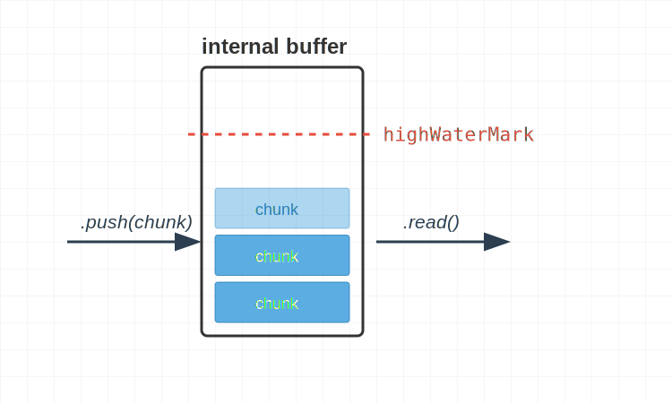
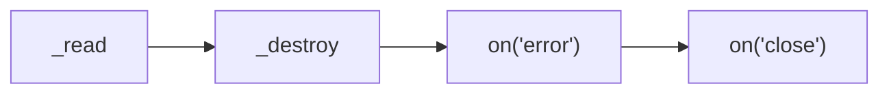
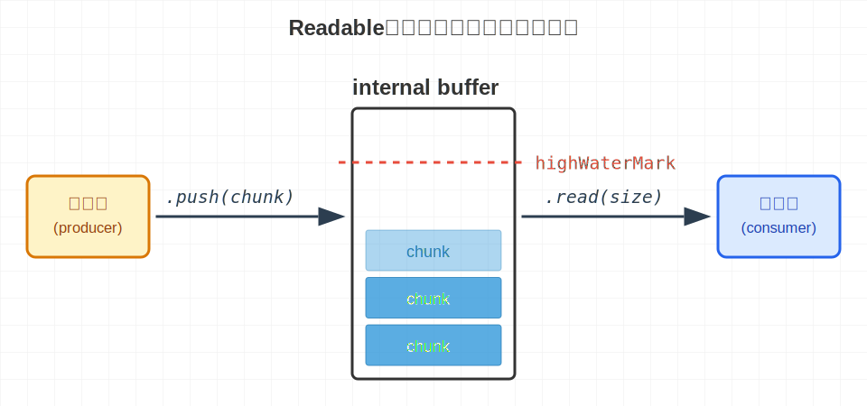
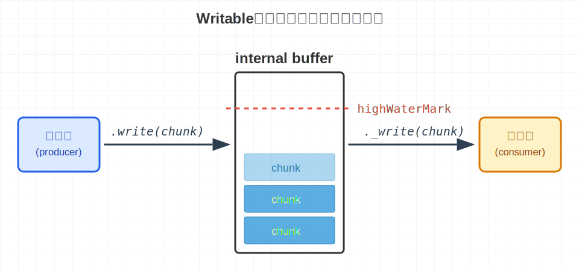

## 記憶體管理：backpressure 與 `highWaterMark`

當讀取 `read` 跟寫入 `push` 的速度都是一致的

```ts
this.push("1".repeat(16384)); // 16384 bytes
myReadable.read(); // 16384 bytes
```

每次 `push` 都會把 internal buffer 填滿，之後再用 `read` 一次把 internal buffer 清空

但實務上讀取 `read` 跟寫入 `push` 的速度會不一樣，此時就需要記憶體管理機制，避免 OOM



`push` 的回傳值，如同 [writable.write](https://nodejs.org/api/stream.html#writablewritechunk-encoding-callback) 一樣是 boolean，代表的是 **isSafeToPushMore**、**canContinue** 的意思

我們將 `highWaterMark` 設為 10，並且在 `_read` 使用 while 迴圈每次 `push` 6 bytes

```ts
import { Readable } from "stream";

class MyReadable extends Readable {
  private maxCount = 5;
  private curCount = 0;
  _read(size: number): void {
    // 模擬讀取資料的延遲
    setTimeout(() => {
      if (this.curCount < this.maxCount) {
        let isSafeToPushMore = true;
        while (isSafeToPushMore) {
          isSafeToPushMore = this.push(this.curCount.toString().repeat(6));
          console.log({
            readableLength: this.readableLength,
            isSafeToPushMore,
          });
        }
        this.curCount++;
        return;
      }
      // https://nodejs.org/api/stream.html#readablepushchunk-encoding
      // Passing chunk as null signals the end of the stream (EOF), after which no more data can be written.
      this.push(null);
    }, 100);
  }
}

const myReadable = new MyReadable({ highWaterMark: 10 });
myReadable.on("readable", myReadable.read);

// Prints
// { readableLength: 6, isSafeToPushMore: true }
// { readableLength: 12, isSafeToPushMore: false }
// { readableLength: 6, isSafeToPushMore: true }
// { readableLength: 12, isSafeToPushMore: false }
// { readableLength: 6, isSafeToPushMore: true }
// { readableLength: 12, isSafeToPushMore: false }
// { readableLength: 6, isSafeToPushMore: true }
// { readableLength: 12, isSafeToPushMore: false }
// { readableLength: 6, isSafeToPushMore: true }
// { readableLength: 12, isSafeToPushMore: false }
```

- `readableLength` 代表目前 internal buffer 有多少 bytes 的資料等著被 `read` 讀取
- 第一次 `push` 6 bytes，`readableLength` 總共 6 bytes，沒有頂到 `highWaterMark`，印出 `{ isSafeToPushMore: true }`
- 第二次 `push` 6 bytes，`readableLength` 總共 12 bytes，頂到 `highWaterMark`，印出 `{ isSafeToPushMore: false }`
- 我們遵循 backpressure，當 `{ isSafeToPushMore: false }` 就不繼續寫入 internal buffer
- 當 [readable.read()](https://nodejs.org/api/stream.html#readablereadsize) 不指定 `size` 的情況，會一次把 internal buffer 的資料讀出來
  ```
  If the size argument is not specified, all of the data contained in the internal buffer will be returned.
  ```

## handle error

`Readable` 只有三個 internal method 要實作，其中 `_read` 跟 `_construct` 的錯誤，最後都會傳遞到 `_destroy`

```ts
class MyReadable extends Readable {
  _read(size: number): void;
  _construct(callback: (error?: Error | null) => void): void;
  _destroy(error: Error | null, callback: (error?: Error | null) => void): void;
}
```

### `_construct` 階段正確拋出錯誤

```ts
import { Readable } from "stream";
import assert from "assert";

class MyReadable extends Readable {
  _construct(callback: (error?: Error | null) => void): void {
    // 模擬非同步操作拋出錯誤
    setTimeout(() => callback(new Error("_construct failed")), 1000);
  }
  _destroy(
    error: Error | null,
    callback: (error?: Error | null) => void,
  ): void {
    console.log("_destroy");
    // ✅ _construct 拋出的錯誤會傳到 _destroy，請記得傳遞到 callback
    callback(error);
  }
}

const myReadable = new MyReadable();
// ✅ 使用者請記得用 on('error') 捕捉錯誤
myReadable.on("error", (err) => {
  assert(myReadable.readable === false);
  assert(myReadable.readableAborted === true);
  assert(myReadable.destroyed === true);
  assert(err === myReadable.errored);
  console.log("on('error')", err.message);
});
myReadable.on("close", () => {
  assert(myReadable.closed === true);
  console.log("on('close')");
});

// Prints
// _destroy
// on('error') _construct failed
// on('close')
```

執行順序如下：


<!--  -->

### `_read` 階段正確呼叫 `destroy`

```ts
import { Readable } from "stream";
import assert from "assert";

class MyReadable extends Readable {
  _read(size: number): void {
    // 模擬非同步操作拋出錯誤
    setTimeout(() => this.destroy(new Error("_read failed")), 1000);
  }
  _destroy(
    error: Error | null,
    callback: (error?: Error | null) => void,
  ): void {
    console.log("_destroy");
    // ✅ destroy 背後會呼叫 _destroy，請記得把 error 傳遞到 callback
    callback(error);
  }
}

const myReadable = new MyReadable();
myReadable.on("readable", myReadable.read);
// ✅ 使用者請記得用 on('error') 捕捉錯誤
myReadable.on("error", (err) => {
  assert(myReadable.readable === false);
  assert(myReadable.readableAborted === true);
  assert(myReadable.destroyed === true);
  assert(err === myReadable.errored);
  console.log("on('error')", err.message);
});
myReadable.on("close", () => {
  assert(myReadable.closed === true);
  console.log("on('close')");
});

// Prints
// _destroy
// on('error') _read failed
// on('close')
```

執行順序如下：



<!--  -->

## `writable._final` vs `readable.push`

在 `stream.Readable`，結束的訊號 `readable.push(null)` 是由實作者在 `_read` 的實作內主動呼叫的

```ts
_read(size: number): void {
  // 實作者可以在這邊處理 async 操作
  this.push(null);
}
```

在 `stream.Writable`，結束的訊號 `writable.end()` 是由使用者主動呼叫的

```ts
import { Writable } from "stream";

class MyWritable extends Writable {
  _final(callback: (error?: Error | null) => void): void {
    // 實作者可以在這邊處理 async 操作
  }
}
const myWritable = new MyWritable();
myWritable.write("some data");
myWritable.end();
```

也因此，`stream.Readable` 沒有 `_final` 這個 internal method，因為 Node.js 已經提供在 `_read` 實作非同步操作的彈性了

## Readable vs Writable




<!-- |                      | Readable                                            | Writable                                                |
| -------------------- | --------------------------------------------------- | ------------------------------------------------------- |
| Trigger signal       | Node.js triggers `_read(size)`                      | User `write(chunk)`                                     |
| Mapping relationship | 1 : N <br/>1x `_read(size)` : Nx `push(chunk)`      | 1 : 1 <br/>1x `write(chunk)` : 1x `_write(chunk)`       |
| backpressure signal  | Return value of `push(chunk)`<br/>(for implementer) | Return value of `_write(chunk)`<br/>(for user)          |
| Error handling       | `_read` implementation<br/>calls `destroy()`        | `_write` implementation<br/>calls `callback(err)`<br/>  |
| Error attribution    | Source-based<br/>tied to the entire data source     | Transaction-based<br/>tied to a specific `write(chunk)` | -->

## 小結

在這篇文章，我們學到了

- `Readable` 的記憶體管理
- `Readable` 的錯誤處理
- `Readable` 跟 `Writable` 的結束訊號差異
- 從生產者、消費者的角度來看 `Readable` 跟 `Writable`
