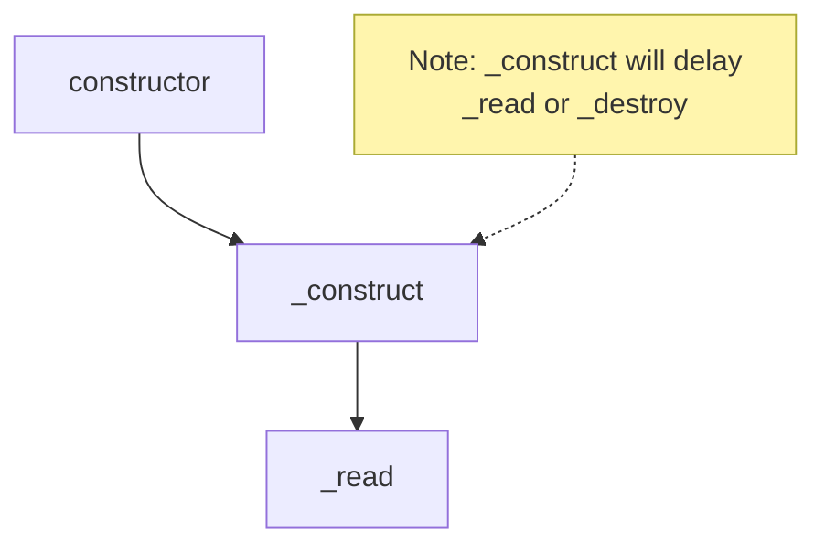

## 生命週期 1：constructor 與初始化

先來個範例，包含 `constructor`, `_construct` 跟 `_read`，各位覺得執行順序是什麼呢？

```ts
import { Readable, ReadableOptions } from "stream";

class MyReadable extends Readable {
  constructor(opts?: ReadableOptions) {
    console.log(performance.now(), "constructor");
    super(opts);
  }
  _construct(callback: (error?: Error | null) => void): void {
    console.log(performance.now(), "_construct");
    // 模擬 async 操作，例如：建立 TCP 連線
    setTimeout(() => callback(), 1000);
  }
  _read(size: number): void {
    console.log(performance.now(), "_read");
    // read data from external resource, and push data to internal buffer
    this.push("1".repeat(size));
  }
}

const myReadable = new MyReadable();
myReadable.read();

// Prints
// 642.80225 constructor
// 643.349708 _construct
// 1645.209708 _read
```

執行順序如下：



## Readable 生命週期 2: 運作 - 兩種讀取模式的切換

<!-- todo-yus -->

- readableFlowing = null
- on('readable'), read, \_read, push
- on('data')
- pause, on('pause'), isPaused
- resume, on('resume')
- highWaterMark, backpressure

## Readable 生命週期 3: 終結 - 結束、銷毀與錯誤處理

- on('end'), readableEnded
- autoDestroy, destroy, on('destory'), destroyed
- on('close'), closed
- on('error'), errored
