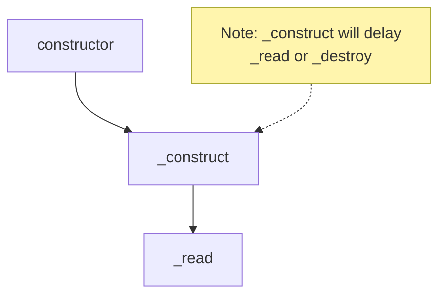

## 生命週期 1：constructor 與初始化

先來個範例，包含 `constructor`, `_construct` 跟 `_read`，各位覺得執行順序是什麼呢？

```ts
import { Readable, ReadableOptions } from "stream";

class MyReadable extends Readable {
  constructor(opts?: ReadableOptions) {
    console.log(performance.now(), "constructor");
    super(opts);
  }
  _construct(callback: (error?: Error | null) => void): void {
    console.log(performance.now(), "_construct");
    // 模擬 async 操作，例如：建立 TCP 連線
    setTimeout(() => callback(), 1000);
  }
  _read(size: number): void {
    console.log(performance.now(), "_read");
  }
}

const myReadable = new MyReadable();
myReadable.read();

// Prints
// 642.80225 constructor
// 643.349708 _construct
// 1645.209708 _read
```

執行順序如下：



## Readable 生命週期 2: 運作 - 兩種讀取模式的切換

### 第一種讀取方式: 有多少讀多少

用 `on('data')` 監聽，直接給範例

```ts
class MyReadable extends Readable {
  private maxCount = 5;
  private curCount = 0;
  _read(size: number): void {
    console.log(performance.now(), "_read");
    // 模擬讀取資料的延遲
    setTimeout(() => {
      if (this.curCount < this.maxCount) {
        this.push(this.curCount.toString().repeat(size));
        this.curCount++;
        return;
      }
      // https://nodejs.org/api/stream.html#readablepushchunk-encoding
      // Passing chunk as null signals the end of the stream (EOF), after which no more data can be written.
      this.push(null);
    }, 100);
  }
}

const myReadable = new MyReadable();
console.log(myReadable.readableFlowing); // null
myReadable.on("data", console.log);
console.log(myReadable.readableFlowing); // true

// Prints
// null
// true
// 790.7202 _read
// <Buffer 30 30 30 30 30 30 30 30 30 30 30 30 30 30 30 30 30 30 30 30 30 30 30 30 30 30 30 30 30 30 30 30 30 30 30 30 30 30 30 30 30 30 30 30 30 30 30 30 30 30 ... 16334 more bytes>
// 891.7516 _read
// <Buffer 31 31 31 31 31 31 31 31 31 31 31 31 31 31 31 31 31 31 31 31 31 31 31 31 31 31 31 31 31 31 31 31 31 31 31 31 31 31 31 31 31 31 31 31 31 31 31 31 31 31 ... 16334 more bytes>
// 998.5499 _read
// <Buffer 32 32 32 32 32 32 32 32 32 32 32 32 32 32 32 32 32 32 32 32 32 32 32 32 32 32 32 32 32 32 32 32 32 32 32 32 32 32 32 32 32 32 32 32 32 32 32 32 32 32 ... 16334 more bytes>
// 1101.6596 _read
// <Buffer 33 33 33 33 33 33 33 33 33 33 33 33 33 33 33 33 33 33 33 33 33 33 33 33 33 33 33 33 33 33 33 33 33 33 33 33 33 33 33 33 33 33 33 33 33 33 33 33 33 33 ... 16334 more bytes>
// 1204.8509 _read
// <Buffer 34 34 34 34 34 34 34 34 34 34 34 34 34 34 34 34 34 34 34 34 34 34 34 34 34 34 34 34 34 34 34 34 34 34 34 34 34 34 34 34 34 34 34 34 34 34 34 34 34 34 ... 16334 more bytes>
// 1307.456 _read
```

- [readableFlowing](https://nodejs.org/api/stream.html#readablereadableflowing) 有 `null`, `true`, `false` 三種狀態，初始值是 `null`
- 當 `on('data')` 開始監聽後， `readableFlowing` 會轉成 `true`
- 因為是 "有多少讀多少"，所以 Node.js 會直接讀 `highWaterMark`，根據 Node.js 原始碼，16KiB 符合預期

```js
// TODO (fix): For some reason Windows CI fails with bigger hwm.
let defaultHighWaterMarkBytes =
  process.platform === "win32" ? 16 * 1024 : 64 * 1024;
```

### 第二種讀取方式: 手動控制讀取速率

<!-- todo-yus -->

- readableFlowing = null
- on('readable'), read, \_read, push
- on('data')
- pause, on('pause'), isPaused
- resume, on('resume')
- highWaterMark, backpressure

## Readable 生命週期 3: 終結 - 結束、銷毀與錯誤處理

- on('end'), readableEnded
- autoDestroy, destroy, on('destory'), destroyed
- on('close'), closed
- on('error'), errored
