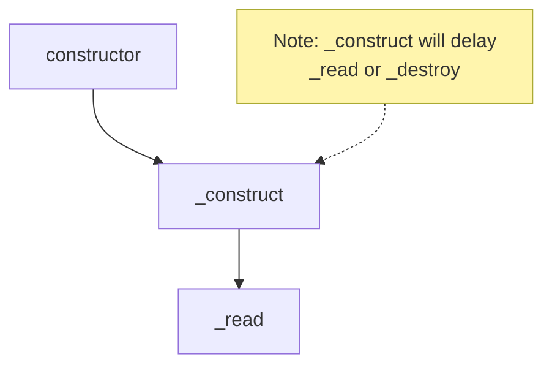
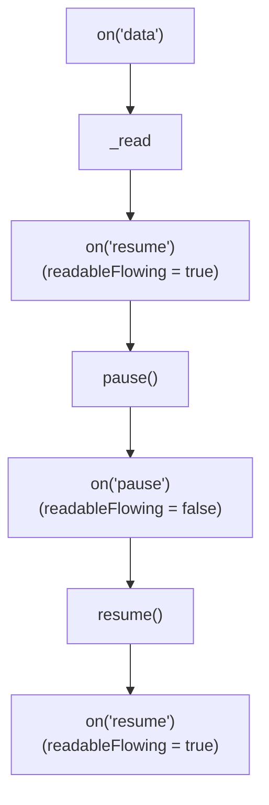
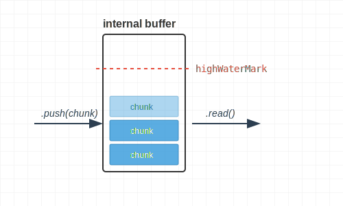
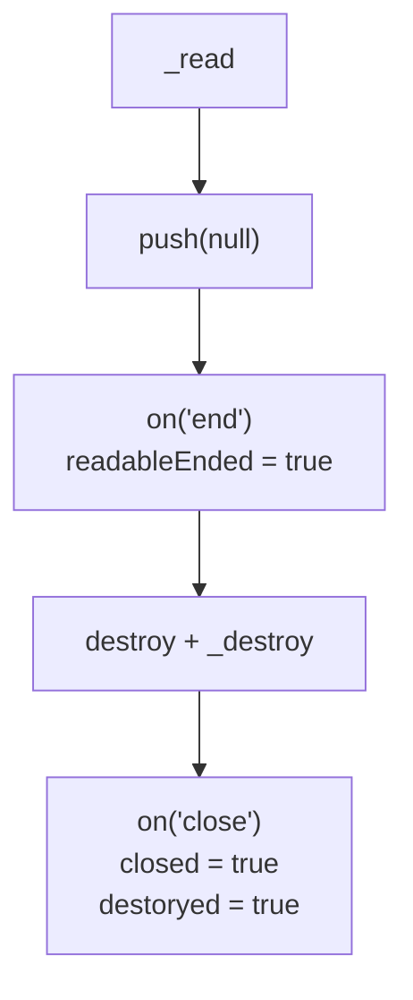
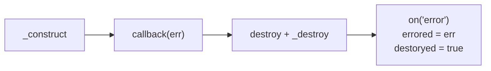
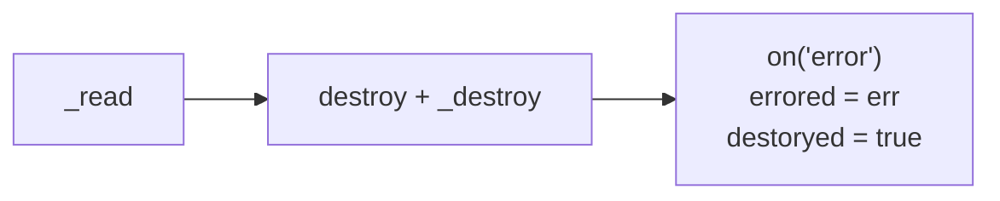

## 生命週期 1：constructor 與初始化

先來個範例，包含 `constructor`, `_construct` 跟 `_read`，各位覺得執行順序是什麼呢？

```ts
import { Readable, ReadableOptions } from "stream";

class MyReadable extends Readable {
  constructor(opts?: ReadableOptions) {
    console.log(performance.now(), "constructor");
    super(opts);
  }
  _construct(callback: (error?: Error | null) => void): void {
    console.log(performance.now(), "_construct");
    // 模擬 async 操作，例如：建立 TCP 連線
    setTimeout(() => callback(), 1000);
  }
  _read(size: number): void {
    console.log(performance.now(), "_read");
  }
}

const myReadable = new MyReadable();
myReadable.read();

// Prints
// 642.80225 constructor
// 643.349708 _construct
// 1645.209708 _read
```

執行順序如下：



## 生命週期 2: 運作 - 兩種讀取模式的切換

### 自動讀取: `on('data')`

```ts
class MyReadable extends Readable {
  private maxCount = 5;
  private curCount = 0;
  _read(size: number): void {
    console.log(performance.now(), "_read");
    // 模擬讀取資料的延遲
    setTimeout(() => {
      if (this.curCount < this.maxCount) {
        this.push(this.curCount.toString().repeat(size));
        this.curCount++;
        return;
      }
      // https://nodejs.org/api/stream.html#readablepushchunk-encoding
      // Passing chunk as null signals the end of the stream (EOF), after which no more data can be written.
      this.push(null);
    }, 100);
  }
}

const myReadable = new MyReadable();
myReadable.readableFlowing; // null
myReadable.on("data", (chunk) => console.log((chunk as Buffer).byteLength));
myReadable.readableFlowing; // true

// Prints
// 790.7202 _read
// 16384
// 891.7516 _read
// 16384
// 998.5499 _read
// 16384
// 1101.6596 _read
// 16384
// 1204.8509 _read
// 16384
// 1307.456 _read
```

- [readableFlowing](https://nodejs.org/api/stream.html#readablereadableflowing) 有 `null`, `true`, `false` 三種狀態，初始值是 `null`
- 當 `on('data')` 開始監聽後，`readableFlowing` 會轉成 `true`
- 自動讀取的設計哲學是 "有多少讀多少"，所以 Node.js 會直接在底層呼叫 `_read(highWaterMark)`
- 承上，根據 [Node.js 原始碼](https://github.com/nodejs/node/blob/main/lib/internal/streams/state.js)，Windows 11 的預設 `highWaterMark` 16KiB 符合預期
<!-- prettier-ignore -->

```js
// TODO (fix): For some reason Windows CI fails with bigger hwm.
let defaultHighWaterMarkBytes =
  process.platform === "win32" ? 16 * 1024 : 64 * 1024;
```

### 自動讀取: 用 `pause` 跟 `resume` 來控制讀取速率

```ts
class MyReadable extends Readable {
  public shouldPause = true;
  // 其餘實作不變...
}

const myReadable = new MyReadable();
myReadable.on("data", (chunk) => {
  myReadable.readableFlowing; // true;
  if (myReadable.shouldPause) {
    myReadable.shouldPause = false;
    myReadable.pause();
    myReadable.isPaused(); // true
    myReadable.readableFlowing; // false
    setTimeout(() => myReadable.resume(), 1000);
  }
});
myReadable.on("resume", () => {
  myReadable.readableFlowing; // true
});
myReadable.on("pause", () => {
  myReadable.readableFlowing; // false
});
```

執行順序如下：



### 手動讀取: `on('readable')` 搭配 `read`

```ts
class MyReadable extends Readable {
  private maxCount = 2;
  // 其餘實作不變...
}

// 統一使用 16KiB，避免跨作業系統的預設值不一樣
const myReadable = new MyReadable({ highWaterMark: 16384 });
myReadable.readableFlowing; // null
myReadable.readableDidRead; // false
myReadable.on("readable", () => {
  console.log(performance.now(), "readable");
  const data = myReadable.read();
  console.log(performance.now(), data?.byteLength);
  myReadable.readableFlowing; // false
  myReadable.readableDidRead; // true
});

// Prints
// 772.669 _read
// 880.1044 readable
// 880.4422 _read
// 880.761 16384
// 983.6141 readable
// 984.0102 _read
// 984.2194 16384
// 1089.2055 readable
// 1089.7458 undefined
```

- `_read` 的調用是由 Node.js 控制的
- `read` 若無指定 `size` 參數，則預設會把 internal buffer 的資料讀完

```
If the size argument is not specified, all of the data contained in the internal buffer will be returned.
```

- 最後一次的 `readable` 觸發，讀到的資料是 `null`，故 `data?.byteLength` 等於 `undefined`

```
If the end of the stream has been reached, calling stream.read() will return null and trigger the 'end' event.
```

### 記憶體管理：backpressure 與 highWaterMark

上面的程式碼範例，讀取 `read` 跟寫入 `push` 的速度都是一致的

```ts
this.push(this.curCount.toString().repeat(size)); // 16384 bytes
myReadable.read(); // 16384 bytes
```

所以每次都是用 `push` 把 internal buffer 填滿，之後再用 `read` 一次把 internal buffer 清空

但實務上讀取 `read` 跟寫入 `push` 的速度會不一樣，此時就需要記憶體管理機制，避免 OOM



`push` 的回傳值，如同 [writable.write](https://nodejs.org/api/stream.html#writablewritechunk-encoding-callback) 一樣是 boolean，代表的是 `isSafeToPushMore`, `canContinue` 的意思

我們將 `highWaterMark` 設為 10，並且在 `_read` 使用 `while` 迴圈每次 `push` 6 bytes

```ts
class MyReadable extends Readable {
  public shouldPause = true;
  private maxCount = 5;
  private curCount = 0;
  _read(size: number): void {
    // 模擬讀取資料的延遲
    setTimeout(() => {
      if (this.curCount < this.maxCount) {
        let isSafeToPushMore = true;
        while (isSafeToPushMore) {
          isSafeToPushMore = this.push(this.curCount.toString().repeat(6));
          console.log({
            readableLength: this.readableLength,
            isSafeToPushMore,
          });
        }
        this.curCount++;
        return;
      }
      // https://nodejs.org/api/stream.html#readablepushchunk-encoding
      // Passing chunk as null signals the end of the stream (EOF), after which no more data can be written.
      this.push(null);
    }, 100);
  }
}

const myReadable = new MyReadable({ highWaterMark: 10 });
myReadable.on("readable", myReadable.read);

// Prints
// { readableLength: 6, isSafeToPushMore: true }
// { readableLength: 12, isSafeToPushMore: false }
// { readableLength: 6, isSafeToPushMore: true }
// { readableLength: 12, isSafeToPushMore: false }
// { readableLength: 6, isSafeToPushMore: true }
// { readableLength: 12, isSafeToPushMore: false }
// { readableLength: 6, isSafeToPushMore: true }
// { readableLength: 12, isSafeToPushMore: false }
// { readableLength: 6, isSafeToPushMore: true }
// { readableLength: 12, isSafeToPushMore: false }
```

- `readableLength` 代表目前 internal buffer 有多少 bytes 的資料等著被 `read` 讀取
- 第一次 `push` 6 bytes，`readableLength` 總共 6 bytes，沒有頂到 `highWaterMark`，印出 `{ isSafeToPushMore: true }`
- 第二次 `push` 6 bytes，`readableLength` 總共 12 bytes，頂到 `highWaterMark`，印出 `{ isSafeToPushMore: false }`
- 我們遵循 backpressure，當 `{ isSafeToPushMore: false }` 就不繼續寫入 internal buffer
<!-- - [readable.read()](https://nodejs.org/api/stream.html#readablereadsize) 不指定 size 的情況，會一次把 internal buffer 的資料讀出來

````
If the size argument is not specified, all of the data contained in the internal buffer will be returned.
``` -->

## 生命週期 3: 結束、關閉

寫個 PoC 來觀察 `on("end")`, `_destroy` 跟 `on("close")` 的觸發順序

```ts
class MyReadable extends Readable {
  _read(size: number): void {
    console.log(performance.now(), "_read");
    this.push("1".repeat(size));
    this.push(null);
  }
  _destroy(
    error: Error | null,
    callback: (error?: Error | null) => void,
  ): void {
    console.log(performance.now(), "_destroy");
    setTimeout(callback, 100);
  }
}

const myReadable = new MyReadable({ highWaterMark: 10 });
myReadable.on("readable", () => {
  const data = myReadable.read();
  console.log(performance.now(), data?.byteLength, "bytes");
});
myReadable.on("end", () => {
  console.log(performance.now(), "end", {
    readableEnded: myReadable.readableEnded,
  });
});
myReadable.on("close", () => {
  console.log(performance.now(), "close", { readableEnded: myReadable.closed });
});

// Prints
// 917.4708 _read
// 918.5436 10 bytes
// 918.7669 end { readableEnded: true }
// 919.0596 _destroy
// 1021.6917 close { closed: true }
````

執行順序如下：



## `writable._final` vs `readable.push`

在 stream.Readable，結束的訊號 `readable.push(null)` 是由實作者在 `_read` 的實作內主動呼叫的

```ts
_read(size: number): void {
  // 實作者可以在這邊處理 async 操作
  this.push(null);
}
```

在 stream.Writable，結束的訊號 `writable.end()` 是由使用者主動呼叫的

```ts
class MyWritable extends Writable {
  _final(callback: (error?: Error | null) => void): void {
    // 實作者可以在這邊處理 async 操作
  }
}
const myWritable = new MyWritable();
myWritable.write("some data");
myWritable.end();
```

也因此，stream.Readable 沒有 `_final` 這個 internal method，因為實作者可以在 `_read` 實作 async 操作

## handle error

Readable 只有三個 internal method 要實作，其中 `_read` 跟 `_construct` 若有錯誤處理，最後都會執行到 `_destroy`

```ts
class MyReadable extends Readable {
  _read(size: number): void;
  _construct(callback: (error?: Error | null) => void): void;
  _destroy(error: Error | null, callback: (error?: Error | null) => void): void;
}
```

### `_construct` 階段正確拋出錯誤

```ts
class MyReadable extends Readable {
  _construct(callback: (error?: Error | null) => void): void {
    // 模擬非同步操作拋出錯誤
    setTimeout(() => callback(new Error("_construct failed")), 1000);
  }
  _destroy(
    error: Error | null,
    callback: (error?: Error | null) => void,
  ): void {
    console.log(performance.now(), "_destroy");
    // ✅ _construct 拋出的錯誤會傳入 _destroy，請記得傳遞到 callback
    if (error) return callback(error);
    callback();
  }
}

const myReadable = new MyReadable();
// ✅ 使用者請記得用 on('error') 捕捉錯誤
myReadable.on("error", (err) => {
  console.log("on('error')");
  console.log(myReadable.destroyed); // true
  console.log(err === myReadable.errored); // true
  console.log(err);
});

// Prints
// 1747.335125 _destroy
// on('error')
// true
// true
// Error: _construct failed
```

執行順序如下：



### `_read` 階段正確呼叫 `destroy`

```ts
class MyReadable extends Readable {
  _read(size: number): void {
    // 模擬非同步操作拋出錯誤
    setTimeout(() => this.destroy(new Error("_read failed")), 1000);
  }
  _destroy(
    error: Error | null,
    callback: (error?: Error | null) => void,
  ): void {
    console.log(performance.now(), "_destroy");
    // ✅ destroy 背後會呼叫 _destroy，請記得把 error 傳遞到 callback
    if (error) return callback(error);
    callback();
  }
}

const myReadable = new MyReadable();
// ✅ 使用者請記得用 on('error') 捕捉錯誤
myReadable.on("error", (err) => {
  console.log("on('error')");
  console.log(myReadable.destroyed); // true
  console.log(err === myReadable.errored); // true
  console.log(err);
});

// Prints
// 1658.621167 _destroy
// on('error')
// true
// true
// Error: _read failed
```

執行順序如下：



## Readable vs Writable

|                                               | Readable                                           | Writable                                              |
| --------------------------------------------- | -------------------------------------------------- | ----------------------------------------------------- |
| 誰負責把資料寫入 internal buffer<br/>(生產者) | 實作者 `push(chunk)`                               | 使用者 `write(chunk)`                                 |
| 誰負責消化 internal buffer<br/>(消費者)       | 使用者 `read(size)`                                | 實作者 `_write(chunk)`                                |
| 啟動訊號                                      | Node.js 觸發 `_read(size)`                         | 使用者 `write(chunk)`                                 |
| 對應關係                                      | 1 : N <br/>1 次 `_read(size)` : N 次 `push(chunk)` | 1 : 1 <br/>1 次 `write(chunk)` : 1 次 `_write(chunk)` |
| backpressure 訊號                             | `push(chunk)` 的回傳值 (給實作者看)                | `_write(chunk)` 的回傳值 (給使用者看)                 |
| 錯誤處理                                      | `_read` 內部實作呼叫 `destroy()`                   | `_write` 內部實作呼叫 `callback(err)`<br/>            |
| 錯誤歸屬                                      | Source-based<br/>關聯到整個資料源                  | Transaction-based<br/>關聯到特定的 `write(chunk)`     |

## 小結

本來以為 Readable 跟 Writable 應該就是完全對稱的設計，但若深入了解，會發現其實沒有那麼簡單～在這篇文章，我盡量把兩者的差異列出來，中間我其實也有卡關，重複閱讀了官方文件很多次，才比較理解　Readable 跟 Writable　的設計哲學差異。
