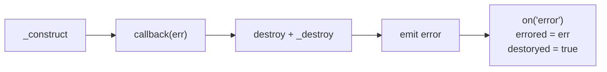
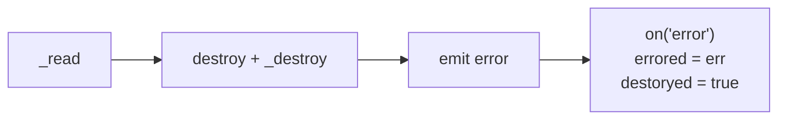

## 生命週期 1：constructor 與初始化

先來個範例，包含 `constructor`, `_construct` 跟 `_read`，各位覺得執行順序是什麼呢？

```ts
import { Readable, ReadableOptions } from "stream";

class MyReadable extends Readable {
  constructor(opts?: ReadableOptions) {
    console.log(performance.now(), "constructor");
    super(opts);
  }
  _construct(callback: (error?: Error | null) => void): void {
    console.log(performance.now(), "_construct");
    // 模擬 async 操作，例如：建立 TCP 連線
    setTimeout(() => callback(), 1000);
  }
  _read(size: number): void {
    console.log(performance.now(), "_read");
  }
}

const myReadable = new MyReadable();
myReadable.read();

// Prints
// 642.80225 constructor
// 643.349708 _construct
// 1645.209708 _read
```

執行順序如下：


## 生命週期 2: 運作 - 兩種讀取模式的切換

### 自動讀取: `on('data')`

```ts
class MyReadable extends Readable {
  private maxCount = 5;
  private curCount = 0;
  _read(size: number): void {
    console.log(performance.now(), "_read");
    // 模擬讀取資料的延遲
    setTimeout(() => {
      if (this.curCount < this.maxCount) {
        this.push(this.curCount.toString().repeat(size));
        this.curCount++;
        return;
      }
      // https://nodejs.org/api/stream.html#readablepushchunk-encoding
      // Passing chunk as null signals the end of the stream (EOF), after which no more data can be written.
      this.push(null);
    }, 100);
  }
}

const myReadable = new MyReadable();
console.log(myReadable.readableFlowing); // null
myReadable.on("data", (chunk) => console.log((chunk as Buffer).byteLength));
console.log(myReadable.readableFlowing); // true

// Prints
// null
// true
// 790.7202 _read
// 16384
// 891.7516 _read
// 16384
// 998.5499 _read
// 16384
// 1101.6596 _read
// 16384
// 1204.8509 _read
// 16384
// 1307.456 _read
```

- [readableFlowing](https://nodejs.org/api/stream.html#readablereadableflowing) 有 `null`, `true`, `false` 三種狀態，初始值是 `null`
- 當 `on('data')` 開始監聽後，`readableFlowing` 會轉成 `true`
- 因為是 "有多少讀多少"，所以 Node.js 會直接讀 `highWaterMark`，根據 Node.js 原始碼，Windows 11 的預設值 16KiB 符合預期

<!-- prettier-ignore -->
```js
// TODO (fix): For some reason Windows CI fails with bigger hwm.
let defaultHighWaterMarkBytes = process.platform === "win32" ? 16 * 1024 : 64 * 1024;
```

### 自動讀取: 用 `pause` 跟 `resume` 來控制讀取速率

```ts
class MyReadable extends Readable {
  public shouldPause = true;
  // 其餘實作不變...
}

// 統一使用 16KiB，避免跨作業系統的預設值不一樣
const myReadable = new MyReadable({ highWaterMark: 16384 });
myReadable.on("data", (chunk) => {
  console.log(performance.now(), "readableFlowing", myReadable.readableFlowing); // true;
  console.log(performance.now(), (chunk as Buffer).byteLength);
  if (myReadable.shouldPause) {
    myReadable.shouldPause = false;
    myReadable.pause();
    console.log(
      performance.now(),
      "isPaused",
      myReadable.isPaused(),
      "readableFlowing",
      myReadable.readableFlowing,
    ); // true false
    setTimeout(() => myReadable.resume(), 1000);
  }
});
myReadable.on("resume", () => {
  console.log(performance.now(), "resume", myReadable.readableFlowing); // true
});
myReadable.on("pause", () => {
  console.log(performance.now(), "pause", myReadable.readableFlowing); // false
});

// Prints
// 657.141584 _read
// 657.489625 resume true
// 758.942125 readableFlowing true
// 759.124209 16384
// 759.353459 pause false
// 759.412167 isPaused true readableFlowing false
// 759.662209 _read
// 1761.100334 resume true
```

執行順序如下：


### 手動讀取: `on('readable')` 搭配 `read`

```ts
class MyReadable extends Readable {
  private maxCount = 1;
  // 其餘實作不變...
}

// 統一使用 16KiB，避免跨作業系統的預設值不一樣
const myReadable = new MyReadable({ highWaterMark: 16384 });
myReadable.readableFlowing; // null
myReadable.readableDidRead; // false
myReadable.on("readable", () => {
  console.log(performance.now(), "readable");
  const data = myReadable.read();
  console.log(performance.now(), data);
  myReadable.readableFlowing; // false
  myReadable.readableDidRead; // true
});

// Prints
// 655.375667 _read
// 756.2565 readable
// 756.425042 _read
// 756.675792 <Buffer 30 30 30 30 30 30 30 30 30 30 30 30 30 30 30 30 30 30 30 30 30 30 30 30 30 30 30 30 30 30 30 30 30 30 30 30 30 30 30 30 30 30 30 30 30 30 30 30 30 30 ... 16334 more bytes>
// 858.348583 readable
// 858.854583 null
```

執行順序如下：


### 記憶體管理：backpressure 與 highWaterMark

上面的程式碼範例，讀取 (`read`) 跟寫入 (`push`) 的速度都是一致的

```ts
this.push(this.curCount.toString().repeat(size)); // 16384 bytes
myReadable.read(); // 16384 bytes
```

所以每次都是用 `push` 把 internal buffer 填滿，之後再用 `read` 一次把 internal buffer 清空

但實務上讀取 (`read`) 跟寫入 (`push`) 的速度會不一樣，此時就需要記憶體管理機制，避免 OOM


`push` 的回傳值，如同 [writable.write](https://nodejs.org/api/stream.html#writablewritechunk-encoding-callback) 一樣是 boolean，代表的是 `isSafeToPushMore`, `canContinue` 的意思

我們將 `highWaterMark` 設為 10，並且在 `_read` 使用 `while` 迴圈每次 `push` 6 bytes

```ts
class MyReadable extends Readable {
  public shouldPause = true;
  private maxCount = 5;
  private curCount = 0;
  _read(size: number): void {
    console.log(performance.now(), "_read");
    // 模擬讀取資料的延遲
    setTimeout(() => {
      if (this.curCount < this.maxCount) {
        let isSafeToPushMore = true;
        while (isSafeToPushMore) {
          isSafeToPushMore = this.push(this.curCount.toString().repeat(6));
          console.log({ isSafeToPushMore });
        }
        this.curCount++;
        return;
      }
      // https://nodejs.org/api/stream.html#readablepushchunk-encoding
      // Passing chunk as null signals the end of the stream (EOF), after which no more data can be written.
      this.push(null);
    }, 100);
  }
}

const myReadable = new MyReadable({ highWaterMark: 10 });
myReadable.on("readable", () => {
  const data = myReadable.read();
  console.log(data?.byteLength);
});

// Prints
// 657.866417 _read
// { isSafeToPushMore: true }
// { isSafeToPushMore: false }
// 758.513833 _read
// 12
// { isSafeToPushMore: true }
// { isSafeToPushMore: false }
// 860.697375 _read
// 12
// { isSafeToPushMore: true }
// { isSafeToPushMore: false }
// 963.028875 _read
// 12
// { isSafeToPushMore: true }
// { isSafeToPushMore: false }
// 1065.249542 _read
// 12
// { isSafeToPushMore: true }
// { isSafeToPushMore: false }
// 1168.485958 _read
// 12
// undefined
```

- 第一次 `push` 6 bytes，Internal Buffer 總共 6 bytes，沒有頂到 `highWaterMark`，印出 `{ isSafeToPushMore: true }`
- 第二次 `push` 6 bytes，Internal Buffer 總共 12 bytes，頂到 `highWaterMark`，印出 `{ isSafeToPushMore: false }`
- 我們遵循 backpressure，當 `{ isSafeToPushMore: false }` 就不繼續寫入 internal buffer
- [readable.read()](https://nodejs.org/api/stream.html#readablereadsize) 不指定 size 的情況，會一次把 internal buffer 的資料讀出來

```
If the size argument is not specified, all of the data contained in the internal buffer will be returned.
```

## 生命週期 3: 結束、關閉

寫個 PoC 來觀察 `on("end")`, `_destroy` 跟 `on("close")` 的觸發順序

```ts
class MyReadable extends Readable {
  _read(size: number): void {
    console.log(performance.now(), "_read");
    this.push("1".repeat(size));
    this.push(null);
  }
  _destroy(
    error: Error | null,
    callback: (error?: Error | null) => void,
  ): void {
    console.log(performance.now(), "_destroy");
    setTimeout(callback, 100);
  }
}

const myReadable = new MyReadable({ highWaterMark: 10 });
myReadable.on("readable", () => {
  const data = myReadable.read();
  console.log(performance.now(), data?.byteLength, "bytes");
});
myReadable.on("end", () => {
  console.log(performance.now(), "end", {
    readableEnded: myReadable.readableEnded,
  });
});
myReadable.on("close", () => {
  console.log(performance.now(), "close", { readableEnded: myReadable.closed });
});

// Prints
// 917.4708 _read
// 918.5436 10 bytes
// 918.7669 end { readableEnded: true }
// 919.0596 _destroy
// 1021.6917 close { closed: true }
```

執行順序如下：


## `writable._final` vs `readable.push`

在 stream.Readable，結束的訊號 (`readable.push`) 是由實作者在 `_read` 的實作內主動呼叫的

```ts
_read(size: number): void {
  // 實作者可以在這邊處理 async 操作
  this.push(null);
}
```

在 stream.Writable，結束的訊號 (`writable.end`) 是由使用者主動呼叫的

```ts
class MyWritable extends Writable {
  _final(callback: (error?: Error | null) => void): void {
    // 實作者可以在這邊處理 async 操作
  }
}
const myWritable = new MyWritable();
myWritable.write("some data");
myWritable.end();
```

也因此，stream.Readable 沒有 `_final` 這個 internal method

## handle error

Readable 只有三個 internal method 要實作

```ts
class MyReadable extends Readable {
  _read(size: number): void {}
  _construct(callback: (error?: Error | null) => void): void {}
  _destroy(
    error: Error | null,
    callback: (error?: Error | null) => void,
  ): void {}
}
```

### `_construct` 階段正確拋出錯誤

```ts
class MyReadable extends Readable {
  _construct(callback: (error?: Error | null) => void): void {
    // 模擬非同步操作拋出錯誤
    setTimeout(() => callback(new Error("_construct failed")), 1000);
  }
  _destroy(
    error: Error | null,
    callback: (error?: Error | null) => void,
  ): void {
    console.log(performance.now(), "_destroy");
    // ✅ _construct 拋出的錯誤會傳入 _destroy，請記得傳遞到 callback
    if (error) return callback(error);
    callback();
  }
}

const myReadable = new MyReadable();
// ✅ 使用者請記得用 on('error') 捕捉錯誤
myReadable.on("error", (err) => {
  console.log("on('error')");
  console.log(myReadable.destroyed); // true
  console.log(err === myReadable.errored); // true
  console.log(err);
});

// Prints
// 1747.335125 _destroy
// on('error')
// true
// true
// Error: _construct failed
```

執行順序如下：



### `_read` 階段正確呼叫 `destroy`

```ts
class MyReadable extends Readable {
  _read(size: number): void {
    // 模擬非同步操作拋出錯誤
    setTimeout(() => this.destroy(new Error("_read failed")), 1000);
  }
  _destroy(
    error: Error | null,
    callback: (error?: Error | null) => void,
  ): void {
    console.log(performance.now(), "_destroy");
    // ✅ destroy 背後會呼叫 _destroy，請記得把 error 傳遞到 callback
    if (error) return callback(error);
    callback();
  }
}

const myReadable = new MyReadable();
// ✅ 使用者請記得用 on('error') 捕捉錯誤
myReadable.on("error", (err) => {
  console.log("on('error')");
  console.log(myReadable.destroyed); // true
  console.log(err === myReadable.errored); // true
  console.log(err);
});

// Prints
// 1658.621167 _destroy
// on('error')
// true
// true
// Error: _read failed
```

執行順序如下：



## `writable._write` vs `readable._read` 錯誤處理

先來看看 `write` 跟 `_write` 的介面

```ts
write(chunk: any, encoding: BufferEncoding, callback?: (error: Error | null | undefined) => void): boolean;
_write(chunk: any, encoding: BufferEncoding, callback: (error?: Error | null) => void): void
```

寫個 PoC 來釐清兩者的執行順序

```ts
class MyWritable extends Writable {
  _write(
    chunk: any,
    encoding: BufferEncoding,
    callback: (error?: Error | null) => void,
  ): void {
    console.log(performance.now(), "_write");
    callback(new Error(`_write ${chunk}`));
  }
}

const myWritable = new MyWritable();
myWritable.write("123", (err) => {
  console.log("write callback");
  console.log(err);
});

// Prints
// _write
// write callback
// Error: _write 123
```

執行順序如下：


而 `readable._read` 則需要使用 `readable.destroy` 來處理錯誤

再來看看 `read`, `_read` 跟 `push` 的介面

```ts
read(size?: number): any;
_read(size: number): void
push(chunk: any, encoding?: BufferEncoding): boolean
```

## Readable vs Writable

若從介面設計的對等性來看

|                                               | Readable                                           | Writable                                              |
| --------------------------------------------- | -------------------------------------------------- | ----------------------------------------------------- |
| 誰負責把資料寫入 internal buffer<br/>(生產者) | `push(chunk)` (實作者)                             | `write(chunk)` (使用者)                               |
| 誰負責消化 internal buffer<br/>(消費者)       | `read(size)` (使用者)                              | `_write(chunk)` (實作者)                              |
| 啟動訊號                                      | `_read(size)` (Node.js 觸發)                       | `write(chunk)` (使用者)                               |
| 對應關係                                      | 1 : N <br/>1 次 `_read(size)` : N 次 `push(chunk)` | 1 : 1 <br/>1 次 `write(chunk)` : 1 次 `_write(chunk)` |
| backpressure 訊號                             | `push(chunk)` 的回傳值 (給實作者看)                | `_write(chunk)` 的回傳值 (給使用者看)                 |
| 錯誤處理                                      | `_read` 內部實作呼叫 `destroy`                     | `_write` 內部實作呼叫 `callback(err)`<br/>            |
| 錯誤歸屬                                      | Transaction-based<br/>關聯到特定的 `write(chunk)`  | Source-based<br/>關聯到整個資料源                     |

<!-- todo-yus -->
