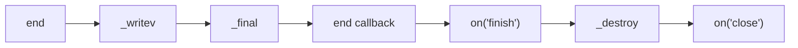
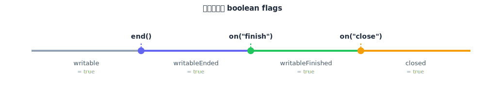

## 生命週期 1：constructor 與初始化

先來個範例，包含 `constructor`、`_construct` 跟 `_write`，各位覺得執行順序是什麼呢？

```ts
import { Writable, WritableOptions } from "stream";

class MyWritable extends Writable {
  constructor(opts?: WritableOptions) {
    super(opts);
    console.log(performance.now(), "constructor");
  }
  _construct(callback: (error?: Error | null) => void): void {
    console.log(performance.now(), "_construct");
    // 模擬 async 操作，例如：建立 TCP 連線
    setTimeout(callback, 1000);
  }
  _write(
    chunk: any,
    encoding: BufferEncoding,
    callback: (error?: Error | null) => void,
  ): void {
    // 模擬寫入延遲
    setTimeout(() => {
      console.log(performance.now(), chunk);
      callback();
    }, 100);
  }
}

const myWritable = new MyWritable();
myWritable.write("123");

// Prints
// 650.24275 constructor
// 650.622958 _construct
// 1754.264416 <Buffer 31 32 33>
```

執行順序如下：


<!--  -->

## 生命週期 2：寫入資料

我曾經以為寫入資料就是一直 `write` 下去就好

```ts
const myWritable = getWritableStreamSomehow();
myWritable.write("123");
myWritable.write("456");
```

但如果仔細查看 [`write`](https://nodejs.org/api/stream.html#writablewritechunk-encoding-callback) 跟 [`_write`](https://nodejs.org/api/stream.html#writable_writechunk-encoding-callback) 的描述的話，會發現 backpressure 跟 `highWaterMark` 這兩個名詞一直被提到

我們先來看看 `write` 的 `callback` 何時會被觸發

```ts
import { Writable, WritableOptions } from "stream";

class MyWritable extends Writable {
  constructor(opts?: WritableOptions) {
    super(opts);
    console.log(performance.now(), "constructor");
  }
  _construct(callback: (error?: Error | null) => void): void {
    console.log(performance.now(), "_construct");
    // 模擬 async 操作，例如：建立 TCP 連線
    setTimeout(callback, 1000);
  }
  _write(
    chunk: any,
    encoding: BufferEncoding,
    callback: (error?: Error | null) => void,
  ): void {
    // 模擬寫入延遲
    setTimeout(() => {
      console.log(performance.now(), chunk);
      callback();
    }, 100);
  }
}

const myWritable = new MyWritable();
const callback = () => console.log(performance.now(), "data is flushed");
const isSafeToWriteMore = myWritable.write("123", callback);
console.log(performance.now(), { isSafeToWriteMore });

// Prints
// 750.2246 constructor
// 750.8683 { isSafeToWriteMore: true }
// 751.1718 _construct
// 1875.7623 <Buffer 31 32 33>
// 1876.2586 data is flushed
```

時間軸如下


<!--  -->

- 根據 [`readable._construct`](https://nodejs.org/api/stream.html#readable_constructcallback) 的描述，`constructor` 執行完後，`process.nextTick` 才會執行 `_construct`
- 雖然 `writable._construct` 的官方文件沒有描述到這個行為，但基本上兩者的概念是相通的
- `_construct` 完成後（呼叫 `_construct` 的 `callback`），代表可以開始 `_write`
- `_write` 完成後（呼叫 `_write` 的 `callback`），代表可以開始 `write` 的 `callback`

只能讚嘆 Node.js 的 Event-driven architecture 設計真的很精妙，大量的利用 `callback` 把各種非同步事件串連起來

但 Node.js 是怎麼判斷 `isSafeToWriteMore` 呢？這會在下一篇文章介紹到

## 生命週期 3：結束、關閉

當使用者確定不會再寫入後，就可以使用 [writable.end](https://nodejs.org/api/stream.html#writableendchunk-encoding-callback)

```ts
const httpRequestWritable = getWritableSomehow();
httpRequestWritable.end("GET / HTTP/1.1\r\nHost: example.com\r\n\r\n");
```

也因此 `end` 之後不能再 `write`，否則就會報錯

```ts
const httpRequestWritable = getWritableSomehow();
httpRequestWritable.end("GET / HTTP/1.1\r\nHost: example.com\r\n\r\n");
httpRequestWritable.write("123"); // Error: write after end
```

寫個 PoC 來觀察 `end`, `_final` 跟 `_destroy` 的觸發順序

```ts
import { Writable } from "stream";
import assert from "assert";

class MyWritable extends Writable {
  _construct(callback: (error?: Error | null) => void): void {
    console.log(performance.now(), "_construct");
    // 模擬 async 操作，例如：建立 TCP 連線
    setTimeout(callback, 1000);
  }
  _final(callback: (error?: Error | null) => void): void {
    console.log(performance.now(), "_final");
    // 模擬 async 操作，例如：關閉 TCP 連線
    setTimeout(callback, 1000);
  }
  _destroy(
    error: Error | null,
    callback: (error?: Error | null) => void,
  ): void {
    console.log(performance.now(), "_destroy");
    // 模擬 async 操作，例如：關閉 TCP 連線
    setTimeout(callback, 1000);
  }
  _write(
    chunk: any,
    encoding: BufferEncoding,
    callback: (error?: Error | null) => void,
  ): void {
    console.log(performance.now(), "_write");
    // 模擬寫入延遲
    setTimeout(callback, 100);
  }
  _writev(
    chunks: Array<{ chunk: any; encoding: BufferEncoding }>,
    callback: (error?: Error | null) => void,
  ): void {
    console.log(performance.now(), "_writev");
    // 模擬寫入延遲
    setTimeout(callback, 100);
  }
}

const myWritable = new MyWritable();
myWritable.write("12345");
myWritable.write("67890");
myWritable.end("abcde", () => console.log(performance.now(), "end callback"));
assert(myWritable.writable === false);
assert(myWritable.writableEnded === true);
myWritable.on("finish", () => {
  assert(myWritable.writableFinished === true);
  console.log(performance.now(), "on('finish')");
});
myWritable.on("close", () => {
  assert(myWritable.destroyed === true);
  assert(myWritable.closed === true);
  console.log(performance.now(), "on('close')");
});

// Prints
// 708.142667 _construct
// 1709.220417 _writev
// 1810.945917 _final
// 2812.627 end callback
// 2813.00425 on('finish')
// 2813.522209 _destroy
// 3815.098334 on('close')
```

時間軸如下



<!--  -->

- 由於我們的 `_construct` 延遲了 `_write`，加上我們有實作 `_writev`
- 所以 Node.js 會幫我們把 internal buffer 用 `_writev` 一次處理

若把 `_construct` 的實作註解，則會變成

```ts
// Prints
// 642.668042 _write
// 744.745125 _writev
// 846.356167 _final
// 1847.872209 end callback
// 1848.167542 on('finish')
// 1848.923875 _destroy
// 2850.768459 on('close')
```

這個現象蠻有趣的，Node.js 會先用 `write` 盡快地送出第一個 chunk，後續的 chunks 則用 `_writev` 一次處理

## 小結

面向開發者（實作 custom Writable）的 methods

| method        | required to implement | description                                                      |
| ------------- | --------------------- | ---------------------------------------------------------------- |
| `constructor` | No                    | place synchronous code here                                      |
| `_construct`  | No                    | place asynchronous code here                                     |
| `_write`      | Yes (or `_writev`)    | handle writing a single chunk                                    |
| `_writev`     | Yes (or `_write`)     | handle writing multiple buffered chunks at once, for performance |
| `_final`      | No                    | called before the stream ends, for cleanup logic                 |
| `_destroy`    | No                    | release underlying resources                                     |

面向使用者（使用 Writable）的 methods

| method    | description                         | will triggers         |
| --------- | ----------------------------------- | --------------------- |
| `write`   | write a chunk of data               | `_write` or `_writev` |
| `end`     | signal no more data will be written | `_final`              |
| `destroy` | force-close the stream              | `_destroy`            |

events

| event          | triggers                               |
| -------------- | -------------------------------------- |
| `on("finish")` | after `_final` completes               |
| `on("error")`  | after `_destroy` passes an error along |
| `on("close")`  | after `_destroy` completes             |



## 參考資料

- https://nodejs.org/api/stream.html
