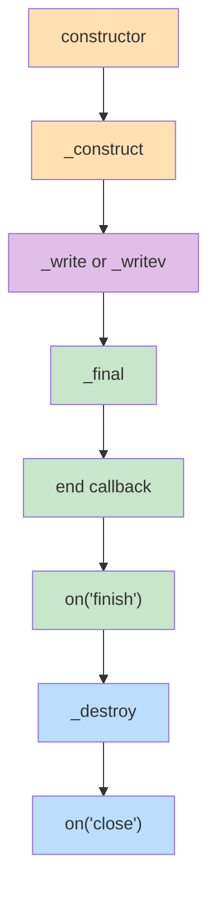

## 前言

這篇會把 `stream.Writable` 分多個生命週期階段來拆解

- [生命週期 1：初始化](#生命週期-1初始化)
- [生命週期 2：寫入資料](#生命週期-2寫入資料)
- [生命週期 3：結束](#生命週期-3結束)
- [生命週期 4：關閉](#生命週期-4關閉)

## callback 架構

Node.js `stream.Readable` 跟 `stream.Writable` 的 internal methods 大量使用 callback 架構

- 呼叫 `callback()` 用來標記此方法順利完成，可以執行下一步

  ```ts
  _construct(callback: (error?: Error | null) => void): void {
    // do something here
    callback();
  }
  ```

- 呼叫 `callback(new Error())` 代表遇到錯誤，進入錯誤處理流程

  ```ts
  _construct(callback: (error?: Error | null) => void): void {
    // do something here
    callback(new Error());
  }
  ```

## 生命週期 1：初始化

初始化階段，會依序執行 `constructor` 跟 `_construct`

```ts
import { Writable, WritableOptions } from "stream";

class MyWritable extends Writable {
  constructor(opts?: WritableOptions) {
    super(opts);
    console.log(performance.now(), "constructor");
  }
  _construct(callback: (error?: Error | null) => void): void {
    console.log(performance.now(), "_construct");
    // 模擬 async 操作，例如：建立 TCP 連線
    setTimeout(callback, 100);
  }
}

const myWritable = new MyWritable();

// Prints
// 650.24275 constructor
// 650.622958 _construct
```

## 生命週期 2：寫入資料

### `_construct` 完成才會執行 `_write`

`_construct` 代表的是非同步的初始化階段，需等到初始化完成，才能開始 `_write` 寫入資料

```ts
import { Writable } from "stream";

class MyWritable extends Writable {
  _construct(callback: (error?: Error | null) => void): void {
    console.log(performance.now(), "_construct");
    // 模擬 async 操作，例如：建立 TCP 連線
    setTimeout(callback, 100);
  }
  _write(
    chunk: any,
    encoding: BufferEncoding,
    callback: (error?: Error | null) => void,
  ): void {
    // ✅ 一秒後，等 _construct 完成才會觸發
    console.log(performance.now(), chunk);
    // 模擬寫入延遲
    setTimeout(callback, 100);
  }
}

const myWritable = new MyWritable();
myWritable.write("123");

// Prints
// 56.28175 _construct
// 162.584583 <Buffer 31 32 33>
```

### `_write` 完成才會執行 `write` 的 callback

使用者呼叫 `write`，Node.js 底層會幫忙呼叫 `_write`，完成後才會觸發 `write` 的 callback

```ts
import { Writable, WritableOptions } from "stream";

class MyWritable extends Writable {
  _write(
    chunk: any,
    encoding: BufferEncoding,
    callback: (error?: Error | null) => void,
  ): void {
    console.log(performance.now(), chunk);
    // 模擬寫入延遲
    setTimeout(callback, 100);
  }
}

const myWritable = new MyWritable();
const callback = () => console.log(performance.now(), "data is flushed");
// ✅ write 的第二個參數 callback
myWritable.write("123", callback);

// Prints
// 65.875709 <Buffer 31 32 33>
// 171.010709 data is flushed
```

### `_writev` 優化多筆寫入

實作 `_writev` 之後，可以讓使用者多次的 `write`，背後簡化成一個 `_writev` 的呼叫

```ts
class MyWritable extends Writable {
  _writev(
    chunks: Array<{ chunk: any; encoding: BufferEncoding }>,
    callback: (error?: Error | null) => void,
  ): void {
    console.log(performance.now(), chunks);
    // 模擬寫入延遲
    setTimeout(callback, 100);
  }
}

const myWritable = new MyWritable();
myWritable.write("123");
myWritable.write("456");
myWritable.write("789");
myWritable.write("abc");

// Prints
// 330.241084 [ { chunk: <Buffer 31 32 33>, encoding: 'buffer' } ]
// 433.146375 [
//   {
//     chunk: <Buffer 34 35 36>,
//     encoding: 'buffer',
//     callback: [Function: nop]
//   },
//   {
//     chunk: <Buffer 37 38 39>,
//     encoding: 'buffer',
//     callback: [Function: nop]
//   },
//   {
//     chunk: <Buffer 61 62 63>,
//     encoding: 'buffer',
//     callback: [Function: nop]
//   },
//   allBuffers: true
// ]
```

## 生命週期 3：結束

當使用者確定不會再寫入後，就可以使用 [writable.end](https://nodejs.org/api/stream.html#writableendchunk-encoding-callback)

```ts
const httpRequestWritable = getWritableSomehow();
httpRequestWritable.end("GET / HTTP/1.1\r\nHost: example.com\r\n\r\n");
```

`end` 不一定要再寫入資料，可以不帶任何參數，效果同上

```ts
const httpRequestWritable = getWritableSomehow();
httpRequestWritable.write("GET / HTTP/1.1\r\nHost: example.com\r\n\r\n");
httpRequestWritable.end();
```

因為 `end` 是標記 `stream.Writable` 的結束，所以結束後不能再 `write`，否則就會報錯

```ts
const httpRequestWritable = getWritableSomehow();
httpRequestWritable.end("GET / HTTP/1.1\r\nHost: example.com\r\n\r\n");
httpRequestWritable.write("123"); // Error: write after end
```

使用者呼叫 `end`，且最後一個 `_write` 完成後，會依序執行 `_final`、`end` 的 callback 跟 `on("finish")`

```ts
import { Writable } from "stream";

class MyWritable extends Writable {
  _write(
    chunk: any,
    encoding: BufferEncoding,
    callback: (error?: Error | null) => void,
  ): void {
    console.log(performance.now(), "_write");
    // 模擬寫入延遲
    setTimeout(callback, 100);
  }
  _final(callback: (error?: Error | null) => void): void {
    console.log(performance.now(), "_final");
    // 模擬 async 操作，例如：關閉 TCP 連線
    setTimeout(callback, 100);
  }
}

const myWritable = new MyWritable({ autoDestroy: false });
myWritable.end("abcde", () => console.log(performance.now(), "end callback"));
myWritable.on("finish", () => console.log(performance.now(), 'on("finish")'));

// Prints
// 256.522833 _write
// 358.595833 _write
// 459.939125 _write
// 561.619333 _final
// 661.852125 end callback
// 661.963667 on("finish")
```

## 生命週期 4：關閉

結束之後，若有設定 `autoDestroy: true`，則會依序觸發 `_destroy` 跟 `on("close")`

```ts
import { Writable } from "stream";

class MyWritable extends Writable {
  _write(
    chunk: any,
    encoding: BufferEncoding,
    callback: (error?: Error | null) => void,
  ): void {
    console.log(performance.now(), "_write");
    // 模擬寫入延遲
    setTimeout(callback, 100);
  }
  _destroy(
    error: Error | null,
    callback: (error?: Error | null) => void,
  ): void {
    console.log(performance.now(), "_destroy");
    // 模擬 async 操作，例如：關閉 TCP 連線
    setTimeout(callback, 100);
  }
}

const myWritable = new MyWritable({ autoDestroy: true });
myWritable.write("12345");
myWritable.write("67890");
myWritable.end("abcde");
myWritable.on("close", () => console.log(performance.now(), 'on("close")'));

// Prints
// 146.700916 _write
// 246.782458 _write
// 348.155833 _write
// 449.130541 _destroy
// 549.774875 on("close")
```

## 完整生命週期

把所有生命週期的 internal methods 跟 events 都整合進來，來看看執行順序吧！

```ts
import { Writable, WritableOptions } from "stream";

class MyWritable extends Writable {
  constructor(opts?: WritableOptions) {
    super(opts);
    console.log(performance.now(), "constructor");
  }
  _construct(callback: (error?: Error | null) => void): void {
    console.log(performance.now(), "_construct");
    // 模擬 async 操作，例如：建立 TCP 連線
    setTimeout(callback, 100);
  }
  _write(
    chunk: any,
    encoding: BufferEncoding,
    callback: (error?: Error | null) => void,
  ): void {
    console.log(performance.now(), "_write");
    // 模擬寫入延遲
    setTimeout(callback, 100);
  }
  _final(callback: (error?: Error | null) => void): void {
    console.log(performance.now(), "_final");
    // 模擬 async 操作，例如：關閉 TCP 連線
    setTimeout(callback, 100);
  }
  _destroy(
    error: Error | null,
    callback: (error?: Error | null) => void,
  ): void {
    console.log(performance.now(), "_destroy");
    // 模擬 async 操作，例如：關閉 TCP 連線
    setTimeout(callback, 100);
  }
}

const myWritable = new MyWritable({ autoDestroy: true });
myWritable.end("abcde", () => console.log(performance.now(), "end callback"));
myWritable.on("finish", () => console.log(performance.now(), 'on("finish")'));
myWritable.on("close", () => console.log(performance.now(), 'on("close")'));

// Prints
// 244.026208 constructor
// 245.449083 _construct
// 347.431958 _write
// 449.094875 _final
// 549.727958 end callback
// 549.952583 on("finish")
// 550.301458 _destroy
// 651.657667 on("close")
```

執行順序如下



<!--  -->

## 小結

面向開發者（實作 Writable）的 methods

| method        | required to implement | description                                                      |
| ------------- | --------------------- | ---------------------------------------------------------------- |
| `constructor` | No                    | place synchronous code here                                      |
| `_construct`  | No                    | place asynchronous code here                                     |
| `_write`      | Yes (or `_writev`)    | handle writing a single chunk                                    |
| `_writev`     | Yes (or `_write`)     | handle writing multiple buffered chunks at once, for performance |
| `_final`      | No                    | called before the stream ends, for cleanup logic                 |
| `_destroy`    | No                    | release underlying resources                                     |

面向使用者（使用 Writable）的 methods

| method    | description                         | will trigger          |
| --------- | ----------------------------------- | --------------------- |
| `write`   | write a chunk of data               | `_write` or `_writev` |
| `end`     | signal no more data will be written | `_final`              |
| `destroy` | force-close the stream              | `_destroy`            |

events

| event          | triggers                               |
| -------------- | -------------------------------------- |
| `on("finish")` | after `_final` completes               |
| `on("error")`  | after `_destroy` passes an error along |
| `on("close")`  | after `_destroy` completes             |


## 參考資料

- https://nodejs.org/api/stream.html
