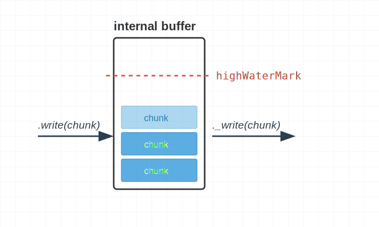

## 前言

我曾經以為寫入資料就是一直 `write` 下去就好

```ts
const myWritable = getWritableStreamSomehow();
myWritable.write("123");
myWritable.write("456");
```

但如果仔細查看 [`write`](https://nodejs.org/api/stream.html#writablewritechunk-encoding-callback) 跟 [`_write`](https://nodejs.org/api/stream.html#writable_writechunk-encoding-callback) 的描述的話，會發現 backpressure 跟 `highWaterMark` 這兩個名詞一直被提到

這篇文章，就是要帶大家深入 `write` 跟 ``

## 記憶體管理：backpressure 與 `highWaterMark`

在 create instance 的階段可以指定 `highWaterMark`，單位是 bytes

```ts
import { Writable } from "stream";

class MyWritable extends Writable {
  _write(
    chunk: any,
    encoding: BufferEncoding,
    callback: (error?: Error | null) => void,
  ): void {
    console.log(performance.now(), "_write");
    // 模擬寫入延遲
    setTimeout(callback, 100);
  }
}

// ✅ 設定 highWaterMark
const myWritable = new MyWritable({ highWaterMark: 1024 });
```

從上面的程式碼範例

- 我們在 `_write` 每 100ms 才能消化一個 chunk
- 但 `write` 本身是同步的 function，可以無限制地呼叫
- 為了避免記憶體耗盡，就必須實作一個 "高水位線"



Node.js 在使用者呼叫 `write` 的當下，就可以判斷接下來要寫入的 chunk 是否會頂到 `highWaterMark`

- 若頂到 `highWaterMark`，回傳 `false`
- 反之，則回傳 `true`

我們設定 `highWaterMark: 10`，並且寫入 3 次 5 bytes 的資料來驗證

```ts
import { Writable } from "stream";

class MyWritable extends Writable {
  _write(
    chunk: any,
    encoding: BufferEncoding,
    callback: (error?: Error | null) => void,
  ): void {
    // 模擬寫入延遲
    setTimeout(callback, 100);
  }
}

const myWritable = new MyWritable({ highWaterMark: 10 });
let isSafeToWriteMore;
isSafeToWriteMore = myWritable.write("12345");
console.log({
  chunk: "12345",
  writableLength: myWritable.writableLength,
  isSafeToWriteMore,
});
isSafeToWriteMore = myWritable.write("67890");
console.log({
  chunk: "67890",
  writableLength: myWritable.writableLength,
  isSafeToWriteMore,
});
isSafeToWriteMore = myWritable.write("abcde");
console.log({
  chunk: "abcde",
  writableLength: myWritable.writableLength,
  isSafeToWriteMore,
});

// Prints
// { chunk: '12345', writableLength: 5, isSafeToWriteMore: true }
// { chunk: '67890', writableLength: 10, isSafeToWriteMore: false }
// { chunk: 'abcde', writableLength: 15, isSafeToWriteMore: false }
```

- 第一次 `write("12345")` 還在 5 bytes 的水位，所以 `isSafeToWriteMore: true` 符合預期
- 第二次 `write("67890")` 剛好頂到 10 bytes 的水位，所以 `isSafeToWriteMore: false` 符合預期
- 第三次 `write("abcde")` 雖然超過 `highWaterMark: 10`，但還是有被處理，這點是符合預期的，參考 [writable.write](https://nodejs.org/api/stream.html#writablewritechunk-encoding-callback) 的描述

  ```
  While calling write() on a stream that is not draining is allowed, Node.js will buffer all written chunks until maximum memory usage occurs, at which point it will abort unconditionally.
  ```

從上面範例得知，`isSafeToWriteMore` 並不是強制性的，為了避免記憶體耗盡，可使用 `on("drain")` 來監聽

:::info
drain 的中文是排水、排洩，在這邊代表 "internal buffer 被清空，可以繼續呼叫 `write`"
:::

```ts
import { Writable } from "stream";

class MyWritable extends Writable {
  _write(
    chunk: any,
    encoding: BufferEncoding,
    callback: (error?: Error | null) => void,
  ): void {
    // 模擬寫入延遲
    setTimeout(callback, 100);
  }
}

const myWritable = new MyWritable({ highWaterMark: 10 });

myWritable.write("123456");
myWritable.write("789abc");
console.log(myWritable.writableLength); // 12
console.log(myWritable.writableNeedDrain); // true

myWritable.once("drain", () => {
  console.log(myWritable.writableLength); // 0
  console.log(myWritable.writableNeedDrain); // false
  // ✅ 可以繼續寫入
});
```

而 backpressure 指的就是這整套機制

- 當 `write` 生產的速度 > `_write` 消化的速度，導致頂到 `highWaterMark`
- 呼叫 `write` 會回傳 `false`，提醒使用者 **請暫停** `write`
- 使用者需手動監聽 `on("drain")`，等到 `_write` 消化完再繼續 `write`

## 效能優化：`cork`、`uncork` 跟 `_writev`

cork 的中文是軟木塞，它 **"塞住"** 了 `_write` 的執行，目的是為了優化多個 `write`，可以合併成一個 `_writev`

從 TCP 封包的層級來看，也可以有效避免 HOL Blocking

❌ Bad Example

```ts
const httpRequestWritable = getWritableSomehow();
httpRequestWritable.write("GET / HTTP/1.1");
httpRequestWritable.write("\r\n");
httpRequestWritable.write("Host: example.com");
httpRequestWritable.write("\r\n\r\n");

// ❌ 可能會傳送多個 TCP 封包，若有 HOL Blocking 則會拖慢傳輸時間
```

✅ Good Example

```ts
const httpRequestWritable = getWritableSomehow();
httpRequestWritable.cork(); // ✅ 先把軟木塞塞起來
httpRequestWritable.write("GET / HTTP/1.1"); // 接著開始批次注水
httpRequestWritable.write("\r\n");
httpRequestWritable.write("Host: example.com");
httpRequestWritable.write("\r\n\r\n");
// https://nodejs.org/api/stream.html#writableuncork
// use process.nextTick allows batching of all writable.write() calls
// that occur within a given Node.js event loop phase.
process.nextTick(() => httpRequestWritable.uncork()); // ✅ 寫入完成後，再把軟木塞拔掉

// ✅ 最終只會傳送一個 TCP 封包，避免 HOL Blocking
// ❗ p.s. 這邊先不探討 TCP packet size，假設這些小量的資料都會在同一個 packet 送出
```

我們同時實作 `_write` 跟 `_writev`，搭配 `cork` 跟 `uncork`，將多個 `write` 的呼叫，合併成一個 `_writev`

```ts
import { Writable } from "stream";

class MyWritable extends Writable {
  _write(
    chunk: any,
    encoding: BufferEncoding,
    callback: (error?: Error | null) => void,
  ): void {
    console.log("_write");
    setTimeout(callback, 100);
  }
  _writev(
    chunks: Array<{ chunk: any; encoding: BufferEncoding }>,
    callback: (error?: Error | null) => void,
  ): void {
    console.log("_writev");
    setTimeout(callback, 100);
  }
}

const myWritable = new MyWritable();
myWritable.cork();
myWritable.write("GET / HTTP/1.1");
myWritable.write("\r\n");
myWritable.write("Host: example.com");
myWritable.write("\r\n\r\n");
process.nextTick(() => myWritable.uncork());

// Prints
// _writev
```

如果沒有實作 `_writev` 的話，就會變成呼叫 `_write`，對效能就會影響，參考 [writable.cork](https://nodejs.org/api/stream.html#writablecork) 的描述：

```
However, use of writable.cork() without implementing writable._writev() may have an adverse effect on throughput.
```

另外，`cork` 跟 `uncork` 並不是一個 boolean 狀態，而是 counter 計數器的概念

```ts
const httpRequestWritable = getWritableSomehow();
// 實務上，write 可能會分散在各個 middleware / util function / application logic
(function writeHTTPStartLine() {
  httpRequestWritable.cork();
  httpRequestWritable.write("GET / HTTP/1.1");
  httpRequestWritable.write("\r\n");
  console.log(httpRequestWritable.writableCorked); // 1
})();
// 這個 util function 自行管理了 cork 跟 uncork
(function writeHTTPHeader() {
  httpRequestWritable.cork();
  console.log(httpRequestWritable.writableCorked); // 2
  httpRequestWritable.write("Host: example.com");
  httpRequestWritable.write("\r\n\r\n");
  httpRequestWritable.uncork();
  console.log(httpRequestWritable.writableCorked); // 1
})();
// 最終 counter 計數器歸零，才會呼叫 `_writev`
process.nextTick(() => httpRequestWritable.uncork());
```

## handle error

若仔細觀察每個 internal method 的參數，會發現 callback function 都有一個 optional error 參數：

```ts
_construct(callback: (error?: Error | null) => void): void
_write(chunk: any, encoding: BufferEncoding, callback: (error?: Error | null) => void): void
_writev(chunks: Array<{ chunk: any; encoding: BufferEncoding; }>, callback: (error?: Error | null) => void): void
_final(callback: (error?: Error | null) => void): void
```

而 `_destroy` 比較特殊，參數還有一個 error

```ts
_destroy(error: Error | null, callback: (error?: Error | null) => void): void
```

因為 `_destroy` 是最後一個階段，在 `_construct`、`_write`、`_writev` 或 `_final` 任一階段拋錯，都會接著觸發 `_destroy`

所以 `_destroy` 也需要正確拋錯，才可以被 `on("error")` 捕捉

以 `_construct` 拋出的錯誤為例，會傳遞到 `_destroy` 跟 `on("error")`

```ts
import assert from "assert";
import { Writable } from "stream";

class MyWritable extends Writable {
  _construct(callback: (error?: Error | null) => void): void {
    console.log("_construct");
    callback(new Error("_construct error"));
  }
  _destroy(
    error: Error | null,
    callback: (error?: Error | null) => void,
  ): void {
    console.log("_destroy");
    callback(error);
  }
}

const myWritable = new MyWritable();
myWritable.on("error", (error) => {
  console.log('on("error")');
  assert(error?.message === "_construct error"); // ✅
});
myWritable.on("close", () => console.log('on("close")'));

// Prints
// _construct
// _destroy
// on("error")
// on("close")
```

## `write` 跟 `_write` 的錯誤傳遞

`_write` 拋出的 `callback(err)` 會先傳遞給 `write` 的 `callback(err)`，再來才會進到 `_destroy`

從它們的介面設計可以看出對稱性，`write` 跟 `_write` 是 1:1 的關係

這樣的設計，可以讓使用者知道哪一包資料的寫入失敗，並且執行對應的處理

```ts
write(chunk: any, encoding: BufferEncoding, callback?: (error: Error | null | undefined) => void): boolean;
_write(chunk: any, encoding: BufferEncoding, callback: (error?: Error | null) => void): void
```

寫個 PoC 來測試

```ts
import assert from "assert";
import { Writable } from "stream";

class MyWritable extends Writable {
  _write(
    chunk: any,
    encoding: BufferEncoding,
    callback: (error?: Error | null) => void,
  ): void {
    console.log("_write");
    // ✅ _write 階段拋出的錯誤
    callback(new Error("_write error"));
  }
  _destroy(
    error: Error | null,
    callback: (error?: Error | null) => void,
  ): void {
    console.log("_destroy");
    callback(error);
  }
}

const myWritable = new MyWritable();
myWritable.write("123", (error) => {
  console.log("write callback");
  assert(error?.message === "_write error"); // ✅ 會傳遞給 write
});
myWritable.on("error", (error) => console.log('on("error")'));
myWritable.on("close", () => console.log('on("close")'));

// Prints
// _write
// write callback
// _destroy
// on("error")
// on("close")
```

## 小結

在這篇文章，我們學到了

- backpressure 與 `highWaterMark` 的機制，平衡 **`write` 的生產速度** 跟 **`_write` 的消化速度**
- `cork` 跟 `uncork` 這個計數器概念，讓多個 `write` 可以合併成一個 `_writev` 的呼叫
- 錯誤處理：`_construct`、`_write`、`_writev`、`_final` 任一階段 callback 帶 error
- `write` 跟 `_write` 的 1:1 關係

## 參考資料

- https://nodejs.org/api/stream.html
